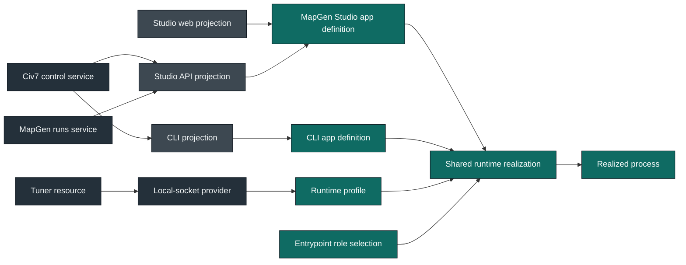

# Civ7 Capability Realization Frame

**Status:** Final platform descent prepared; four-model packet and current
product receipts sealed, external Habitat consumer handoff pending
**Date:** 2026-07-31
**Owner:** Civ7 platform architecture and product stewardship

## Intent

Close the current architecture initiative by aligning each shipped Civ7 product
capability with one Habitat role and one execution environment. The migration
must simplify the working product, not preserve current folders under cleaner
names or instantiate every plausible platform layer.

The unit of analysis is a **product capability realization chain**:

```text
definition -> projection -> composition -> realization -> observation
```

Within one app realization, the runtime lifecycle is:

```text
definition -> selection -> derivation -> compilation
  -> provisioning -> mounting -> observation
```

The first chain decides what each capability *is* and who owns it. The second
decides how one app selects and runs those capabilities without creating a
second semantic architecture. Civ7 may specialize the concrete runtime, but it
does not collapse package, resource, provider, service, plugin, and app into
one convenience owner.

Directories and package edges are evidence about that chain. They are not
authority by themselves.

## Model Progression

The normative [model progression](./MODEL-PROGRESSION.md) changes the viewpoint
before implementation:

```text
meaning -> lawful structure -> lawful movement -> lived observation
```

The product, system, outcome, and actor-role-outcome packets own the laws at
those gates. The progression owns their order, receipt shape, and feedback
route. It is a funnel, not commit chronology and not another production layer.

## Rolling Focus

**Attractor cubes:** Meaning selects Actor. Intent. Outcome. Refusal. Trust.
Structure selects Owner. Boundary. Direction. Lifecycle. Closure. Descent
selects Ground. Chain. Ratchet. Delete. Seal.

**Current container:** hold the final product-led descent at its external
admission gate. The four models, exact corpora, Explore Live Map oracle, Studio
design synchronization, wind and pressure reconstruction, and seed-stateless
latitude fallback are sealed current-product receipts. The remaining work is
recomposed in [WORKSTREAM.md](./WORKSTREAM.md) as Ground -> Core Platform ->
Dacia Product -> Estate Reconciliation -> Platform Seal. Core Platform contains
Swooper construction, Interactive construction, and one joint seal. Historical
numbered phases are absorbed evidence rather than a competing execution
sequence.

Habitat source, package, blueprint, and release ownership lives upstream and is
accepted as external authority. The corrected, constructible, consumer-usable
pin has not landed for Civ7. Until it does, no target source moves and Civ7
creates no local kind, copied packet, compatibility law, or other approximation.
The Swooper chain is staged as the first construction slice after that pin and
the qualified kinds are admitted: admitted config -> generated
entrypoint/digests -> materialized tree -> installation receipt ->
loader/runtime evidence -> final-surface parity. It does not seal alone: its
source writer, deployment path, and fresh-live proof consume Interactive owners.
Interactive construction therefore follows inside the same Core Platform
parent, and both close through one joint proof and deletion receipt.

**Gradient:** usable upstream Habitat handoff -> Ground -> Core Platform
(Swooper -> Interactive -> joint seal) -> Dacia Product -> Estate
Reconciliation -> Platform Seal.

## Settled Ground

The following work is complete and is not reopened by this frame:

- CLI ownership is settled: the app owns the oclif process and no commands,
  while `plugins/cli/topics/*` own nested command projections. The current
  `cli-shell` and `cli-topic-plugin` roots remain legacy, unsealed instances
  until their anchors, closed proof interiors, and support-cabinet correction
  land.
- Habitat structure proves that the CLI app is commandless. A bounded source
  relation proves the sole `package.json#oclif.plugins` registry and forbids a
  second topic enumeration. Shell tests observe runtime discovery, collision
  freedom, help, executable-shim equivalence, and shared-harness delegation
  only.
- Upstream ownership and destination direction are accepted. The corrected
  Template successor must use `plugins/cli/topics/*`, never package-per-command
  roots or app-owned command source, and publish a constructible usable pin
  before Civ7 imports its shared app law or moves target source.
- `plugins/mod/map/swooper-physics` owns Swooper's portable mod definition:
  domains, recipe, metrics, diagnostics, trace, and visualization.
- `apps/mods/map/swooper-physics` owns the deployable Civ7 realization,
  generated entrypoints, build output, deployment, and live proof. Its
  corrected destination composes generic app definition/profile/entrypoint law
  with a `local-civ7` profile, `build` and `deploy` entrypoints, and qualified
  artifact, deployment, optional runtime, and live layers; it does not bypass
  generic app law. No current Swooper test is genuine live proof.
- `packages/mapgen-core` owns the portable MapGen authoring and execution SDK,
  not Swooper's product domain.
- `services/civ7-control` owns semantic live-control admission, policy,
  orchestration, and outcomes.
- Closed positive Habitat law is the ratchet. A destination is not valid merely
  because files were moved into it.

## Current Facts

1. CLI and Studio use the host-side Tuner socket path in production.
2. App UI, Tuner, and gameplay `ScriptSystem` are distinct Civ7 JavaScript
   states. Their `globalThis` objects and lifecycles are not shared.
3. Commit `8d0d4983ba` deleted the unconsumed intelligence-bridge project after
   preserving unique native App UI evidence and recording its re-entry trigger.
   That commit is a completed historical receipt, not a current provider or
   product path.
4. Preserved engine-reference evidence shows that nested App UI clients are
   asynchronous while Tuner `CMD` evaluation is synchronous. Any future bridge
   would require a deliberate mailbox or another proven async transport.
5. `@civ7/direct-control` mixes protocol framing, managed session state,
   exact Civ7 command lowering, observations, and product-facing convenience
   surfaces.
6. `Civ7ControlOrpcDirectControlFacade` mirrors that mixed package as one large
   service dependency and encourages type extraction from a facade rather than
   module-owned capability contracts.
7. The game CLI also calls direct-control outside the semantic service for raw
   execution, health, catalog, inspection, map reads, watch, restart, and
   focused diagnostic/read helpers.
8. Studio Run in Game and Save & Deploy are not request-local functions. Their
   process-lifetime operation runtime owns admission, retention, adoption,
   cancellation, diagnostics, and public state across caller interruption.
9. MapGen remains portable across browser preview, generated mod runtime, and
   tests. Moving its product truth into a network-shaped service would reduce
   that portability without adding an earned capability.
10. Studio is the only current HTTP host for the control service. The CLI calls
    the service in process.
11. Civ7's current service blueprint and implementation are pinned to oRPC 1
    and the patched `effect-orpc` bridge. They are migration corpus, not target
    authority. The inspected shared commit is only an audit baseline pointing
    toward native oRPC 2 and its official Effect integration; destination law
    is the accepted corrected successor, not that baseline, and its corrected
    constructible usable pin has not landed for Civ7.
12. `packages/civ7-adapter` is hybrid: its port, mock, and static metadata are
    portable, while its concrete adapter and setup capture import Civ7 engine
    modules and globals.
13. Proposed mod-install, saved-config, fresh-log, run-workspace, and authored-
    config owners currently perform Node filesystem effects. Those effects are
    runtime bindings, not package or mod-definition truth.
14. Studio's operation registry, records, retention, cancellation, and event
    state are semantic process-scoped MapGen-runs state, not a provider-neutral
    foreign resource.
15. The Studio API reads official-data roots separately from saved-game
    configuration roots; its target context must preserve those as distinct
    cold capabilities.

## Role Model

| Role | Owns | Must not own |
| --- | --- | --- |
| Package | Pure protocol, SDK, algorithm, schema, parser, plan, or comparison matter | Filesystem/network/engine effects, managed external state, product orchestration, host startup |
| Resource | A provider-neutral foreign capability with a real acquire/use/release lifetime and typed failure vocabulary | Stateless external calls, service-owned state, semantic product policy, provider selection, caller projection |
| Provider | One concrete resource realization and foreign-failure translation | Resource contract authority, app profile, service policy |
| Service | A named domain capability, invariants, policy, operations, required semantic capabilities, and scoped semantic state | Transport mount, provider construction, ambient host globals |
| Plugin projection | A qualified projection or integration for one real role, host, or caller; an API may reuse shared service-source construction law for its own oRPC projection; a CLI topic may own command-local host translation | Independent product truth, domain-service state, process lifecycle |
| Mod definition | Authored product content and one stable mod identity | Generated output, deployment, process lifecycle |
| App | Product/runtime identity, selected plugin membership, semantic adapter selection, and qualified cold effect implementations | Provider acquisition, service binding, mounting, reusable capability truth |
| Runtime profile | Provider selection, configuration roots, and process/harness defaults | Capability truth, acquisition, plugin membership, adapter identity |
| Entrypoint | One app, one profile, and one role/process selection through `startApp(...)` | App membership, provider acquisition, manual mounting |
| Runtime substrate | Derivation, compilation, provisioning, semantic-target lowering, service binding, context materialization, mounting, observation, and disposal | Product capability truth or app membership |
| Instance manifest | Concrete blueprint identity, version, governed roots, selected capabilities, and accepted niche facts | Blueprint policy, source topology, runtime composition |

These are architecture roles, not folder folklore or a claim that every noun
has one generic blueprint. Independent Habitat packets select the exact depths
they govern; qualified Civ7 niches own only product-specific law where the
shared substrate has no generic packet. RAWR HQ Template owns the Habitat
packets, package, and canonical runtime realization model upstream, and Civ7
accepts that external destination authority. The currently inspected Template
commit remains an audit baseline with recorded corrections: a corrected,
constructible, consumer-usable pin has not landed for Civ7. Magic Migration is
executable corroboration, not a competing source. Existing Civ7 mechanics do
not earn a local approximation merely because they already work.

## Authority Order

```text
product intent
  -> capability owner
  -> execution environment
  -> kind law
  -> public contract
  -> app composition
  -> behavior proof
```

- Habitat owns positive structure and kind-local source relationships.
- Nx owns project dependency direction and proof ordering.
- TypeScript owns assignability and exact public construction surfaces.
- Knip owns unreachable code and exports.
- Tests own product behavior and cross-boundary runtime proof through the
  closed, disjoint confidence layers selected by each kind. Domain-qualified
  kinds may impose a stronger domain-shaped proof grammar.
- Every admitted test root is closed by its blueprint around a small set of
  meaningful confidence axes. Generic kinds reuse their generic layers;
  qualified and domain kinds refine them. No kind admits a case-by-case or
  open test cabinet.
- Proof membership comes from the owning source relation or exact identities
  selected by the instance or product manifest. A wildcard names only the
  terminal filename grammar; it never discovers app, API, web, or product
  proof.
- Generic app proof mirrors source exactly: every admitted
  `runtime/profiles/<profile>.ts` and every authored role entrypoint has one
  matching suite. API projection and optional execution leaves, web layers,
  and qualified product layers use their exact manifest-selected component ids
  instead; the API contract anchor remains fixed by its kind.
- Narsil and Fluree support discovery and corroboration; neither defines
  architecture authority.

## Recommended System Shape



The service remains callable in process. An API plugin projects it only when a
network caller exists. The app definition selects plugins; its runtime profile
selects the concrete provider. The shared runtime provisions the resource,
binds the public service client, supplies API context, mounts the selected
roles, and owns disposal. The service client maps the ready capability into
private service ports; no facade or adapter project sits between resource and
service.

The local-socket provider keeps its framing and command codecs private. A
standalone Tuner protocol package is admitted only when a second independent
consumer proves that public boundary.

## Explicit Decisions

### Adopt the shared service substrate

Do not extend Civ7's oRPC 1 and patched `effect-orpc` service law. When the
accepted upstream owner publishes the corrected constructible usable pin,
import its Habitat service, API-plugin, app packet set, and native oRPC/Effect
line, then burn the control service and future MapGen-runs service directly
into that shape. Until then, target source does not move and Civ7 does not fork,
copy, or approximate generic contract, implementation, context, module, router,
error, proof, or consumer law. Product names, roots, and optional interiors
remain Civ7-owned.

The reusable service source blueprint is independently selected at
`src/service` in both a standalone service project and an API composition. It
never owns `test/`: the standalone project owns contract, module-semantics, and
execution proof, while the containing API project owns its contract,
projection, and selected execution proof.

Any exception requires a concrete incompatibility that survives a focused
shared-substrate spike. Migration convenience is not sufficient.

### Keep one control service

Do not split `civ7-control`, `civ7-live`, and `civ7-play` merely because those
nouns are plausible. The current city, diplomacy, display, government,
notification, progression, turn, unit, view, world, and strategy procedures
share one live-game admission and policy boundary. A later split requires a
different authority, runtime, access policy, or consumer lifecycle.

### Keep MapGen portable

Do not create `services/civ7-mapgen` in this initiative. Map generation is a
portable deterministic capability used in a browser worker and a Civ7 mod
runtime. `mapgen-core`, the Swooper definition plugin, and the realization app
already express its actual ownership.

Studio's operation lifecycle is a different capability. A focused MapGen runs
service may own long-lived Save & Deploy and Run in Game state without owning
recipes, generation algorithms, or Studio transport.

Save & Deploy composes two authorities rather than hiding them in one target.
The matching definition supplies pure complete-config admission and canonical
serialization. The Studio app's selected config-source adapter supplies an
opaque prepared write with exact rollback; the matching realization supplies
materialization and deployment operations. MapGen-runs owns their prepare ->
write -> deploy transaction and public phase evidence. The Studio app selects
the effect adapters, while shared runtime binds them without importing their
implementations into the service.

### Keep external effects at realization

Path injection and one-shot calls do not make external I/O pure.
`packages/civ7-adapter` retains only its portable EngineAdapter port, static
metadata, and mock; the concrete Civ7-global adapter, setup capture, and map
entrypoint belong to the Swooper realization's generated map-script runtime.
Pure mod-install, save-file, and Studio-run packages may retain parsing,
planning, hashing, serialization, and comparison only. The Studio, Swooper
realization, and CLI apps own the exact cold filesystem adapters they select;
CLI topics call those bound capabilities and never become effect writers. App
profiles choose roots and providers, but never redefine adapter identities.

### Do not create an HQ API

Do not create `plugins/server/api/civ7-hq` as a container for unrelated
capabilities. API plugins are caller projections, not service catalogs.
Studio's current caller boundary earns a Studio API projection. A public
control API can be added when a non-Studio network consumer and its auth,
compatibility, and lifecycle requirements are concrete.

### Do not promote the controller island

Do not resurrect the deleted intelligence bridge as the primary control path.
A controller-primary design still depends on an unbuilt async mailbox,
deployed-version negotiation, lifecycle readiness, and live proof. Commit
`8d0d4983ba` is the completed deletion receipt; it is not a provider awaiting
promotion.

The no-unconsumed-bridge terminal condition is already satisfied and remains an
invariant. Verified native behavior facts may inform the control service
implementation. A future App UI controller starts as a new qualified mod
plugin and app only after a real same-realm consumer or async ingress contract
exists.

The deletion receipt includes the corresponding ADR-007 supersession. Any
future ownership change must update its governing ADR in the same layer.
Accepted authority never knowingly contradicts a mergeable intermediate layer.

### Admit resources only for managed capabilities

The Tuner session is an earned resource: it has acquisition, reconnect,
health, command execution, and release semantics. Civ7 window capture
independently earns a narrow resource because it acquires and revisions a
compiled ScreenCaptureKit helper, translates TCC/platform failures, and serves
two app runtimes. Neither fact earns a generic desktop-control resource. The
official resource corpus is currently a static submodule and generated-data
authority, not automatically a runtime `resource` package. A generic catalog or
desktop-app resource still waits for a concrete managed consumer and provider
corpus.

MapGen operation records, retention, cancellation, and event state are not a
foreign capability. They remain scoped state inside the MapGen-runs service.
Saved configurations, official-data roots, fresh-log reads, run-workspace
writes, authored-config transactions, and local mod installation are cold app
or CLI adapters because they have no independent acquire/release lifetime.

## Scope

### In

- Current capability-chain authority and canonical architecture alignment.
- Shared or qualified Habitat kind-law adoption for packages, resources,
  providers, services, caller projections, mod definitions, and apps.
- Shared service/API law adoption and oRPC/Effect vendor convergence.
- Shared runtime-realization adoption for app definitions, profiles,
  entrypoints, provisioning, service binding, mounting, and disposal.
- Tuner resource/provider extraction.
- Control-service client and private capability-port normalization.
- Deletion of the mixed direct-control package and the facade mirror.
- A complete direct-control consumer-to-destination ledger, including raw CLI
  diagnostics and non-Tuner host capabilities.
- Extraction of host-scoped MapGen run-state authority.
- Studio API/app realization ownership.
- Classification of the misleading `packages/plugins/*` set.
- Mod definition/realization normalization for existing mods.
- Canonical docs, OpenSpec disposition, dead-code proof, and stack/worktree
  closure.

### Out

- New gameplay or MapGen behavior.
- A Tuner-to-App-UI async mailbox.
- A gameplay `ScriptSystem` controller without a proven loading rail.
- A generic Civ7 catalog or macOS process-control resource without a working
  consumer.
- A MapGen service, Civ7 HQ API, or durable workflow merely to complete the
  five-root visual pattern.
- A public Tuner protocol package with only one provider consumer.
- Product-specific forks of the shared service or API substrate without a
  proven incompatibility.

## Falsifiers

Reopen the frame if any of the following becomes true:

- A current product capability cannot be expressed without duplicating
  semantic authority across these kinds.
- The Tuner session has no independently managed lifetime after the mixed
  direct-control package is decomposed.
- A shipped direct-control consumer has no qualified destination in the
  resource, service, diagnostic projection, or app runtime.
- A proven App UI ingress can await the nested client without a mailbox or
  transport addition.
- Control modules prove independent authorities or runtime admission policies
  that require separate services.
- Moving Studio's server surface into an API plugin destroys a required
  same-origin or shared-session invariant rather than relocating its owner.
- MapGen run-state cannot be separated from Studio transport without losing
  operation adoption, retention, or cancellation behavior.
- The shared service substrate cannot preserve a current control behavior after
  one focused native migration spike.
- A proposed portable Habitat law cannot be expressed without encoding Civ7
  instance names or current directory enumerations.

## Decision Gate

The models are read in this order:

1. [product authority](./PRODUCT-AUTHORITY.md);
2. [system model](./SYSTEM-MODEL.md);
3. [outcome model](./OUTCOME-MODEL.md);
4. [actor, role, and outcome lens](./ACTOR-ROLE-OUTCOME-MODEL.md).

They must agree with the [current capability
chains](./CURRENT-CAPABILITY-CHAINS.md), [topology
alternatives](./TOPOLOGY.md), [kind-law matrix](./KIND-LAW-MATRIX.md),
[migration corpus](./CORPUS.md), and [workstream](./WORKSTREAM.md). Current
chains remain behavior-preservation evidence; topology remains the accepted
destination; cross-channel parity applies only where multiple authorized
projections exist; the four models decide which complete product chain may move
next.

After model acceptance, the bounded Explore oracle proceeds in current topology.
Structural implementation waits for the corrected usable Habitat pin and
qualified kind admission, then proceeds one complete chain at a time: positive
destination law, injected fixtures, promotion/enforcement in the exact
burn-down branch, observed live red, qualified dispositions, zero, behavior
proof, source deletion, and Graphite seal.
