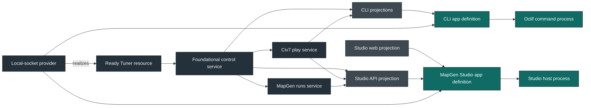

# Civ7 Capability Realization Frame

**Status:** Qualified service law materialized; exact service corpus red
**Date:** 2026-08-06
**Owner:** Civ7 platform architecture and product stewardship

## Intent

Close the current architecture initiative by aligning each shipped Civ7 product
capability with one Habitat role and one execution environment. The migration
must simplify the working product, not preserve current folders under cleaner
names or instantiate every plausible platform layer.

The unit of analysis is a **product capability realization chain**:

```text
definition -> projection -> composition -> realization -> observation
```

Within one app realization, the runtime lifecycle is:

```text
definition -> selection -> derivation -> compilation
  -> provisioning -> mounting -> observation
```

The first chain decides what each capability *is* and who owns it. The second
decides how one app selects and runs those capabilities without creating a
second semantic architecture. Civ7 may specialize the concrete runtime, but it
does not collapse package, resource, provider, service, plugin, and app into
one convenience owner.

Directories and package edges are evidence about that chain. They are not
authority by themselves.

## Model Progression

The normative [model progression](./MODEL-PROGRESSION.md) changes the viewpoint
before implementation:

```text
meaning -> lawful structure -> lawful movement -> lived observation
```

The product, system, outcome, and actor-role-outcome packets own the laws at
those gates. The progression owns their order, receipt shape, and feedback
route. It is a funnel, not commit chronology and not another production layer.

## Rolling Focus

**Attractor cubes:** Meaning selects Actor. Intent. Outcome. Refusal. Trust.
Structure selects Owner. Boundary. Direction. Lifecycle. Closure. Descent
selects Ground. Chain. Ratchet. Delete. Seal.

**Current container:** burn the exact red service corpus into the accepted
control/play split. The local compatibility law now closes the public client,
private service spine, module/model interiors, and contract/semantics/execution
proof axes without selecting vendor syntax or manufacturing a shared-kind
manifest. The qualified inventory requires control `{app,game,map,ui}`, the
actor-facing play modules, and MapGen-runs. Foundational control burns down
first, followed by play, without a facade, private contract picking, provider
acquisition, or frozen vendor syntax.

The completed Swooper cold construction, exact corpora, Ground receipt,
Explore Live Map oracle, Studio design synchronization, wind and pressure
reconstruction, and seed-stateless latitude fallback remain sealed inputs.
Habitat source and shared law remain upstream; Civ7 authors only instances,
qualified overlays, product policy, adapters, and compatibility rules.

`@habitat-ai/cli@0.5.2` and its exact `@habitat-ai/sdk@0.5.2` dependency now
supply the selected `app@1`, `package@1`, `plugin@1`, `plugin-nx@1`,
`provider@1`, and `resource@1` laws. The local Habitat producer and bootstrap
architecture are gone. `service@1` remains intentionally unselected, so
current Civ7 service law stays local rather than being disguised as shared
substrate.

The active chain is provider-neutral resource -> concrete provider ->
foundational control service -> actor-facing play or run service -> caller
projection -> real host composition -> observation. Habitat
0.5.2 closes the shared structural shells but publishes neither a product app
runtime nor a selected service kind. Provider selection, acquisition, public-
client binding, host mounting, observation, and disposal therefore belong to
the qualified CLI or Studio app composition that actually performs them;
services retain Civ7-owned law. Decorative app descriptors, profiles,
`startApp` wrappers, and copied shared-service packets are refused.

The first Interactive managed capability is now constructed. The
provider-neutral Civ7 Tuner contract owns ready-state, execution, observation,
and typed transport-failure vocabulary. Its local-socket provider privately
owns endpoint discovery, framing, multiplexing, connection epochs, raw
dispatch evidence, reset, and scoped release. Blind semantic retry, readiness
thresholds, and command-output interpretation were refused from the provider;
they remain service concerns. Closed contract, semantics, execution, and
opt-in collaboration proof are active, and the Nx graph now sees resource and
provider as distinct one-way project roles. The collaboration leaf has not run
against a live Civ7 process and is not claimed as passed.

Window capture is classified by its reusable capability rather than its first
product consumer. `resources/window-capture` owns provider-neutral
selected-window evidence and failures; its `macos-screencapturekit` provider
owns helper preparation, TCC/platform translation, atomic PNG installation,
and the scoped lifetime of in-flight capture children. Provider acquisition
must strictly probe the cached or newly compiled helper before returning a
ready capability; release closes admission, requests bounded
termination of every remaining child, and drains every admitted operation.
Those cancellation and atomicity guarantees are target laws, not claims about
the current direct-control implementation. The control service alone owns Civ7
window defaults, appshot policy, and semantic interpretation. Shared
`resource@1` closes the generic resource shell without prescribing every
product proof axis. Civ7 therefore composes its qualified resource-proof overlay
for the required contract typecheck and optional runtime contract-value proof;
it does not fork or copy the shared law.

The first definition ownership reduction is closed: diagnostics and metric
commands now live in the closed `mapgen` CLI topic, consume public Swooper and
MapGen capabilities, and leave no command runner in the portable definition.
The second definition reduction is now closed. One closed `authoring` packet
owns config admission, canonical serialization, and the finite map-catalog and
recipe-metadata target table. Exact target proof replaces the two displaced
generated-output tests; 517 Swooper product tests, package build/check, both
focused Habitat laws, and Knip pass. Transitional scripts retain only host
reads, writes, rollback, and plan application. Those effects remain held for
the qualified Interactive app adapter rather than being hidden in definition
authorship.

The first realization reduction is also closed. Swooper is an admitted shared
`app@1` instance with a closed qualified source interior. Its build now compiles
virtual map entries directly into an ignored final `dist/mod` tree; no root
scripts cabinet, checked-in mod tree, or generated TypeScript entries survive.
Exact config-to-script identity is proved before materialization. The current
proof topology is also closed on four disjoint axes: artifact-plan proof,
deployment behavior, runtime compatibility, and uncached live observation.
Final-surface parity moved to its recipe owner while the realization retains
the target that executes it. The ordinary graph proves 527 product tests and
28 app tests; no live Civ7 target was executed or claimed.

The second realization reduction is closed. A qualified `deploy.ts` entrypoint
and `runtime/adapters/local-mod-install.ts` now bind the exact Swooper mod
identity without invoking the CLI process. The CLI and app remain peer
projections of the existing installation capability until Estate
Reconciliation resolves its misclassified package owner. The app graph now
proves 29 tests. Published Habitat and canonical Template expose no generic
product app-runtime constructor, so no inert app descriptor or profile was
authored.

The service cut remains native oRPC 2 plus Effect 4, but the flat fifteen-root
control contract is no longer target authority. `services/civ7-control` owns
closed typed app/game/map/UI operations over ready Tuner and generic window-
capture resources. `services/civ7-play` consumes only that public client and
owns attention, gameplay checks/requests, reconciliation, no-repeat policy, and
next lawful action. No play module receives Tuner or provider state; no control
module manufactures gameplay strategy merely because it executes the native
operation. The aggregate direct-control facade, host-admission middleware,
controller capability mirror, transport address, arbitrary JavaScript escape,
and generic mutation-proof wrapper remain refused.

Within control, `game` composes explicit native subdomains rather than
promoting city, diplomacy, notifications, player, progression, turn, or unit to
root modules. Native leaves use `observe`, `check`, and `send`; a `send` performs one
fresh check and at most one invocation, then reports exact dispatch evidence
and optional same-evaluation `immediateAfter` readback. Generic operation
unions, polling, postconditions, no-repeat behavior, and actor-facing `request`
are structurally displaced from those native action leaves rather than ported.
A named foundational operation may own bounded observation required by its own
contract, but never mutation replay or actor-outcome interpretation.

Construction is ratcheted continuously rather than certified only at the end.
Each completed module must close its focused semantic tests, TypeScript,
Biome, and selected Habitat laws before the next module becomes the active red
corpus. The ordinary Nx `check` graph composes those product proofs with Effect
diagnostics, Knip, boundaries, policy, verification, and upstream checks. Civ7
keeps that explicit consumer selection until Habitat decides whether generic,
opt-in quality-graph aggregation belongs in the shared substrate.

**Gradient:** qualified service law red state -> foundational control ->
actor-facing play -> MapGen-runs -> CLI and Studio projections/composition ->
displaced-owner deletion -> joint Core Platform seal -> Dacia Product -> Estate
Reconciliation -> Platform Seal.

<details>
<summary>Prior focus pivots</summary>

### 2026-08-06 - Active Guidance Ratchet

The destination model was sealed, but executable guidance still encoded
direct-control ownership, flat service structure, local Habitat production,
copied vendor mechanics, and stale source/command snapshots. Every active local
skill, AGENTS router, ADR, and canonical architecture guide received an
explicit keep/repair/consolidate/delete disposition. Generic Habitat and vendor
law returned to their published owners; six Civ7-specific skills remain.
Source stayed stationary until the guidance corpus could no longer pull
implementation toward the displaced model.

### 2026-08-06 - Destination Platform Re-ratified

The recovered whole-platform proposal falsified the one-service control/play
collapse and exposed an unnamed MapGen realization supplier plus a fictitious
shared runtime. The accepted model now selects provider-neutral resources,
app-selected providers, foundational control, actor-facing play, MapGen-runs,
caller projections, and native app composition with no facade or shared runtime.
Studio's qualified adapter owns ephemeral materialization/install effects;
MapGen-runs owns their semantic operation. The next forcing surface is active
guidance: stale local skills and routers must no longer teach the architecture
that this model just rejected.

### 2026-08-06 - Live/Play Repair Expanded To The Whole Platform

The prior focus correctly re-separated foundational live control from
actor-facing play, but it began evaluating source before independently
reconstructing the full earlier platform proposal. The active model loop now
re-tests resources, services, API projections, workflows, apps, and deletion
boundaries together. The green flat service rewrite remains migration evidence;
no source shape becomes authority until the platform model seals.

### 2026-08-06 - Live Control And Play Re-separated

The prior focus assigned readiness, setup, world, view, city, diplomacy,
progression, strategy, and mutations to one semantic service because they
shared Tuner readiness. Exact consumers and the recovered product proposal
falsified that premise. Foundational live control and actor-facing play have
different outcomes, policy, consumers, and dependency direction. The model is
repaired before further source moves; the technically green flat rewrite is
migration evidence, not a destination to ratchet.

### 2026-08-06 - Window Capture Resource Generalized

The app-adapter direction correctly rejected a Civ7-specific resource but
would have duplicated one effectful ScreenCaptureKit implementation across two
apps. That contradiction exposed the real owner: a generic managed
window-capture capability. Its lifecycle is not the inert helper cache; it is
the acquired provider scope that owns every in-flight foreign child and its
bounded termination protocol. Apps select one provider, the service supplies
Civ7 meaning, and neither duplicates host execution.

### 2026-08-06 - Window Capture Resource Refused

The prior Interactive gradient treated compilation and reuse of a
ScreenCaptureKit helper as managed acquisition. Implementation falsified that
classification: no foreign state survives a capture call and no honest release
operation exists. Window capture now enters the control service as an
app-supplied capability port; qualified app adapters own platform execution.
The Tuner remains the sole managed resource in this slice.

### 2026-08-05 - Interactive Runtime Substrate Rebased

The accepted Interactive target previously delegated provider lifecycle,
service binding, projection mounting, and process disposal to a generic Habitat
runtime and expected shared `service@1` law. The published 0.5.1 consumer face
falsifies both assumptions: it supplies structural `app@1`, `resource@1`, and
`provider@1`, while `service@1` is intentionally unselected and no product
runtime constructor exists. The product ownership model survives. Each
qualified host app now owns its concrete composition and lifecycle directly;
services keep local Civ7 law and consume ready resource values.

### 2026-08-05 - Product App Runtime Refused

The accepted Swooper target previously assumed a shared `defineApp`/profile/
`startApp` runtime. Inspection of the published Habitat 0.5.1 interface and
canonical Template implementation falsified that assumption: Habitat owns
structural authority, not product process realization. Swooper is a finite
build/deploy app whose honest entrypoints are Nx targets. The qualified local
installation boundary landed without inventing an unused runtime abstraction;
focus moved directly to Interactive construction and the joint live seal.

### 2026-08-05 - Ground Closed

The earlier shared-kind refusal is superseded by the exact Habitat 0.5.1
handoff. Civ7 proved the installed consumer face, all six selected closed kinds,
unsupported service refusal, initializer idempotence, 97 local compatibility
applications, and the ordinary Nx product graph. The local Habitat producer was
deleted. Focus moved from substrate admission to the first complete product
construction chain.

</details>

## Settled Evidence

The following work is complete and is not reopened by this frame:

- CLI ownership is settled: the app owns the oclif process and no commands,
  while `plugins/cli/topics/*` own nested command projections. The current
  `cli-shell` and `cli-topic-plugin` roots remain legacy, unsealed instances
  until their anchors, closed proof interiors, and support-cabinet correction
  land.
- Habitat structure proves that the CLI app is commandless. A bounded source
  relation proves the sole `package.json#oclif.plugins` registry and forbids a
  second topic enumeration. Shell tests observe runtime discovery, collision
  freedom, help, executable-shim equivalence, and shared-harness delegation
  only.
- Upstream ownership and destination direction are accepted. The corrected
  Template successor must use `plugins/cli/topics/*`, never package-per-command
  roots or app-owned command source, and publish a constructible usable pin
  before Civ7 imports its shared app law or moves target source.
- `plugins/mod/map/swooper-physics` owns Swooper's portable mod definition:
  domains, recipe, metrics, diagnostics, trace, and visualization.
- `apps/mods/map/swooper-physics` owns the deployable Civ7 realization,
  generated entrypoints, build output, deployment, and live proof. Its
  corrected destination composes shared `app@1` root law with closed qualified
  build, deploy, runtime, artifact, deployment, compatibility, and live axes.
  Habitat 0.5.2 supplies no product app-runtime constructor, so the finite
  build/deploy targets remain Nx entrypoints rather than decorative
  `defineApp` or profile objects. No live target has passed yet.
- `packages/mapgen-core` owns the portable MapGen authoring and execution SDK,
  not Swooper's product domain.
- `services/civ7-control` owns foundational app/game/map/UI control facts and
  typed native operations. `services/civ7-play` owns actor-facing gameplay
  observation, decisions, reconciliation, and next-action policy.
- Closed positive Habitat law is the ratchet. A destination is not valid merely
  because files were moved into it.

## Current Facts

1. CLI and Studio use the host-side Tuner socket path in production.
2. App UI, Tuner, and gameplay `ScriptSystem` are distinct Civ7 JavaScript
   states. Their `globalThis` objects and lifecycles are not shared.
3. Commit `8d0d4983ba` deleted the unconsumed intelligence-bridge project after
   preserving unique native App UI evidence and recording its re-entry trigger.
   That commit is a completed historical receipt, not a current provider or
   product path.
4. Preserved engine-reference evidence shows that nested App UI clients are
   asynchronous while Tuner `CMD` evaluation is synchronous. Any future bridge
   would require a deliberate mailbox or another proven async transport.
5. `@civ7/direct-control` mixes protocol framing, managed session state,
   exact Civ7 command lowering, observations, and product-facing convenience
   surfaces.
6. `Civ7ControlOrpcDirectControlFacade` mirrors that mixed package as one large
   service dependency and encourages type extraction from a facade rather than
   module-owned capability contracts. The flat successor repeated the deeper
   collapse by treating a shared Tuner prerequisite as one semantic owner.
7. The game CLI also calls direct-control outside the semantic service for raw
   execution, health, catalog, inspection, map reads, watch, restart, and
   focused diagnostic/read helpers.
8. Studio Run in Game and Save & Deploy are not request-local functions. Their
   process-lifetime operation runtime owns admission, retention, adoption,
   cancellation, diagnostics, and public state across caller interruption.
9. MapGen remains portable across browser preview, generated mod runtime, and
   tests. Moving its product truth into a network-shaped service would reduce
   that portability without adding an earned capability.
10. Studio is the only current HTTP host for foundational control. The CLI
    calls control and play in process; Studio projects only the exact control or
    play leaves its caller contract retains.
11. Civ7's current service blueprint and implementation are pinned to oRPC 1
    and the patched `effect-orpc` bridge. They are migration corpus, not target
    authority. Habitat 0.5.2 intentionally publishes no shared service kind, so
    their replacement must remain a Civ7-owned Interactive decision until an
    upstream service law is deliberately selected.
    Destination law requires a complete qualified successor whose Ground proofs
    pass rather than a dependency-only transition.
12. `packages/civ7-adapter` is hybrid: its port, mock, and static metadata are
    portable, while its concrete adapter and setup capture import Civ7 engine
    modules and globals.
13. Proposed mod-install, saved-config, fresh-log, run-workspace, and authored-
    config owners currently perform Node filesystem effects. Those effects are
    runtime bindings, not package or mod-definition truth.
14. Studio's operation registry, records, retention, cancellation, and event
    state are semantic process-scoped MapGen-runs state, not a provider-neutral
    foreign resource.
15. The Studio API reads official-data roots separately from saved-game
    configuration roots; its target context must preserve those as distinct
    cold capabilities.

## Role Model

| Role | Owns | Must not own |
| --- | --- | --- |
| Package | Pure protocol, SDK, algorithm, schema, parser, plan, or comparison matter | Filesystem/network/engine effects, managed external state, product orchestration, host startup |
| Resource | A provider-neutral foreign capability with a real acquire/use/release lifetime and typed failure vocabulary | Stateless external calls, service-owned state, semantic product policy, provider selection, caller projection |
| Provider | One concrete resource realization and foreign-failure translation | Resource contract authority, app composition, service policy |
| Service | A named domain capability, invariants, policy, operations, required semantic capabilities, and scoped semantic state | Transport mount, provider construction, ambient host globals |
| Plugin projection | A qualified projection or integration for one real role, host, or caller; an API calls public service clients and a CLI topic may own command-local host translation | Independent product truth, domain-service state, process lifecycle |
| Mod definition | Authored product content and one stable mod identity | Generated output, deployment, process lifecycle |
| App | Product/runtime identity, selected plugin membership, provider and semantic-adapter selection, qualified host composition, and process lifecycle | Reusable capability truth, semantic service policy, plugin-owned interaction meaning |
| Entrypoint | One concrete app role or finite Nx task using its native host | A second product model, reusable capability truth, invented generic startup wrappers |
| Instance manifest | Concrete blueprint identity, version, governed roots, selected capabilities, and accepted niche facts | Blueprint policy, source topology, runtime composition |

These are architecture roles, not folder folklore or a claim that every noun
has one generic blueprint. Independent Habitat packets select the exact depths
they govern; qualified Civ7 niches own only product-specific law where the
shared substrate has no generic packet. RAWR HQ Template owns the Habitat
packets, package, and canonical runtime realization model upstream, and Civ7
accepts that external destination authority. Habitat 0.5.2 release provenance,
initializer idempotence, six selected closed-kind fixtures, and unsupported
service refusal are accepted Ground evidence. Magic Migration is executable
corroboration, not a competing source. Existing Civ7 mechanics do not earn a
local approximation merely because they already work.

## Authority Order

```text
product intent
  -> capability owner
  -> execution environment
  -> kind law
  -> public contract
  -> app composition
  -> behavior proof
```

- Habitat owns positive structure and kind-local source relationships.
- Nx owns project dependency direction and proof ordering.
- TypeScript owns assignability and exact public construction surfaces.
- Knip owns unreachable code and exports.
- Tests own product behavior and cross-boundary runtime proof through the
  closed, disjoint confidence layers selected by each kind. Domain-qualified
  kinds may impose a stronger domain-shaped proof grammar.
- Every admitted test root is closed by its blueprint around a small set of
  meaningful confidence axes. Generic kinds reuse their generic layers;
  qualified and domain kinds refine them. No kind admits a case-by-case or
  open test cabinet.
- Proof membership comes from the owning source relation or exact identities
  selected by the instance or product manifest. A wildcard names only the
  terminal filename grammar; it never discovers app, API, web, or product
  proof.
- Qualified app proof mirrors the actual host composition it admits. API
  projection and optional execution leaves, web layers, and qualified product
  layers use exact manifest-selected component ids; no profile or entrypoint
  grammar is inferred from shared `app@1`.
- Narsil and Fluree support discovery and corroboration; neither defines
  architecture authority.

## Recommended System Shape


```mermaid
flowchart LR
  Provider["Local-socket provider"] -->|realizes| Resource["Ready Tuner resource"]
  Resource --> Control["Foundational control service"]
  Control --> Play["Civ7 play service"]
  Control --> CLI["CLI projections"]
  Play --> CLI
  Control --> StudioAPI["Studio API projection"]
  Play --> StudioAPI
  Control --> Runs["MapGen runs service"]
  Runs --> StudioAPI
  Web["Studio web projection"] --> Studio["MapGen Studio app definition"]
  StudioAPI --> Studio
  CLI --> CLIApp["CLI app definition"]
  Provider --> Studio
  Provider --> CLIApp
  Studio --> StudioProcess["Studio host process"]
  CLIApp --> CLIProcess["Oclif command process"]

  classDef truth fill:#24303a,stroke:#101820,color:#f4f7f8;
  classDef projection fill:#3d4851,stroke:#101820,color:#f4f7f8;
  classDef runtime fill:#0f6b63,stroke:#101820,color:#ffffff;
  class Resource,Provider,Control,Play,Runs truth;
  class CLI,StudioAPI,Web projection;
  class Studio,CLIApp,StudioProcess,CLIProcess runtime;
```

Both services remain callable in process. An API plugin projects either only
when a network caller exists. Each qualified host app selects and acquires its
concrete providers, constructs the control client, constructs the play and run
clients from that public capability, supplies projection context, mounts its
native host, and owns disposal. No facade or adapter project sits between
resource and control, and no Tuner-shaped port bypasses control into play.

The local-socket provider keeps its framing and command codecs private. A
standalone Tuner protocol package is admitted only when a second independent
consumer proves that public boundary.

## Explicit Decisions

### Retain one local service substrate

Habitat 0.5.2 deliberately leaves `service@1` unselected. Interactive
construction therefore reuses and tightens the existing local Civ7 service
packet rather than copying the dormant SDK packet, extending the old mixed
facade, or waiting on a fictitious shared runtime. The service owns contract,
modules, router, errors, public in-process client, and its disjoint proof
layers. The Studio API is a caller projection over public clients, never a
second service owner.

The root `@orpc`/Effect/TypeBox transition lands only with a complete behavior-
preserving service cut. A dependency-only intermediate, compatibility facade,
or private-contract extraction is refused.

### Separate foundational control from play

Keep `services/civ7-control` as the foundational live-control owner and create
`services/civ7-play` as the actor-facing gameplay owner. This split is earned:
Studio, MapGen-runs, Swooper live proof, and CLI status/map/view need control
without play, while the game-play CLI needs gameplay situation, policy,
reconciliation, and next actions that those consumers must not inherit.

Control exposes closed typed app/game/map/UI operations over ready resources.
Play consumes only the public control capability. A third `civ7-live` service
is refused because it would forward the same foundational facts without a new
owner. Sharing one live-game admission prerequisite does not merge services;
allowing both services direct Tuner access would erase the direction and is
also refused.

### Keep MapGen portable

Do not create `services/civ7-mapgen` in this initiative. Map generation is a
portable deterministic capability used in a browser worker and a Civ7 mod
runtime. `mapgen-core`, the Swooper definition plugin, and the realization app
already express its actual ownership.

Studio's operation lifecycle is a different capability. A focused MapGen runs
service may own long-lived Save & Deploy and Run in Game state without owning
recipes, generation algorithms, or Studio transport.

Save & Deploy composes two authorities rather than hiding them in one target.
The matching definition supplies pure complete-config admission and canonical
serialization. The Studio app's selected config-source adapter supplies an
opaque prepared write with exact rollback; the matching realization supplies
materialization and deployment operations. MapGen-runs owns their prepare ->
write -> deploy transaction and public phase evidence. The Studio app selects
and binds the effect adapters without importing their implementations into the
service.

### Keep external effects at realization

Path injection and one-shot calls do not make external I/O pure.
`packages/civ7-adapter` retains only its portable EngineAdapter port, static
metadata, and mock; the concrete Civ7-global adapter, setup capture, and map
entrypoint belong to the Swooper realization's generated map-script runtime.
Pure mod-install, save-file, and Studio-run packages may retain parsing,
planning, hashing, serialization, and comparison only. The Studio, Swooper
realization, and CLI apps own the exact cold filesystem adapters they select;
CLI topics call those bound capabilities and never become effect writers. The
qualified app composition owns concrete roots, providers, and adapter
identities exactly once.

### Do not create an HQ API

Do not create `plugins/server/api/civ7-hq` as a container for unrelated
capabilities. API plugins are caller projections, not service catalogs.
Studio's current caller boundary earns a Studio API projection. A public
control API can be added when a non-Studio network consumer and its auth,
compatibility, and lifecycle requirements are concrete.

### Do not promote the controller island

Do not resurrect the deleted intelligence bridge as the primary control path.
A controller-primary design still depends on an unbuilt async mailbox,
deployed-version negotiation, lifecycle readiness, and live proof. Commit
`8d0d4983ba` is the completed deletion receipt; it is not a provider awaiting
promotion.

The no-unconsumed-bridge terminal condition is already satisfied and remains an
invariant. Verified native behavior facts may inform the control service
implementation. A future App UI controller starts as a new qualified mod
plugin and app only after a real same-realm consumer or async ingress contract
exists.

The deletion receipt includes the corresponding ADR-007 supersession. Any
future ownership change must update its governing ADR in the same layer.
Accepted authority never knowingly contradicts a mergeable intermediate layer.

### Admit resources only for managed capabilities

The Tuner session is an earned resource: it has acquisition, reconnect,
health, command execution, and release semantics. Generic window capture also
earns a resource because provider acquisition establishes a ready
ScreenCaptureKit capability and its scope owns every in-flight child through
completion, interruption, or release. Helper compilation alone earns nothing,
and no daemon or synthetic state is introduced. Civ7 matching, appshot policy,
and outcome meaning remain in the control service. The
official resource corpus is currently a static submodule and generated-data
authority, not automatically a runtime `resource` package. A generic catalog or
desktop-app resource still waits for a concrete managed consumer and provider
corpus.

MapGen operation records, retention, cancellation, and event state are not a
foreign capability. They remain scoped state inside the MapGen-runs service.
Saved configurations, official-data roots, fresh-log reads, run-workspace
writes, authored-config transactions, and local mod installation are cold app
or CLI adapters because they have no independent acquire/release lifetime.

## Scope

### In

- Current capability-chain authority and canonical architecture alignment.
- Shared Habitat kind-law adoption for packages, resources, providers,
  plugins, and apps, plus qualified Civ7 overlays and local service law.
- Civ7 service/API law normalization and oRPC/Effect vendor convergence without
  selecting or copying the unavailable `service@1` packet.
- Qualified CLI, Studio, and finite-task app composition using their real host
  entrypoints and explicit lifecycle ownership.
- Tuner resource/provider extraction.
- Control-service client and private capability-port normalization.
- Deletion of the mixed direct-control package and the facade mirror.
- A complete direct-control consumer-to-destination ledger, including raw CLI
  diagnostics and non-Tuner host capabilities.
- Extraction of host-scoped MapGen run-state authority.
- Studio API/app realization ownership.
- Classification of the misleading `packages/plugins/*` set.
- Mod definition/realization normalization for existing mods.
- Canonical docs, OpenSpec disposition, dead-code proof, and stack/worktree
  closure.

### Out

- New gameplay or MapGen behavior.
- A Tuner-to-App-UI async mailbox.
- A gameplay `ScriptSystem` controller without a proven loading rail.
- A generic Civ7 catalog or macOS process-control resource without a working
  consumer.
- A MapGen service, Civ7 HQ API, or durable workflow merely to complete the
  five-root visual pattern.
- A public Tuner protocol package with only one provider consumer.
- A copied, forked, or locally approximated shared service or product-runtime
  substrate.

## Falsifiers

Reopen the frame if any of the following becomes true:

- A current product capability cannot be expressed without duplicating
  semantic authority across these kinds.
- The Tuner session has no independently managed lifetime after the mixed
  direct-control package is decomposed.
- A shipped direct-control consumer has no qualified destination in the
  resource, service, diagnostic projection, or app runtime.
- A proven App UI ingress can await the nested client without a mailbox or
  transport addition.
- Control modules prove independent authorities or runtime admission policies
  that require separate services.
- Moving Studio's server surface into an API plugin destroys a required
  same-origin or shared-session invariant rather than relocating its owner.
- MapGen run-state cannot be separated from Studio transport without losing
  operation adoption, retention, or cancellation behavior.
- The established local service packet cannot preserve a current control
  behavior without reintroducing a facade or duplicated authority.
- A proposed portable Habitat law cannot be expressed without encoding Civ7
  instance names or current directory enumerations.

## Decision Gate

The models are read in this order:

1. [product authority](./PRODUCT-AUTHORITY.md);
2. [system model](./SYSTEM-MODEL.md);
3. [outcome model](./OUTCOME-MODEL.md);
4. [actor, role, and outcome lens](./ACTOR-ROLE-OUTCOME-MODEL.md).

They must agree with the [current capability
chains](./CURRENT-CAPABILITY-CHAINS.md), [topology
alternatives](./TOPOLOGY.md), [kind-law matrix](./KIND-LAW-MATRIX.md),
[migration corpus](./CORPUS.md), and [workstream](./WORKSTREAM.md). Current
chains remain behavior-preservation evidence; topology remains the accepted
destination; cross-channel parity applies only where multiple authorized
projections exist; the four models decide which complete product chain may move
next.

After model acceptance, the bounded Explore oracle proceeds in current topology.
Structural implementation proceeds from the passing Ground exit receipt one
complete chain at a time: positive destination law, injected fixtures,
promotion/enforcement in
the exact burn-down branch, observed live red, qualified dispositions, zero,
behavior
proof, source deletion, and Graphite seal.
