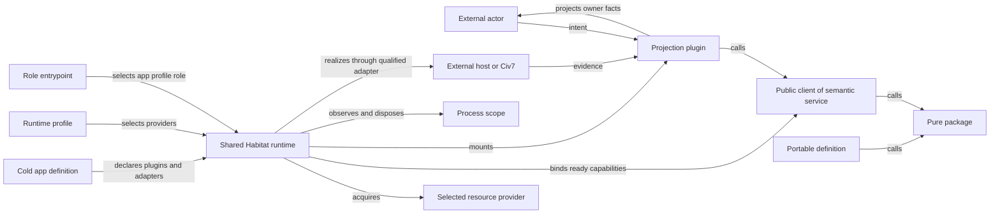

# Civ7 System Model

**Status:** Normative project system model for the capability-realization cutover
**Date:** 2026-07-31
**Owner:** Civ7 platform architecture

This model places the capabilities authorized by
[PRODUCT-AUTHORITY.md](./PRODUCT-AUTHORITY.md) against the shared Habitat
substrate. Shared Habitat is external authority for construction law and runtime
realization; Civ7 selects and composes it rather than forking, weakening, or
reimplementing it.

The inspected Habitat baseline is not a usable implementation pin. Its accepted
corrected successor has not landed, and the kinds identified as pending in
[KIND-LAW-MATRIX.md](./KIND-LAW-MATRIX.md) are not yet constructible. The
destinations below are therefore authority selections, not permission to move
source. Exact current-source dispositions remain in [CORPUS.md](./CORPUS.md).

## System Boundary

Inside the Civ7 Modding Tools system:

- portable SDKs, protocols, algorithms, definitions, and static policy;
- managed foreign resources and their concrete providers;
- semantic product services;
- CLI, API, web, and mod-definition projections;
- cold app definitions, runtime profiles, role entrypoints, and qualified
  adapter declarations.

Outside the system:

- people and external automation;
- Civilization VII, its loader, engine, Tuner endpoint, files, and official
  resource corpus;
- the host operating system and filesystem;
- remote source repositories and network consumers;
- shared Habitat kind law, generators, runtime compiler, provisioning kernel,
  process runtime, and role harnesses.

The shared Habitat platform is a sealed external substrate beneath the Civ7
system boundary. It is neither a Civ7 product capability nor a local migration
owner. Civ7 app source supplies cold declarations to that substrate; it does not
become a second runtime implementation.

## Placement Laws

An app is one finite cold composition packet: definition, profile, role
entrypoint, and any selected qualified adapters. The following rows keep those
declarations distinct from the external runtime that realizes them.

| Kind or role | Owns | Does not own |
| --- | --- | --- |
| Package | Pure reusable contracts, algorithms, parsing, planning, comparison, static policy, and deterministic test implementations | Foreign acquisition, product write authority, projection, process startup, or host effects |
| Resource | Provider-neutral acquire/use/release contract and typed readiness/failure vocabulary for one foreign capability | Provider selection, product semantics, caller projection, or app policy |
| Provider | One concrete resource acquisition and release implementation | Product policy, profile selection, semantic service operations, or projection |
| Service | One semantic capability and its facts, policy, transitions, correction law, contract, private implementation/router, and public in-process client | Transport mounting, resource acquisition, provider selection, UI/CLI presentation, or process startup |
| CLI topic plugin | One command-topic projection, cold capability requirements, and qualified command-local adapters | Binary startup, reusable semantic truth, provider construction, or alternate transport |
| Server API plugin | One caller-facing contract, request policy, context projection, transport metadata, and calls to public clients | Product state, provider construction, app startup, or private service implementation |
| Web plugin | Browser views, interactions, and client-side projection | Server startup, provider selection, product write authority, or private service source |
| Mod definition plugin | Portable authored mod identity, content, product configuration, and cold metadata | Generated output, installation, engine globals, process lifecycle, or live proof |
| Workflow plugin | Available shared grammar for durable orchestration that outlives one request and earns replay/retry ownership; no Civ7 instance is selected | Product facts, service policy, synchronous request composition, or current Studio run state |
| App definition | Cold product/runtime identity, plugin membership, and selected qualified adapter identities | Provider selection, acquisition, binding, mounting, observation, disposal, or reusable product truth |
| Runtime profile | Cold provider selection, configuration roots, and process/harness defaults | Plugin membership, semantic adapter identity, acquisition, or service policy |
| Role entrypoint | One cold app, profile, and role selection delegated through the shared start surface | A second startup plan, provider acquisition, manual mounting, or product semantics |
| Qualified app adapter | One cold environment-specific effect implementation selected by the app definition | Managed foreign-resource lifecycle, provider selection, service policy, or a generic integration cabinet |
| Shared runtime substrate (external) | Derivation, compilation, provider acquisition, capability and client binding, context materialization, role mounting, observation, and disposal | Civ7 product truth, plugin membership, provider choice, or semantic policy |

All selected kinds are closed. Required leaves define the spine; optional
leaves are finite, explicitly admitted capabilities. An open interior is not an
extensibility mechanism. Workflow grammar is available, but durable workflows
remain deferred until a Civ7 capability earns and selects an instance.

The resource/provider split has one writer at each fact boundary: the resource
defines the provider-neutral value and failure vocabulary; the selected
provider emits the concrete epoch, health, command, capture, and foreign-failure
facts under that contract. Services may interpret those facts into product
meaning but do not rewrite them.

## Relationship Vocabulary

Every cross-container edge uses one of these meanings:

| Edge | Authorized subject and meaning |
| --- | --- |
| `defines` | Owns portable product or contract truth consumed elsewhere |
| `derives` | Produces static output from identified source evidence |
| `declares` | Records cold plugin membership, capability requirements, or qualified adapter identities without executing them |
| `selects` | Chooses without constructing: an app definition selects plugins and qualified adapters, a profile selects providers and defaults, and an entrypoint selects one app/profile/role tuple |
| `acquires` | The shared runtime invokes a profile-selected provider and owns the resulting resource scope |
| `binds` | The shared runtime supplies ready resources and qualified adapter capabilities to a public service client or projection context |
| `mounts` | The shared runtime starts the role and projection selected by the entrypoint and app definition |
| `calls` | Invokes a public client or pure package contract |
| `projects` | Presents an owner capability to a caller without acquiring its authority |
| `realizes` | Applies a runtime-bound qualified effect to a portable definition without transferring definition authority |
| `observes` | Reads owner facts or runtime state without creating or deciding them |
| `disposes` | The shared runtime closes mounted roles, bound clients, and acquired resources in its owned process scope |
| `proves` | Supplies evidence for one named claim class |

Imports are implementation evidence, not a system relationship. A dependency
that cannot be described by one edge usually signals mixed ownership.

## Authority Direction



Authority flows inward through admitted intent and outward through owner facts.
The app, profile, and role entrypoint are cold inputs to shared runtime
realization. Profiles select providers; only the shared runtime acquires them,
binds ready capabilities and public clients, mounts roles, observes the process,
and disposes the scope. Services retain semantic authority, and projections call
their public clients. No projection, provider, app declaration, or runtime
profile reaches inward to extract private service contracts or implementation
types.

## Capability Realization Chains

### Official Game Knowledge

```text
identified Civ7 installation/resources
  -> qualified extraction command
  -> published official-resource corpus
  -> deterministic generated types and policy
  -> pure SDK/MapGen/Studio consumers
  -> generated-currentness proof
```

The corpus is static source evidence, not a managed runtime resource. The
extractor and publisher own effects; generated packages own the public static
contract.

### Generic Mod Product

```text
mod author intent
  -> SDK plus mod definition plugin
  -> deterministic render/file plan
  -> cold realization definition, profile, and role selection
  -> shared runtime binds the qualified install adapter and mounts the role
  -> Civ7 Mods tree
  -> independent installation, loader, and live evidence
```

The definition never depends on its realization. The cold realization
declaration references one definition and one qualified adapter identity; the
shared runtime executes the selected role and scopes the adapter. Generated,
installed, loader-accepted, and live facts remain independent.

### Swooper Map Product

```text
map author intent
  -> Swooper definition
  -> MapGen SDK/core
  -> deterministic artifacts, trace, metrics, and browser projection
  -> cold Swooper realization, profile, and map-role selection
  -> shared runtime binds the realization-local Civ7 adapter
  -> selected map entrypoint
  -> Civ7 map loader and engine projection
  -> fresh live evidence
```

Portable generation and Civ7 realization remain separate proof classes even
when one cold app declaration selects them together.

### Live Civ7 Control

```text
CLI or Studio actor intent
  -> topic or API projection
  -> civ7-control public client
  -> semantic admission and policy
  -> runtime-bound ready Tuner/window capabilities
  -> exact native Civ7 command or observation
  -> semantic result or reconciliation state
  -> same caller projection
```

The Tuner provider owns connection and session mechanics. The service owns
gameplay meaning. A cold profile selects the provider, while the shared runtime
acquires it, binds the service client, and owns process-scope disposal. No
direct-control facade, service-adapter package, or caller-owned contract sits
between them.

### Map Configuration And Realization

```text
Studio actor intent
  -> Studio web projection
  -> Studio API projection
  -> {
       public Swooper definition surface for config admission/serialization
       mapgen-runs public client for operation authority
     }
  -> runtime-bound source/run/log adapters and control capabilities
  -> MapGen-runs semantic transitions and civ7-control client calls
  -> operation facts and correlated live evidence
  -> Studio API and web outcome view
```

Save & Deploy may remain one interaction, but source writing, deployment, and
their receipts remain distinct owner transitions.

### CLI Product Access

```text
terminal actor
  -> cold commandless CLI definition, profile, and CLI role
  -> shared runtime mounts native oclif
  -> native discovery selects one registered topic projection
  -> shared runtime binds that command's declared public client or adapter
  -> topic projection calls the public client or pure package contract
  -> owner capability
  -> structured terminal projection
```

The CLI app is already commandless: `apps/cli/package.json#oclif.plugins` is the
sole topic-membership authority, and topic plugins already own command UX. The
cutover migrates only the app anchor, definition/profile/entrypoint proof, and
delegation to the shared runtime harness; it does not move command logic out of
the app because none is owned there. Neither app declarations nor topics own
service policy or resource acquisition.

### Durable Workflows

Shared Habitat supplies workflow grammar, but this model selects no Civ7
workflow instance. Durable workflow realization remains deferred until a
process-independent capability requires resume, retry, scheduling, fanout, or
durable progress. Request-local and retained-process MapGen operations remain
service-owned state rather than a workflow by analogy.

## Current-To-Destination Authority Map

| Current mixed owner | Destination authorities |
| --- | --- |
| `@civ7/direct-control` | `resources/civ7-tuner`, its provider, `services/civ7-control`, and owner-qualified diagnostic adapters/projections |
| Control facade and parallel contract shapes | One `services/civ7-control` public client; private router and implementation |
| `packages/studio-contract` | Portable MapGen config package plus Studio API caller contract |
| `packages/studio-server` | MapGen-runs service, Studio API plugin, and cold Studio app declarations/adapters selected for shared runtime realization |
| `packages/mapgen-studio-ui` | Retained component library; no relocation is selected. The separate Studio browser application source moves to the web projection |
| Concrete `packages/civ7-adapter` engine code | Matching mod realization's map-script runtime |
| `packages/plugins/plugin-mods` | Pure installation plan package plus qualified app effects; CLI topics only project the app-bound capability |
| Swooper/Dacia mixed mod roots | Definition plugins plus matching realization apps |
| `apps/cli` runtime anchor and shell proof | Corrected shared app anchor, definition/profile/entrypoint proof, and runtime-harness delegation; commands remain in their existing topic owners |

These are authority selections, not permission to create an unconstructible kind
or a complete source-disposition ledger. In particular, the Studio UI package
does not move on the strength of this table.

## State And Lifecycle Ownership

| State or lifecycle | Fact or behavior owner | Shared-runtime responsibility | Replay/crash law |
| --- | --- | --- | --- |
| Tuner socket/session epoch | Local-socket provider | Acquire the profile-selected provider once for the required scope and release it | Reconnect creates a new epoch; release closes provider-owned socket state |
| Live control decision | Civ7 control service | Bind ready Tuner/window capabilities to the public client and dispose the binding | Unverified dispatch is explicit and must not be blindly repeated |
| Studio process identity | Shared process runtime | Create, observe, and dispose one role process selected by the entrypoint | Stable for one process scope; never product state |
| MapGen operation record | MapGen-runs service | Bind and scope the service client; dispose process-scoped service state after drain | Request-correlated, adoptable during the retained process scope, cancellable, and terminal according to owner policy |
| Authored config source write | Swooper definition for admitted content; qualified Studio adapter for the exact write/rollback effect | Bind the app-selected adapter using profile-supplied roots and scope its execution | Preserve the prepared write and exact write or rollback receipt |
| Mod installation | Qualified app adapter emits the exact replacement-effect receipt; the matching mod realization owns deployment meaning | Bind the selected adapter and scope its execution; CLI topics call the bound capability without becoming writers | Retry compares supplied tree state and never infers loader acceptance |
| Generated policy | Generator/package owner | None; this is deterministic static derivation, not runtime acquisition | Reproduce from the identified official source revision |
| Browser preview | Studio web projection and browser worker | Mount the selected web role and dispose its scope | Ephemeral projection; reproducible from exact admitted inputs and independently cancellable |

Cold app definitions, profiles, and role entrypoints select or declare; they are
never lifecycle owners. A runtime cache, registry, or actor exists only when its
semantic or mechanical owner needs that lifecycle. Process state is not promoted
into a resource merely because the shared runtime must eventually dispose it.

## Forbidden Relations

- A service does not acquire its own provider, import an app profile, or cede
  semantic decisions to the runtime that binds it.
- A projection calls public clients or pure package contracts. It does not
  import private service source, construct providers, or become a second
  semantic service.
- A CLI command does not construct Tuner, service, or app runtime state.
- The already-commandless CLI app does not receive commands during migration;
  only its app anchor, cold composition proof, and runtime delegation change.
- A facade does not use `Parameters<OtherSurface["method"]>` as contract
  authority.
- A definition plugin does not write generated files or install itself.
- A package does not hide host filesystem or ambient engine access.
- A provider does not name gameplay operations or caller routes.
- An app definition does not acquire, bind, mount, observe, dispose, duplicate
  service contracts, or own semantic capability state.
- A profile selects providers and roots only. It does not select plugins or
  semantic adapter identities and does not perform acquisition.
- A role entrypoint selects one app/profile/role tuple and delegates once; it
  does not contain a second startup or mounting plan.
- Shared runtime acquires, binds, mounts, observes, and disposes, but it does not
  gain Civ7 product facts or policy.
- No current source, including Studio run state, is classified as a workflow.
  Workflow grammar remains available and a Civ7 instance remains deferred until
  request/process lifetime is demonstrably insufficient.
- `packages/mapgen-studio-ui` remains a component library. The selected
  `plugins/web/app/mapgen-studio` destination applies only to browser
  application source currently under `apps/mapgen-studio`; it does not
  relocate or relabel the component package.
- A controller mod does not appear without an accepted same-realm consumer and
  lifecycle owner.
- A Habitat rule does not gain Civ7 product policy.

## Construction Gate

Before moving source into a destination:

1. the product capability and semantic owner are authorized;
2. the corrected shared kind and selected-depth laws have landed upstream at a
   usable implementation pin;
3. the exact root is constructible through that shared generator or an accepted
   manifest-backed instance path;
4. its public faces, dependencies, proof topology, and runtime role are closed;
5. current consumers and behavior evidence are frozen; and
6. the same implementation container deletes the displaced owner.

The corrected shared successor has not landed, so this gate remains closed for
target source moves. If a kind is unconstructible, keep current behavior stable.
Do not create a local approximation, move source speculatively, or harden a
transition architecture.

## Transition Test

The system model is stable enough to open outcome modeling only when:

- every product owner maps to exactly one Habitat role;
- every relationship has a named direction;
- no service, resource, provider, plugin, app, or workflow shares a writer;
- no reciprocal client or private-source dependency is required;
- app definitions, profiles, and role entrypoints remain cold declarations;
- provider, process, binding, mounting, operation, and effect lifecycles have
  one owner, with shared runtime responsible for acquisition and disposal;
- current and destination topology remain visibly distinct; and
- every unconstructible destination remains blocked rather than locally
  emulated.
