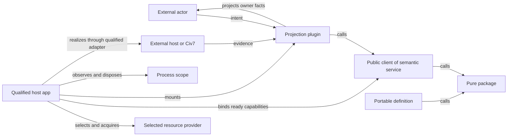

# Civ7 System Model

**Status:** Normative project system model for the capability-realization cutover
**Date:** 2026-08-05
**Owner:** Civ7 platform architecture

This model places the capabilities authorized by
[PRODUCT-AUTHORITY.md](./PRODUCT-AUTHORITY.md) against the shared Habitat
substrate. Shared Habitat is external authority for the selected structural
kinds; Civ7 selects and composes them rather than forking, weakening, or
reimplementing them. Habitat 0.5.2 does not supply a generic product runtime and
does not select `service@1`. Concrete host composition and service law therefore
remain explicit Civ7 responsibilities.

The selected shared kinds are constructible at the Ground-proven 0.5.2 pin.
Qualified Civ7 overlays still must close each destination before source moves.
Exact current-source dispositions remain in [CORPUS.md](./CORPUS.md).

## System Boundary

Inside the Civ7 Modding Tools system:

- portable SDKs, protocols, algorithms, definitions, and static policy;
- managed foreign resources and their concrete providers;
- semantic product services;
- CLI, API, web, and mod-definition projections;
- runtime apps, concrete host entrypoints, and qualified adapters.

Outside the system:

- people and external automation;
- Civilization VII, its loader, engine, Tuner endpoint, files, and official
  resource corpus;
- the host operating system and filesystem;
- remote source repositories and network consumers;
- shared Habitat kind law and its consumer tooling.

The shared Habitat platform is a sealed external substrate beneath the Civ7
system boundary. It is neither a Civ7 product capability nor a local migration
owner. Civ7 app source implements its real host composition; Habitat closes the
app shell but does not execute the product.

## Placement Laws

An app is one finite runtime composition for an actual host or task: concrete
entrypoints, selected providers and plugins, client construction, qualified
adapters, and owned process lifetime. The following rows keep that composition
distinct from reusable capabilities.

| Kind or role | Owns | Does not own |
| --- | --- | --- |
| Package | Pure reusable contracts, algorithms, parsing, planning, comparison, static policy, and deterministic test implementations | Foreign acquisition, product write authority, projection, process startup, or host effects |
| Resource | Provider-neutral acquire/use/release contract and typed readiness/failure vocabulary for one foreign capability | Provider selection, product semantics, caller projection, or app policy |
| Provider | One concrete resource acquisition and release implementation | Product policy, app selection, semantic service operations, or projection |
| Service | One semantic capability and its facts, policy, transitions, correction law, contract, private implementation/router, and public in-process client | Transport mounting, resource acquisition, provider selection, UI/CLI presentation, or process startup |
| CLI topic plugin | One command-topic projection, cold capability requirements, and qualified command-local adapters | Binary startup, reusable semantic truth, provider construction, or alternate transport |
| Server API plugin | One caller-facing contract, request policy, context projection, transport metadata, and calls to public clients | Product state, provider construction, app startup, or private service implementation |
| Web plugin | Browser views, interactions, and client-side projection | Server startup, provider selection, product write authority, or private service source |
| Mod definition plugin | Portable authored mod identity, content, product configuration, and cold metadata | Generated output, installation, engine globals, process lifecycle, or live proof |
| Workflow plugin | Available shared grammar for durable orchestration that outlives one request and earns replay/retry ownership; no Civ7 instance is selected | Product facts, service policy, synchronous request composition, or current Studio run state |
| App | Product/runtime identity, concrete host entrypoints, selected plugins and providers, public-client construction, qualified adapters, mounting, observation, and disposal | Reusable product truth, semantic service policy, or plugin-owned interaction meaning |
| Qualified app adapter | One product-specific environment effect selected by the app | Managed foreign-resource lifecycle, provider selection, service policy, or a generic integration cabinet |

All selected kinds are closed. Required leaves define the spine; optional
leaves are finite, explicitly admitted capabilities. An open interior is not an
extensibility mechanism. Workflow grammar is available, but durable workflows
remain deferred until a Civ7 capability earns and selects an instance.

The resource/provider split has one writer at each fact boundary: the resource
defines provider-neutral value and failure vocabulary; the selected provider
emits concrete epoch, health, command, capture, and foreign-failure facts under
that contract. Services may interpret those facts into product meaning but do
not rewrite them.

## Relationship Vocabulary

Every cross-container edge uses one of these meanings:

| Edge | Authorized subject and meaning |
| --- | --- |
| `defines` | Owns portable product or contract truth consumed elsewhere |
| `derives` | Produces static output from identified source evidence |
| `declares` | Records plugin membership, capability requirements, or qualified adapter identities without transferring their authority |
| `selects` | An app chooses the concrete provider, plugin, adapter, or host role it will realize |
| `acquires` | An app invokes its selected provider and owns the resulting process-local resource scope |
| `binds` | An app supplies ready resources and qualified adapters to a public service client or projection context |
| `mounts` | An app starts its selected native host and projections |
| `calls` | Invokes a public client or pure package contract |
| `projects` | Presents an owner capability to a caller without acquiring its authority |
| `realizes` | Applies a runtime-bound qualified effect to a portable definition without transferring definition authority |
| `observes` | Reads owner facts or runtime state without creating or deciding them |
| `disposes` | The app closes mounted roles, bound clients, and acquired resources in its process scope |
| `proves` | Supplies evidence for one named claim class |

Imports are implementation evidence, not a system relationship. A dependency
that cannot be described by one edge usually signals mixed ownership.

## Authority Direction


```mermaid
flowchart LR
  X[External actor] -->|intent| P[Projection plugin]
  G[External host or Civ7] -->|evidence| P
  P -->|calls| S[Public client of semantic service]
  S -->|calls| K[Pure package]

  A[Qualified host app] -->|selects and acquires| R[Selected resource provider]
  A -->|binds ready capabilities| S
  A -->|mounts| P
  A -->|observes and disposes| L[Process scope]

  D[Portable definition] -->|calls| K
  A -->|realizes through qualified adapter| G
  P -->|projects owner facts| X
```

Authority flows inward through admitted intent and outward through owner facts.
The qualified host app selects providers and plugins, acquires ready
capabilities, constructs public clients, mounts native roles, observes the
process, and disposes the scope. Services retain semantic authority, and
projections call their public clients. No projection, provider, or app reaches
inward to extract private service contracts or implementation types.

## Capability Realization Chains

### Official Game Knowledge

```text
identified Civ7 installation/resources
  -> qualified extraction command
  -> published official-resource corpus
  -> deterministic generated types and policy
  -> pure SDK/MapGen/Studio consumers
  -> generated-currentness proof
```

The corpus is static source evidence, not a managed runtime resource. The
extractor and publisher own effects; generated packages own the public static
contract.

### Generic Mod Product

```text
mod author intent
  -> SDK plus mod definition plugin
  -> deterministic render/file plan
  -> finite realization build/deploy entrypoint
  -> realization app invokes its qualified install adapter
  -> Civ7 Mods tree
  -> independent installation, loader, and live evidence
```

The definition never depends on its realization. Nx records the realization's
one-way product dependency, while its finite build/deploy entrypoints invoke
the qualified adapter directly. Generated, installed, loader-accepted, and live
facts remain independent. No absent shared product runtime is simulated.

### Swooper Map Product

```text
map author intent
  -> Swooper definition
  -> MapGen SDK/core
  -> deterministic artifacts, trace, metrics, and browser projection
  -> finite Swooper build/deploy realization
  -> realization-local Civ7 adapter
  -> selected map entrypoint
  -> Civ7 map loader and engine projection
  -> fresh live evidence
```

Portable generation and Civ7 realization remain separate proof classes even
when one finite app realizes them together.

### Foundational Live Civ7 Control

```text
CLI, Studio, MapGen-runs, Swooper proof, or play-service intent
  -> caller projection or public service dependency
  -> civ7-control public client
  -> runtime-bound ready Tuner and window-capture resources
  -> closed app, game, map, or UI operation
  -> exact epoch-correlated native fact, dispatch, or readback
  -> requesting owner
```

The Tuner resource defines health, epoch, raw-command, and failure vocabulary;
the selected Tuner provider owns the concrete connection/session mechanics and
emits those facts. The window-capture provider owns raw ScreenCaptureKit
execution and scoped children. The control service has exactly the finite
module set `{app,game,map,ui}` and owns only Civ7 interpretation plus
epoch-correlated semantic facts and closed native operations in those modules.
It does not own raw Tuner health, epoch, or command facts, actor intent,
gameplay strategy, or next-action policy. The qualified CLI or Studio app
selects and acquires both providers, constructs the service client with both
ready capabilities, and owns process-scope disposal. No direct-control facade,
service-adapter package, caller-owned contract, arbitrary JavaScript executor,
or provider state crosses this boundary.

### Civ7 Play

```text
human or agent gameplay intent
  -> game-play CLI or selected API projection
  -> civ7-play public client
  -> actor-facing observation, check, request, and reconciliation policy
  -> civ7-control public client
  -> exact native control fact or transition
  -> play-owned outcome and next lawful action
  -> caller projection
```

The play service owns gameplay meaning and composes the foundational control
capability. It has exactly the finite module set `{attention,automation,city,
diplomacy,notifications,progression,planning,turn,unit}`. Actor reconciliation,
no-repeat policy, and next-action policy remain play-owned across those
modules. It never receives `Civ7Tuner`, provider configuration, raw runtime
inspection, or a private control router. Shared live admission is one
dependency, not one semantic owner.

### Map Configuration And Realization

```text
Studio actor intent
  -> Studio web projection
  -> Studio API projection
  -> {
       public Swooper definition surface for config admission/serialization
       mapgen-runs public client for operation authority
     }
  -> runtime-bound source/run/log adapters and control capabilities
  -> MapGen-runs semantic transitions and foundational control-client calls
  -> operation facts and correlated live evidence
  -> Studio API and web outcome view
```

Save & Deploy may remain one interaction, but source writing, deployment, and
their receipts remain distinct owner transitions.

### CLI Product Access

```text
terminal actor
  -> commandless CLI app starts native oclif
  -> native discovery selects one registered topic projection
  -> app-owned command context binds the required public client or adapter
  -> topic projection calls the public client or pure package contract
  -> owner capability
  -> structured terminal projection
```

The CLI app is already commandless: `apps/cli/package.json#oclif.plugins` is the
sole topic-membership authority, and topic plugins already own command UX. The
cutover seals the app anchor, native Oclif entrypoint, topic registry, and
command-scope binding/finalization proof; it does not move command logic into
the app. Topics own neither service policy nor provider construction.

### Durable Workflows

Shared Habitat supplies workflow grammar, but this model selects no Civ7
workflow instance. Durable workflow realization remains deferred until a
process-independent capability requires resume, retry, scheduling, fanout, or
durable progress. Request-local and retained-process MapGen operations remain
service-owned state rather than a workflow by analogy.

## Current-To-Destination Authority Map

| Current mixed owner | Destination authorities |
| --- | --- |
| `@civ7/direct-control` | `resources/civ7-tuner`, `resources/window-capture`, their providers, `services/civ7-control`, `services/civ7-play`, qualified app adapters, and owner-qualified diagnostic projections |
| Control facade and parallel contract shapes | Delete; control and play each expose one public contract/client face over one private router authority, and callers use the public client without picking types from another surface |
| `packages/studio-contract` | Portable MapGen config package plus Studio API caller contract |
| `packages/studio-server` | MapGen-runs service, Studio API plugin, and qualified Studio host composition/adapters |
| `packages/mapgen-studio-ui` | Retained component library; no relocation is selected. The separate Studio browser application source moves to the web projection |
| Concrete `packages/civ7-adapter` engine code | Matching mod realization's map-script runtime |
| `packages/plugins/plugin-mods` | Pure installation plan package plus qualified app effects; CLI topics only project the app-bound capability |
| Swooper/Dacia mixed mod roots | Definition plugins plus matching realization apps |
| `apps/cli` runtime anchor and shell proof | Shared app anchor plus qualified native Oclif startup, command binding, and finalization proof; commands remain in their topic owners |

These are authority selections, not permission to create an unselected kind
or a complete source-disposition ledger. In particular, the Studio UI package
does not move on the strength of this table.

## State And Lifecycle Ownership

| State or lifecycle | Fact or behavior owner | App-composition responsibility | Replay/crash law |
| --- | --- | --- | --- |
| Tuner socket/session epoch | Local-socket provider | Acquire the selected provider once for the required scope and release it | Reconnect creates a new epoch; release closes provider-owned socket state |
| Window-capture provider scope | macOS ScreenCaptureKit provider | Acquire one ready generic capture capability, track every invocation child, and release the scope | Target law: release closes admission, applies bounded child termination, and drains admitted capture operations; the helper cache is inert |
| Foundational live-control scope | Civ7 control service | Bind ready Tuner and window-capture resources to the public control client and dispose the binding | Provider-owned epoch changes invalidate control observations; raw dispatch never becomes gameplay acceptance |
| Gameplay decision | Civ7 play service | Bind the public control client to the public play client; no provider enters play context | Unverified dispatch is explicit, retains its no-repeat key, and must be reconciled through fresh control facts |
| Studio process identity | MapGen Studio app | Create, observe, and dispose its native host roles | Stable for one process scope; never product state |
| MapGen operation record | MapGen-runs service | Bind and scope the service client; dispose process-scoped service state after drain | Request-correlated, adoptable during the retained process scope, cancellable, and terminal according to owner policy |
| Authored config source write | Swooper definition for admitted content; qualified Studio adapter for the exact write/rollback effect | Bind the app-selected adapter using app-owned roots and scope its execution | Preserve the prepared write and exact write or rollback receipt |
| Mod installation | Qualified app adapter emits the exact replacement-effect receipt; the matching mod realization owns deployment meaning | Bind the selected adapter and scope its execution; CLI topics call the bound capability without becoming writers | Retry compares supplied tree state and never infers loader acceptance |
| Generated policy | Generator/package owner | None; this is deterministic static derivation, not runtime acquisition | Reproduce from the identified official source revision |
| Browser preview | Studio web projection and browser worker | Mount the web host and dispose its scope | Ephemeral projection; reproducible from exact admitted inputs and independently cancellable |

Apps own their concrete process composition and lifetime without gaining the
semantic authority of the services, resources, or plugins they compose. A
runtime cache, registry, or actor exists only when its semantic or mechanical
owner needs that lifecycle. Process state is not promoted into a resource
merely because an app must eventually dispose it.

## Forbidden Relations

- A service does not acquire its own provider, import its app, or cede
  semantic decisions to the runtime that binds it.
- The play service does not receive Tuner, window capture, provider state,
  arbitrary JavaScript execution, or private control source; it depends on the
  public foundational control capability.
- The control service does not own actor-facing gameplay strategy, next-action
  policy, or a second copy of play outcomes merely because it performs the
  native operation.
- A projection calls public clients or pure package contracts. It does not
  import private service source, construct providers, or become a second
  semantic service.
- A CLI command does not construct Tuner, service, or app process state.
- The already-commandless CLI app does not receive commands during migration;
  only its app anchor, cold composition proof, and runtime delegation change.
- A facade does not use `Parameters<OtherSurface["method"]>` as contract
  authority.
- A definition plugin does not write generated files or install itself.
- A package does not hide host filesystem or ambient engine access.
- A provider does not name gameplay operations or caller routes.
- An app does not duplicate service contracts or own semantic capability state
  merely because it selects, binds, mounts, observes, and disposes them.
- No descriptor, profile, or `startApp` wrapper is authored without a concrete
  runtime capability that consumes it.
- No current source, including Studio run state, is classified as a workflow.
  Workflow grammar remains available and a Civ7 instance remains deferred until
  request/process lifetime is demonstrably insufficient.
- `packages/mapgen-studio-ui` remains a component library. The selected
  `plugins/web/app/mapgen-studio` destination applies only to browser
  application source currently under `apps/mapgen-studio`; it does not
  relocate or relabel the component package.
- A controller mod does not appear without an accepted same-realm consumer and
  lifecycle owner.
- A Habitat rule does not gain Civ7 product policy.

## Construction Gate

Before moving source into a destination:

1. the product capability and semantic owner are authorized;
2. the selected shared kind is published at the accepted 0.5.2 pin, or the
   destination is governed by an explicitly accepted local compatibility kind;
3. a selected shared instance has its accepted manifest-backed construction
   path, while a local compatibility kind has resolved rules and exact path
   coverage without manufacturing a false shared-kind manifest;
4. its public faces, dependencies, proof topology, and runtime role are closed;
5. current consumers and behavior evidence are frozen; and
6. the same implementation container deletes the displaced owner.

The gate is open only for the six Ground-proven shared kinds and the explicitly
accepted local Civ7 service compatibility kind. If a destination has neither a
selected shared kind nor an accepted local compatibility law, keep current
behavior stable. Do not create a local approximation, move source
speculatively, or harden a transition architecture.

## Transition Test

The system model is stable enough to open outcome modeling only when:

- every product owner maps to exactly one Habitat role;
- every relationship has a named direction;
- no service, resource, provider, plugin, app, or workflow shares a writer;
- no reciprocal client or private-source dependency is required;
- provider, process, binding, mounting, operation, and effect lifecycles have
  one owner, with each qualified app responsible for its concrete composition
  and disposal;
- current and destination topology remain visibly distinct; and
- every unselected destination remains blocked rather than locally emulated.
