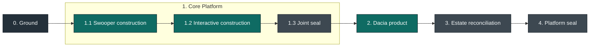

# Civ7 Capability Realization Workstream

**Status:** Ground active and refused at shared kind construction; release
provenance and initializer idempotence verified, target source stationary
**Frame:** [FRAME.md](./FRAME.md)
**Model progression:** [MODEL-PROGRESSION.md](./MODEL-PROGRESSION.md)
**Product authority:** [PRODUCT-AUTHORITY.md](./PRODUCT-AUTHORITY.md)
**System model:** [SYSTEM-MODEL.md](./SYSTEM-MODEL.md)
**Outcome model:** [OUTCOME-MODEL.md](./OUTCOME-MODEL.md)
**Actor lens:** [ACTOR-ROLE-OUTCOME-MODEL.md](./ACTOR-ROLE-OUTCOME-MODEL.md)
**Current chains:** [CURRENT-CAPABILITY-CHAINS.md](./CURRENT-CAPABILITY-CHAINS.md)
**Selected topology:** [TOPOLOGY.md](./TOPOLOGY.md)
**Kind law:** [KIND-LAW-MATRIX.md](./KIND-LAW-MATRIX.md)
**Migration corpus:** [CORPUS.md](./CORPUS.md)
**Proof corpus:** [PROOF-CORPUS.md](./PROOF-CORPUS.md)
**Ground receipt:** [GROUND-RECEIPT.md](./GROUND-RECEIPT.md)

## Objective

Materialize one cohesive Civ7 modding platform on the shared Habitat substrate.
The final platform preserves the authorized product capabilities while giving
each fact, transition, lifecycle, and effect one qualified owner. It removes
hybrid containers rather than carrying them forward under new names.

The migration unit is a complete product capability realization chain:

```text
meaning -> lawful structure -> lawful movement -> lived observation
  -> displaced-owner deletion -> seal
```

Models are authority and evidence, not a backlog. Work is the finite difference
between those models and the observed estate. Once a difference closes, it
disappears from the active frame.

## Director Frame

### Attractor Cubes

The active context filter is deliberately small and selective:

| Cube | Attractors |
| --- | --- |
| Meaning | Actor. Intent. Outcome. Refusal. Trust. |
| Structure | Owner. Boundary. Direction. Lifecycle. Closure. |
| Descent | Ground. Chain. Ratchet. Delete. Seal. |

These are not a vocabulary list. Each cube selects the context admitted into
one decision. A clarification that sharpens the same selection updates the
rolling frame in place; a change that selects a different governing context is
a recorded focus pivot.

### Layer Weight

| Layer | Character | Authority |
| --- | --- | --- |
| Packages and static policy | Dense and slow | Pure contracts, schemas, algorithms, plans, generated static truth |
| Resources and providers | Stable and explicit | Foreign lifecycle, readiness, epochs, typed failures, concrete acquisition |
| Services | Assured and semantic | Capability policy, invariants, operations, scoped semantic state |
| Projections | Responsive and replaceable | Caller translation, transport, presentation, host integration |
| Apps and realizations | Flexible at the surface | Product membership, profile, entrypoint, adapter selection, runtime observation |

Lower layers do not absorb upper-layer convenience. Upper layers remain easy to
change because the layers beneath them are narrow, typed, and unsurprising.

## Settled Evidence

The following are complete evidence, not open work containers:

- Product, system, outcome, and actor-role-outcome models are sealed against
  the exact current and proof corpora.
- Studio design synchronization, Explore Live Map outcome honesty, physical
  wind and pressure reconstruction, and seed-stateless latitude behavior are
  landed current-product receipts.
- Swooper's portable definition and Civ7 realization are distinct owners.
- The CLI app is commandless; nested commands belong to
  `plugins/cli/topics/*`.
- `services/civ7-control` is the sole semantic live-control authority.
- The unconsumed controller island is deleted. Its future form remains deferred
  behind the recorded same-realm consumer and lifecycle trigger.
- MapGen remains portable. A network-shaped MapGen generation service and a
  manufactured MapGen-run resource remain excluded.

Historical semantic cuts under `docs/projects/engine-refactor-v1` remain
behavior and decision evidence. They are not reopened merely because their
source later moves into the accepted topology.

## Final Initiative



The order is product-led. Each container establishes a construction pattern or
public capability that the next container consumes. Swooper and Interactive
retain distinct product owners, but their current source-write, deployment, and
live-proof dependencies make them one execution parent. Nested slices receive
separate Graphite branches for review; neither claims migration until the Core
Platform exit receipt closes.

## Container 0: Ground

**Outcome:** Civ7 can construct and enforce the selected platform kinds using
one versioned upstream Habitat consumer release, without local substrate forks
or copied policy.

**Entry:** the four model receipts and selected topology remain current.

**Contained work:**

1. Receive the direct Habitat-lane handoff and verify the exact package version,
   source identity, digest, release provenance, and supported Bun/Nx/Oclif
   surface.
2. Run the consumer initializer in a disposable or no-write mode and prove that
   repeated application is idempotent.
3. Admit and prove only the shared generic package, resource, provider, service,
   API, CLI-topic, and app blueprint kinds required by the initiative. Prove
   their shared construction and initializer mechanics separately. Each product
   slice owns admission of its qualified Civ7 laws immediately before source
   movement.
4. Receive and verify the exact shared vendor-transition manifest for the root
   catalog, patched dependency, patch file, lockfile, and Habitat package. Do
   not mutate the root or strand current consumers during Ground.
5. Prove blueprint-owned instance anchors, generated `habitat.toml` facts,
   positive and negative injected fixtures, construction success, and
   unsupported-kind empty-write refusal.
6. Freeze the exact Core Platform source and proof census from `CORPUS.md` and
   `PROOF-CORPUS.md` before opening its red corpus.

**Exit receipt:** the pinned substrate constructs every shared kind needed by
the Core Platform parent, the vendor transition is exact and ready for its
coupled Interactive branch, the live estate is classified without source
relocation, and no generic law contains Civ7 instance names.

**Refusal:** one missing kind, non-idempotent initializer, unverified artifact,
or need for a Civ7-local approximation keeps all target source stationary.
The current refusal and exact re-entry trigger are recorded in
[GROUND-RECEIPT.md](./GROUND-RECEIPT.md).

## Container 1: Core Platform

**Actors and outcomes:** a map author can author, run, inspect, compare, and
explain deterministic Swooper Physics output. A release operator can realize
one exact definition in Civ7 and receive independent materialization,
installation, loader, and live-behavior facts. An operator or agent can observe
a running Civ7 epoch, make one lawful native decision, reconcile uncertainty
without unsafe repeat, and run, adopt, inspect, or cancel one request-correlated
MapGen realization through CLI or Studio without changing owner meaning.

**Why one parent:** Swooper is the most mature definition/realization split and
therefore the first construction slice. It is not independently sealable: its
source writer belongs to the Studio app, its deployment path crosses current
Studio source, and its live proofs consume the target control client, Studio
API, MapGen-runs service, app adapters, and Tuner provisioning. Coupling the
execution seal removes that knot without merging the products' semantic owners.

**Entry:** Ground closes. The Swooper child uses the admitted substrate without
applying a dependency-only root transition. The effective vendor change occurs
with native service and error migration in the Interactive slice; no old patch
line survives the joint seal.

### 1.1 Swooper Product

Admit the qualified map-definition and map-realization laws, and instantiate the
MapGen CLI-topic root under Ground's shared CLI-topic law, before moving their
respective Swooper source.

#### 1.1.1 Portable Definition

- Close `plugins/mod/map/swooper-physics` around domains, recipe, authoring,
  diagnostics, metrics, trace, and visualization.
- Retain generic mechanics in MapGen packages and product meaning in Swooper.
- Move definition-owned diagnostic and metric commands to the MapGen topic
  instance without moving product truth into the CLI.
- Remove generated-file materializers, live engine globals, and realization
  effects from the definition only where their destinations already exist.
- Keep Studio-targeted source writers, Studio-owned deployment source, and
  Interactive-dependent live proof stationary until slice 1.2 constructs those
  exact destinations.

#### 1.1.2 Civ7 Realization

- Construct `apps/mods/map/swooper-physics` as one cold app definition with the
  `local-civ7` profile, `build` and `deploy` entrypoints, exact target table,
  realization-local map-script adapter/setup/entrypoint, and qualified install
  adapter.
- Reduce `packages/civ7-adapter` to its portable contract, static metadata,
  detached comparison support, and deterministic mock.
- Reduce mod installation to pure validation, comparison, plan, digest, and
  receipt matter; keep filesystem effects at the app adapter.
- Preserve MapGen's separate map seed, game seed, setup, artifacts, trace,
  metrics, diagnostics, and visualization contracts.

#### 1.1.3 Slice Construction And Evidence

```text
admitted config
  -> generated entrypoint and source/artifact digests
  -> materialized exact tree
  -> installation/replacement receipt
  [held for parent]
  -> loader/runtime evidence -> final-surface parity
```

Each arrow yields an independent fact. Slice 1.1 constructs and proves only the
cold chain available at its admitted destinations; it freezes the live oracle
for execution after slice 1.2 supplies the required owners. Browser preview is
not loader proof; installation is not live behavior; later failure does not
erase an earlier receipt. Before retiring the engine-bound SDK path or concrete
adapter exports, close generated entrypoints, SDK types, package exports, docs
and examples, live-subpath imports, and an exact external-consumer search. Old
scripts and Swooper-owned false-plugin consumers receive terminal dispositions
only after their replacement proof passes.

**Corpus:** select only rows from *Swooper Definition And Realization*, *Civ7
Engine Adapter And Map Entrypoint*, *Direct-Control Consumer Closure*, and
*False Plugin Collapse* whose destinations are the admitted definition,
realization, pure adapter package, or MapGen CLI-topic instance. Rows targeting
the Studio app, control service, MapGen-runs, app adapters, Tuner provisioning,
or their live proofs remain stationary for slice 1.2. No other row enters this
slice implicitly.

**Slice receipt:** every Swooper-owned destination and the MapGen topic instance
are constructible, their selected rows have exact dispositions, and every
cross-owner row is explicitly held for slice 1.2. No old owner is deleted and
no independent migration or merge is claimed.

**Refusal:** an isolated package/adapter move, missing live fact, retained host
effect in the definition, or compatibility facade refuses the whole migration
claim. The slice remains inside the Core Platform parent.

### 1.2 Interactive Platform

**Actors and outcomes:** an operator or agent can observe a running Civ7 epoch,
make one lawful native decision, reconcile uncertainty without unsafe repeat,
and run, adopt, inspect, or cancel one request-correlated MapGen realization
through CLI or Studio without changing owner meaning.

**Why next:** the Swooper slice supplies the concrete realization target and
the exact consumer gates that expose the remaining host, transport, service,
API, web, CLI, and app knot. This slice closes those dependencies rather than
hardening a transition facade.

The nested order is dependency order, not separate product migrations.

#### 1.2.1 Pure Matter And Managed Collaboration

Instantiate resource, provider, service, API, and remaining CLI-topic roots
under Ground-proven shared laws. Admit only the qualified web, CLI-app, and
Studio-app laws before moving their respective source.

- Extract only proven pure config, save parsing, run-workspace comparison, and
  mod-install planning into packages.
- Construct `resources/civ7-tuner` with its local-socket provider and
  `resources/civ7-window-capture` with its macOS provider.
- Keep framing, socket, helper acquisition, session lifetime, epochs, health,
  and foreign-failure translation private to their qualified owners. Do not
  publish a Tuner protocol package with one consumer.

#### 1.2.2 Semantic Services

- Apply the accepted root `@orpc`/Effect/TypeBox transition in the same semantic
  branch that migrates native service construction and errors. Do not create a
  dependency-only intermediate estate; retain the obsolete patch file until no
  consumer remains, then delete it at the joint seal.
- Rewrite `services/civ7-control` directly onto the accepted service substrate,
  consuming ready runtime-bound capabilities through private module ports and
  exposing one public client.
- Construct `services/mapgen-runs` for admission, operation state, retention,
  adoption, cancellation, diagnostics, autoplay policy, and terminal outcomes.
- Keep process-scoped semantic state in its service scope. Cold host effects
  enter through exact app-selected dependencies; neither service constructs a
  provider, mount, process, or ambient singleton.

#### 1.2.3 Projections

- Construct the MapGen Studio API projection from its frozen route ledger,
  composing public service clients rather than extracting private contracts or
  redeclaring schemas.
- Construct the Studio web projection around authorized views, interactions,
  and browser execution.
- Construct all CLI topic roots with exact command mirrors. Semantic game
  commands use the control client; MapGen operations use the MapGen-runs
  client; raw diagnostics retain only their bounded evidence vocabulary.

#### 1.2.4 App Realization

- Make `apps/mapgen-studio` a cold composition: plugin membership, profile,
  role entrypoints, and exact semantic adapter selection.
- Construct the commandless CLI app around its app definition, selected
  profiles, `civ7.ts` entrypoint, shared Oclif harness, runtime binding, and
  app-owned `local-mods` adapter. The app owns no commands or semantic service
  truth.
- Let shared runtime provision providers, bind public clients, materialize API
  context, mount server/web roles, observe the process, and dispose one scope.
- Keep official-data, saved-file, fresh-log, run-file, and authored-config
  filesystem effects in exact app adapters with one matching execution proof.
- Move the Swooper source writers, Studio-owned deployment source, and live
  proof rows held by slice 1.1 only after these app, service, and resource
  destinations are constructible.

#### 1.2.5 Slice Collapse

- Delete the direct-control facade, mixed direct-control package, parallel
  contract package, Studio server package, manual daemon/runtime construction,
  alternate transports, and duplicate observation paths only as their target
  owners and consumer gates close inside the parent stack.
- Preserve request, refusal, dispatch, observation, acceptance, reconciliation,
  and terminal operation facts without reducing them to `ok` or one strongest
  status.

**Slice receipt:** the two semantic services and their resources, projections,
apps, and consumers are constructible; CLI and Studio preserve authorized
Task/Question meaning; every displaced owner is ready for joint deletion. This
is not an independent migration or merge claim.

**Refusal:** one unresolved route, import, proof row, lifecycle owner, or need
to keep the old source owner refuses the parent seal. A resource, service, API,
CLI, web, or app sub-slice does not claim the product migration by itself.

### 1.3 Joint Evidence And Seal

1. Drive every one of the frozen 461 current proof/support files to exactly one
   terminal disposition: `relocate`, `combine`, `inline`, `delete`, or
   `excluded unchanged`. Destination leaves may differ in count; no source row
   remains ambiguous.
2. Run the complete definition, realization, adapter, service, resource,
   provider, API, web, CLI, app, MapGen-runs, Studio, and fresh-live proof graph.
   Preserve admission, dispatch, observation, acceptance, reconciliation, and
   terminal outcome as independent facts.
3. Close every generated entrypoint, SDK, package-export, documentation,
   live-subpath, external-consumer, route, lifecycle, and filesystem-effect
   gate at its selected owner.
4. Delete the old scripts, mixed packages, compatibility facade, parallel
   contract, manual runtime, false-plugin owners, duplicate observations, and
   old vendor patch line. Regenerate rather than hand-edit generated output.
5. Obtain fresh product, system, outcome, actor/outcome, TypeScript/state-space,
   testing, native-authority, and runtime reviews against the frozen parent.

**Exit receipt:** both product chains close at their distinct semantic owners;
all 461 source proof rows have terminal dispositions; every touched consumer
reaches its selected owner; no old owner, facade, patch, or alternate runtime
survives; and the complete Core Platform stack is clean and mergeable.

**Refusal:** one unresolved corpus row, public consumer, route, live fact,
lifecycle owner, filesystem effect, inflated result, or need to retain a
displaced owner refuses the entire parent seal.

## Container 2: Dacia Product

**Actors and outcomes:** a civilization mod author owns one portable Dacia
definition; a release operator can build, install, and prove its exact Civ7
realization.

**Why now:** the Core Platform has proved the generic definition, realization,
runtime, installation, CLI, and proof paths. Dacia therefore becomes a small
product migration instead of a second architecture design.

**Contained work:**

- Admit the qualified civilization definition and realization laws.
- Construct `plugins/mod/civ/dacia` and `apps/mods/civ/dacia` from the accepted
  SDK and shared runtime grammar.
- Preserve mod identity, content, generated tree, deployment, loader behavior,
  and consumer gates while separating authored truth from host effects.
- Delete `mods/mod-swooper-civ-dacia` only after both owners and their
  independent proof facts close.

**Exit receipt:** no mixed Dacia root remains; definition, generated,
installation, loader, and live claims are independently supported.

**Refusal:** a missing qualified kind, unknown public consumer, or absent loader
evidence retains the current root and refuses the migration claim.

## Container 3: Estate Reconciliation

**Outcome:** every remaining repository root has a truthful role in the
materialized platform, without empty substrate layers or names that impersonate
ownership.

**Contained work:**

- Classify `packages/plugins/{plugin-files,plugin-git,plugin-graph}` by actual
  state owner, mutations, consumers, and runtime. Relocate, combine, inline, or
  delete each capability only after its destination kind is active.
- Classify `apps/docs` and `apps/playground` against their actual content and
  example/build outcomes instead of forcing the Studio app shape onto them.
- Reconfirm that the official-game-knowledge chain and generic mod SDK remain
  pure current owners; move nothing merely for topological symmetry.
- Remove stale package identities, exports, graph edges, docs, generated
  currentness owners, and legacy enforcement whose governed state no longer
  exists.
- Leave deferred capabilities absent: no controller mod, HQ API, public Tuner
  protocol, generic catalog or desktop-control resource, MapGen generation
  service, or durable workflow plugin without its recorded re-entry evidence.

**Exit receipt:** the hybrid-owner register is empty or contains only explicit
deferred external facts; nothing is called a plugin, service, resource, or app
because that name was convenient historically.

**Refusal:** reuse, naming, or visual symmetry alone never earns a destination.
An unconstructible or ownerless capability remains classified and stationary.

## Container 4: Platform Seal

**Outcome:** the repository, canonical authority, generated artifacts, and
runtime evidence all describe the same materialized Civ7 modding platform.

**Contained work:**

1. Promote stable product and system truth to canonical docs, domain routers,
   skills, ADRs, and deferrals. Archive or rebaseline historical OpenSpec
   packets without rewriting their chronology.
2. Reconcile `CORPUS.md`, `PROOF-CORPUS.md`, status axes, and consumer gates to
   the final estate. Reconfirm the Core Platform's terminal 461-file census;
   do not claim it for the first time here. A moved path is not a migration
   receipt.
3. Run one Nx-owned build/check/test graph, Habitat policy and boundaries,
   generated-currentness, Knip, and focused uncached loader/live proofs.
4. Run final Narsil reference, cycle, and boundary corroboration. Narsil does
   not replace TypeScript, Knip, Habitat, or product proof.
5. Obtain fresh product, system, outcome, actor/outcome, TypeScript/state-space,
   testing, native-authority, and runtime reviews against the frozen tree.
6. Merge the Graphite stack in dependency order, remove clean worktrees, run
   `gt sync --force --no-restack --no-interactive`, and leave primary attached
   to current `main`.

**Exit receipt:** every authorized capability is `migrated` with its honest
proof set, every retained public consumer reaches its selected owner, all
currentness and policy graphs are green, and the repository is clean.

**Refusal:** any old-owner reference, unknown consumer, inflated live claim,
policy violation, dead-code finding, dirty worktree, or unresolved review
finding refuses the finalization claim.

## Prior Container Absorption

| Earlier workstream slice | Final owner |
| --- | --- |
| Pre-migration convergence and Explore oracle | Settled evidence |
| Old Containers 1-4: substrate, package, resource, provider law | Container 0 shared admission; qualified instances materialize inside Containers 1-3 |
| Old Phase 5: projection/app/deployment preflight | Container 1 nested Swooper and Interactive slices |
| Old Phase 6: shared runtime and service substrate | Container 0 admission plus Container 1 consumption |
| Old Phases 7-10: MapGen-runs, Studio API/web/app, host control | Container 1.2 dependency order and Container 1.3 joint seal |
| Old Container 11: controller disposition | Settled evidence; only canonical history cleanup remains in Container 4 |
| Old Container 12: mod kinds | Swooper -> Container 1.1; Dacia -> Container 2 |
| Old Container 13: false plugins | Swooper/CLI split -> Container 1; remaining classifications -> Container 3 |
| Old Container 14: canonical authority and final proof | Container 4 |

A.2, automatic post-step engine-layer observation, and other separately
accepted project slices retain their own admission. They do not enter this
initiative unless product authority proves that one is required to close a
named capability receipt.

## Model Stewards

Five read-only standing roles keep the models selective rather than blending
them into one architecture opinion:

| Role | Receipt |
| --- | --- |
| `civ7-product-model-steward` | Meaning: capability, actor outcome, authorization, owner/non-owners, independent status axes |
| `civ7-system-model-steward` | Lawful Structure: qualified container, typed direction, writer, lifecycle, constructibility |
| `civ7-outcome-model-steward` | Lawful Movement: intent, owner result/refusal/reconciliation, next action, independent proof facts |
| `civ7-actor-outcome-steward` | Lived Observation: external actor, role, Task/Question, authorized channels, meaning parity |
| `civ7-model-defect-router` | Feedback only: return a failed receipt to its earliest owning model |

The router has no corrective authority. Task-specific corpus, scope, and
questions belong in each launch packet, not in the standing constitutions.
Invoke only the steward whose receipt is under review; use fresh sessions for
a frozen container's terminal review. The rolling frame remains director-held:
it selects which model and container are active rather than becoming a fifth
evaluative authority.

## Delivery Law

Each parent container repeats one compact loop:

```text
accepted receipts
  -> constructible closed law
  -> exact red corpus
  -> qualified dispositions
  -> zero
  -> behavior and outcome proof
  -> displaced-owner deletion
  -> Graphite seal
```

- Product behavior stays fixed unless product authority changes it.
- Positive kind law precedes source movement.
- Tests prove disjoint behavior claims; they do not parse source or restate
  topology.
- TypeScript owns type relations, Habitat owns structure and bounded source
  law, Nx owns graph and proof ordering, Knip owns reachability, and vendor
  reviewers challenge custom native-boundary machinery.
- Commit a closed semantic slice promptly. Keep coupled child branches in one
  parent delivery stack until the parent exit receipt closes.
- Return surprising evidence to the earliest owning model. Do not convert it
  into a compatibility layer, exception cabinet, or ambient backlog.

## Stop Conditions

Stop and return to the owning model when:

- a capability exists only because a legacy container exposes it;
- one fact, writer, or lifecycle has two owners;
- a cross-owner edge is reciprocal, private, ambient, or untyped;
- a service is a forwarding facade, a resource owns product semantics, a
  projection owns state, or an app exports reusable truth;
- a result collapses admission, dispatch, observation, acceptance, and outcome;
- a channel reports success that its semantic owner did not prove;
- a generic law needs current Civ7 instance names;
- a source move can close only by retaining its displaced owner; or
- the required Habitat destination is not constructible from the accepted
  upstream release.
