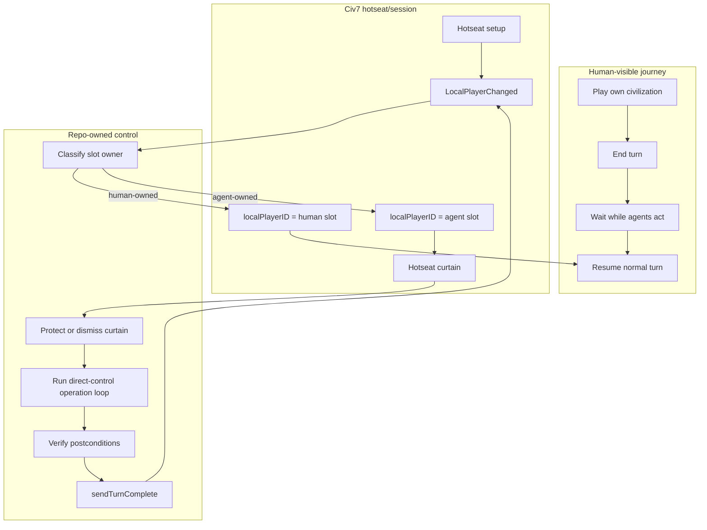

# Play Agent Hotseat Phase Packet

Status: framed phase packet for proof-gated workstream design.
Source thread: `019e86b7-b08b-72f3-8341-6c78a1285c93`.
Prepared: 2026-06-02.

This packet turns the hotseat-backed playable-AI solution into a bounded
workstream phase. It is not an implementation spec. Its job is to make the next
work prove or falsify the solution before the repo invests in agent-turn
features.

## Frame

Objective: prove whether one Civ7 client can support a human playing normally
against external AI agents by using official hotseat as the local-player handoff
primitive, with `@civ7/direct-control` acting only on agent-owned local turns.

Done means:

- Hotseat activation is either proven in a disposable single-client setup or
  plainly falsified for this installed build.
- If activation passes, hotseat local-player rotation is observed with
  `LocalPlayerChanged`, `GameContext.localPlayerID`, curtain state, and player
  slot ownership.
- If rotation passes, one low-risk agent-owned local turn operation and turn
  completion are proven with before/after state.
- Human UI restoration is verified after agent turns.
- If hotseat fails, the fallback path is preserved as non-local operation
  authority, with its own explicit `sendRequest` proof gates.

Authority inputs:

- Thread `019e86b7-b08b-72f3-8341-6c78a1285c93`, including the upstream
  hotseat solution and control-surface reference. Those docs were created in the
  source checkout at
  `docs/projects/civ7-direct-control/workstream/play-agent-hotseat-solution.md`
  and `play-agent-control-surface-reference.md`; they are not present in this
  detached worktree snapshot.
- Installed official Civ7 resources under
  `/Users/mateicanavra/Library/Application Support/Steam/steamapps/common/Sid Meier's Civilization VII/CivilizationVII.app/Contents/Resources`.
- Current `@civ7/direct-control` package contract and CLI ownership.
- User priority reset from source thread `019e86cb-4f67-79b1-9881-ddf6dde1a2aa`:
  modularize first, then oRPC, then hotseat/oRPC implementation slices.
- TypeScript design references:
  `typescript/references/refactoring-patterns.md`,
  `module-organization.md`, `design-patterns.md`, and
  `where-defaults-hide.md`.
- oRPC design authority, deferred until module seams and procedure atoms exist:
  `civ7-orpc-control-architecture`.
- Root `AGENTS.md`, `packages/civ7-direct-control/AGENTS.md`, and Graphite
  workflow docs.

In scope:

- Official hotseat activation despite `UI.supportsHotseat()` gating.
- Local-player handoff observation.
- Hotseat curtain and Start Turn handling.
- Agent-slot classification.
- Direct-control action, verification, and turn-complete loop only on
  agent-owned local turns.
- Human-visible waiting/resume UX boundaries.
- Fallback to non-local operation authority if hotseat is falsified.
- Team lanes, proof gates, stop conditions, and the smallest next experiments.

Foreground:

- Proof before architecture. The first phase must show whether the native
  handoff exists at runtime.
- Modularization before transport. Hotseat and oRPC work must not pile new
  procedure or command surfaces onto giant files that already obscure proof
  boundaries.
- User continuity. The human must experience one normal Civ game, not manual
  play through every hotseat slot.
- Authority hygiene. Runtime Civ7 control stays in `@civ7/direct-control`;
  generated resources, installed files, logs, and live observations are
  evidence, not editable source truth.

Exterior:

- Mutating the watched live-play support worktree or active live game.
- Broad autoplay enthusiasm or native AI substitution.
- Multiple Civ clients.
- Generic multiplayer implementation.
- Cleanup theater. Refactors are in scope only when they reduce proof-boundary
  drift, repeated special-casing, stale fake-server fixtures, command/test
  coupling, or embedded JavaScript-string blindness before oRPC is introduced.

Falsifier: if official hotseat cannot be activated in one client, or if it
cannot expose controllable local-player handoff through `GameContext.localPlayerID`,
stop the hotseat phase and preserve fallback work under non-local operation
authority only.

Structural alternative considered: drive non-local player/city/unit targets
directly from one local human session. Keep this as fallback because validator
evidence is not enough; each operation family still needs disposable
`sendRequest` proof plus human-session integrity proof.

## Mental Model

Hotseat is valuable only if it makes the agent's player become the current local
player. If that happens, the repo does not need to impersonate network clients
or invent local-player switching. It can classify the current local player,
route human-owned turns to the UI, route agent-owned turns to the agent runner,
verify operations through direct-control, and complete the turn.

## Proof Gates

Run these gates in order. Mutating gates require an explicitly disposable game
or setup and explicit approval. A failed lower gate blocks higher gates.

| Gate | Proof Question | Smallest Experiment | Pass | Fail / Stop |
|---|---|---|---|---|
| G1 Hotseat activation | Can official hotseat be reached in one client despite `UI.supportsHotseat()`? | From menu/setup, read `UI.supportsHotseat`, `Network` capability/server fields, title/setup flags, then attempt official `SERVER_TYPE_HOTSEAT` create-game path only in disposable setup. | `Configuration.getGame().isHotseat === true` or equivalent hotseat setup/game state. | Hotseat route rejects, no-ops, or creates non-hotseat mode. Stop hotseat and open fallback. |
| G2 Local-player rotation | Does hotseat rotate the current local player through human/agent hotseat slots? | Tiny hotseat game with one human slot and one agent-owned hotseat human slot. Log `LocalPlayerChanged`, `GameContext.localPlayerID`, `GameContext.localObserverID`, slot ownership, and curtain DOM. | `localPlayerID` becomes the agent slot, then returns to human or advances predictably. | Local player never changes, only the real human becomes local, or handoff blocks progression. |
| G3 Curtain handling | Can agent-owned handoff proceed without human pressing Start Turn? | On an agent-owned handoff, inspect and exercise only the curtain remove/default-mode path needed to continue the disposable turn. | Agent turn can start with a stable waiting/hidden-curtain state and human UI can later restore. | Curtain or `INTERFACEMODE_HOTSEAT` cannot be controlled without corrupting UI. |
| G4 Agent local operation | Can direct-control execute one low-risk operation while agent slot is current local player? | Validate one player/unit/city operation against the current local agent player, send exactly one approved request, and read the postcondition. | Operation executes, verifies state delta, and does not break handoff. | Rejection is authority/local-player related, send no-ops, or postcondition cannot verify. |
| G5 Turn completion | Can the agent-owned turn complete and continue handoff? | Call approved `sendCiv7TurnComplete` only after readiness checks. | `hasSentTurnComplete` or turn/handoff state changes, and next local player is observed. | Turn completion is blocked or leaves session in ambiguous state. |
| G6 Human restoration | Does the human resume a normal turn? | After one or more agent turns, inspect local player, interface mode, curtain presence, input readiness, notifications/popups, and automation/autoplay flags. | Human local player is active, input is not suppressed, and standard UI is usable. | Human UI remains in agent/hotseat state, input is suppressed, or agent-private state leaks. |
| G7 Fallback authority | If hotseat fails, can non-local targets execute through operation routers? | In a disposable non-hotseat game, separately prove one low-risk `sendRequest` for player, city, and unit families with non-local targets. | Family-specific request executes and verifies state delta without corrupting human session. | Requests reject, no-op, or require debug/world-builder semantics. |

## Team Lanes

This is a specified, tightly coupled, process-traced team. One DRA owns
synthesis, repo state, proof claims, and stop decisions. Parallel lanes are
useful only for read-only inspection and proof design; mutating runtime proof
must be serialized by the DRA.

| Lane | Accountable Output | Reads First | Hands Off |
|---|---|---|---|
| Hotseat activation | Activation proof plan and title/config gate findings | `mp-landing-new.js`, `mp-shell-logic.js`, setup schema `SupportsHotseatMultiplayer`, `UI.supportsHotseat`, `Network.hostMultiplayerGame` | DRA for G1 decision |
| Handoff observation | Runtime event/snapshot script for local-player rotation | `game-core-utilities.js` `useLocalPlayerId`, `mp-ingame-mgr.js`, `hotseat-curtain.js`, direct-control App UI snapshot | DRA for G2/G3 gates |
| Agent operation loop | Minimal operation/verification candidate on agent-owned local turn | `packages/civ7-direct-control/src/index.ts` operation router, approval model, turn completion wrappers | DRA for G4/G5 gates |
| Human UX/safety | Waiting/restoration UX acceptance checks | hotseat curtain behavior, context manager input suppression, current Studio/CLI status patterns | DRA for G6 gate |
| Fallback authority | Non-local operation proof design by family | direct-control operation wrappers, target-id assumptions, validator evidence | DRA only if G1/G2 fail |
| Proof ledger review | Evidence schema, stale-log prevention, stop-condition audit | `civ7-operational-debugging` proof boundaries and prior workstream ledgers | DRA before any mutation |

Every lane must label claims as `source-proven`, `runtime-read`, `mutating-proven`,
`inferred`, `unresolved`, or `falsified`.

## Priority Reset: Modularize Before oRPC

The hotseat packet remains useful, but it is no longer the next implementation
slice. The next structural foundation is a modularization workstream across the
current giant surfaces:

- direct-control `index.ts`;
- CLI game/play command hierarchy;
- tuner command/source organization, especially embedded JavaScript literals;
- the monolithic direct-control play/test fixture surface.

This is not cleanup theater. The purpose is to make proof boundaries and
procedure atoms visible before oRPC wraps them. A transport-first oRPC layer
would otherwise preserve the same drift in a typed router shape: broad commands,
stale fake-server fixtures, repeated special-cases, and runtime JavaScript
sources hidden inside strings.

Modularization design principles:

- Stabilize the public package surface first; internal modules may move, but
  CLI, Studio, and downstream imports should keep a deliberate facade.
- Split by reason to change: transport/session framing, App UI reads, Tuner
  reads, setup/lifecycle, operation validation/request, autoplay, catalog, and
  proof/test fixtures should not share one implementation file as their real
  owner.
- Treat JS command sources as first-class source units or builders with typed
  input/output contracts, not anonymous literals buried in orchestration code.
- Quarantine untrusted runtime payloads at boundaries with parse/normalize
  steps; do not widen proof payloads through `any` or unchecked shape casts.
- Prefer typed command/handler maps and state/proof discriminants over boolean
  option soup.
- Keep one public barrel/facade per package boundary; avoid internal barrels
  that make every helper an accidental API.

Suggested modularization gates:

| Gate | Proof Question | Pass |
|---|---|---|
| M1 Public facade inventory | Which direct-control exports are public contracts versus internals? | A facade list exists and no proposed module move changes consumer imports unintentionally. |
| M2 Runtime source seams | Can App UI/Tuner JavaScript command sources be organized as named source builders or modules? | Embedded string clusters have owners, typed inputs, and tests independent of socket framing. |
| M3 Operation/proof seams | Are operation validation, request sending, approval, and postcondition proof separated without changing behavior? | Existing operation tests pass and proof labels remain attached to the same runtime claims. |
| M4 CLI command seams | Can CLI game/play commands call package-owned capabilities without owning raw command strings? | CLI tests still prove command parsing/integration while direct-control owns runtime strings. |
| M5 Fixture modernization | Can the fake tuner server/play tests shrink into reusable fixtures by state surface and capability? | Tests remain behavior-equivalent but failures identify the module/proof boundary involved. |
| M6 oRPC readiness | Do stable procedure atoms exist with input, output, risk, approval, and proof boundaries? | Only then use `civ7-orpc-control-architecture` to shape routers, context, and middleware. |

The literal `systematic-workstream` skill was not found in the available skill
roots during this packet update. Until a future branch provides it, use
`workstream-runner`, `workstream-review-loops`, and repo-local
`civ7-open-spec-workstream` for the modularization wave.

## Files And APIs To Inspect First

Installed official resources:

- `Base/modules/core/ui/shell/mp-landing/mp-landing-new.js`
  - `UI.supportsHotseat()`
  - `MultiplayerShellManager.onGameBrowse(ServerType.SERVER_TYPE_HOTSEAT, true)`
- `Base/modules/core/ui/shell/mp-shell-logic/mp-shell-logic.js`
  - `screen-mp-create-game`
  - `Network.hostMultiplayerGame(eServerType)`
- `Base/modules/core/ui/shell/mp-staging/model-mp-staging-new.js`
  - hotseat slot actions and `SlotStatus.SS_TAKEN`
  - local identity checks against `GameContext.localPlayerID`
- `Base/modules/core/ui-next/utilities/game-core-utilities.js`
  - `useLocalPlayerId()`
  - `LocalPlayerChanged`
- `Base/modules/base-standard/ui/mp-ingame-mgr/mp-ingame-mgr.js`
  - hotseat curtain attach on local-player change
- `Base/modules/base-standard/ui-next/screens/hotseat/hotseat-curtain.js`
  - `INTERFACEMODE_HOTSEAT`
  - Start Turn/removal/default interface behavior
- `Base/modules/core/ui/context-manager/context-manager.js`
  - `Automation.isActive || Autoplay.isActive` input suppression

Repo code:

- `packages/civ7-direct-control/README.md`
  - `App UI` vs `Tuner` state boundaries
  - approval requirement for mutations
- `packages/civ7-direct-control/src/index.ts`
  - operation families and target IDs
  - `operationRouterSource`
  - `requestCiv7Operation`
  - `sendCiv7TurnComplete`
- `packages/cli/**`
  - existing `civ7 game status`, `health`, `exec`, `operation`, and lifecycle
    command paths if a CLI proof command is needed.

## Next Implementation Slice

The next slice is now the modularization foundation, not the hotseat proof
harness and not oRPC. Do this first:

1. Open a modularization workstream that inventories public exports and current
   giant surfaces before code movement.
2. Extract or design seams for direct-control runtime source builders,
   operation/proof helpers, lifecycle/read wrappers, CLI game/play command
   callers, and reusable fake-server fixtures.
3. Keep behavior unchanged and use TypeScript compiler/tests as change
   detectors, not as proof that runtime Civ7 behavior is correct.
4. Once seams and procedure atoms exist, use `civ7-orpc-control-architecture`
   to shape oRPC routers/context/middleware.
5. After that, return to the hotseat proof harness:
   - App UI read command or scripted probe for hotseat availability, server type,
     multiplayer flags, local player, observer, automation/autoplay state, and
     curtain presence;
   - `LocalPlayerChanged` event/snapshot probe for disposable hotseat games;
   - proof ledger entry template for G1-G6;
   - approved disposable G1 activation attempt.

Do not build agent planning, multiple-turn automation, or UX polish until G1 and
G2 pass. If G1 or G2 fails, switch immediately to G7 and keep the fallback
scoped to per-family non-local operation proof.

## Stop Conditions

- A command would mutate the watched live-play support worktree or active live
  game.
- The session is not explicitly disposable for a mutating proof.
- `UI.supportsHotseat()` remains false and no official route/config path can
  activate hotseat in setup.
- Hotseat starts but does not rotate `GameContext.localPlayerID` to agent-owned
  hotseat slots.
- Agent operations require authority that is unavailable even when the agent
  slot is current local player.
- Human UI cannot be restored after one agent turn.
- Fallback `sendRequest` proofs fail or cannot be distinguished from normal
  operation validity failures.

## Next Packet

First inspect:

1. `packages/civ7-direct-control/src/index.ts` for public exports, runtime
   source clusters, operation/proof helpers, lifecycle/read wrappers, and
   approval boundaries.
2. CLI game/play command hierarchy for command parsing versus package-owned
   runtime capability calls.
3. Direct-control tests and fake tuner server fixtures for stale coupling and
   behavior-preserving fixture seams.
4. TypeScript references named above for facade exports, module boundaries,
   command/handler maps, boundary parsing, and defaults to avoid.
5. Only after modular seams exist, installed `mp-landing-new.js`,
   `mp-shell-logic.js`, and `hotseat-curtain.js` for exact runtime fields to
   include in the G1/G2 read harness.

Exact next action: create a Graphite branch for a modularization workstream
packet and first behavior-preserving seam in `@civ7/direct-control`. Keep oRPC
and hotseat proof harness work behind that structural foundation.
