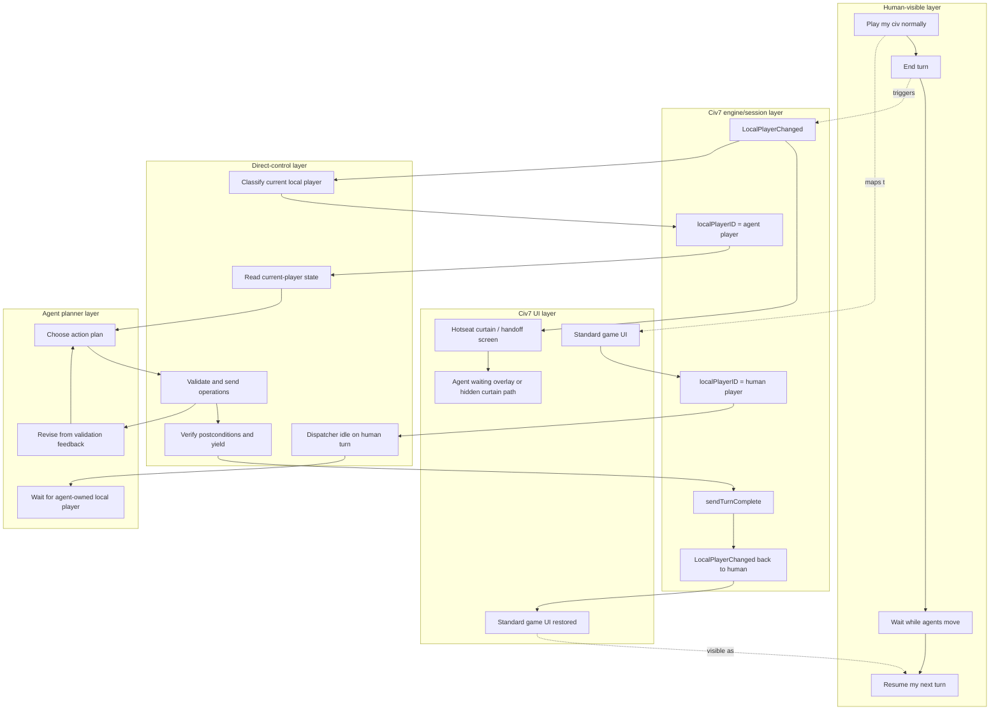
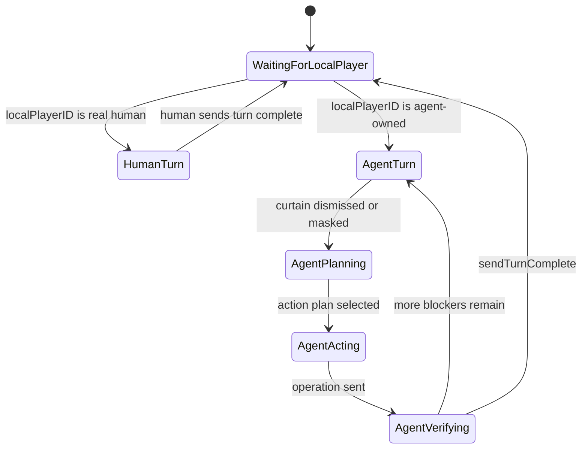
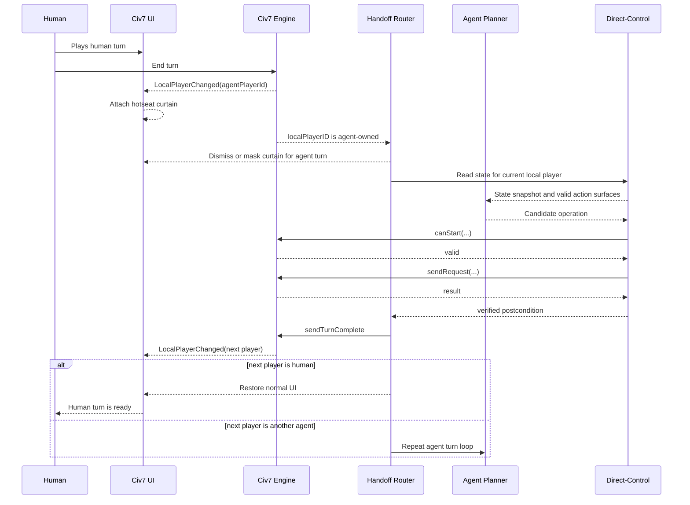
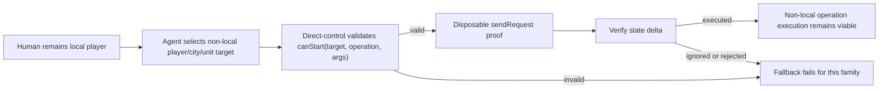

# Play Agent Hotseat Solution

Status: proposed solution architecture

This document captures the current best solution for single-client playable-AI
support in Civilization VII. It should be read after
`control-surface-reference.md`, which is the evidence ledger. This
document is the solution frame: what we should try to build, what user
experience it enables, what code/runtime layers participate, and what proofs
must succeed before implementation.

## Recommendation

Build toward **hotseat-backed agent turns**.

The mental model is simple: Civ7 hotseat already appears to have the one thing
we need most: an engine-managed handoff where `GameContext.localPlayerID`
changes from one human slot to another. The agent system should not impersonate
extra Civ clients, and it should not use native `Autoplay` as the main control
path. Instead, configure the human player and agent-controlled civilizations as
hotseat human slots. When Civ7 hands control to the real human, leave the UI
alone. When Civ7 hands control to an agent slot, let the agent operate that
slot through the existing validator-backed direct-control operation surfaces,
then complete the turn and wait for the next handoff.

The credible fallback is **single-client non-local operation authority**: if
hotseat cannot be activated, keep one local human client and attempt to send
validated operations to non-local player/unit/city targets directly. That path
is plausible because the operation wrappers are target-id based, but it still
needs a disposable `sendRequest` proof before it can become the primary design.

Related evidence reference sections:

- `control-surface-reference.md#hotseat`
- `control-surface-reference.md#single-client-multi-agent-operation-control`
- `control-surface-reference.md#immediate-proof-targets`

Status terms used below:

- **Known:** observed in official resources, repo code, or read-only runtime.
- **Expected:** the design expectation if the named proof gate passes.
- **Blocked:** cannot be treated as true until the named proof gate passes.
- **Falsifier:** a result that forces the frame to change.

Safety constraints:

- Do not use multiple Civ clients.
- Do not mutate the active live game for this research path.
- Run mutating proof only in disposable sessions after explicit approval.
- Record approval, before/after state, command/result, and postcondition
  evidence for every mutating proof.
- Do not activate `Automation` or `Autoplay` during a real human turn UI unless
  a later approved proof establishes a safe bounded use.

Proof-dependent assumptions:

- **A1 Hotseat activation:** official `SERVER_TYPE_HOTSEAT` setup can be reached
  in this installed build.
- **A2 Hotseat rotation:** hotseat gameplay emits `LocalPlayerChanged` and
  rotates `GameContext.localPlayerID` through each hotseat human slot.
- **A3 Agent local authority:** when an agent slot is current local player,
  ordinary operation requests execute for that slot.
- **A4 Curtain control:** the hotseat curtain can be dismissed, masked, and
  restored without leaving the human UI in a bad state.
- **A5 Non-local fallback authority:** if hotseat fails, non-local operation
  requests can execute against target IDs without corrupting the human-local
  session.

## What This Solves For The Player

The desired experience is not "watch Civ7 native AI play." It is:

1. The human starts one Civ7 game from one Civ client.
2. The human plays their own civilization normally.
3. Other civilizations are assigned to external AI agents.
4. When the human ends their turn, the game may advance through agent-controlled
   turns without asking the human to manually play each hotseat slot.
5. When control returns to the human, the UI feels like ordinary Civ7 again:
   notifications, choices, camera, diplomacy, city and unit decisions are
   available for the human's civilization.

From the human's perspective, agent turns should feel like an intentional
"waiting for agents" phase, not like the human is being forced through multiple
private hotseat screens. In the background, the system can still use official
hotseat handoff and direct-control operation dispatch.

## User Journey And Background Blueprint

This is the intended service-blueprint style journey. The top row is what the
human experiences. Lower rows are increasingly technical layers that make the
handoff work.

| Phase | Human-visible experience | Civ7 UI layer | Civ7 engine/session layer | Direct-control layer | Agent planner layer |
|---|---|---|---|---|---|
| Setup | Human chooses "play with agents" and starts one game. | Multiplayer/hotseat setup is entered if A1 passes. | Game is configured as hotseat; slots become `SS_TAKEN` human-capable participants. | CLI records player ownership metadata. | Agents are assigned to player IDs before gameplay starts. |
| Human turn | Human plays normally. | Standard UI remains interactive; no automation blackout. | `GameContext.localPlayerID` is the human player. | Dispatcher refuses gameplay mutations for agent slots. | Agents may observe only if observation is explicitly allowed. |
| Human ends turn | Human sees a waiting/agent-turn state. | Hotseat curtain may appear; agent-owned curtain handling depends on A4. | Engine emits `LocalPlayerChanged` for the next hotseat human slot if A2 passes. | Dispatcher reads current local player and classifies ownership. | Agent remains idle until ownership is confirmed. |
| Agent turn | Human waits while an agent decides. | UI is protected from exposing/interrupting agent-private state unnecessarily. | Current local player is expected to be the agent civ if A2 passes. | Direct-control reads, validates, sends, and verifies operations if A3 passes. | Agent chooses actions from state and validation feedback. |
| Return to human | Human resumes normal play. | Curtain/overlay clears; standard UI returns if A4 passes. | `LocalPlayerChanged` returns to the human player if A2 passes. | Dispatcher yields and stops agent mutations. | Agent planner returns to idle/observe mode. |

## Primary Architecture: Hotseat-Backed Agent Turns

The solution has three cooperating parts.

### 1. Hotseat Setup Adapter

The setup adapter creates the slot topology:

- one real human player;
- one or more agent-controlled player slots represented as hotseat humans;
- optional native AI/computer slots for civilizations we do not control.

Evidence that this is the official setup direction:

- Hotseat is gated in the multiplayer landing UI by `UI.supportsHotseat()` in
  `/Users/mateicanavra/Library/Application Support/Steam/steamapps/common/Sid Meier's Civilization VII/CivilizationVII.app/Contents/Resources/Base/modules/core/ui/shell/mp-landing/mp-landing-new.js:43`
  and `:80`.
- The hotseat button routes to
  `MultiplayerShellManager.onGameBrowse(ServerType.SERVER_TYPE_HOTSEAT, true)`
  in the same file at `:159-162`.
- Hotseat skips the browser and pushes `screen-mp-create-game` in
  `/Users/mateicanavra/Library/Application Support/Steam/steamapps/common/Sid Meier's Civilization VII/CivilizationVII.app/Contents/Resources/Base/modules/core/ui/shell/mp-shell-logic/mp-shell-logic.js:368-370`.
- Hosting uses `Network.hostMultiplayerGame(eServerType)` in
  `mp-shell-logic.js:654-672`.
- Hotseat-specific human slot action maps to `SlotStatus.SS_TAKEN` in
  `/Users/mateicanavra/Library/Application Support/Steam/steamapps/common/Sid Meier's Civilization VII/CivilizationVII.app/Contents/Resources/Base/modules/core/ui/shell/mp-staging/model-mp-staging-new.js:148-156`.
- Slot status changes use `Configuration.editPlayer(playerID).setSlotStatus(...)`
  and `setAsMajorCiv()` in `model-mp-staging-new.js:1620-1634`.
- Non-hotseat multiplayer refuses changing a slot that is already human, while
  hotseat has its own rules in `model-mp-staging-new.js:1682-1688`.

Current blocker: the live runtime reports `UI.supportsHotseat() === false`.
That does not negate the hotseat resources; it means the next proof must happen
from a disposable menu/setup context, not from the current active game.

### 2. Handoff Router

The handoff router watches local-player identity and decides who owns the turn.

Evidence that local-player handoff is the official hotseat mechanism:

- `useLocalPlayerId()` initializes from `GameContext.localPlayerID` and listens
  to `LocalPlayerChanged`, updating from `data.player` in
  `/Users/mateicanavra/Library/Application Support/Steam/steamapps/common/Sid Meier's Civilization VII/CivilizationVII.app/Contents/Resources/Base/modules/core/ui-next/utilities/game-core-utilities.js:64-79`.
- The in-game manager comments that `LocalPlayerChanged` is likely "handing off
  game to another player (hotseat)" and attaches the curtain if
  `Configuration.getGame().isHotseat` in
  `/Users/mateicanavra/Library/Application Support/Steam/steamapps/common/Sid Meier's Civilization VII/CivilizationVII.app/Contents/Resources/Base/modules/base-standard/ui/mp-ingame-mgr/mp-ingame-mgr.js:140-146`.
- The staging model defines local identity as
  `playerId == GameContext.localPlayerID` in
  `model-mp-staging-new.js:419-420`.

The key invariant: the agent dispatcher acts only when the current local player
is an agent-owned slot. It must not send gameplay mutations while the current
local player is the real human.

### 3. Agent Turn Executor

The executor uses the existing direct-control operation contract:

1. read current state for the current local agent player;
2. derive candidate actions;
3. validate through the relevant operation router;
4. send one or more approved operations;
5. verify state deltas;
6. complete the agent turn.

Evidence that the existing wrapper is structurally aligned:

- Operation families include unit, city, and player operations in
  `packages/civ7-direct-control/src/index.ts:764-769`.
- Operation inputs are explicitly target-id based: `unitId`, `cityId`, or
  `playerId` in `packages/civ7-direct-control/src/index.ts:771-779`.
- Router selection maps families to native operation routers and target keys in
  `packages/civ7-direct-control/src/index.ts:3389-3396`.
- Validation uses `router.canStart(target, enumValue, args)` in
  `packages/civ7-direct-control/src/index.ts:3402-3433`.
- Sending uses `meta.router.sendRequest(target, before.enumValue, args)` in
  `packages/civ7-direct-control/src/index.ts:3443-3449`.
- Requests already require explicit approval in
  `packages/civ7-direct-control/src/index.ts:3896-3904`.
- The repo already wraps turn completion with approval, readiness checks,
  `GameContext.sendTurnComplete()`, and postcondition verification in
  `packages/civ7-direct-control/src/index.ts:2031-2048`.
- Official UI calls `GameContext.sendTurnComplete()` from the end-turn action
  panel after checking `GameContext.hasSentTurnComplete()` and `canEndTurn()` in
  `/Users/mateicanavra/Library/Application Support/Steam/steamapps/common/Sid Meier's Civilization VII/CivilizationVII.app/Contents/Resources/Base/modules/base-standard/ui/action/panel-action.js:706-727`.

In hotseat, the strongest expectation is that the agent slot is the current
local player during its own turn, so normal local-player operation authority
should be available without pretending to be another network client.

## Handoff Interaction Sequence

## Curtain Handling Model

The curtain is not an obstacle by itself. It is an official privacy/handoff UI
that we need to treat differently for human-owned and agent-owned slots.

Evidence:

- The curtain reads the current local player with `useLocalPlayerId()` in
  `hotseat-curtain.js:17-23`.
- It switches to `INTERFACEMODE_HOTSEAT` on mount in
  `hotseat-curtain.js:46-48`.
- `Start Turn` removes the curtain and switches back to default interface mode
  in `hotseat-curtain.js:53-58`.
- `removeCurtain()` removes the `hotseat-screen-curtain` element in
  `hotseat-curtain.js:59-62`.

Expected policy:

- For real human slots, show the normal curtain or a product-specific equivalent
  that preserves hotseat privacy.
- For agent slots, do not require the human to press Start Turn. Programmatically
  dismiss or mask the curtain after the handoff router confirms the current
  player is agent-owned.
- During agent turns, present the human with a stable waiting state rather than
  exposing the agent's private player UI.
- When local player returns to the human, restore normal UI and avoid leaving
  `INTERFACEMODE_HOTSEAT` active.

## Why Automation Is Not The Main Path

Automation and `Autoplay` are support tools, not the product control model.

The official UI suppresses input when automation/autoplay is active:

- `ContextManager.noUserInput()` returns true when
  `Automation.isActive || Autoplay.isActive` in
  `/Users/mateicanavra/Library/Application Support/Steam/steamapps/common/Sid Meier's Civilization VII/CivilizationVII.app/Contents/Resources/Base/modules/core/ui/context-manager/context-manager.js:656-659`.

That is the wrong default for "human plays normally while agents take their own
turns." Automation can still help with disposable smoke tests, native-AI
benchmarks, observer/waiting experiments, and setup research. It should not be
the mechanism that decides or executes external-agent gameplay.

## Fallback Architecture: Non-Local Operation Authority

If hotseat cannot be activated, the fallback is to test whether native operation
routers accept non-local target IDs directly.

This fallback solves fewer problems cleanly. It does not give us official
hotseat privacy or current-local-player semantics. It can still work if
operation authority is truly target based. Validator-only runtime checks already
showed `PlayerOperations.canStart(...)` accepts real non-local/non-human
participant IDs for at least one weak/no-op-ish operation and rejects invalid
player ID `999`, but that is not enough to prove mutating gameplay execution.

Required proof: in a disposable session, send exactly one low-risk non-local
operation and verify a state delta. Repeat separately for player, city, and unit
families before relying on this architecture. Even a successful send only proves
that one operation family may execute; separate fallback gates must prove
ownership isolation, human UI/session integrity, and no leakage into the
human-local turn.

## Decision Matrix

| Candidate | User fit | Current evidence state | Main risk | Current rank |
|---|---|---|---|---|
| Hotseat-backed agent turns | High | High static evidence, missing launch proof | `UI.supportsHotseat()` false in current runtime | 1 |
| Non-local operation authority | Medium | Medium validator evidence, missing send proof | `canStart` may not imply `sendRequest` execution | 2 |
| Local multiplayer only | Low under one-client constraint | High setup evidence | One client appears to own only `GameContext.localPlayerID` unless hotseat is active | Support only |
| Automation/autoplay | Low for human-vs-agent product | High for native autoplay existence | Suppresses human UI and delegates decisions to native Civ7 AI | Support only |
| Multiple Civ clients | High technically, disallowed | Not applicable | Violates explicit constraint | Out of scope |

## Proof Gates Before Implementation

Do these in order. All mutating tests must use a disposable game/session and
explicit approval.

1. **Hotseat availability proof**
   - Context: menu/setup, not the active live game.
   - Probe: read `UI.supportsHotseat()` and the relevant `Network`/configuration
     mode fields.
   - Allowed mutation: only after approval, attempt the official
     `SERVER_TYPE_HOTSEAT` create-game path in a disposable setup.
   - Before/after fields: `UI.isInGame`, `UI.supportsHotseat`,
     `Network.getServerType`, `Configuration.getGame().isHotseat`,
     `Configuration.getGame().isAnyMultiplayer`.
   - Pass condition: `Configuration.getGame().isHotseat === true` in disposable
     setup or gameplay.
   - Fail condition: official hotseat route rejects, no-ops, or enters a
     non-hotseat mode.
   - Evidence artifact: JSON probe transcript plus setup/game mode snapshot.

2. **Hotseat rotation proof**
   - Context: tiny disposable hotseat game with at least one real human slot and
     one agent-owned hotseat human slot.
   - Probe: log `LocalPlayerChanged`, `GameContext.localPlayerID`,
     `GameContext.localObserverID`, curtain attachment/removal, and player slot
     ownership.
   - Allowed mutation: ordinary disposable end-turn progression only after
     approval.
   - Before/after fields: current local player, observer, active player,
     `isHotseat`, curtain DOM presence, turn number/date.
   - Pass condition: local player rotates to each hotseat human/agent slot.
   - Fail condition: local player never changes, only human slot becomes local,
     or curtain/handoff blocks progression.
   - Evidence artifact: event log plus before/after runtime snapshots.

3. **Agent-turn operation proof**
   - Context: current local player is an agent-owned hotseat slot.
   - Probe: validate one low-risk operation for the current local agent player.
   - Allowed mutation: exactly one approved operation with a named reason, then
     approved turn completion if blockers are clear.
   - Before/after fields: local player, operation target, validation result,
     operation result, relevant state delta, `hasSentTurnComplete`, turn/handoff
     state.
   - Pass condition: operation executes, postcondition verifies, and turn handoff
     continues.
   - Fail condition: operation rejects because of local-player/authority state,
     sends without state delta, or breaks subsequent handoff.
   - Evidence artifact: operation validation/request transcript and postcondition
     readback.

4. **Human UI restoration proof**
   - Context: control returns from one or more agent turns to the real human.
   - Probe: confirm standard UI, notifications, popups, input, current local
     player, and interface mode.
   - Allowed mutation: none beyond the already-approved disposable turn flow.
   - Before/after fields: `GameContext.localPlayerID`, `Automation.isActive`,
     `Autoplay.isActive`, interface mode, curtain presence, blocking
     notifications, input readiness.
   - Pass condition: human can continue playing normally.
   - Fail condition: human UI remains in hotseat/agent overlay, input remains
     suppressed, or agent-private state leaks into the human turn.
   - Evidence artifact: runtime snapshot plus screenshot or UI-state transcript.

5. **Fallback proof only if needed**
   - Context: hotseat activation failed or was unavailable; one local human
     client remains active in a disposable game.
   - Probe: validate non-local `player`, `city`, and `unit` operation families
     separately.
   - Allowed mutation: one approved low-risk non-local `sendRequest` per family.
   - Before/after fields: local player, target owner, operation family,
     validation result, request result, state delta, human UI/session state.
   - Pass condition: non-local target operation executes and verifies a state
     delta for that family, with no human UI/session corruption.
   - Fail condition: request rejects, no-ops, only works for debug operations, or
     leaks/misattributes control into the human-local turn.
   - Evidence artifact: per-family validation/request transcript plus session
     integrity readback.

## Implementation Shape After Proof

If the hotseat proofs pass, the implementation should stay small and layered:

- `hotseat-setup`: create or guide setup into hotseat with player ownership
  metadata.
- `handoff-router`: watch/read current local player and classify
  `human-owned`, `agent-owned`, `native-ai`, or `unknown`.
- `curtain-policy`: show human handoff UI, mask/dismiss agent handoff UI, restore
  default interface mode.
- `agent-turn-runner`: reuse existing play-agent priority/operation loop scoped
  to the current local agent player.
- `safety-ledger`: record approvals, disposable-session flags, operation
  validation, send results, postconditions, and handoff transitions.

The architecture should not add a new runtime transport unless existing
direct-control cannot observe the needed handoff events. Runtime Civ7 control
belongs in `@civ7/direct-control`; the bridge should be an extension of that
surface, not a caller-local control script.

## Frame Falsifiers

Reframe away from hotseat-backed agent turns if any of these become true:

- Hotseat cannot be activated from this installed build, even in menu/setup and
  even through official `SERVER_TYPE_HOTSEAT` routing.
- Hotseat does not rotate `GameContext.localPlayerID` through all hotseat human
  slots.
- Agent-owned hotseat turns cannot execute normal operation requests despite
  being current local player.
- Curtain/interface restoration cannot be made reliable enough for the human to
  resume normal play.

Reframe away from non-local operation fallback if:

- `sendRequest` rejects or ignores non-local targets across meaningful player,
  city, and unit operation families.
- Rejections cannot be separated from ordinary turn/validity failures.
- Successful sends require debug/world-builder semantics rather than normal
  gameplay authority.

## Current Conclusion

The strongest product path is not headless automation and not LAN with hidden
extra clients. It is **official hotseat as the local-player handoff primitive,
with our agents occupying hotseat human slots and the existing direct-control
operation loop acting only when an agent slot is current**.

That is the cleanest way to satisfy the core user story: one human plays their
own civilization normally in one Civ7 client while AI agents take their own
turns in the same game.
