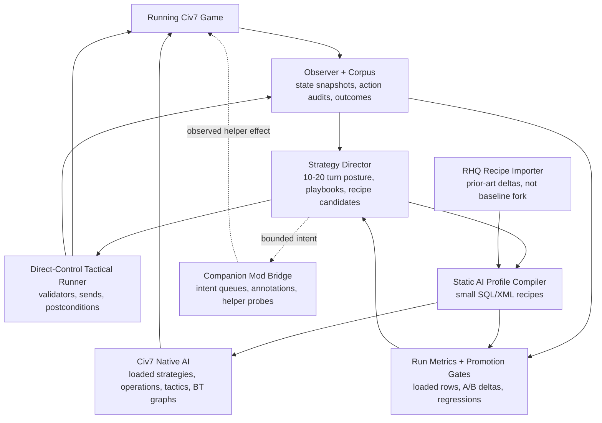
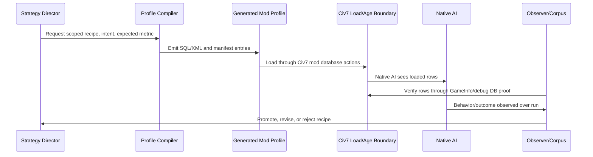
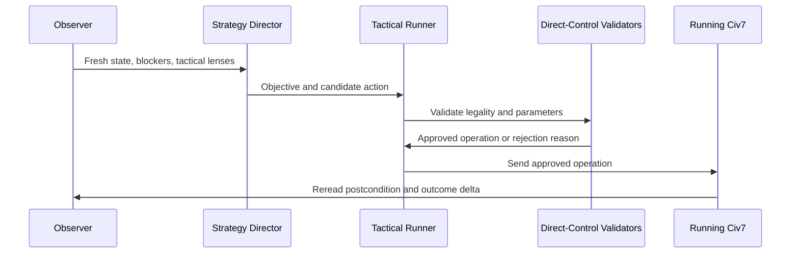
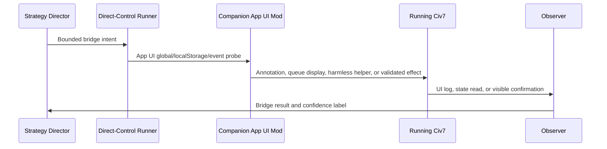

# Civ7 Intelligence Layer Solution Frame

**Status:** Operational solution frame
**Audience:** Workstream lead, agent implementers, and reviewers deciding what
to build next
**Companion references:** [ai-lever-reference.md](ai-lever-reference.md),
[rhq-reference.md](rhq-reference.md),
[runtime-bridge-and-probes.md](runtime-bridge-and-probes.md)

## Commander's Intent

Build an intelligence layer that lets LLM agents improve Civ7 play on two
different authority surfaces:

1. **Live external play.** An LLM observes the active local game, reasons about
   the next turn or near-term tactical objective, and uses `@civ7/direct-control`
   plus CLI workflows to send validated player operations.
2. **Native AI profile shaping.** An LLM or compiler turns strategy knowledge
   into small, auditable SQL/XML mod profiles that change Civ7's loaded AI
   priorities, operations, strategies, tactics, and behavior-tree graphs at
   load or age boundaries.

The product should not pretend these are the same mechanism. Direct-control is
the live control lane. Static AI profiles are the native-AI steering lane.
The intelligence layer is the system that observes, decides, compiles, executes,
and measures across both lanes without blurring their proof boundaries.

## Frame Commitments

**In.** This frame selects in the product mechanics needed for LLM-assisted Civ7
play: the strategy corpus, live observer, strategy director, direct-control
tactical runner, static AI profile compiler, RHQ recipe importer, companion mod
bridge probes, and measured-run verification.

**Foreground.** The load-bearing question is authority: which layer is allowed
to observe, decide, send actions, compile native-AI policy, or mutate in-game
state. The second load-bearing question is time scale: immediate tactical play,
10-20 turn strategic steering, pre-game or age-bound profile shaping, and
long-run corpus learning require different mechanisms.

**Exterior.** This frame deliberately excludes unsupported memory editing,
blind writes to Civ7 SQLite files, claims of ordered per-save human action
history without a parser, and claims that behavior trees or AI database rows can
be changed live until a disposable-session probe proves native AI re-read and
behavior effect.

**Would force a reframe.** Reframe this solution if a stable supported path
proves mid-game native-AI row or behavior-tree mutation with native AI re-read
and rollback, or if fixed-seed A/B runs show generated static profiles load but
repeatedly fail to move behavior.

## What Problem This Solves

The user-facing product goal is not simply "make Civ7 automate." It is to make
strategy reusable. A live LLM can spend many tokens choosing one good move, but
the system becomes more valuable when those decisions become reusable recipes,
playbooks, profile deltas, and measurements that future agents can apply.

Today the workspace has three useful but incomplete facts:

- Direct-control gives us a credible live play surface for local hotseat.
- Official Civ7 resources expose a large static native-AI data surface.
- RHQ proves a mod can use that surface aggressively, but it is prior art, not
  a clean product baseline.

The missing product layer is the bridge between those facts: a system that can
observe games, form strategy, act when direct live play is the right mechanism,
compile static native-AI profiles when native policy is the right mechanism, and
measure whether either choice actually improved play.

## Product Scenarios

### Scenario 1: Tactical Hotseat Agent

An agent is controlling a local hotseat player. It reads the current game state,
finds ready units and blockers, asks direct-control validators for legal action
candidates, sends approved operations, and records postconditions. This is the
near-term path for "LLM actually plays the game."

The system must feel like a capable operator, not a raw script runner. The agent
should work from structured tactical lenses, explain the objective behind an
action, avoid illegal sends, and leave an audit trail that future runs can learn
from.

### Scenario 2: Strategy Director

An agent watches the same game at a 10-20 turn horizon. It does not need to
click every move. It chooses posture: expand, repair economy, prepare war,
defend, pursue legacy path, pivot diplomacy, or accelerate a victory route.

The strategy director produces two kinds of outputs:

- **Playbooks** for the tactical runner: near-term objectives, priority order,
  constraints, and action candidates.
- **Profile candidates** for the compiler: scoped static AI deltas that could
  bias future native behavior toward the same strategic posture.

Until live native-AI steering is proven, this director cannot assume it can
rewrite the current AI brain mid-turn. Its reliable live output is playbook
guidance for direct-control.

### Scenario 3: Native AI Profile Compiler

Before a game starts, or at an age/load boundary, the system compiles a small
SQL/XML mod profile. The profile changes a focused native-AI lever family such
as settlement scoring, repair bias, operation eligibility, tactical priority,
or a behavior-tree assignment.

The compiler is not a fork of RHQ. It emits minimal recipes with intent labels,
source anchors, expected metrics, loaded-row checks, and rollback. A recipe is
only promoted when a fixed-seed A/B run shows a measurable behavior or outcome
delta.

### Scenario 4: Companion Mod Bridge

A companion App UI mod may become the in-game bridge for annotations, strategy
intent queues, richer observations, and helper affordances that direct-control
can read or trigger. The bridge is useful even if it never mutates native AI.

The safe first bridge is not "LLM sends arbitrary JS into Civ." It is: the
direct-control runner writes a bounded intent payload into an App UI-visible
channel, the companion mod reads it, performs a harmless visible/logged effect,
and the observer records the result. More powerful effects must earn authority
through probes and postconditions.

### Scenario 5: Strategy Corpus Loop

Every run records observations, decisions, sends, generated profiles, loaded-row
proofs, and outcomes. Over time, the corpus supports playbooks, strategy
retrieval, recipe selection, A/B comparisons, and future model evaluation.

This is the compounding product outcome: the system should get better because
strategy artifacts become durable and measurable, not because one agent guessed
well in one game.

## Solution Architecture

The solution has four layers. The layer boundary is the main architectural
claim of this frame.



The operating loop is:

```text
observe -> form posture -> choose lane -> emit bounded artifact -> validate or
compile -> apply at the lane's authority boundary -> measure -> update corpus
```

That loop is the product machine. Each layer can improve independently, but the
system only compounds when every action or profile candidate returns with proof
and outcome data.

### Layer 1: Observer And Corpus

The observer is the truth intake. It reads live state through direct-control,
captures logs and loaded-row proofs when available, and writes source-labeled
records. It is also the boundary that prevents false confidence: runtime live
state, official static resources, local debug database copies, public mod
claims, and measured runs prove different things.

Minimum record families:

- turn snapshots and strategic summaries;
- action proposals, approvals, sends, and postconditions;
- generated profile recipes and loaded-row checks;
- run metrics for fixed-seed comparisons;
- source labels and confidence markers.

### Layer 2: Strategy Director

The strategy director decides intent, not raw execution. It converts observed
state into posture, plans, priorities, and candidate interventions. It can ask
for tactical actions or profile recipes, but it does not bypass validators, emit
raw SQL into a running game, or write directly into Civ7 databases.

The director works on two horizons:

- **Posture horizon:** 10-20+ turns, where the output is strategic direction,
  constraints, and expected outcomes.
- **Execution horizon:** current turn to the next few turns, where the output is
  tactical work that direct-control can validate and send.

This preserves a clean agent experience: the LLM thinks in strategy and
constrained operations, while lower layers own legality, compilation, loading,
and verification.

### Layer 3: Execution Adapters

Execution splits into three adapters because the game exposes three different
authority surfaces:

| Adapter | What it can do | What it cannot claim yet |
| --- | --- | --- |
| Direct-control runner | Send validated live player operations and reread postconditions | Native AI policy mutation |
| Static AI profile compiler | Emit mod SQL/XML that changes loaded AI priorities, operations, strategies, tactics, and behavior-tree graphs | Arbitrary custom native AI code or live reload |
| Companion bridge | Carry bounded App UI intents, annotations, observations, and helper probes | Stable live native-AI steering until proven |

### Layer 4: Measurement And Promotion

No recipe or bridge behavior becomes product policy because it looks plausible.
It is promoted by proof:

1. source anchor;
2. generated artifact;
3. loaded-row or runtime observation;
4. measured behavior or outcome delta when behavior quality is claimed;
5. rollback or disable path.

### Authority Boundaries

| Layer | May do | Must not do |
| --- | --- | --- |
| Strategy director | Choose posture, objectives, playbooks, action candidates, profile candidates, and evaluation readouts | Emit raw JS, raw SQL, raw XML, or direct game mutations |
| Direct-control runner | Read live state, validate actions, send approved operations, run probes, and verify postconditions | Own raw socket fallbacks outside `@civ7/direct-control` or mutate native AI policy |
| Static profile compiler | Generate small auditable SQL/XML mod artifacts, manifests, profile metadata, and rollback data | Write local Civ7 SQLite/debug databases or apply RHQ wholesale |
| Native AI | Consume loaded rows and execute engine-owned behavior | Be treated as a custom tactical API or proven live policy surface |
| Companion mod | Show annotations, read bounded intent queues, emit richer observations, and run harmless helper probes | Become raw LLM code execution or a hidden replacement for validators |
| Corpus | Store source-labeled observations, actions, profile hashes, run metrics, and promotion decisions | Become authority by accumulation without proof labels and run context |

### Lane Selection

The strategy director chooses a lane by asking what kind of intervention is
needed:

| Need | Use | Reason |
| --- | --- | --- |
| A legal action in the current live game | Direct-control tactical runner | It can validate, send, and reread postconditions now |
| A 10-20 turn plan for the same player | Strategy playbook over direct-control | The plan can guide near-term validated actions |
| A native-AI bias for future runs or an age/load boundary | Static profile compiler | Native AI steering is currently static or age-bound |
| An in-game display, intent queue, or observation helper | Companion bridge | It can enrich UI/context without claiming native AI mutation |
| A broad RHQ-like behavior change | RHQ recipe extraction, then compiler | RHQ deltas must be isolated and measured before use |
| A live native-AI brain pivot | Probe harness only | The mechanism is unproven and cannot be baseline |

### Artifact Contracts

The first implementation should keep contracts small and explicit:

| Artifact | Required fields |
| --- | --- |
| `StrategyPlan` | `horizon`, `posture`, `objectives`, `constraints`, `success_signals`, `lane_recommendations` |
| `ActionCandidate` | `intent`, `operation_family`, `target`, `parameters`, `validator_required`, `freshness_ttl`, `postcondition` |
| `ProfileRecipe` | `intent`, `lever_family`, `source_anchors`, `generated_rows`, `load_boundary`, `expected_metric`, `rollback` |
| `BridgeIntent` | `namespace`, `correlation_id`, `intent_type`, `payload`, `expiry`, `idempotency_key`, `allowed_effect` |
| `LoadedRowProof` | `profile_hash`, `table`, `keys`, `expected_rows`, `observed_rows`, `read_source`, `read_time` |
| `RunMetric` | `seed`, `mod_set`, `profile_hash`, `metric_name`, `baseline_value`, `candidate_value`, `confidence_note` |
| `PromotionDecision` | `artifact_id`, `proofs`, `outcome_delta`, `decision`, `rollback_status`, `next_probe` |

These names are contract placeholders, not final package APIs. They make the
first slice concrete enough that implementation can start without committing to
premature public schemas.

## How The Mechanics Work

### Static Profile Mechanic

Static profile shaping is the most concrete native-AI path we have today:



The compiler can change known data surfaces such as `AiFavoredItems`,
`AiOperationDefs`, `AllowedOperations`, `AiOperationTeams`,
`OpTeamRequirements`, `AiTactics`, `Strategies`, `StrategyConditions`,
`Strategy_Priorities`, `Strategy_YieldPriorities`, `PseudoYields`,
`BehaviorTrees`, `BehaviorTreeNodes`, and `TreeData`. It can compose behavior
trees from native node definitions. It cannot assume new native node
implementations or arbitrary custom tactical code.

Operationally, a profile recipe is selected before game start or before an
age/load boundary, emitted with a generated artifact hash, loaded through normal
mod database actions, then verified by row reads after load. Age-bound steering
should be treated as a lifecycle probe until we prove exactly when generated
profiles can be swapped or layered safely.

Detailed lever evidence lives in [ai-lever-reference.md](ai-lever-reference.md).

### Live Play Mechanic

Live play uses direct-control as the trusted send path:



This is the path for precise tactical automation. If the user wants the agent
to move units, choose production, end turns, dismiss blockers, or operate a
local hotseat player, this lane should be used before any mod bridge.

Action candidates expire. A candidate should be invalidated when the turn
advances, a restart occurs, a blocker changes, human input intervenes, the
source snapshot becomes stale, validation fails, or the postcondition does not
match the expected state change.

### Companion Bridge Mechanic

The companion bridge is a probe-backed extension point, not a foundation:



The first bridge product outcome should be strategic context inside the game:
plan overlays, intent queues, warnings, annotations, or observations that make
agent play easier. Live native-AI steering remains a research probe.

Runtime bridge evidence and required probes live in
[runtime-bridge-and-probes.md](runtime-bridge-and-probes.md).

## What RHQ Means For This Solution

RHQ matters because it demonstrates the shape of a serious Civ7 AI profile mod:
it changes favored lists, operations, settlement scoring, tactical priorities,
diplomacy, victory strategy, and some behavior-tree data. It is proof that the
static mod surface is worth using.

RHQ should not be the baseline implementation:

- it is a broad overhaul rather than a minimal compiler output;
- some local files are inactive or not wired by the active manifest;
- its behavior-tree additions are not clearly attached by active loaded files;
- it makes wide deletes/reinserts that are hard to attribute to one behavior;
- it has not been reduced into measured, source-labeled recipes.

The right use is to import RHQ as a recipe corpus. Each useful RHQ delta should
be mapped to an official AI concept, labeled with intent, reduced to the
smallest useful lever group, loaded in isolation, and measured.

Detailed RHQ findings live in [rhq-reference.md](rhq-reference.md).

## First Build Slice

Build the first slice around proof, not ambition:

1. **Corpus schema and observer.** Persist turn snapshots, action audits,
   profile recipes, loaded-row checks, source labels, and run metrics.
2. **Direct-control tactical runner.** Drive a local hotseat player through
   validated actions and postconditions; keep the agent in validate-only mode
   until sends are bounded.
3. **One-lever profile compiler.** Choose one visible lever family, such as
   settlement scoring, repair preference, expansion posture, or operation
   eligibility. Generate a small SQL/XML profile with a manifest.
4. **Loaded-row verification.** Prove the generated rows are visible through
   `GameInfo` or debug database inspection after load.
5. **Fixed-seed A/B run.** Compare baseline against the one-lever profile and
   record whether behavior or outcomes moved. First useful metrics include
   expansion timing, settlement quality, repair latency, unit survival,
   blocked-turn reduction, city capture pressure, and economy recovery.
6. **RHQ recipe importer, read-only first.** Parse RHQ deltas into candidate
   recipes without applying them wholesale.
7. **Companion bridge harmless probe.** Prove an App UI script can receive a
   bounded intent and produce a logged harmless effect.

The acceptance bar is intentionally narrow: one live tactical lane, one static
profile lane, and one measured feedback loop.

## Operating Rules

- The strategy director emits intent, playbooks, and recipe candidates; it does
  not emit raw JS or SQL to a running game.
- Direct-control owns live sends and postconditions.
- The compiler owns static native-AI profile artifacts.
- The companion bridge starts as UI/observation infrastructure, not a hidden
  control channel.
- RHQ is a pattern library and test corpus, not the product root.
- Behavior quality claims require measured runs, not just loaded rows.
- Evidence labels must survive document edits and agent handoffs.

## Product Outcomes This Enables

This frame enables several concrete products:

- a local hotseat AI operator that can actually play through the CLI;
- a strategic coach/director that plans beyond the next immediate click;
- generated AI profile mods that encode named play styles or strategic biases;
- RHQ-derived recipe packs with measured effects instead of broad inherited
  overhaul behavior;
- a strategy corpus that supports retrieval, comparison, and future evaluation;
- companion in-game overlays and queues that make agent strategy visible and
  steerable during play.

The important product shift is from "an LLM controls Civ once" to "the system
turns play into durable, testable strategy assets."

## Open Questions And Falsifiers

The active probes are tracked in
[runtime-bridge-and-probes.md](runtime-bridge-and-probes.md). The most important
open questions are:

- Can generated profiles be swapped or layered safely at age transitions?
- Can behavior-tree generation be attached to operations in a way that produces
  observable behavior changes?
- Can a companion App UI mod receive intent robustly without creating unsafe
  execution paths?
- Do Civ7 logs or saves contain enough ordered action/state information to
  enrich the corpus beyond forward instrumentation?
- Is there any supported live path for native AI to re-read changed rows?

Until those are answered, the solution should advance by measured static
profiles and direct-control live play.

## Source Trail

Use the companion references for evidence details:

- [ai-lever-reference.md](ai-lever-reference.md) explains what native AI levers
  are currently supported by official resources and what depth of control they
  imply.
- [rhq-reference.md](rhq-reference.md) records what local RHQ actually loads and
  how to treat it as recipe prior art.
- [runtime-bridge-and-probes.md](runtime-bridge-and-probes.md) records runtime
  bridge evidence, required probes, and under-investigated threads.
- [PROJECT-civ7-intelligence-layer.md](PROJECT-civ7-intelligence-layer.md)
  records the broader workstream frame and evidence policy.

Public sources used in the investigation:

- [RHQ CivFanatics resource](https://forums.civfanatics.com/resources/rhq-artificially-intelligent-ai-mod.31881/)
- [RHQ CivFanatics thread](https://forums.civfanatics.com/threads/rhq-artificially-intelligent-ai-mod.695214/)
- [Civ7 behavior-tree architecture thread](https://forums.civfanatics.com/threads/civilization-7-behavior-tree-system-architecture.695219/)
- [CivMods RHQ install page](https://civmods.com/install?modId=g4j7p6n66683m8c)
