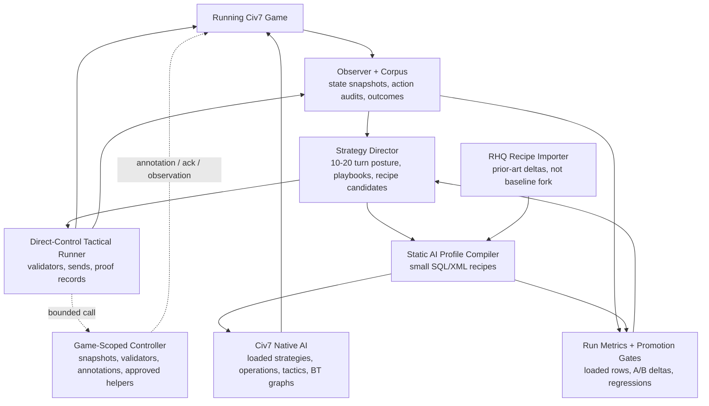
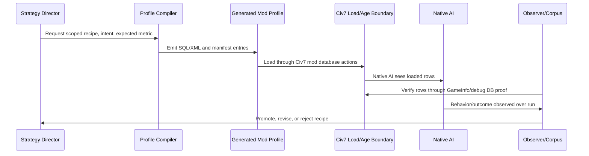
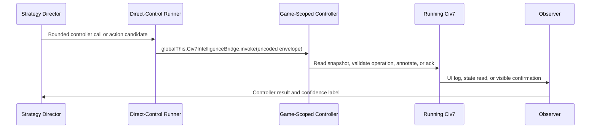

# Civ7 Intelligence Layer Solution Frame

**Status:** Operational solution frame
**Audience:** Workstream lead, agent implementers, and reviewers deciding what
to build next
**Companion references:** [actuation-path-map.md](actuation-path-map.md),
[ai-lever-reference.md](ai-lever-reference.md),
[corpus-and-trace-reference.md](corpus-and-trace-reference.md),
[rhq-reference.md](rhq-reference.md),
[runtime-bridge-and-probes.md](runtime-bridge-and-probes.md)

## Commander's Intent

Build an intelligence layer that lets LLM agents improve Civ7 play on two
different authority surfaces:

1. **Live external play.** An LLM observes the active local game, reasons about
   the next turn or near-term tactical objective, and uses `@civ7/direct-control`
   plus CLI workflows to send validated player operations.
2. **Native AI profile shaping.** An LLM or compiler turns strategy knowledge
   into small, auditable SQL/XML mod profiles that change Civ7's loaded AI
   priorities, operations, strategies, tactics, and behavior-tree graphs at
   load or age boundaries.

The product should not pretend these are the same mechanism. Direct-control is
the live control lane. Static AI profiles are the native-AI steering lane.
The intelligence layer is the system that observes, decides, compiles, executes,
and measures across both lanes without blurring their proof boundaries.

## Current Answer

The investigated paths point to a two-sided authority model, not to one
universal bridge and not to three peer execution lanes. A strategy agent affects
the game in two product-safe ways, with one game-scoped controller under the
live side:

1. It plays live through `@civ7/direct-control`. This is the only baseline
   authority for current-turn actions because it owns tuner socket transport,
   state selection, validation, approval, send wrappers, and proof promotion.
   Hotseat is the leading probe for multi-player local handoff, but it is not
   production until activation, local-player rotation, curtain handling, agent
   action, turn completion, and human restoration are proven in a disposable
   game.
2. It shapes native AI through generated static profiles. The compiler can
   emit small SQL/XML recipes over AI lists, pseudo-yields, strategies,
   operations, tactics, and behavior-tree graphs using known native nodes.
   These are load-scoped today; age-scoped layering is source-backed but still
   needs a transition proof.

The game-scoped App UI controller belongs under the live side. It can carry
strategy intent, annotations, observations, acknowledgements, helper probes, and
the stable read/validation methods that currently exist as raw direct-control JS
wrappers. Its substrate is an in-process oRPC/Effect service router loaded by a
game-scoped App UI `UIScripts` mod. The
`globalThis.Civ7IntelligenceBridge.invoke(...)` function is only the serialized
ingress direct-control uses to enter that router through the selected App UI game
state.

The controller is now the baseline implementation candidate for post-Begin game
reads and validators because live probes showed App UI game context has the same
major gameplay roots checked in Tuner, plus App UI-only lifecycle/UI/storage
roots. It must not independently choose or send mutating operation APIs, even
though companion scripts can reach them, because that would bypass the
direct-control approval and proof model. Exact approved helper execution can move
inside the controller only after direct-control creates the approval record and
postcondition proof remains external.

Everything else is measurement or research. Saves, logs, Hall of Fame data,
debug database copies, and live `GameInfo` readback are valuable for corpus
enrichment and proof, but existing saves/logs are not a full action diary.
Autoplay and Automation are useful for native-AI smoke tests and measured runs;
they are eliminated as the primary external-agent play path.

## Frame Commitments

**In.** This frame selects in the product mechanics needed for LLM-assisted Civ7
play: the strategy corpus, live observer, strategy director, direct-control
tactical runner, static AI profile compiler, RHQ recipe importer, companion mod
bridge probes, and measured-run verification.

**Foreground.** The load-bearing question is authority: which layer is allowed
to observe, decide, send actions, compile native-AI policy, or mutate in-game
state. The second load-bearing question is time scale: immediate tactical play,
10-20 turn strategic steering, pre-game or age-bound profile shaping, and
long-run corpus learning require different mechanisms.

**Exterior.** This frame deliberately excludes unsupported memory editing,
blind writes to Civ7 SQLite files, claims of ordered per-save human action
history without a parser, and claims that behavior trees or AI database rows can
be changed live until a disposable-session probe proves native AI re-read and
behavior effect.

**Would force a reframe.** Reframe this solution if a stable supported path
proves mid-game native-AI row or behavior-tree mutation with native AI re-read
and rollback, or if fixed-seed A/B runs show generated static profiles load but
repeatedly fail to move behavior.

## What Problem This Solves

The user-facing product goal is not simply "make Civ7 automate." It is to make
strategy reusable. A live LLM can spend many tokens choosing one good move, but
the system becomes more valuable when those decisions become reusable recipes,
playbooks, profile deltas, and measurements that future agents can apply.

Today the workspace has three useful but incomplete facts:

- Direct-control gives us a credible live play surface for local hotseat.
- Official Civ7 resources expose a large static native-AI data surface.
- RHQ proves a mod can use that surface aggressively, but it is prior art, not
  a clean product baseline.

The missing product layer is the decision-and-evidence loop between those
facts: a system that can observe games, form strategy, choose the correct
authority side, act when direct live play is the right mechanism, compile static
native-AI profiles when native policy is the right mechanism, and measure
whether either choice actually improved play.

## Product Scenarios

### Scenario 1: Tactical Hotseat Agent

An agent controls an agent-owned local player through direct-control. Once the
hotseat gates pass, that player can be one slot in a local human-versus-agent
hotseat game. The agent reads the current game state, finds ready units and
blockers, asks direct-control validators for legal action candidates, sends
approved operations, and records proof layers plus any semantic postconditions.
This is the path for "LLM actually plays the game."

The system must feel like a capable operator, not a raw script runner. The agent
should work from structured tactical lenses, explain the objective behind an
action, avoid illegal sends, and leave an audit trail that future runs can learn
from.

### Scenario 2: Strategy Director

An agent watches the same game at a 10-20 turn horizon. It does not need to
click every move. It chooses posture: expand, repair economy, prepare war,
defend, pursue legacy path, pivot diplomacy, or accelerate a victory route.

The strategy director produces two kinds of outputs:

- **Playbooks** for the tactical runner: near-term objectives, priority order,
  constraints, and action candidates.
- **Profile candidates** for the compiler: scoped static AI deltas that could
  bias future native behavior toward the same strategic posture.

Until live native-AI steering is proven, this director cannot assume it can
rewrite the current AI brain mid-turn. Its reliable live output is playbook
guidance for direct-control.

### Scenario 3: Native AI Profile Compiler

Before a game starts, or at an age/load boundary, the system compiles a small
SQL/XML mod profile. The profile changes a focused native-AI lever family such
as settlement scoring, repair bias, operation eligibility, tactical priority,
or a behavior-tree assignment.

The compiler is not a fork of RHQ. It emits minimal recipes with intent labels,
source anchors, expected metrics, loaded-row checks, and rollback. A recipe is
only promoted when a fixed-seed A/B run shows a measurable behavior or outcome
delta.

### Scenario 4: Companion App UI Endpoint

A companion App UI mod may become the in-game endpoint for annotations, strategy
intent, richer observations, and helper affordances that direct-control can read
or trigger. The endpoint is useful even if it never mutates native AI.

The safe first endpoint is not "LLM sends arbitrary JS into Civ." It is: the
direct-control runner calls
`globalThis.Civ7IntelligenceBridge.invoke(encodedEnvelope)`, the endpoint enters
an in-process oRPC/Effect router, dispatches only allowlisted read/ack/display
procedures, and the observer records the result. Synchronous App UI ingress is
the baseline. `localStorage` can become a reload mirror after proof. Queueing,
pub/sub, schedules, build-queue helpers, or richer AI intelligence services are
future Effect-backed controller capabilities, not a reason to introduce a second
control framework. More powerful effects must remain subordinate to
direct-control approval and postcondition proof.

### Scenario 5: Strategy Corpus Loop

Every run records observations, decisions, sends, generated profiles, loaded-row
proofs, and outcomes. Over time, the corpus supports playbooks, strategy
retrieval, recipe selection, A/B comparisons, and future model evaluation.

This is the compounding product outcome: the system should get better because
strategy artifacts become durable and measurable, not because one agent guessed
well in one game.

## Solution Architecture

The solution has two authority sides and one cross-cutting evidence loop. The
side boundary is the main architectural claim of this frame.



The operating loop is:

```text
observe -> form posture -> choose lane -> emit bounded artifact -> validate or
compile -> apply at the lane's authority boundary -> measure -> update corpus
```

That loop is the product machine. Each side can improve independently, but the
system only compounds when every action or profile candidate returns with proof
and outcome data.

### Observer And Corpus

The observer is the truth intake. It reads live state through direct-control,
captures logs and loaded-row proofs when available, and writes source-labeled
records. It is also the boundary that prevents false confidence: runtime live
state, official static resources, local debug database copies, public mod
claims, and measured runs prove different things.

Minimum record families:

- turn snapshots and strategic summaries;
- action proposals, approvals, sends, proof layers, and postconditions;
- generated profile recipes and loaded-row checks;
- run metrics for fixed-seed comparisons;
- source labels and confidence markers.

### Strategy Director

The strategy director decides intent, not raw execution. It converts observed
state into posture, plans, priorities, and candidate interventions. It can ask
for tactical actions or profile recipes, but it does not bypass validators, emit
raw SQL into a running game, or write directly into Civ7 databases.

The director works on two horizons:

- **Posture horizon:** 10-20+ turns, where the output is strategic direction,
  constraints, and expected outcomes.
- **Execution horizon:** current turn to the next few turns, where the output is
  tactical work that direct-control can validate and send.

This preserves a clean agent experience: the LLM thinks in strategy and
constrained operations, while lower layers own legality, compilation, loading,
and verification.

### Authority Sides And Endpoint

Execution splits into two authority sides because live player control and native
AI policy shaping have different proof boundaries. The game-scoped controller is
attached to the live side.

| Surface | What it can do | What it cannot claim yet |
| --- | --- | --- |
| Direct-control runner | Send validated live player operations and record proof layers | Native AI policy mutation |
| Static AI profile compiler | Emit mod SQL/XML that changes loaded AI priorities, operations, strategies, tactics, and behavior-tree graphs | Arbitrary custom native AI code or live reload |
| Game-scoped App UI controller | Host a native `scope="game"` `UIScripts` oRPC/Effect service router with `globalThis.Civ7IntelligenceBridge` as bounded ingress from direct-control | Independent action sends, Tuner deployment, shell-wide availability, or stable live native-AI steering |

### Measurement And Promotion

No recipe or companion behavior becomes product policy because it looks
plausible. It is promoted by proof:

1. source anchor;
2. generated artifact;
3. loaded-row or runtime observation;
4. measured behavior or outcome delta when behavior quality is claimed;
5. rollback or disable path.

### Authority Boundaries

| Layer | May do | Must not do |
| --- | --- | --- |
| Strategy director | Choose posture, objectives, playbooks, action candidates, profile candidates, and evaluation readouts | Emit raw JS, raw SQL, raw XML, or direct game mutations |
| Direct-control runner | Read live state, validate actions, send approved operations, run probes, and record proof layers | Own raw socket fallbacks outside `@civ7/direct-control` or mutate native AI policy |
| Static profile compiler | Generate small auditable SQL/XML mod artifacts, manifests, profile metadata, and rollback data | Write local Civ7 SQLite/debug databases or apply RHQ wholesale |
| Native AI | Consume loaded rows and execute engine-owned behavior | Be treated as a custom tactical API or proven live policy surface |
| Game-scoped App UI controller | Return snapshots, validate operations, show annotations, acknowledge calls, and run exact approved helpers after proof | Become raw LLM code execution, Tuner deployment by assumption, or an independent action sender |
| Corpus | Store source-labeled observations, actions, profile hashes, run metrics, and promotion decisions | Become authority by accumulation without proof labels and run context |

### Lane Selection

The strategy director chooses a lane by asking what kind of intervention is
needed:

| Need | Use | Reason |
| --- | --- | --- |
| A legal action in the current live game | Direct-control tactical runner | It can validate, send, and collect proof layers now |
| A 10-20 turn plan for the same player | Strategy playbook over direct-control | The plan can guide near-term validated actions |
| Human versus external agents in one local client | Hotseat-backed direct-control after gates pass | Hotseat may provide local-player handoff without live native-AI mutation |
| A native-AI bias for future runs or an age/load boundary | Static profile compiler | Native AI steering is currently static or age-bound |
| An in-game display, acknowledgement, observation helper, or read/validator API | Game-scoped App UI controller under direct-control | It can enrich UI/context and absorb raw wrapper JS without claiming native AI mutation or independent sends |
| A broad RHQ-like behavior change | RHQ recipe extraction, then compiler | RHQ deltas must be isolated and measured before use |
| A live native-AI brain pivot | Probe harness only | The mechanism is unproven and cannot be baseline |

### Artifact Contracts

The first implementation should keep contracts small and explicit:

| Artifact | Required fields |
| --- | --- |
| `StrategyPlan` | `horizon`, `posture`, `objectives`, `constraints`, `success_signals`, `lane_recommendations` |
| `ActionCandidate` | `intent`, `operation_family`, `target`, `parameters`, `validator_required`, `freshness_ttl`, `proof_required`, `expected_outcome_delta` |
| `ProfileRecipe` | `intent`, `lever_family`, `source_anchors`, `generated_rows`, `load_boundary`, `expected_metric`, `rollback` |
| `CompanionUiCall` | `method`, `payload`, `correlation_id`, `protocol_version`, `expected_ack`, `expiry`, `idempotency_key` |
| `LoadedRowProof` | `profile_hash`, `table`, `keys`, `expected_rows`, `observed_rows`, `read_source`, `read_time` |
| `RunMetric` | `seed`, `mod_set`, `profile_hash`, `metric_name`, `baseline_value`, `candidate_value`, `confidence_note` |
| `PromotionDecision` | `artifact_id`, `proofs`, `outcome_delta`, `decision`, `rollback_status`, `next_probe` |

These names are contract placeholders, not final package APIs. They make the
first slice concrete enough that implementation can start without committing to
premature public schemas.

## How The Mechanics Work

### Static Profile Mechanic

Static profile shaping is the most concrete native-AI path we have today:



The compiler can change known data surfaces such as `AiFavoredItems`,
`AiOperationDefs`, `AllowedOperations`, `AiOperationTeams`,
`OpTeamRequirements`, `AiTactics`, `Strategies`, `StrategyConditions`,
`Strategy_Priorities`, `Strategy_YieldPriorities`, `PseudoYields`,
`BehaviorTrees`, `BehaviorTreeNodes`, and `TreeData`. It can compose behavior
trees from native node definitions. It cannot assume new native node
implementations or arbitrary custom tactical code.

Operationally, a profile recipe is selected before game start or before an
age/load boundary, emitted with a generated artifact hash, loaded through normal
mod database actions, then verified by row reads after load. Age-bound steering
should be treated as a lifecycle probe until we prove exactly when generated
profiles can be swapped or layered safely.

Detailed lever evidence lives in [ai-lever-reference.md](ai-lever-reference.md).

### Live Play Mechanic

Live play uses direct-control as the trusted send path:


This is the path for precise tactical automation. If the user wants the agent
to move units, choose production, end turns, dismiss blockers, or operate a
local hotseat player, this lane should be used before any mod bridge.

Action candidates expire. A candidate should be invalidated when the turn
advances, a restart occurs, a blocker changes, human input intervenes, the
source snapshot becomes stale, validation fails, or the postcondition does not
match the expected state change.

The current operation wrappers do not all prove the same kind of postcondition.
The action record must distinguish validation-before-send, send receipt,
post-send validation, and semantic outcome delta. `verified: true` is not enough
for strategy learning unless it is paired with the domain-specific outcome that
was actually observed.

### Game-Scoped Controller Mechanic

The controller is a direct-control implementation target, not an independent
control plane:



The first controller product outcome should be direct-control method stability:
deploy the game-scoped controller, prove lifecycle, compare read parity with
existing wrappers, and compare validator parity before migrating wrapper
families. Strategic context inside the game remains valuable, but it is no longer
the whole first slice.

The App UI/Tuner split is part of the contract. `UIScripts` attach to App UI
contexts. The game-scoped App UI context now has live evidence for the major
gameplay roots checked in Tuner, while shell App UI is a separate context and
Tuner is not a modinfo deployment target. The controller should therefore be a
game-scoped `UIScripts` API, with an optional shell entrypoint only for setup and
configuration.

#### In-Game Controller Baseline

The baseline implementation target is a deterministic controller inside App UI
game context. That controller owns event subscriptions, local state caching,
capability discovery, UI overlays, request acknowledgements, read snapshots,
operation validation, and later exact approved helper execution. This reduces
the need to verify each raw external command body and lets the game-side code
produce coherent readbacks from one context.

It does not make verification disappear. The controller itself must prove
installation, shell/game lifecycle, reload and restart recovery, save/load
recovery, turn and age transitions, hotseat local-player identity, method
allowlists, input size limits, stale request rejection, approval tokens for any
mutation, and semantic outcome checks. A full LLM runtime inside the game is not
the baseline because external model I/O, secrets, performance, and browser/game
API constraints are unproven.

Runtime bridge evidence and required probes live in
[runtime-bridge-and-probes.md](runtime-bridge-and-probes.md).

## What RHQ Means For This Solution

RHQ matters because it demonstrates the shape of a serious Civ7 AI profile mod:
it changes favored lists, operations, settlement scoring, tactical priorities,
diplomacy, victory strategy, and some behavior-tree data. It is proof that the
static mod surface is worth using.

RHQ should not be the baseline implementation:

- it is a broad overhaul rather than a minimal compiler output;
- some local files are inactive or not wired by the active manifest;
- its behavior-tree additions are not clearly attached by active loaded files;
- it makes wide deletes/reinserts that are hard to attribute to one behavior;
- it has not been reduced into measured, source-labeled recipes.

The right use is to import RHQ as a recipe corpus. Each useful RHQ delta should
be mapped to an official AI concept, labeled with intent, reduced to the
smallest useful lever group, loaded in isolation, and measured.

Detailed RHQ findings live in [rhq-reference.md](rhq-reference.md).

## First Build Slice

Build the first slice around proof, not ambition:

1. **Corpus schema and observer.** Persist turn snapshots, action audits,
   profile recipes, loaded-row checks, source labels, and run metrics.
2. **Direct-control tactical runner.** Drive an agent-owned local player
   through validated actions and proof records; keep the agent in
   validate-only mode until sends are bounded.
3. **One-lever profile compiler.** Choose one visible lever family, such as
   settlement scoring, repair preference, expansion posture, or operation
   eligibility. Generate a small SQL/XML profile with a manifest.
4. **Loaded-row verification.** Prove the generated rows are visible through
   `GameInfo` or debug database inspection after load.
5. **Fixed-seed A/B run.** Compare baseline against the one-lever profile and
   record whether behavior or outcomes moved. First useful metrics include
   expansion timing, settlement quality, repair latency, unit survival,
   blocked-turn reduction, city capture pressure, and economy recovery.
6. **RHQ recipe importer, read-only first.** Parse RHQ deltas into candidate
   recipes without applying them wholesale.
7. **Game-scoped controller bridge.** Deploy a project-owned game-scoped
   `UIScripts` mod whose `globalThis.Civ7IntelligenceBridge.invoke` ingress
   calls an in-process oRPC/Effect router; prove `ping`, `capabilities.list`,
   `game.snapshot`, read parity, and operation validator parity against existing
   direct-control wrappers.
8. **Hotseat proof sequence.** In a disposable session, prove activation,
   local-player rotation, curtain handling, one approved agent operation, turn
   completion, and human restoration.

The acceptance bar is intentionally narrow but material: one live tactical lane,
one game-scoped controller bridge with read/validator parity proof, one static
profile lane, and one measured feedback loop.

## Operating Rules

- The strategy director emits intent, playbooks, and recipe candidates; it does
  not emit raw JS or SQL to a running game.
- Direct-control owns live sends, approval, and proof records.
- The compiler owns static native-AI profile artifacts.
- The game-scoped controller starts as a direct-control implementation surface
  for reads, validators, UI/observation, and exact approved helpers after proof;
  it is not a hidden independent control channel.
- RHQ is a pattern library and test corpus, not the product root.
- Behavior quality claims require measured runs, not just loaded rows.
- Evidence labels must survive document edits and agent handoffs.

## Product Outcomes This Enables

This frame enables several concrete products:

- a local hotseat AI operator that can actually play through the CLI;
- a strategic coach/director that plans beyond the next immediate click;
- generated AI profile mods that encode named play styles or strategic biases;
- RHQ-derived recipe packs with measured effects instead of broad inherited
  overhaul behavior;
- a strategy corpus that supports retrieval, comparison, and future evaluation;
- a game-scoped controller that makes agent strategy visible and steerable
  during play while replacing raw wrapper JS where parity is proven.

The important product shift is from "an LLM controls Civ once" to "the system
turns play into durable, testable strategy assets."

## Open Questions And Falsifiers

The active probes are tracked in
[runtime-bridge-and-probes.md](runtime-bridge-and-probes.md). The most important
open questions are:

- Can generated profiles be swapped or layered safely at age transitions?
- Can behavior-tree generation be attached to operations in a way that produces
  observable behavior changes?
- Can the game-scoped App UI controller receive calls robustly, preserve
  direct-control approval/proof authority, and replace raw wrapper JS for proven
  read/validator families?
- Do Civ7 logs or saves contain enough ordered action/state information to
  enrich the corpus beyond forward instrumentation?
- Is there any supported live path for native AI to re-read changed rows?

Until those are answered, the solution should advance by measured static
profiles and direct-control live play.

## Source Trail

Use the companion references for evidence details:

- [ai-lever-reference.md](ai-lever-reference.md) explains what native AI levers
  are currently supported by official resources and what depth of control they
  imply.
- [actuation-path-map.md](actuation-path-map.md) classifies each investigated
  path by product authority and proof level.
- [corpus-and-trace-reference.md](corpus-and-trace-reference.md) records what
  saves, logs, debug databases, Hall of Fame data, and direct-control traces can
  contribute to the strategy database.
- [rhq-reference.md](rhq-reference.md) records what local RHQ actually loads and
  how to treat it as recipe prior art.
- [runtime-bridge-and-probes.md](runtime-bridge-and-probes.md) records runtime
  bridge evidence, required probes, and residual runtime proof gates.
- [PROJECT-civ7-intelligence-layer.md](PROJECT-civ7-intelligence-layer.md)
  records the broader workstream frame and evidence policy.

Public sources used in the investigation:

- [RHQ CivFanatics resource](https://forums.civfanatics.com/resources/rhq-artificially-intelligent-ai-mod.31881/)
- [RHQ CivFanatics thread](https://forums.civfanatics.com/threads/rhq-artificially-intelligent-ai-mod.695214/)
- [Civ7 behavior-tree architecture thread](https://forums.civfanatics.com/threads/civilization-7-behavior-tree-system-architecture.695219/)
- [CivMods RHQ install page](https://civmods.com/install?modId=g4j7p6n66683m8c)
