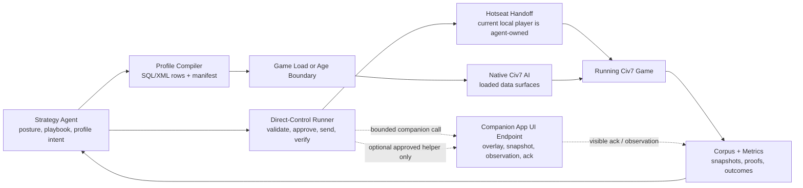

# Civ7 Intelligence Actuation Path Map

Status: evidence synthesis for the open-thread investigation.
Updated: 2026-06-03.
Companion frame: [SOLUTION-FRAME.md](SOLUTION-FRAME.md).
Lane reports: [agent-reports/](agent-reports/).

This map answers one question: how can a strategy agent affect Civ7, and what
must be true before that path becomes product authority?

## Executive Answer

A strategy agent can affect Civ7 through two reliable authority sides and one
subordinate helper endpoint.

The reliable live action surface is `@civ7/direct-control`. It reads state,
validates operations, sends approved player actions, and records proof layers.
Hotseat is the leading probe for making this work as
"human versus external agents in one local client", but hotseat still needs a
disposable activation and handoff proof before it becomes a production claim.

The reliable native-AI shaping surface is the static Civ7 mod database. A
generated profile can change loaded AI lists, pseudo-yields, strategies,
operations, tactics, and behavior-tree graphs at game load and likely through
age-scoped action groups. Actual age-transition swap or layering is still a
probe, not a baseline.

The helper endpoint is a companion App UI mod. It can display strategy, observe
events, acknowledge requests, and enrich the agent's context. The primary
ingress should be a companion-owned, game-scoped App UI global API such as
`globalThis.Civ7IntelligenceBridge.invoke(...)`, called through direct-control.
It must not become an independent action sender. Companion scripts can reach
mutating operation APIs, which makes the path powerful but unsafe unless it
stays subordinate to direct-control approval, allowlists, and semantic
postcondition readback.

## Path Classifications

| Path | Classification | Why |
| --- | --- | --- |
| Direct-control live reads and approved sends | Production candidate | Existing package boundary, wrappers, approvals, validators, and proof records are the right live authority surface. |
| Hotseat-backed agent turns | Leading probe candidate | Official resources show hotseat setup, local-player handoff, and curtain machinery; runtime activation/rotation/action proof is still missing. |
| Static generated AI profile at game load | Production candidate | Official resources and local RHQ show SQL/XML database profiles load and alter native AI data surfaces. |
| Static generated AI profile at age boundary | Probe candidate | Official age modules prove age-scoped action groups; generated swap/layer behavior at transition is not runtime-proven. |
| Behavior-tree graph generation | Production candidate for known nodes | Trees, nodes, and data rows are real static data; new native node implementations are not supported by current evidence. |
| RHQ recipe extraction | Production candidate as prior-art importer | RHQ is useful as a measured recipe source after deltas are reduced and verified, not as a baseline fork. |
| App UI `globalThis` companion RPC | Production candidate after project-owned lifecycle proof | Installed UI mod and post-Begin live probe prove game-scoped `UIScripts` can attach callable public APIs to App UI `globalThis`; they do not prove shell-wide or Tuner-wide availability. |
| Companion App UI endpoint for display, acknowledgements, observations | Production candidate after receipt probe | UI scripts load and can use `GameInfo`, `engine.on(...)`, and `localStorage`; harmless receipt/ack proof remains the first implementation gate. |
| Companion-owned gameplay `sendRequest` | Eliminated as independent authority | It bypasses direct-control approval, validator, no-replay, and postcondition discipline. |
| Direct-control-approved companion helper action | Deferred probe candidate | Possible only if tokenized, allowlisted, visible, logged, and paired with direct-control semantic postcondition proof. |
| Full in-game controller | Direction, not baseline | Could reduce repeated transport proof by centralizing App UI logic, but still needs lifecycle, approval, local-player, and outcome proof. |
| Live `GameInfo` to debug DB row comparison | Production candidate for loaded-row proof | Current live `GameInfo` counts/sample rows matched `Debug/gameplay-copy.sqlite` for several tables. |
| Live native-AI row or behavior-tree mutation | Deferred reverse-engineering thread | No supported path proves row mutation, native AI re-read, behavior effect, and rollback mid-game. |
| Autoplay | Test/measurement candidate; eliminated as primary external-agent play path | Native Autoplay is real and wrapped by direct-control, but it delegates decisions to native AI and suppresses normal input. |
| Automation | Observation/test harness; eliminated as primary live play path | It can run benchmark/setup flows and suppress UI; it is too broad for human-safe external-agent action authority. |
| Existing `.Civ7Save` files as action diary | Eliminated near-term | Saves expose metadata and binary state, not an accessible ordered action history. |
| Logs as native-AI behavior trace | Probe candidate / observation signal | Some movement/target/unit operation records exist, but current logs are sparse and not a complete decision trace. |
| Hall of Fame and debug SQLite scoring bundle | Production candidate for measured-run context | Structured outcomes, players, objects, loaded rows, and mod metadata exist locally. |

## Actuation Mechanics

The agent's choice is a timescale decision:

- current-turn tactical action: direct-control;
- human versus agent local play: hotseat plus direct-control, after gates pass;
- multi-turn plan for the same player: strategy playbook feeding
  direct-control;
- native-AI tendency for future or age-scoped runs: static profile compiler;
- in-game strategy visibility or richer observations: companion App UI endpoint;
- behavior learning and recipe promotion: corpus plus measured runs.

## Thread Resolution

### `.Civ7Save` Reverse Engineering

Existing saves are not a baseline strategy-corpus source. They have `CIV7`
magic, exposed setup strings, and stable autosave windows suitable for a future
binary-delta spike, but current evidence does not reveal an ordered command
diary. Treat them as reproducible state artifacts and deferred forensic inputs.

Next trigger: build a bounded parser only when there is a controlled run whose
direct-control action trace can be compared against known save deltas.

### Age Transition Profile Layering

Age-scoped static data is real. Official age modules use `AgeInUse` criteria and
separate current/persist action groups. What is not proven is whether generated
local profile rows can be swapped or layered during a running age transition
without restart, and whether native AI re-reads every relevant row.

Next trigger: disposable Antiquity-to-Exploration profile marker probe.

### Script-Like AI Hooks

`ScriptConsumer` and `AI_BUDGET_SCRIPTING` exist as native AI component/budget
data. `BoostHandlers` and `TargetScript` exist in schema. None currently prove a
modder-authored live bridge. Local evidence found zero loaded `BoostHandlers`,
zero loaded `TriggeredBehaviorTrees`, and no non-empty `TargetScript` rows.

Next trigger: promote only after finding an official/local working example or a
disposable probe proves callback resolution, behavior effect, and rollback.

### Triggered Behavior Trees

`TriggeredBehaviorTrees` is a real schema hook and references AI events and
behavior trees, but no official or active local RHQ rows were found. It is a
generated-profile probe candidate, not a production surface.

Next trigger: a minimal disposable row using a known AI event with clear logs
and bounded behavior.

### Live GameInfo Readback

This path moved from unknown to usable loaded-row proof. Live `GameInfo` reads
matched `Debug/gameplay-copy.sqlite` for table counts and sample rows across
several tables, including AI/profile tables. This proves row visibility after
load; it does not prove behavior quality or live native-AI re-read.

Next trigger: marker-row probe with a generated disabled-by-default profile.

### Native AI Logs

Local AI logs are useful enrichment, not a complete behavior diary. Current
logs include some movement, target, knowledge, and unit-efficiency rows, plus a
sparse `UnitOperations.log`. Many high-value AI CSVs are header-only in the
current capture.

Next trigger: disposable fixed-run logging probe with known direct-control
actions and any safely enabled verbose AI logging.

### Companion App UI Endpoint

Companion scripts can expose callable App UI public APIs on `globalThis`. The
installed LF policies/yields preview mod proves the shape by registering a
game-scoped `UIScripts` public API and attaching
`globalThis.LfYieldsPreview`; a post-Begin live read-only probe confirmed it is
visible in App UI and not in Tuner. A later shell probe found the LF symbol
absent, so the claim is game-context evidence, not shell-wide or Tuner-wide
evidence. This should be the primary endpoint ingress for a project-owned
`Civ7IntelligenceBridge`.

Companion scripts can also reach mutating operation APIs. That answers the
capability question but creates a product boundary: independent endpoint-owned
sends are eliminated. The endpoint can still become valuable for display,
acknowledgement, `canStart` hints, and observation. Queueing is a later probe or
reload mirror, not the baseline.

Next trigger: project-owned `Civ7IntelligenceBridge` lifecycle proof across
shell/game scope, UI reload, restart, load/save, turn changes, and Tuner
absence; then a separate direct-control-approved helper-action proof only in a
disposable game.

### Hotseat, Autoplay, And Automation

Hotseat is the important live-play unlock, but it is not proven yet. Autoplay
and Automation are useful for smoke tests, waiting, benchmarking, and native-AI
measured runs. They are eliminated as the primary live external-agent executor
because they are global, suppress normal input, and hand decisions to native AI.

Next trigger: disposable hotseat activation, local-player rotation, curtain,
agent action, turn complete, and human restoration probe sequence.

## Eliminated Product Claims

Do not claim any of these as part of the product architecture:

- "Existing saves contain full human play-by-play" without a parser and
  controlled comparison.
- "RHQ is a live bridge" or "RHQ proves live native-AI steering."
- "ScriptConsumer" or "AI_BUDGET_SCRIPTING" means external scripts can steer
  native AI live.
- "Loaded rows mean behavior improved."
- "Debug SQLite writes are a runtime control path."
- "Companion UI scripts can replace direct-control because they can call
  operation APIs."
- "`UIScripts` means a project bridge is Tuner-loaded."
- "Shell App UI state proves game-scoped companion globals are loaded."
- "Autoplay lets an external strategy agent play" as opposed to native AI
  playing while the external agent observes.

## Proof Ladder

Use the smallest proof that matches the claim:

1. **Schema proof:** table/column exists.
2. **Source proof:** official/RHQ resource uses the surface.
3. **Loaded-row proof:** live `GameInfo` and debug DB show expected generated
   rows.
4. **Runtime receipt proof:** companion or direct-control observes an expected
   event, direct response, or acknowledgement.
5. **Postcondition proof:** an approved action changes game state exactly as
   expected. For generic operations, distinguish validation-before-send,
   send receipt, post-send validation, and semantic outcome delta.
6. **Behavior proof:** fixed-seed runs show native AI behavior or outcome moved.
7. **Promotion proof:** the artifact has rollback, provenance, and repeatable
   measured value.

Each path is promoted only to the rung it has actually reached.
