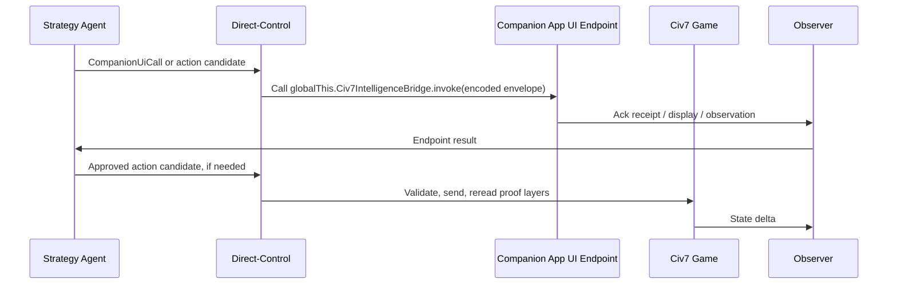

# Runtime Companion Endpoint And Probe Reference

This reference keeps runtime endpoint evidence, probe design, and under-investigated
threads close to [SOLUTION-FRAME.md](SOLUTION-FRAME.md) without making the main
solution frame depend on unproven mechanisms.

## Runtime Evidence

Concrete local findings from the investigation:

- `packages/civ7-direct-control` owns developer-process control through the
  tuner socket protocol.
- Direct-control can execute JavaScript in App UI and Tuner states.
- A live read-only proof found Civ7 listening on port `4318`, with states
  `App UI` and `Tuner`.
- App UI exposed `localStorage`, `Automation`, `Database`, `GameInfo`, and
  `engine`.
- Tuner exposed `Database`, `GameInfo`, and `engine`, but not `localStorage` or
  `Automation`.
- Installed UI mods use game/shell `UIScripts`, `engine.on(...)`, and
  `localStorage` settings.
- UI logs showed local UI mod scripts loading from `fs://game/...`.
- The installed `civmods-lf-policies-yields-preview` mod registers
  `scripts/api/public-api.js` as a `UIScripts` item. That script freezes a
  public API object and attaches it as `globalThis.LfYieldsPreview`.
- A read-only post-Begin game-context probe confirmed `globalThis` is extensible
  in App UI, `globalThis.LfYieldsPreview` is an object callable through the
  direct-control CLI in App UI, and the same symbol is `undefined` in Tuner.
- A later read-only shell-context probe found App UI present but
  `globalThis.LfYieldsPreview` and `globalThis.Civ7IntelligenceBridge` absent.
  This narrows the claim: game-scoped App UI `UIScripts` can expose globals
  after their action group loads; shell App UI availability is separate.
- Live `GameInfo` table reads matched `Debug/gameplay-copy.sqlite` row counts
  and sample ordering for several tables, including `AiOperationDefs`,
  `BehaviorTrees`, `Resources`, and `Strategy_Priorities`.
- App UI and Tuner both exposed operation routers such as
  `Game.UnitOperations`, `Game.UnitCommands`, `Game.CityOperations`,
  `Game.CityCommands`, and `Game.PlayerOperations` with `canStart` and
  `sendRequest` methods.
- Installed UI mod code locally demonstrated direct calls to
  `Game.PlayerOperations.sendRequest`, proving companion scripts can mutate
  gameplay if they choose to.
- `@civ7/direct-control` already carries the safer mutation model:
  approval policy, validation before send, no automatic replay after uncertain
  mutation, and postcondition readback.

These findings make an App UI companion endpoint plausible. They do not prove
shell-wide availability, Tuner-resident deployment, or live native-AI policy
steering.

## Vocabulary

These terms must stay distinct:

| Term | Meaning |
| --- | --- |
| `shell` / `game` | Civ7 modinfo action-group scopes. They decide when mod actions such as `UIScripts`, `ImportFiles`, and `UpdateDatabase` load. |
| `App UI` / `Tuner` | Runtime states visible through the direct-control tuner socket. They are not modinfo deployment targets. |
| `tuner-ready` | Direct-control can find the Tuner state and a read-only gameplay canary passes after Begin Game. |
| `UIScripts` | A mod action item that can load UI JavaScript into shell or game App UI context. It does not by itself prove Tuner globals. |
| `ImportFiles` map script | Map/import code such as Swooper Maps. It is map-generation prior art, not companion App UI endpoint prior art. |

## Endpoint Mechanism Classification

| Mechanism | Status | Product meaning |
| --- | --- | --- |
| Direct-control sends JS to App UI/Tuner | Proven | Can inject controlled probes and wrapper commands |
| App UI companion mod via game-scoped `UIScripts` | Proven shape | Can load an endpoint script in App UI game context after its action group runs |
| App UI `globalThis` public API | Proven by installed mod and post-Begin live read | Best primary in-process RPC ingress for `Civ7IntelligenceBridge` |
| Shell App UI public API availability | Unproven / observed absent for LF in current shell probe | Must not be assumed from App UI state presence |
| Companion reads `localStorage` intent | Likely but demoted | Reload mirror or async probe only; storage collision risk exists |
| Companion observes App UI global variable | Proven shape | Stronger as explicit `globalThis.Civ7IntelligenceBridge.invoke(...)` than as anonymous variable |
| Companion reacts to `engine.on(...)` hooks | Proven for native events | Can watch turn/frame/player events |
| Tuner-resident deployed endpoint API | Unproven | `UIScripts` do not currently prove Tuner attachment |
| Tuner-to-UI custom event path | Unproven | Must be probed before event delivery is assumed |
| Mod reads `GameInfo` / `Database` rows | Proven | Useful for observation and loaded-row checks |
| Companion affects native AI policy live | Unproven | Do not depend on it |
| Companion adds annotations/tactical helpers | Proven-likely | Safest bridge value |
| Companion sends player operations independently | Eliminated | Capability exists, but it bypasses direct-control authority |
| Direct-control-approved companion helper action | Deferred probe | Only acceptable with token, allowlist, visible ack, and semantic postcondition readback |
| File polling from game script | Unproven | Do not design around it |
| Map script live bridge after game start | Ruled out for general play | Map scripts are generation-time |
| Full in-game controller | Direction, not baseline | Can reduce transport proof once lifecycle, safety, model I/O, and outcome proof are established |

## Safe Companion Product First

The endpoint should first serve:

- primary synchronous App UI RPC through
  `globalThis.Civ7IntelligenceBridge.invoke(...)`;
- strategy-intent display;
- plan and objective display;
- in-game annotations and overlays;
- richer observations that direct-control can read;
- harmless validation probes;
- helper affordances wrapped by approvals and semantic postconditions.

The endpoint should not first serve:

- live native AI database mutation;
- hot-reloading behavior trees;
- replacing direct-control action validation;
- raw external JS execution by an LLM.

## Companion Authority Contract

The companion endpoint can receive and display strategy intent, but it should not
own gameplay sends. Its contract should look like this:



If a future proof lets the endpoint execute a helper action, direct-control still
creates the approved action record first and verifies the expected outcome
after.
The endpoint never receives raw LLM JavaScript or unsupervised operation
payloads.

Recommended `Civ7IntelligenceBridge` shape:

```js
const METHODS = Object.freeze({
  "system.ping": () => ({ version: "0.1.0" }),
  "capabilities.list": () => ({
    methods: ["system.ping", "capabilities.list", "game.snapshot", "intent.ack"],
  }),
  "game.snapshot": () => ({
    turn: typeof Game !== "undefined" ? Game.turn : null,
    localPlayerID:
      typeof GameContext !== "undefined" ? GameContext.localPlayerID : null,
  }),
  "intent.ack": (params) => ({ received: params?.id ?? null }),
});

const Civ7IntelligenceBridge = Object.freeze({
  version: "0.1.0",
  ping: () => ({ ok: true }),
  invoke: (encodedEnvelope) => {
    const request = JSON.parse(encodedEnvelope);
    if (request.protocolVersion !== "0.1.0") {
      return JSON.stringify({
        ok: false,
        requestId: request.requestId,
        error: { code: "protocol.unsupported" },
      });
    }
    if (!Object.prototype.hasOwnProperty.call(METHODS, request.method)) {
      return JSON.stringify({
        ok: false,
        requestId: request.requestId,
        error: { code: "method.not_allowed" },
      });
    }
    const handler = METHODS[request.method];
    return JSON.stringify({
      ok: true,
      requestId: request.requestId,
      method: request.method,
      result: handler(request.params),
    });
  },
});

Object.defineProperty(globalThis, "Civ7IntelligenceBridge", {
  value: Civ7IntelligenceBridge,
  writable: false,
  configurable: false,
});
```

Use `globalThis` as the namespace. Do not patch `Game`, `GameInfo`, or other
native globals. `Object.freeze` and `defineProperty` are accidental-overwrite
guards, not security boundaries.

The envelope should be encoded by the direct-control wrapper with the smallest
transport-safe representation that the App UI runtime supports. Prefer
base64url JSON if the runtime provides compatible decoding primitives; otherwise
send escaped JSON as the first slice. In both cases, validate protocol version,
required request id, method allowlist, parameter shape, and input size before
dispatch.

Minimum envelope fields:

| Field | Purpose |
| --- | --- |
| `protocolVersion` | Reject incompatible callers. |
| `requestId` | Correlate logs, responses, and retries. |
| `method` | Dispatch only allowlisted companion methods. |
| `params` | Method-specific typed payload. |
| `createdAtTurn` / `expiresAtTurn` | Reject stale turn-scoped calls when provided. |
| `idempotencyKey` | Required only for async or helper-approved effects. |

Minimum response fields:

| Field | Purpose |
| --- | --- |
| `ok` | Success/failure discriminator. |
| `requestId` | Echo for correlation. |
| `method` | Echo for diagnostics. |
| `result` | Method-specific result when `ok` is true. |
| `error.code` | Stable typed failure code when `ok` is false. |
| `observedAt` | Optional turn/local-player/runtime context for proof records. |

## oRPC Placement

Use oRPC for the external direct-control boundary. The repo already has typed
procedures for lifecycle, live reads, setup, actions, and capability catalogs,
with approval context for mutating procedures.

Do not embed oRPC as the App UI global substrate for the first slice. The App UI
surface should stay a tiny companion-specific envelope RPC. A future generated
adapter can share schemas with direct-control, but the game-side runtime should
not inherit external transport assumptions.

## In-Game Controller Direction

A fuller App UI resident controller is a good target because it can centralize
event subscriptions, local state caching, overlays, capability discovery,
acknowledgements, and exact approved helper execution. That would reduce the
need to verify every raw external command path.

It does not eliminate verification. It shifts the verification target to the
controller: installation, shell/game lifecycle, reload and restart recovery,
save/load, turn and age transitions, local-player identity, method allowlists,
input limits, stale-request rejection, approval-token validation, and semantic
outcome proof. A model runtime fully inside the game also needs separate proof
for outbound network access, secret handling, performance, and UI thread safety.

## Required Probes

| Probe | Purpose | Success |
| --- | --- | --- |
| One-lever profile load | Prove compiler emits valid SQL/XML | Generated rows load and are visible |
| Fixed-seed A/B run | Prove profile changes behavior, not only rows | Metric moves across controlled runs |
| Behavior-tree generation | Prove generated tree graphs are valid | Tree loads, no DB errors, attached operation still runs |
| RHQ recipe isolation | Prove an RHQ pattern can be safely extracted | One mapped recipe loads and has measured effect |
| App UI `Civ7IntelligenceBridge` RPC | Prove direct-control can call a companion public API | `ping`, `invoke`, and `snapshot` return bounded JSON from App UI game context |
| Lifecycle scope proof | Prevent shell/Tuner overclaims | Symbol is absent or intentionally minimal in shell, present in game, reloads after UI restart, and remains absent in Tuner unless separately installed |
| `localStorage` mirror | Prove durable App UI intent queue only if async is needed | Script reads namespaced queue; collision behavior and UI log confirm |
| Custom event path | Test event-based delivery only if synchronous RPC is insufficient | Script receives injected event, or path is ruled out |
| Live AI reload falsifier | Test only in disposable session | Runtime row change and native AI re-read are both proven |

## Resolved Open Threads

| Thread | Resolution |
| --- | --- |
| Live `GameInfo` row reads versus debug database copies | Promoted to loaded-row proof candidate. Current live counts/sample rows matched debug DB copies. |
| Companion UI scripts calling operation APIs | Capability proven, independent authority eliminated. Use only direct-control-owned actions. |
| App UI `globalThis` RPC surface | Promoted to primary endpoint ingress after project-owned lifecycle proof. Installed LF mod plus post-Begin live probe prove the shape, not shell/Tuner/lifecycle resilience. |
| Raw debug DB writes as control path | Eliminated. Debug copies are evidence, not mutation targets. |
| Companion endpoint as native AI policy surface | Deferred. No supported live row mutation plus native AI re-read path was found. |
| App UI endpoint receipt | The public-API shape is proven by installed mod; a project-owned `Civ7IntelligenceBridge` still needs lifecycle and method proof. |

## Proof And Promotion Flow

Use this flow for every risky claim:

```text
hypothesis -> probe -> source/load/runtime proof -> measured outcome ->
confidence label update -> promote, defer, or reframe
```

A proof can promote an implementation only for the boundary it exercised. A
loaded-row proof can promote "the generated rows load." It cannot promote "the
AI played better." A harmless endpoint probe can promote "the endpoint received
an intent." It cannot promote "the endpoint is safe for action execution."

## Reframe Triggers

Reframe the architecture if any of these become true:

- A measured probe proves native AI rows or behavior-tree state can be changed
  and re-read mid-game through a stable supported path.
- A companion mod cannot receive external intent through App UI globals,
  `localStorage`, or any safe event/polling mechanism.
- Direct-control lacks enough action coverage for credible hotseat live play.
- One-lever static profiles repeatedly load but fail to move behavior under
  fixed-seed A/B runs.
- Save/log reverse-engineering yields an ordered human action diary rich enough
  to become the main strategy corpus.

## Residual Probes

The prior under-investigated threads are no longer unclassified. Remaining
work is probe-shaped:

- marker-row loaded proof after a generated profile loads;
- age-transition marker-row swap/layer proof;
- project-owned `Civ7IntelligenceBridge` shell/game/reload/save/load lifecycle,
  `ping`, `invoke`, and `snapshot` proof;
- `localStorage` queue namespace proof without key collision, only if async
  delivery is still needed;
- direct-control-approved companion helper action in a disposable game only;
- native-AI live reload falsifier with row visibility, AI re-read, behavior
  effect, and rollback;
- fixed disposable logging run to measure how complete native AI logs can be;
- hotseat activation and handoff proof sequence.

## Local Source Pointers

- `packages/civ7-direct-control/AGENTS.md`
- `packages/civ7-direct-control/src/index.ts`
- `/Users/mateicanavra/Library/Application Support/Civilization VII/LocalStorage.sqlite`
- `/Users/mateicanavra/Library/Application Support/Civilization VII/Mods.sqlite`
- `/Users/mateicanavra/Library/Application Support/Civilization VII/Logs/`
- `/Users/mateicanavra/Library/Application Support/Civilization VII/Debug/gameplay-copy.sqlite`
