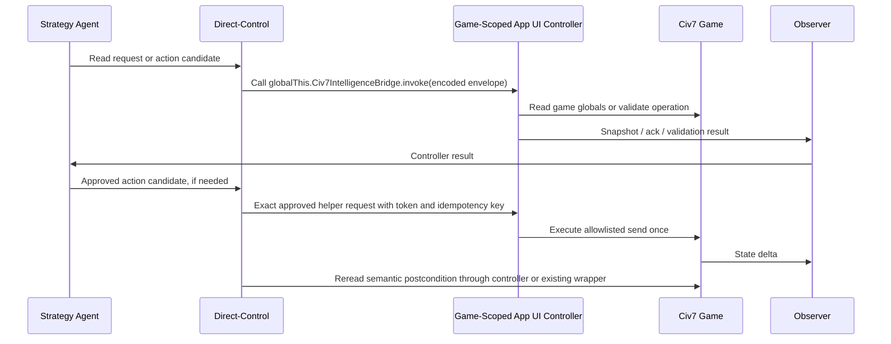

# Runtime Companion Endpoint And Probe Reference

This reference keeps runtime endpoint evidence, probe design, and under-investigated
threads close to [SOLUTION-FRAME.md](SOLUTION-FRAME.md) without making the main
solution frame depend on unproven mechanisms.

## Runtime Evidence

Concrete local findings from the investigation:

- `packages/civ7-direct-control` owns developer-process control through the
  tuner socket protocol.
- Direct-control can execute JavaScript in App UI and Tuner states.
- A live read-only proof found Civ7 listening on port `4318`, with states
  `App UI` and `Tuner`.
- App UI exposed the major gameplay roots checked in Tuner:
  `Game`, `GameplayMap`, `Players`, `Units`, `MapUnits`, `Cities`, `MapCities`,
  `Districts`, `MapConstructibles`, `Database`, and `GameInfo`.
- App UI also exposed App UI-only controller and lifecycle roots in the current
  session: `GameContext`, `Automation`, `Network`, `UI`, `WorldUI`,
  `localStorage`, and `WorldBuilder`.
- Tuner exposed the major gameplay read/action roots checked in this pass, but
  not `WorldBuilder`, `GameContext`, `Automation`, `Network`, `UI`, `WorldUI`, or
  `localStorage`.
- A read-only value probe returned matching App UI and Tuner values for map
  dimensions, seed, plot terrain/resource/revealed state, alive players, human
  player, first unit id/location/type, and `GameInfo.Resources.length`.
- Installed UI mods use game/shell `UIScripts`, `engine.on(...)`, and
  `localStorage` settings.
- UI logs showed local UI mod scripts loading from `fs://game/...`.
- The installed `civmods-lf-policies-yields-preview` mod registers
  `scripts/api/public-api.js` as a `UIScripts` item. That script freezes a
  public API object and attaches it as `globalThis.LfYieldsPreview`.
- A read-only post-Begin game-context probe confirmed `globalThis` is extensible
  in App UI, `globalThis.LfYieldsPreview` is an object callable through the
  direct-control CLI in App UI, and the same symbol is `undefined` in Tuner.
- A later read-only shell-context probe found App UI present but
  `globalThis.LfYieldsPreview` and `globalThis.Civ7IntelligenceBridge` absent.
  This narrows the claim: game-scoped App UI `UIScripts` can expose globals
  after their action group loads; shell App UI availability is separate.
- Live `GameInfo` table reads matched `Debug/gameplay-copy.sqlite` row counts
  and sample ordering for several tables, including `AiOperationDefs`,
  `BehaviorTrees`, `Resources`, and `Strategy_Priorities`.
- App UI and Tuner both exposed operation routers such as
  `Game.UnitOperations`, `Game.UnitCommands`, `Game.CityOperations`,
  `Game.CityCommands`, and `Game.PlayerOperations` with `canStart` and
  `sendRequest` methods.
- App UI and Tuner both exposed operation/command constants for the checked
  player, unit, and city operation families.
- Installed UI mod code locally demonstrated direct calls to
  `Game.PlayerOperations.sendRequest`, proving companion scripts can mutate
  gameplay if they choose to.
- Official `scope="game"` UI scripts use the same pattern: read the game globals,
  handle `engine` or browser events, call `Game.*Operations.canStart`, and send
  operation requests. Civ's own `ui/tuner-input/tuner-input.js` is loaded as a
  game-scoped `UIScripts` item and reacts to `tuner-user-action-a/b` browser
  events from core input handling before invoking game-side helpers.
- `@civ7/direct-control` already carries the safer mutation model:
  approval policy, validation before send, no automatic replay after uncertain
  mutation, and postcondition readback.

These findings make a deployed game-scoped App UI controller the primary
implementation candidate for the current direct-control read/action wrapper
surface. They do not prove shared `globalThis` between shell and game, a
Tuner-resident deployed API, or live native-AI policy steering.

## Vocabulary

These terms must stay distinct:

| Term | Meaning |
| --- | --- |
| `shell` / `game` | Civ7 modinfo action-group scopes. They decide when mod actions such as `UIScripts`, `ImportFiles`, and `UpdateDatabase` load. These are the native rails for a deployed controller. |
| `App UI` / `Tuner` | Runtime states visible through the direct-control tuner socket. They are not modinfo deployment targets. |
| `tuner-ready` | Direct-control can find the Tuner state and a read-only gameplay canary passes after Begin Game. |
| `UIScripts` | A mod action item that can load UI JavaScript into shell or game App UI context. It does not by itself prove Tuner globals. |
| `ImportFiles` map script | Map/import code such as Swooper Maps. It is map-generation prior art, not live controller prior art. |

## Endpoint Mechanism Classification

| Mechanism | Status | Product meaning |
| --- | --- | --- |
| Direct-control sends JS to App UI/Tuner | Proven | Can inject controlled probes and wrapper commands |
| App UI companion mod via game-scoped `UIScripts` | Proven native rail | Can load the primary controller script in App UI game context after its action group runs |
| App UI `globalThis` public API | Proven by installed mod and post-Begin live read | Best primary in-process RPC ingress for `Civ7IntelligenceBridge` |
| Shell App UI public API availability | Separate native rail, not shared state | Use a shell-scoped entrypoint for setup/config; do not assume game-scoped globals exist in shell |
| Companion reads `localStorage` intent | Likely but demoted | Reload mirror or async probe only; storage collision risk exists |
| Companion observes App UI global variable | Proven shape | Stronger as explicit `globalThis.Civ7IntelligenceBridge.invoke(...)` than as anonymous variable |
| Companion reacts to `engine.on(...)` hooks | Proven for native events | Can watch turn/frame/player events |
| Tuner-resident deployed endpoint API | Unproven | `UIScripts` do not currently prove Tuner attachment |
| Tuner-to-UI custom event path | Not needed for baseline | Probe only if a future feature actually requires cross-state event delivery |
| Mod reads `GameInfo` / `Database` rows | Proven | Useful for observation, loaded-row checks, and controller snapshots |
| Companion affects native AI policy live | Unproven | Do not depend on it |
| Companion adds annotations/tactical helpers | Proven-likely | Safest bridge value |
| Companion sends player operations independently | Eliminated | Capability exists, but it bypasses direct-control authority |
| Direct-control-approved companion helper action | Primary implementation candidate after proof | Controller may execute exact approved helpers with token, allowlist, visible ack, and semantic postcondition readback |
| File polling from game script | Unproven | Do not design around it |
| Map script live bridge after game start | Ruled out for general play | Map scripts are generation-time |
| Full game-scoped App UI controller | Primary implementation candidate | Can absorb most raw wrapper JS while preserving direct-control transport, approvals, and proof records |

## Controller Product First

The endpoint should first serve the surfaces now proven to belong on the
game-scoped App UI rail:

- primary synchronous App UI RPC through
  `globalThis.Civ7IntelligenceBridge.invoke(...)`;
- read snapshots for game, map, plots, players, units, cities, visibility, and
  bounded `GameInfo` rows;
- operation-family capability discovery and `canStart` validation;
- exact direct-control-approved helper execution for a disposable first action
  proof;
- strategy-intent display;
- plan and objective display;
- in-game annotations and overlays;
- richer observations that direct-control can read.

The endpoint should not first serve:

- live native AI database mutation;
- hot-reloading behavior trees;
- independent action choice or unsupervised gameplay sends;
- replacing direct-control approval and proof records;
- raw external JS execution by an LLM.

## Controller Authority Contract

The controller can own game-resident read logic, event subscriptions, capability
cataloging, and exact helper execution. It must not own action choice,
approval, retries, or postcondition promotion. Its contract should look like
this:



Direct-control creates the approved action record before any helper execution
and verifies the expected outcome after. The endpoint never receives raw LLM
JavaScript or unsupervised operation payloads.

Recommended `Civ7IntelligenceBridge` shape:

```js
const controllerRuntime = createCiv7ControllerRuntime({
  globals: globalThis,
  policy: directControlPolicyContext,
});

const Civ7IntelligenceBridge = Object.freeze({
  version: "0.1.0",
  ping: () => ({ ok: true }),
  invoke: (encodedEnvelope) => {
    return controllerRuntime.invokeEncoded(encodedEnvelope);
  },
});

Object.defineProperty(globalThis, "Civ7IntelligenceBridge", {
  value: Civ7IntelligenceBridge,
  writable: false,
  configurable: false,
});
```

Use `globalThis` as the namespace. Do not patch `Game`, `GameInfo`, or other
native globals. `Object.freeze` and `defineProperty` are accidental-overwrite
guards, not security boundaries.

The envelope should be encoded by the direct-control wrapper with the smallest
transport-safe representation that the App UI runtime supports. Prefer
base64url JSON if the runtime provides compatible decoding primitives; otherwise
send escaped JSON as the first slice. In both cases, validate protocol version,
required request id, method allowlist, parameter shape, and input size before
dispatch.

Minimum envelope fields:

| Field | Purpose |
| --- | --- |
| `protocolVersion` | Reject incompatible callers. |
| `requestId` | Correlate logs, responses, and retries. |
| `method` | Dispatch only allowlisted companion methods. |
| `params` | Method-specific typed payload. |
| `createdAtTurn` / `expiresAtTurn` | Reject stale turn-scoped calls when provided. |
| `idempotencyKey` | Required only for async or helper-approved effects. |

Minimum response fields:

| Field | Purpose |
| --- | --- |
| `ok` | Success/failure discriminator. |
| `requestId` | Echo for correlation. |
| `method` | Echo for diagnostics. |
| `result` | Method-specific result when `ok` is true. |
| `error.code` | Stable typed failure code when `ok` is false. |
| `observedAt` | Optional turn/local-player/runtime context for proof records. |

## ORPC And Effect Placement

Use oRPC and Effect as the shared service substrate across the controller stack,
not only at the external direct-control boundary. The repo already has typed
procedures for lifecycle, live reads, setup, actions, capability catalogs, and
approval context. The deployed game controller should use the same architectural
shape: a game-resident procedure router with Effect services for Civ globals,
policy context, logging/proof sinks, bounds, approval checks, and future
controller internals.

The App UI global is still required, but it is not the product API. Treat
`globalThis.Civ7IntelligenceBridge.invoke(...)` as a serialized ingress adapter
from direct-control's existing command transport into the in-process callable
router. The envelope exists because the tuner socket command bridge can only
cross into the selected game state by evaluating a bounded JS call; once inside
the controller, dispatch should go through procedure definitions, schemas,
Effect context, and shared middleware rather than a hand-maintained method table.

This substrate choice applies to three related surfaces:

- the internal game controller mod API;
- the external direct-control bridge API;
- future internal AI intelligence services that may need pub/sub, queues,
  schedules, build-queue helpers, strategy/tactics invocations, or other
  in-game orchestration.

Do not turn that into arbitrary script authority. The oRPC/Effect substrate
organizes typed callable capabilities; direct-control still owns external
transport, approval records, no-replay behavior, and postcondition proof.

## In-Game Controller Baseline Candidate

The live probe changes the baseline: App UI game context exposed the same major
gameplay roots checked in Tuner, plus lifecycle/UI/storage roots that Tuner
lacked. A fuller App UI resident controller is therefore the primary
implementation candidate for replacing raw per-wrapper JS literals. It can
centralize event subscriptions, local state caching, overlays, capability
discovery, acknowledgements, read snapshots, validation, and exact approved
helper execution.

It does not eliminate verification. It shifts the verification target to the
controller: installation, shell/game lifecycle, reload and restart recovery,
save/load, turn and age transitions, local-player identity, method allowlists,
input limits, stale-request rejection, approval-token validation, and semantic
outcome proof. A model runtime fully inside the game also needs separate proof
for outbound network access, secret handling, performance, and UI thread safety.

Direct-control remains the external authority for tuner socket framing, state
discovery, reconnects, approvals, no-replay policy, audit records, and proof
classification. The controller changes the command body from many raw JS
literals to a stable project-owned API call; it does not create a new transport.

## Required Probes

| Probe | Purpose | Success |
| --- | --- | --- |
| One-lever profile load | Prove compiler emits valid SQL/XML | Generated rows load and are visible |
| Fixed-seed A/B run | Prove profile changes behavior, not only rows | Metric moves across controlled runs |
| Behavior-tree generation | Prove generated tree graphs are valid | Tree loads, no DB errors, attached operation still runs |
| RHQ recipe isolation | Prove an RHQ pattern can be safely extracted | One mapped recipe loads and has measured effect |
| App UI `Civ7IntelligenceBridge` RPC | Prove direct-control can call the project-owned public API | `ping`, `invoke`, and `game.snapshot` return bounded JSON from App UI game context |
| Controller parity read probe | Prove App UI controller covers current raw wrapper reads | Controller outputs match existing wrappers for map summary, one plot, player/unit/city summaries, visibility, and `GameInfo` on the same turn |
| Controller operation validation probe | Prove App UI controller covers operation legality checks | `operations.validate` returns the same validator shape for player/unit/city operation families without sending |
| Controller approved action probe | Prove exact helper execution without independent authority | Direct-control creates an approval record, controller executes one allowlisted disposable action once, and direct-control rereads semantic postcondition |
| Lifecycle scope proof | Prevent shell/Tuner overclaims | Game symbol is present after game action-group load and reloads after UI restart; shell uses its own entrypoint if needed; Tuner remains absent unless separately proven |
| `localStorage` mirror | Prove durable App UI intent queue only if async is needed | Script reads namespaced queue; collision behavior and UI log confirm |
| Custom event path | Test event-based delivery only if synchronous RPC is insufficient | Script receives injected event, or path is ruled out |
| Live AI reload falsifier | Test only in disposable session | Runtime row change and native AI re-read are both proven |

## Resolved Open Threads

| Thread | Resolution |
| --- | --- |
| Live `GameInfo` row reads versus debug database copies | Promoted to loaded-row proof candidate. Current live counts/sample rows matched debug DB copies. |
| App UI and Tuner gameplay-root parity | Promoted. Current live read-only probes show App UI has the same major gameplay read/action roots checked in Tuner, plus App UI-only lifecycle/UI/storage roots. |
| Companion UI scripts calling operation APIs | Capability proven, independent authority eliminated. Use only direct-control-approved controller actions. |
| App UI `globalThis` RPC surface | Promoted to primary controller ingress after project-owned lifecycle proof. Installed LF mod plus post-Begin live probe prove the shape, not shared shell/Tuner state. |
| Native game/shell rails | Promoted. One mod can define separate `scope="game"` and `scope="shell"` `UIScripts`; they are separate contexts and should expose separate handshakes if both are needed. |
| Raw debug DB writes as control path | Eliminated. Debug copies are evidence, not mutation targets. |
| Companion endpoint as native AI policy surface | Deferred. No supported live row mutation plus native AI re-read path was found. |
| App UI endpoint receipt | The public-API shape is proven by installed mod; a project-owned `Civ7IntelligenceBridge` still needs lifecycle, method, parity, and approved-action proof. |

## Proof And Promotion Flow

Use this flow for every risky claim:

```text
hypothesis -> probe -> source/load/runtime proof -> measured outcome ->
confidence label update -> promote, defer, or reframe
```

A proof can promote an implementation only for the boundary it exercised. A
loaded-row proof can promote "the generated rows load." It cannot promote "the
AI played better." A harmless endpoint probe can promote "the endpoint received
an intent." It cannot promote "the endpoint is safe for action execution."

## Reframe Triggers

Reframe the architecture if any of these become true:

- A measured probe proves native AI rows or behavior-tree state can be changed
  and re-read mid-game through a stable supported path.
- A companion mod cannot receive external intent through App UI globals,
  `localStorage`, or any safe event/polling mechanism.
- Direct-control lacks enough action coverage for credible hotseat live play.
- One-lever static profiles repeatedly load but fail to move behavior under
  fixed-seed A/B runs.
- Save/log reverse-engineering yields an ordered human action diary rich enough
  to become the main strategy corpus.

## Residual Probes

The prior under-investigated threads are no longer unclassified. Remaining
work is probe-shaped:

- marker-row loaded proof after a generated profile loads;
- age-transition marker-row swap/layer proof;
- project-owned `Civ7IntelligenceBridge` shell/game/reload/save/load lifecycle,
  `ping`, `invoke`, and `snapshot` proof;
- `localStorage` queue namespace proof without key collision, only if async
  delivery is still needed;
- direct-control-approved companion helper action in a disposable game only;
- native-AI live reload falsifier with row visibility, AI re-read, behavior
  effect, and rollback;
- fixed disposable logging run to measure how complete native AI logs can be;
- hotseat activation and handoff proof sequence.

## Local Source Pointers

- `packages/civ7-direct-control/AGENTS.md`
- `packages/civ7-direct-control/src/index.ts`
- `/Users/mateicanavra/Library/Application Support/Civilization VII/LocalStorage.sqlite`
- `/Users/mateicanavra/Library/Application Support/Civilization VII/Mods.sqlite`
- `/Users/mateicanavra/Library/Application Support/Civilization VII/Logs/`
- `/Users/mateicanavra/Library/Application Support/Civilization VII/Debug/gameplay-copy.sqlite`
