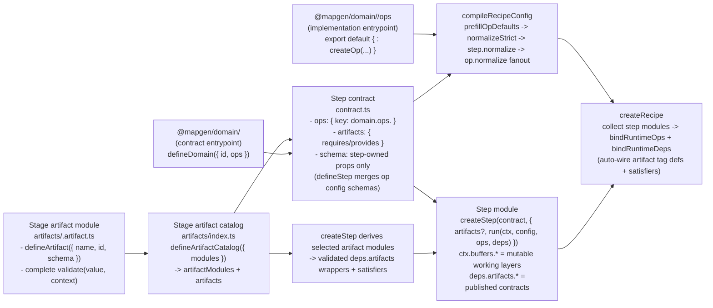

# Implementation Reference (Expanded Constraints + Surfaces)

This is the expanded reference used during Phase 4 implementation. Keep it close while coding.

Also keep this stop-sign reference nearby:
- `docs/projects/engine-refactor-v1/resources/workflow/domain-refactor/references/implementation-traps-and-locked-decisions.md`

## Expanded constraints and invariants

Canonical TypeScript rules (hard rules):
- Use `OpTypeBag` from `@swooper/mapgen-core/authoring` for all shared op types (`types.ts` is the only shared type surface).
- Do not export or re-export types from helpers or rules; shared types live in `types.ts` only.
- `rules/**` must not import `../contract.js` (type-only or runtime). Use `../types.js` for types and core SDK packages for utilities.

Execution posture:
- Proceed end-to-end per slice: migrations, deletions, docs/tests, and guardrails ship together; each slice ends pipeline-green.
- Prefer durable fix anchors: land fixes at contracts/schemas/normalize boundaries rather than patching internals likely to churn next slice.
- Stop the line on drift: if a locked decision is threatened or a contract is ambiguous, pause, update the Phase 3 issue, and add a guardrail before continuing.
- Keep diffs reviewable: default to one Graphite branch/PR per slice; split broad slices into explicit subissues/branches.
- Router compliance: before editing any file, read the closest `AGENTS.md` router that scopes that file.

Non-negotiable invariants (target architecture):
- Ops are the contract; steps never call internal domain helpers directly.
- Ops are atomic; ops must not call other ops (composition happens in steps/stages).
- No runtime “views” cross the op boundary (POJOs + typed arrays only).
- Op contracts own schemas and default configs; step contracts declare which op contracts they use via `contract.ops`.
- `defineStep({ ops })` merges declared op configs into the step schema automatically (step schemas only declare step-owned props).
- Plan compilation produces final configs; runtime treats `node.config` as “the config” (no runtime defaulting merges).
- Semantic knobs require an explicit contract: meaning, missing/empty/null behavior, and determinism expectations must be written down and test-locked (do not infer ad hoc during implementation).
- No dual paths, shims, translators, DeepPartial override blobs, or fallback behaviors within scope.
- Artifacts are contract-first and stage-owned:
  - each `stages/<stage>/artifacts/<name>.artifact.ts` module owns one contract and its complete structural/semantic validator,
  - `stages/<stage>/artifacts/index.ts` is the single catalog and exports its derived `artifactModules` and `artifacts`,
  - step contracts declare `artifacts.requires/provides` with the derived `artifacts` handles,
  - producers pass selected derived modules to `createStep`; the SDK derives runtimes and data access stays on `deps.artifacts.*`,
  - validators stay with their recipe/domain contracts; MapGen Core supplies admission machinery, not domain-specific validation.

## Artifacts authoring (stage-owned module + catalog, step-owned runtime binding)

Artifact module (one contract plus its complete validator):
```ts
// mods/mod-swooper-maps/src/recipes/standard/stages/ecology/artifacts/feature-occupancy.artifact.ts
import type {
  ArtifactValidationContext,
  ArtifactValidationIssue,
} from "@swooper/mapgen-core/authoring/contracts";
import {
  defineArtifact,
  Type,
  TypedArraySchemas,
  validateArtifactSchema,
} from "@swooper/mapgen-core/authoring/contracts";

/** Closed structural schema for feature-planner occupancy state. */
export const Schema = Type.Object(
  {
    width: Type.Integer({ minimum: 1, description: "Map width represented by occupancy." }),
    height: Type.Integer({ minimum: 1, description: "Map height represented by occupancy." }),
    occupied: TypedArraySchemas.u8({
      description: "One byte per tile: 1 when occupied by a planned feature, otherwise 0.",
    }),
  },
  {
    additionalProperties: false,
    description: "Ecology feature occupancy shared by ordered feature planners.",
  },
);

/** Registers write-once occupancy state that prevents planners from claiming the same tile. */
export const artifact = defineArtifact({
  name: "featureOccupancy",
  id: "artifact:ecology.featureOccupancy",
  schema: Schema,
});

function isRecord(value: unknown): value is Record<string, unknown> {
  return value !== null && typeof value === "object" && !Array.isArray(value);
}

/**
 * Validates the closed schema, active-map dimensions, one occupancy cell per tile, and the
 * binary occupancy value domain. These are the artifact's complete admission invariants.
 */
export function validate(
  value: unknown,
  context?: ArtifactValidationContext,
): readonly ArtifactValidationIssue[] {
  const issues = [...validateArtifactSchema(Schema, value)];
  if (!isRecord(value)) return Object.freeze(issues);

  const { width, height, occupied } = value;
  if (
    typeof width !== "number" ||
    !Number.isInteger(width) ||
    typeof height !== "number" ||
    !Number.isInteger(height) ||
    width < 1 ||
    height < 1 ||
    !(occupied instanceof Uint8Array)
  ) {
    return Object.freeze(issues);
  }

  if (occupied.length !== width * height) {
    issues.push({ message: "featureOccupancy.occupied must contain one cell per tile." });
  }
  if (
    context?.dimensions &&
    (width !== context.dimensions.width || height !== context.dimensions.height)
  ) {
    issues.push({ message: "featureOccupancy dimensions must match the active map." });
  }
  if (occupied.some((cell) => cell !== 0 && cell !== 1)) {
    issues.push({ message: "featureOccupancy.occupied accepts only 0 or 1." });
  }
  return Object.freeze(issues);
}
```

Stage catalog (the only registry; both public surfaces are derived from it):
```ts
// mods/mod-swooper-maps/src/recipes/standard/stages/ecology/artifacts/index.ts
import { defineArtifactCatalog } from "@swooper/mapgen-core/authoring/contracts";
import * as featureOccupancy from "./feature-occupancy.artifact.js";

const catalog = defineArtifactCatalog({ featureOccupancy });

/** Ecology artifact modules pairing each contract with its complete admission validator. */
export const artifactModules = catalog.modules;

/** Ecology artifact handles derived from the module catalog for contracts and consumers. */
export const artifacts = catalog.artifacts;
```

Consumer step contract (declares dependencies via `artifacts.*`):
```ts
// mods/mod-swooper-maps/src/recipes/standard/stages/ecology/steps/features-apply/contract.ts
import ecology from "@mapgen/domain/ecology";
import { Type, defineStep } from "@swooper/mapgen-core/authoring/contracts";
import { artifacts as ecologyArtifacts } from "../../artifacts/index.js";

export default defineStep({
  id: "features-apply",
  phase: "ecology",
  artifacts: { requires: [ecologyArtifacts.featureOccupancy], provides: [] },
  ops: { apply: ecology.ops.applyFeatures },
  schema: Type.Object({}, { additionalProperties: false }),
  requires: [],
  provides: [],
});
```

Producer step runtime (binds runtime checks + publishes via `deps`):
```ts
// mods/mod-swooper-maps/src/recipes/standard/stages/ecology/steps/features-plan/index.ts
import { createStep } from "@swooper/mapgen-core/authoring";
import { artifactModules as ecologyArtifactModules } from "../../artifacts/index.js";
import contract from "./contract.js";

export default createStep(contract, {
  artifacts: [ecologyArtifactModules.featureOccupancy],
  run: (ctx, config, ops, deps) => {
    const { width, height } = ctx.dimensions;
    const occupied = new Uint8Array(width * height);
    // Planner output determines which cells are marked occupied before publication.
    deps.artifacts.featureOccupancy.publish(ctx, { width, height, occupied });
  },
});
```

## Target architecture diagram (wiring)



## Expected file surfaces (outside view)

```txt
mods/mod-swooper-maps/src/domain/<domain>/
  index.ts                # contract entrypoint (defineDomain); safe for step contracts
  config.ts               # optional; thin re-export surface for domain-owned schemas/constants
  ops/
    contracts.ts          # op contracts registry (export const contracts = { ... })
    index.ts              # op implementations registry (export default { ... } satisfies contracts)
    <op>/
      contract.ts
      types.ts
      rules/
        index.ts
      strategies/
        default.ts
        index.ts
      index.ts

mods/mod-swooper-maps/src/recipes/standard/stages/<stage>/
  artifacts/
    index.ts              # defineArtifactCatalog; derives artifactModules + artifacts
    <name>.artifact.ts    # one defineArtifact contract + its complete validator
  index.ts                # stage module (createStage), wires steps + knobsSchema + compile-time op registry
  steps/
    <step>/
      contract.ts         # defineStep({ ops, artifacts.requires/provides, schema, requires/provides (non-artifacts) })
      index.ts            # createStep(contract, { artifacts?, normalize?, run(ctx, config, ops, deps) })
      lib/                # optional pure helpers
```
