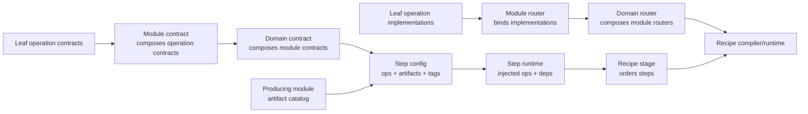

# Implementation Reference

This is the expanded reference for Phase 4 domain implementation.

Also keep these references nearby:

- `docs/projects/engine-refactor-v1/resources/workflow/domain-refactor/references/implementation-traps-and-locked-decisions.md`
- `docs/projects/engine-refactor-v1/resources/workflow/domain-refactor/references/op-and-config-design.md`
- `docs/system/libs/mapgen/reference/OPS-MODULE-CONTRACT.md`

## TypeScript and ownership rules

- Every domain has one declarative `contract.ts`, one executable `router.ts`,
  and one public `index.ts`.
- Every direct semantic module has the same three singular surfaces.
- A module contract directly composes its leaf operation contracts.
- A module router directly binds the corresponding leaf operation
  implementations.
- The module's `ops/` directory contains only semantic operation directories.
  Do not add another contract or implementation registry layer inside it.
- Each operation contract owns its shared input schema, shared output schema,
  and complete tuple of semantic strategy definitions.
- The operation contract is the default authority. Aggregate surfaces do not
  re-export constituent operation contracts as named alternatives.
- Do not create a shared operation-envelope type bag. Shared domain vocabulary
  is decomposed into model atoms at the lowest truthful owner; algorithm
  `Params` and `Result` types stay private to rules or strategies.
- A rule does not derive its public vocabulary from the operation envelope or
  an artifact payload. A strategy imports the operation contract only to bind
  its implementation through `createStrategy`.
- Each strategy definition lives in
  `strategies/<semantic-id>/config.ts`; its implementation lives beside it in
  `index.ts`. The operation-level `strategies/index.ts` collects executable
  strategies only.
- Strategy ids name behavior. A sole semantic strategy is inferred as the
  default; a multi-strategy operation explicitly selects a semantic default.
  The word `"default"` is not a strategy identity.

## Execution posture

- Migrations, deletions, docs, tests, and guardrails ship together per slice.
- Prefer contracts, schema admission, normalization, and semantic ownership as
  fix anchors.
- Stop when a locked decision is threatened or an ownership boundary is
  ambiguous. Resolve the Phase 3 issue and executable guardrail before
  continuing.
- Read the closest `AGENTS.md` router before editing a path.
- Classify unfamiliar structure with `bun habitat classify <path>` and run the
  reported targets.

## Non-negotiable architecture

- Operations are the domain compute boundary; recipe steps do not call private
  domain helpers directly.
- Operations are atomic and do not call other operations. Composition happens
  in recipe steps and stages.
- Only POJO-like data and typed arrays cross operation boundaries. Runtime
  views, adapters, execution contexts, and RNG callbacks do not.
- Operation contracts own their schemas and strategy definitions. Step config
  declares the exact operation contracts it uses.
- `defineStep({ ops })` derives the selected operation config envelopes into
  the step schema; the explicit step schema contains only step-owned fields.
- Plan compilation produces final config. Runtime code does not merge defaults,
  infer author intent, or validate a second time.
- Semantic knobs document and test meaning, missing/empty/null behavior,
  composition, and determinism.
- No dual paths, shims, translators, partial override bags, or hidden fallbacks
  remain within a completed slice.
- Model atoms, policy, and shared rules live at the lowest owner whose siblings
  genuinely share them.

## Artifacts and step binding

Artifacts are contract-first and owned by the exact domain module that
produces them:

- each
  `domain/<domain>/modules/<module>/artifacts/<name>.artifact.ts` owns one
  immutable data product's identity, schema, and complete admission;
- the adjacent `artifacts/index.ts` exports the module's single artifact
  catalog;
- step config selects exact handles in `artifacts.requires` and
  `artifacts.provides`;
- step runtime reads and publishes only through derived
  `deps.artifacts.<name>` capabilities; and
- recipe stages order steps and do not define or aggregate artifact catalogs.

Current engine state is invocation-local adapter observation, not an immutable
artifact. Metrics, visualization, trace, and diagnostics are evidence
capabilities rather than alternate causal stores.

The complete artifact procedure lives in:

- `docs/system/libs/mapgen/reference/ARTIFACTS.md`
- `docs/system/libs/mapgen/how-to/add-a-new-artifact.md`

The durable flow is:

1. The exact producing domain module defines the artifact authority and
   includes it in its adjacent catalog.
2. Step config imports that public handle and declares it as required or
   provided.
3. `defineStep` snapshots the selected authorities.
4. `createStep` binds behavior; runtime reads or publishes through
   `deps.artifacts`.
5. Recipe composition privately owns storage, admission, satisfaction, and
   scheduling.

## Step runtime contract

Steps use a two-file authoring surface:

```text
steps/<step>/
  config.ts
  step.ts
```

`config.ts` owns `defineStep(...)`, selected operation contracts, exact
artifact handles, dependency/effect tags, and step-owned schema fields.
`step.ts` owns `createStep(...)` behavior.

The runtime signature is:

```ts
run: (context, config, ops, deps) => {
  const { width, height } = context.setup.dimensions;
  const input = deps.artifacts.someInput.read(context);
  const output = ops.computeSomething({ width, height, input }, config.computeSomething);
  deps.artifacts.someOutput.publish(context, output);
}
```

Steps never deep-import operation implementations or access raw artifact
storage. Projection steps may inspect invocation-local engine state through the
adapter, but they do not publish a stale engine snapshot as an artifact.

## Composition diagram


```mermaid
flowchart LR
  OperationContracts["Leaf operation contracts"]
  ModuleContract["Module contract\ncomposes operation contracts"]
  DomainContract["Domain contract\ncomposes module contracts"]
  OperationImplementations["Leaf operation implementations"]
  ModuleRouter["Module router\nbinds implementations"]
  DomainRouter["Domain router\ncomposes module routers"]
  ArtifactCatalog["Producing module\nartifact catalog"]
  StepConfig["Step config\nops + artifacts + tags"]
  StepRuntime["Step runtime\ninjected ops + deps"]
  Stage["Recipe stage\norders steps"]
  Recipe["Recipe compiler/runtime"]

  OperationContracts --> ModuleContract
  ModuleContract --> DomainContract
  OperationImplementations --> ModuleRouter
  ModuleRouter --> DomainRouter
  DomainContract --> StepConfig
  ArtifactCatalog --> StepConfig
  StepConfig --> StepRuntime
  DomainRouter --> Recipe
  StepRuntime --> Stage
  Stage --> Recipe
```

## Expected file surfaces

```text
mods/mod-swooper-maps/src/domain/<domain>/
  contract.ts
  router.ts
  index.ts
  model/                           # optional shared vocabulary
    atoms/
    policy/
    rules/
  modules/
    <module>/
      contract.ts
      router.ts
      index.ts
      model/                       # optional module-local vocabulary
        atoms/
        policy/
        rules/
      artifacts/                   # optional immutable products
        index.ts
        <name>.artifact.ts
      ops/
        <operation>/
          contract.ts
          index.ts
          rules/                   # optional private rules
          strategies/
            index.ts
            <semantic-id>/
              config.ts
              index.ts

mods/mod-swooper-maps/src/recipes/<recipe>/stages/<family>/<stage>/
  index.ts
  model/
    policy/
  steps/
    <step>/
      config.ts
      step.ts
```

The stage hierarchy may add semantic family levels. Artifact catalogs remain
under their exact producing module regardless of which recipe stages consume
or publish them.

Representative anchors:

- Domain contract and router:
  `mods/mod-swooper-maps/src/domain/ecology/contract.ts`,
  `mods/mod-swooper-maps/src/domain/ecology/router.ts`
- Module contract and router:
  `mods/mod-swooper-maps/src/domain/ecology/modules/biomes/contract.ts`,
  `mods/mod-swooper-maps/src/domain/ecology/modules/biomes/router.ts`
- Operation:
  `mods/mod-swooper-maps/src/domain/foundation/modules/mesh/ops/compute-mesh/`
- Module artifact catalog:
  `mods/mod-swooper-maps/src/domain/ecology/modules/biomes/artifacts/index.ts`
- Step config and runtime:
  `mods/mod-swooper-maps/src/recipes/standard/stages/ecology/biomes/steps/biomes/config.ts`,
  `mods/mod-swooper-maps/src/recipes/standard/stages/ecology/biomes/steps/biomes/step.ts`
