# MapGen Studio Runtime Closeout Takeover Frame

Status: reviewed normative frame; current resume state lives in
`verification-ledger.md`

Built by: Codex takeover DRA

Built for: continuation of session `019f3913-4c80-78f1-bdd8-236713d527da`

Snapshot date: 2026-07-12

Document role: normative mental and orchestration frame for the remaining
initiative. It is not a second progress tracker. `verification-ledger.md` owns
live status after it is repaired to current truth; this frame owns the durable
interpretation of what the work is, why it is sequenced this way, and how the
DRA exercises judgment.

Lifecycle authority amendment (2026-07-13): Studio development has one
foreground owner, `nx run mapgen-studio:dev`. Nx composes Vite, its continuous
daemon dependency, and prerequisite tasks; one interrupt stops the graph. Every
later reference in this frame to a per-worktree helper, private tmux/state,
start/stop certification, or a separate Codex lifecycle is superseded and is
not executable authority.

Durable home:
`docs/projects/mapgen-studio-runtime-transition/TAKEOVER-FRAME.md`. It lands as
one clean Graphite documentation layer directly above
`codex/habitat-rule-introduction-baseline-manifests@9ff0f711e`, without touching
the inherited dirty execution worktree. That layer is the control parent for
recreated Stage 2 semantic branches after the mixed dirt is separated; it is not
a branch-closing substitute for reconciling `WORKSTREAM.md` and live records.

## Epistemic Contract

Labels used below:

- **Observed**: directly supported by the session transcript, Git/Graphite,
  current worktrees, or a repository artifact.
- **Inferred**: synthesis that best explains the observed record but is not
  itself sealed authority.
- **Normative**: the operating commitment this takeover adopts from current
  user direction and the repository's authority order.
- **Proposed**: a recommendation that still needs to be admitted at a clean
  execution boundary.

Authority is read in this order:

1. current direct user direction;
2. `AGENTS.md`, repository process, and canonical product/system authority;
3. accepted current MapGen and Habitat authority;
4. packet/OpenSpec authority admitted for this initiative;
5. future Foundry material only at its declared draft status;
6. current code, Git topology, tests, and runtime observations as evidence;
7. stale proposals, logs, generated artifacts, and derivative chat summaries as
   discovery material only.

This is not the claim that every newer message overrides durable product truth:
it means a direct categorical correction changes the operating frame unless it
conflicts with a higher safety constraint. The source session was still live
when this frame was assembled, so every volatile Current Resume Boundary fact
must be revalidated before mutation.

## Frame Identity

### WHAT

This frame treats the remaining work as a **product-closeout and semantic
normalization program**, not as a generic cleanup campaign. The unit of analysis
is the complete path from one user-selected config to one request-correlated
map running in Civ7, plus the authority and repository state required to make
that outcome honest. Consolidation, cleanup, noise removal, normalization, and
radical simplification are permitted methods. They are not substitutes for the
product result.

### WHY

The structurally different alternative was to organize the initiative around
code surfaces: tests, schemas, Studio modules, Habitat rules, Effect lint, and
folder topology. That frame was rejected because the session repeatedly showed
that locally clean surfaces could coexist with a broken Run in Game button. A
product-flow frame makes narrow green gates, wrong-owner rules, and ornamental
refactors visible as insufficient. It also prevents transitional Studio code
from becoming target architecture merely because it has been documented or
reorganized carefully.

### Selection Commitments

In:

- the coherent local Graphite stack and each layer's semantic ownership;
- retained Run in Game behavior, config generation, direct-control, public
  status, diagnostics, and rendered/in-game verification;
- removal of redundant concepts, compatibility paths, brittle mirrors, wrong
  owners, and special-case execution needed to close that behavior honestly;
- current Habitat prerequisites exposed by A.2;
- tests, docs, OpenSpec, Graphite, worktrees, and live process state required
  for clean closure.

Foreground:

- one authority, one representation, and one transition path at each boundary;
- state-space reduction rather than relocation of complexity;
- product behavior and exact evidence class rather than proxy success;
- owner-correct enforcement through TypeScript, behavior tests, Nx, Habitat
  Structure/Grit, and live gates;
- semantic commits and clean takeover boundaries.

Exterior:

- realization of the future RAWR/Habitat blueprint catalog;
- a greenfield replacement Studio service, UI, host, worker, or runtime;
- unrelated repository cleanup and independently owned stacks/worktrees;
- compatibility lanes that preserve the current runtime as a future fallback;
- custom tracking, collector, dashboard, or harness machinery whose only job is
  describing progress.

### Hard Core

1. **Product outcome:** the rendered Studio action must launch the exact
   requested generated content and be verified through the game, not only an
   endpoint or unit test.
2. **Single authority and flow:** each semantic boundary has one owner, one
   canonical representation, and one transition path. Redundant ontologies and
   rescue paths are removed.
3. **Authority-correct enforcement:** behavior, types, dependencies, structure,
   and live observations are asserted by their natural owners; current code is
   evidence, not automatic authority.
4. **Transitional containment:** retained behavior may merge, but current
   Studio topology does not become future architecture by survival.
5. **Clean closure:** a domino closes only with current gates, fresh required
   reviews, reconciled records, a semantic Graphite layer, and a clean owned
   worktree.

### Protective Belt

- exact branch names and commit SHAs;
- the number and grouping of implementation agents;
- whether a bounded repair is a prerequisite, inter-packet, or numbered packet;
- internal file layout where authority permits more than one honest shape;
- exact test commands and performance observations;
- current process ports and temporary scratch locations.

### Falsifier And Degeneration Trigger

This frame must be revised if an accepted product or architecture source shows
that the intended outcome requires preserving two authoritative config kinds,
two runtime mutation owners, or the current Studio topology as the target. It
must also be revised if a required closeout unit cannot be expressed as a
product/authority/state-space obligation without inventing project-management
machinery.

Reframe immediately on one decisive authority conflict or categorical
falsifier. Otherwise, reframe when independent findings converge on the same
wrong owner or concept. A count is not a substitute for judgment.

## Full Initiative Arc

The initiative evolved through nine phases. This is a semantic phase map, not a
claim that every historical task is still valid.

1. **Runtime packet train (P01-P14).** Safe public status and explicit private
   diagnostics; operation identity and cancellation; source resolution;
   manifest, generation, deployment, observation, attribution, and retention.
2. **Verification and authority correction.** Red gates became investigation
   inputs. Habitat remained the sole repository structural-rule authority and
   router, not the sole correctness mechanism. Stale or wrong-owner rules were
   repaired or retired instead of bypassed.
3. **Rendered-user remediation (P15-P21).** The real button exposed what
   endpoint-centered verification missed: config drift, whole-app restart,
   daemon restarts, stale browser/daemon graphs, setup ownership, and missing
   in-game closure.
4. **Architecture reckoning.** The session separated the small retained
   behavioral core from disposable service/API/web topology and distinguished
   immediate closeout from future Habitat realization and a later Studio
   replacement.
5. **Closeout planning and recovery.** External prerequisites merged, the
   opening source range was recovered, a systematic closeout workstream was
   admitted, and Stage 0 census/accounting closed.
6. **Canonical config simplification.** Config envelope cutover, manifest
   parity, and Packet A established one complete recipe-produced JSON config
   boundary and rejected property-level migration/default rescue.
7. **Owner/topology cleanup around the baseline.** A.1 aligned tests to semantic
   owners; A.1a repaired Vite source freshness; the lifecycle child isolated
   per-worktree Studio ownership.
8. **Domain-operation normalization.** A.2 framed the closed operation topology,
   moved generated validation to package/Nx owners, admitted Habitat rule
   introduction manifests, and then exposed a Grit execution capability defect.
9. **Remaining closeout.** Finish A.2 and queued A-series units on ordinary
   sibling Graphite tracks, move setup/start ownership to control oRPC, certify
   coherent existing layers, run one final rendered/Civ7 matrix,
   archive, merge/drain, and return to Habitat.

```mermaid
flowchart LR
  A["P01-P14 runtime train"] --> B["P15-P21 rendered remediation"]
  B --> C["Transition closeout frame + Stage 0"]
  C --> D["A / A.1 / A.1a complete config and owner cleanup"]
  D --> E["A.2 domain operation topology"]
  E --> F["A.3 / A.3a / A.4 / A.5 state-space cleanup"]
  F --> G["B control-oRPC + P19/P20: Stage 2 lock"]
  G --> H["Native Graphite normalization only if needed"]
  H --> J["Stage 5 branch certification"]
  J --> K["Stage 6 integrated runtime readiness"]
  K --> L["Stage 7 completed-record archive"]
  L --> M["Stage 8 final P21 matrix + merge"]
  M --> N["Stage 9 Habitat handoff"]
```



## The Current Closeout

### Objective

Close the current MapGen Studio Run in Game body of work as an honest, merged,
transitional behavioral baseline:

```text
one selected config
  -> one resolved source
  -> one generation manifest
  -> one request-local generated mod
  -> one deployed snapshot
  -> one prepared Civ7 setup
  -> one soft game restart/start
  -> one request-correlated in-game map
  -> one safe public status stream
  -> one explicit private diagnostics path
```

The closeout retains verified behavior and pure kernels. It does not canonize
the present Studio runtime, app-hosted orchestration, browser derivation, or
exact Habitat topology as the future realization.

### Work Containers At Initial Takeover

| Container | State at takeover | Meaning |
| --- | --- | --- |
| P01-P14 original runtime packets | Historically implemented/task-checked; portions invalidated | Implementation source, not final closeout evidence. Every packet needs final semantic/evidence reconciliation. |
| P15-P18 remediation | Implemented/task-checked; late overlap invalidated evidence | Retained candidate behavior, not final acceptance. |
| P19 generated-mod visibility | Open, 0/14 at opening census | Ownership and stable-row behavior remain to close, largely through Packet B/C. |
| P20 saved-config reconciliation | Open/contradictory, 14/18 on paper | Evidence rows were not run; retained logs are insufficient. |
| P21 real-user matrix | Open, 0/20 | Exact rendered browser, setup, and in-game matrix remains closing authority. |
| Transition planning + Stage 0 | Closed | Source recovery and enough accounting exist to execute repair. |
| Packet A complete-config admission | Closed-passed candidate | Complete recipe-owned config at public boundaries; no sparse rescue. |
| A.1 test topology | Closed-passed candidate | Tests aligned to semantic owners; brittle mirrors removed; A.3 debt retained. |
| A.1a dev freshness | Closed-passed candidate | Serve resolves Studio contract source; build remains artifact-owned. |
| Lifecycle alignment child | Closed-passed candidate | Private worktree lifecycle composes canonical Nx daemon ownership. |
| A.2 frame | Restored and adapted in the sealed split base | The target topology, separate D1-D4 decisions, and descent state model are preserved without beginning Authority implementation. |
| A.2 generated-validator ownership prerequisite | Sealed at `dd38de22e` | Package/Nx owners retain behavior; three wrong-owner Habitat checks retired. |
| A.2 rule-introduction-manifest prerequisite | Sealed at `9ff0f711e` | Habitat can admit explicit nonempty shrink-only baselines. |
| Generic Grit capabilities | Sealed | Pinned acquisition, `RuleDiagnostics`, generic fix admission, and `RuleFixPreview` are ratcheted prerequisites. |
| Nx output ownership | Sealed at `d40cd82a8` | One Nx graph owns output-materializing proof order; parallel output graphs use separate worktrees. |
| A.2 split-base reconciliation | Sealed | Current readiness semantics and the nine-document descent container are preserved above the sealed prerequisites. A.2 implementation has not begun. |
| A.2 Authority | Not started | The sibling A.2 track begins only from the reviewed split base. |
| A.2 domain slices | Not started | 34 Ecology, 18 Foundation, 19 Morphology, 19 Hydrology, 8 Resources, 3 Placement operations. |
| A.3 static coverage | Planned | Close test/dev/tool TypeScript authority and move five source-local type-test families. |
| A.3a atomic reroll | Sealed at `93b1153ca` | One user command produces one worker start with Auto-run on or off. |
| A.4 preset ontology removal | Planned | Delete the second full-config concept and its state/lifecycle/UI/persistence paths. |
| A.5 browser payload/worker readiness | Proposed; cohesion unproven | Lazy selected config loading and worker warmup may need separate units. |
| B control-oRPC ownership | Planned | Daemon-owned typed setup/start/soft-restart capability; no caller-local direct-control choreography. |
| C rendered acceptance | Planned umbrella | Expands across Stages 5-8: branch certification, integrated deterministic readiness, one final exact-tree matrix, archive, and merge. |
| Workstream Stage 1 control/corpus | Closed for the split boundary | Current control records agree; the absent historical `TRANSITION.md` filename is not a reason to invent another artifact. |
| Workstream Stage 2 semantic lock | Active product closeout | The admitted scope includes A/A.1/A.1a/lifecycle and the ratcheted Habitat prerequisites; the split base opens the two remaining semantic tracks. |
| Workstream Stages 3-9 | Not started | Targeted Graphite normalization only if concrete inspection requires it, then branch certification, integrated readiness, one final matrix, archive, submit/merge, and Habitat handoff. |

Historical `checked` means task state, not current product acceptance. The config
and runtime changes after P01-P18 invalidate any evidence whose observed tree or
contract no longer matches.

### Cross-Cutting Semantic Corpus

These units are not safely represented by a single packet number. Each must
receive an explicit final disposition rather than disappear during closeout.

| Unit | Integration state | Remaining disposition | Closure stage |
| --- | --- | --- | --- |
| `TOOL-EFFECT` | Lower-stack capability exists; late consumers changed | Reconcile exact retained surface and affected gates | 2, then 5 |
| `CONFIG-AUTHORITY` | Implemented across late config work | Prove one recipe-owned authority and delete survivors | 2 |
| `CONFIG-ENVELOPE` | Packet A candidate complete | Reconcile packet tasks and final contract tree | 2, then 5 |
| `CONFIG-PARITY` | Implemented candidate | Bind exact source/manifest/runtime evidence | 2, then 5-8 |
| `TOOL-CONTRACT-ADMISSION` | Partly implemented | Preserve owner-correct contract admission through final verification | 2, then 5 |
| `TOOL-STUDIO-STRUCTURAL-TEST-DISPOSITION` | A.1 removed/moved a large corpus | Re-census deferred static checks and owner destinations | 2 |
| `EVIDENCE-VOCABULARY` | Code terminology normalized | Reconcile packet/docs records and exact public names | 2, then 5 |
| `MIXED-LATE` | Spread across late commits | Split every row by semantic owner before certification | 2-5 |
| Shared Studio lifecycle | Lifecycle child is a closed-passed candidate | Preserve one per-worktree owner and re-certify | 2, then 5 |
| Daemon stability | Improved but only partially live-proven | Re-run exact lifecycle and endpoint lanes | 5-8 |
| Codex lifecycle final certification | Planned | Certify helper/start/stop behavior at final tree | 5 |
| Transition/archive/closeout records | Inconsistent and incomplete | Reconcile, archive through owners, then prove closure | 1, 7, 9 |
| Parked readiness consumer | Protected at `f325250d0878` | Keep reference-only; hand back after merged closure | 9 |

### Known Packet Reopenings

| Packet surface | Required reconciliation |
| --- | --- |
| P05 | A.4 retired the launch-source union; reopen only on concrete contract invalidation. |
| P06 | Repair task/evidence contradiction; neither checkbox nor prose wins silently. |
| P08 | Reconcile the stable-row amendment and its downstream consumers. |
| P10 | Re-evaluate retained-log whitespace and any parser/evidence consequence. |
| P14 | Reconcile aggregate-rule retirement against current authority. |
| P16-P18 | Replace evidence invalidated by later overlapping changes. |
| P08/P18/P19/P20/P21 | Settle one stable-row representation across all consumers. |
| P19/P20 | Settle direct-control composition after Packet B owns setup/start. |
| P21 | Execute the three accepted rendered success rows on the frozen runtime tree. |

The fixed success tuple is saved setup `ToT_BasicModsEnabled.Civ7Cfg`, Huge, 10
players, balanced resources, seed `1538316415`. Its named config variants are
Swooper Earthlike, Latest Juicy, and Swooper Desert Mountains. Controlled
failure, recovery, freshness, and redaction remain deterministic behavior gates;
they are not extra live Civ7 mutation rows.

## Initial Takeover Boundary (Historical)

### Observed Snapshot

- Requested takeover worktree:
  `/Users/mateicanavra/Documents/.nosync/DEV/worktrees/431b/civ7-modding-tools`,
  clean and detached at `origin/main@46943c5f1` when inspected.
- Original session framing worktree:
  `/Users/mateicanavra/Documents/.nosync/DEV/worktrees/wt-agent-codex-mapgen-studio-runtime-openspec-packets`,
  clean on `codex/mapgen-domain-operation-topology@16745e337`.
- Active execution worktree:
  `/Users/mateicanavra/Documents/.nosync/DEV/worktrees/wt-agent-sol-a2-domain-operation`,
  branch `codex/mapgen-domain-operation-authority`, HEAD `9ff0f711e`.
- The local source range is 49 commits represented by 39 Graphite entries and
  870 changed paths above current `origin/main`. It is local-only/unsubmitted;
  no PR or merge closure may be inferred from local branch names.
- The active execution tree has 62 tracked changed files and 31 untracked files,
  75 porcelain entries across 13 top-level roots. Nothing is staged. Its diff
  combines generic Grit provider work, the preserved A.2 Authority candidate,
  and live/backlog record edits. It contains no fix/apply-admission change.
- `codex/readiness-final-aggregate-proof-green@f325250d0878` is a protected,
  separately owned sentinel. It is reference-only for this workstream.
- The source session accepted the takeover transfer and is now idle. All three
  provider review lanes completed; all child agents and Grit/Vitest/Habitat/Nx/
  typecheck processes are closed. The old DRA is non-mutating. Editor language
  servers and an unrelated Studio tmux session on ports 5173/5174 remain under
  the original framing worktree's ownership and were deliberately untouched.

### Governing Correction

The takeover DRA remains the single accountable owner for product direction,
cross-track judgment, and initiative closure. The current sibling-track ruling
delegates one bounded ownership surface: the user's A.2 orchestrator owns A.2
Authority, its deterministic census, the six domain migrations, and ordinary
Graphite mutation on that sibling. It does not supervise the takeover DRA or
own final product acceptance. Fresh peers continue to fill bounded research,
implementation, and review roles; roles are stable while sessions are fresh per
changeset.

The A.2 packet, `WORKSTREAM.md`, `verification-ledger.md`, and `NEXT-PACKET.md`
must express that bounded sibling ownership without resurrecting the earlier
standalone product-DRA split or a returned-stack integration protocol.

### Scope-Authority Reconciliation

The normative `WORKSTREAM.md` admitted an opening range of 39 commits and 475
paths. It does not yet name Packet A, A.1, A.1a, A.2, A.3+, or the two generic
Grit capability landings that now occupy Stage 2. The current direct user request
authorizes this reviewed takeover frame as a **Stage 2 scope supplement**, not as
permission to leave the governing corpus contradictory.

That reconciliation is now closed by the Current Graphite Law in
`WORKSTREAM.md`; older replacement-stack language is historical only.

`TRANSITION.md` is currently absent even though Stage 1 references transition
closure. The ledger also treats some decisions as rolling while the Stage 2
entry calls Stage 1 final. Reconcile that contradiction; do not invent a missing
artifact merely to satisfy a filename if the canonical transition contract can
be represented more directly.

### Protected Continuation Surface

Before further inherited implementation, the DRA must complete explicit role
transfer, revalidate sole mutation ownership, freeze an exact dirty-tree census,
and realign the live records. The previous DRA and every mutation-capable child
or process must be stopped, closed, or explicitly transferred. Record exact
worktree, branch, base, HEAD/tree, staged/unstaged/untracked state, live agents,
processes, gates, scratch, and the sole mutator. No reset, checkout cleanup,
stash, broad stage, or mixed commit is permitted.

The current dirty tree must first be separated while preserving these semantic
stories:

1. generic Grit diagnostic acquisition, with pinned-CLI behavior and no
   file-type/rule-ID branch, repaired and isolated as the first landing;
2. the preserved A.2 Authority candidate, kept uncommitted until both generic
   Habitat capability landings are sealed, then recreated on their clean tips
   and re-derived against current diagnostics.

After the provider landing, a new separate generic authority-derived fix/apply
admission landing begins, retaining one-or-many Habitat selection and refusing
unsupported live mutation. It is absent from inherited dirt and precedes the
recreated A.2 Authority landing.

The provider review accepted the capability boundary and left six blockers:

1. make apply observation hermetic with a scoped Grit catalog, empty scoped user
   configuration, and downloads disabled;
2. decode the pinned compact JSONL union through TypeBox, require terminal
   `reason: "allMatchesFound"`, and reconcile match counts;
3. tighten the pinned check wire schema and use only top-level `paths` as
   processed-path evidence;
4. plan roots once as per-rule root pairs, with one deliberate not-applicable
   disposition for unmatched selected rules;
5. separate acquisition policy from observed-result naming and make acquisition/
   error dispatch compiler-exhaustive;
6. distinguish parse failure from a valid but incomplete observation.

Bounded cleanup also removes unused fixture/extension residue, stale aliases and
comments, and a redundant wrapper. Typecheck and 39 focused tests pass;
`git diff --check` passes. Scoped Biome reports 33 errors/28 infos versus
37/33 on the equivalent committed base, but no clean-worktree or live CLI gate
exists. These are integration facts, not closure receipts.

## Current Resume Amendment (2026-07-14)

The current stack preserves the sealed product, Habitat, Nx, TypeScript, and
lint authority layers. The bounded descent container and active-ledger
reconciliation are sealed in the split base. A.2 Authority, its live violation
corpus, and domain migration have not begun.

The reviewed semantic tip is the split base. Create ordinary sibling Graphite
children from it: one for the user's A.2 track and one for this DRA's independent
product-closeout continuation. Keep them parallel while independent. If a real
dependency later appears, use native Graphite to move the continuation's first
unique branch above the completed A.2 tip. There is no returned stack, wholesale
replay, replacement stack, or mandatory recut.

The user's A.2 orchestrator owns Authority, the advisory file/clause/predicate
census, deterministic destination/action classification, and the six domain
migrations on its sibling. The takeover DRA protects those surfaces, continues
the independent product track, and retains final P21, submission, merge, drain,
and initiative-closure authority.

## Remaining Order

The initiative proceeds by dependency, not by numeric label alone.

1. **Create the sibling branches.** Preserve the sealed split base and open
   ordinary A.2 and independent-continuation children. Do not add A.2
   implementation or live-corpus machinery to the common parent.
2. **Run two protected sibling tracks.** The user's team implements and seals A.2
   Authority, freezes the zero-unknown advisory corpus, and executes Ecology ->
   Foundation -> Morphology -> Hydrology -> Resources -> Placement. The takeover
   DRA closes only source-independent A.3 surfaces, A.4, separately admitted A.5
   concerns, control-oRPC, P19, and P20.
3. **Finish semantic lock.** Keep the tracks parallel unless source dependencies
   require native Graphite movement, finish A.2-sensitive A.3 scopes, and reach
   P21 semantic readiness with zero undecided semantic rows.
4. **Inspect the current stack.** Preserve coherent layers. Use targeted native
   Graphite restack, move, split, or fold only when concrete inspection requires
   it; do not replay the repository or rebuild a replacement stack.
5. **Stage 5 branch certification.** Re-review and gate every accepted layer, close
   P01-P20 against current contracts, and make P21 genuinely ready. This is the
   first bounded portion of umbrella C.
6. **Stage 6 integrated readiness.** Reconverge A.2/A.3, run deterministic
   product gates, and make P21 runtime-ready. P19/P20 are the preliminary live
   support; do not spend another Civ7 matrix here.
7. **Stages 7-8 archive, final matrix, and merge.** Reconcile completed records,
   then run the three accepted P21 rows once on the frozen runtime-relevant
   submission candidate and merge bottom-to-top with post-merge tree checks.
   Any runtime-relevant change invalidates all three rows so the final evidence
   remains bound to one exact tree. Record-only changes do not replay Civ7.
8. **Stage 9 handoff.** Drain worktrees/processes, write the zero-context
    continuation, and return to the parked Habitat authority initiative.

## Development Philosophy

### State-Space Law

At each boundary, one semantic obligation has one admission/mutation authority
and one authoritative transition path. This does not collapse deliberately
distinct capabilities or projections such as safe public status and explicitly
requested private diagnostics. Secondary ontologies, aliases, fallbacks, shadow
persistence, property rescue, implicit optional-field coupling, overloaded
absence/default semantics, and rule-specific execution forks multiply states.
Remove the concept when its behavior is already carried by a stronger owner.

Complete canonical configs have required keys and schema-owned defaults;
behavioral modes are explicit variants. Sparse observations and external
contracts may preserve omission when absence has durable meaning and forcing a
value or union would be less honest.

### Authority Law

Product and architecture authority define the target. Habitat is the sole
repository structural-rule authority/router, not the sole correctness
mechanism. A stale or wrong-owner rule is updated, split, or retired through its
authority record; it is never bypassed locally. Code, tests, logs, and generated
files are evidence with bounded claim strength.

### Placement Law

- TypeScript and schemas own representability and closed data contracts.
- Behavior tests own observable code and product behavior.
- Nx owns dependency graph and task/build/generated-currentness relationships.
- Habitat Structure owns closed filesystem shapes.
- TypeScript or Biome owns source/import laws when its native semantics can
  express them directly. Habitat/Grit owns repository-specific recurring
  classes and routes their enforcement.
- Permanent structural authority expresses positive durable classes. Temporary
  negative hazard patterns are allowed only with an owner and retirement trigger.
- Live browser, endpoint, setup, log, and in-game checks each own only the
  operational claim they actually exercise.

### Simplification Law

Delete before abstracting. Prefer the installed library's native semantics and
existing production seams. A new abstraction must name an earned reusable
semantic capability, remove duplicated state or ownership, and avoid becoming a
parallel engine. One present instance does not by itself disqualify a stable
semantic class; instance count is not the decision rule. Moving or renaming
wrong ownership is not simplification.

### Genericity Law

Generic layers operate on roles, capabilities, contracts, and evidence classes.
They may consume manifest-declared identities, extensions, scopes, rule IDs, and
capabilities as data. They must not hard-code a current identity or file type as
special-case control flow. Domain semantics remain in their domain owner.

### Verification Law

Red is input. A blocker triggers classification and focused investigation. A
unit closes only after its declared static, behavior, review, and live gates run
at the relevant tree. Narrow green, worker self-report, generated output, or an
endpoint response cannot impersonate integrated product acceptance.

Run ordinary verification from the owning worktree through the repository's
normal commands. A separate worktree is justified by real parallel ownership or
output isolation, not by a need to hand-assemble another dependency environment
for the same command. If normal execution is unsafe or impractical, repair that
workflow at its owner instead of routing around it.

### Test Law

Generic tests derive laws from contracts and schemas; they do not freeze
incidental current keys, values, paths, symbols, deleted names, or inventories.
An exact field, path, or symbol is valid to assert when that exact shape is the
named public, security, or interoperability invariant and the test is not merely
duplicating schema/type authority. Domain tests retain irreducible algorithmic,
causal, metric, and outcome knowledge. Typecheck and lint are implementation
HUDs, not reviewer discoveries.

### Documentation Law

Comments explain purpose, owner, and invariant, not line mechanics. Durable
authority remains durable; temporal status stays in project records. Use
`proof` only where it has a precise standard engineering meaning; otherwise
name the actual evidence, observation, correlation, or verification.

### Closure Law

Commit deterministic semantic units as Graphite layers. Let moves and large
relocations land separately when they obscure the behavior diff. Reconcile
tasks, evidence, reviews, worktrees, processes, and scratch. Park future work
with an owner and re-entry trigger rather than smuggling it into the current
domino.

### Judgment Law

Repeated symptoms require moving one level above the line or file to the owner,
authority, flow, or state machine. Do not harden a suspect model because local
tests can be made green. Radical simplification is not unlimited cleanup:
adjacent work enters only when it removes a state/authority blocking the active
outcome or is explicitly admitted as a separate prerequisite.

### Correction Lineage

The laws above are learned operating rules, not free-floating slogans. Transcript
anchors identify the teaching moment; current user direction and repo authority
remain normative.

| Transcript anchor | Failure exposed | Direct correction | Durable law and later adoption |
| --- | --- | --- | --- |
| 2026-07-06 opening doctrine, `chunk001:45-100` | The opening brief named the target before implementation failure | Verify the actual button, endpoint, and Civ7 result; skipped lanes leave work open | This established the initial evidence hierarchy later hardened by failures |
| 2026-07-06 21:52/22:02, `chunk001:696-750` | A red gate had been turned into a handoff/stopping point | Blockers are inputs: use prompt design and investigators, classify owner/authority, repair, then continue | Red gates repeatedly spawned bounded investigations and prerequisite landings |
| Opening + chunk 012 | Tests/scripts could mirror structure while Habitat authority drifted | Habitat routes repository structural laws; use positive classes, not snapshots | Wrong-owner checks were repaired/retired rather than locally waived |
| 2026-07-08, `chunk027:505-523` | Roughly 48 hours of apparent testing still left the real button stuck and configs invalid | Treat the rendered failure as an incident; reproduce the user's path rather than defend narrow receipts | P15-P21 and the two-pass matrix became mandatory closeout containers |
| 2026-07-09, `chunk032:860-900,964-980`; `chunk033:147-249,279-299` | Property migrations and key-specific tests preserved overlapping config authorities | Configs are dumb JSON; reset to ideal boundaries, materialize recipe-owned complete defaults, and permit no property/stage/config special cases | Packet A established complete-config admission, manifest parity, and no brittle key archaeology |
| Config simplification, chunks 050-052 | Local schema wrappers and optionality obscured native library semantics | Use TypeBox/closed unions radically; make invalid states unrepresentable | Required/defaulted canonical configs replaced implicit optional coupling |
| A.1, chunks 051-053 | File/path/deleted-name tests duplicated authority and survived moves | Separate behavior, domain, recipe, SDK, Nx, and Habitat ownership | Mirrors were deleted or moved to their natural component owners |
| 2026-07-12, chunk 054 | The orchestrator delegated supervision itself | The root remains DRA; peers advise, implement bounded scopes, or review | Sequencing, synthesis, Git, disposition, and closure returned to one DRA |
| 2026-07-12, chunk 054 | A Markdown/rule-specific apply path was being hardened | Habitat exposes generic apply/fix capabilities, never one known docs path | Provider work pivoted to manifest-declared generic diagnostic acquisition |
| Current takeover correction | Reviewer permanence was interpreted as thread identity | Roles and responsibilities are permanent; fresh agents fill them per changeset | Stable lanes preserve standards while fresh instances preserve independence |

## Keyword Bags

The supplied vocabulary is retained explicitly. These meanings are the public
mental map, not hidden chain-of-thought.

### State-Space And Deletion

- **ratchet**: each accepted semantic commit makes the legitimate system state
  narrower and does not casually reopen a retired path; reversal requires new
  authority or a recorded falsifier.
- **simplification**: reduce authorities, representations, transitions, and
  concepts, not merely line count.
- **radical**: be willing to delete a green implementation or ontology when its
  model is wrong.
- **clean**: behavior, authority, docs, tests, Git, agents, and runtime state
  agree; nothing owned remains midair.
- **remove**: delete a redundant path after classifying the behavior it carried.
- **eliminate**: make an entire illegal state or authority class unreachable.

Expanded bag: `single-source, state-space-collapse, immutable, atomic,
no-alias, no-fallback, no-rescue, no-shadow, deletion-target, semantic-commit`.

### Authority And Correctness

- **authority**: the legitimate semantic owner plus its recorded enforcement
  path.
- **rules**: reusable laws about durable classes, normally stated positively;
  temporary negative hazards carry an explicit retirement trigger.
- **boundaries**: points where ownership, validation, defaulting, admission,
  mutation, or projection changes hands explicitly.
- **invariant**: a truth intended to survive implementation replacement.
- **assert**: encode a durable truth at the layer able to own it naturally.
- **correct**: aligned with product behavior, canonical authority, and executed
  evidence at the claimed boundary.

Expanded bag: `owner, source-order, admission, disposition, positive-authority,
Habitat, Structure, Grit, Nx, evidence-class, no-false-green`.

### System And Flow

- **behavior**: code or user outcomes independent of current symbol/file shape.
- **flow**: the directional path from authoritative input to outcome without a
  rescue or shadow route.
- **module**: a semantic ownership unit whose relevant contract, policy/rules,
  implementation, and assembly are legible; not every module has the A.2
  operation-template shape.
- **system**: the graph of authorities, components, states, and flows, not the
  file tree.
- **component**: a real semantic or operational owner, not a convenient folder.
- **state machine**: explicit legal variants and transitions with impossible
  combinations unrepresentable.
- **abstraction**: an earned reusable semantic capability, never a special case
  wearing a generic name; current instance count alone is not decisive.
- **modular**: separated roles and owners without wrappers or oversplitting that
  add no capability.
- **explicit**: source, mode, absence, ownership, transition, failure, and
  evidence are represented rather than inferred.

Expanded bag: `one-request, one-config, one-manifest, one-runtime-owner,
projection, mutation, correlation, discriminated-union, closed-contract`.

### Principal Judgment And Review

- **judgment**: classify and adjudicate evidence instead of mechanically obeying
  current code, a reviewer vote, or a red gate.
- **review**: an adversarial failure-finding lane with a named lens and failure
  model, not an approval ritual.
- **principal engineer**: holds the whole system frame, reasons above symptoms,
  delegates bounded work, and remains accountable for execution and closure.
- **above**: operate one abstraction/ownership level above the immediate symptom
  while staying close enough to integrate and verify the actual change.

Expanded bag: `DRA, arbiter, synthesis, adversarial, falsifier, blocker-as-input,
semantic-backflow, disposition, exact-tree, rendered-provenance`.

## DRA And Agent Orchestration

### Nondelegable Center

The DRA retains:

- the frame, authority order, and current objective;
- corpus synthesis and semantic decisions;
- packet sequence and prerequisite admission;
- reviewer-finding disposition and cross-lane integration;
- Git/Graphite mutation and worktree/process ownership;
- evidence labels, closure claims, merge/drain, and final handoff.

This is the explicit collapse of Product/Development and Supervisor/Enforcer
obligations into one accountable DRA. It is not self-review: independent lanes
still provide back pressure.

### Delegation Decision

Delegate when bounded context gathering, disjoint implementation, or an
independent review lens can run without transferring synthesis. Retain locally
when the work is authority adjudication, integration, branch mutation, or a
decision whose answer changes the initiative's ontology or dependency graph.

Use four wave types:

1. **Research/advisor:** ambiguity, red gate, disputed owner, library behavior,
   or history. Read-only and source-backed.
2. **Implementation:** destination and write set are deterministic. Fresh
   workers, disjoint paths, one work kind, local checks while editing.
3. **Review:** frozen integrated diff, fresh read-only adversarial lanes,
   complete wave collected before repair unless the direction itself changes.
4. **Repair/re-review:** fresh bounded implementers repair accepted findings;
   every materially affected permanent role reruns on the repaired snapshot.
   A shared contract, type, authority, ownership, behavior, or integrated shape
   change reopens all three roles.

Agents finish naturally unless the direction changes. Do not cut them off for
speed, redirect them to a new work kind, reuse reviewers as implementers, or
carry stale agents across packets. A genuinely failed/nonresponsive lane is
recorded `no-result`. Before replacement, stop or fence the old worker, snapshot
and attribute its diff/processes/scratch, decide which partial work is accepted
or rejected, and establish a clean or explicitly preserved baseline. Only then
may a fresh worker receive the scope. No agent or partial write set crosses a
packet boundary unaccounted.

### Prompt Contract

Every peer prompt is self-contained, bounded, and safe to execute without hidden
context. It contains only behavior-changing context:

- bounded objective and why it matters now;
- source oracle and authority order;
- packet/current-tree context and hard core;
- one named lens and concrete failure modes to hunt;
- exact allowed paths/write set and protected/exterior paths;
- exact working directory, branch, base, HEAD/tree, dirty baseline, shared-
  filesystem warning, and other active agents whose work may be visible;
- output destination and OS scratch path, including whether repo writes are
  forbidden, plus private-data redaction, retention, cleanup, and final scratch
  disposition rules;
- the minimum tool/MCP surface and per-lane model/effort configuration needed;
- output contract, evidence/provenance requirements, and stop condition;
- read-only or edit permission, plus local checks for implementers;
- instruction not to revert unrelated changes;
- the decision or integration point returned to the DRA.

Only the accountable track owner stages, commits, or mutates Graphite. Peers do
not stash, reset, rewrite worktrees, touch sibling tracks, or start persistent
Studio/Civ7 processes unless their bounded assignment explicitly owns that
operation.

Configure model, effort, tools, MCP access, filesystem/write scope, and process
permissions in spawn/runtime controls when supported, not only in prose. When a
control cannot enforce the boundary, record that limitation and retain the
explicit instruction. Every lane dispositions or cleans its scratch before it
can close; private diagnostics and live logs never become ambient shared context.

Do not pad high-autonomy peers with exhortations. Bound scope and convergence.
Use `cognition:team-design` for team relationships and singular accountability,
and `cognition:prompt-design` for each agent packet. `dev:agents` governs
`AGENTS.md`; it is not multi-agent orchestration authority.

### One-Time Onboarding Review Board

This frame is reviewed by three temporary onboarding roles before it becomes
normative:

1. **Initiative cartographer:** full arc, current containers, source authority,
   omissions, ordering, and honest current state.
2. **Philosophy historian:** correction lineage, limiting cases, keyword model,
   and whether learned judgment survives synthesis.
3. **Orchestration and mutation-safety auditor:** DRA accountability, prompt
   contracts, review closure, compaction, role transfer, and shared-worktree risk.

These reviewers may re-review repairs to this document, then dissolve. They are
not the permanent changeset roles below and must not silently become initiative
implementers.

Final onboarding result on 2026-07-12: all three roles returned `PASS` after
their accepted findings were repaired and re-reviewed.

### Stable Review Roles For The Remaining Initiative

These are stable **roles**, filled by fresh agents per changeset. They are not
the three reviewers used to assemble this frame. Stability belongs to the lens,
responsibility, and closure standard, not to an agent session or thread. Fresh
instances preserve independence from implementation and stale packet context.

1. **TypeScript/state-space simplifier:** closed unions, impossible states,
   inference, casts, optionality, deletion, naming, and compiler-owned laws.
2. **Architecture/authority simplifier:** owner placement, Habitat/Nx/test
   boundaries, positive class laws, module shape, no helper ladders or tooling
   detours.
3. **Product/runtime/library verifier:** oRPC, Effect, TypeBox, direct-control,
   resource/error lifecycle, public/private projection, rendered-to-Civ7
   evidence.

Risk-specific lanes may supplement but never replace these roles. For A.2, the
third lane narrows toward Habitat baseline/Grit/Structure/MapGen correctness;
for B/C it widens to live runtime and library correctness.

### Review Closure Contract

Every review binds itself to an exact commit/tree or recorded diff digest. Each
finding states severity, evidence, impact, smallest repair, residual limits, and
recommended disposition. Accepted P1/P2 findings block closure. P3 may be
repaired, explicitly waived, or deferred with owner and trigger.

After repair, the DRA classifies impact rather than assuming only the reporting
lane changed. Types/contracts reopen the TypeScript role; placement/authority/Nx/
Habitat changes reopen the architecture role; runtime/library/evidence changes
reopen the product role; tests or comments reopen every role whose claim they
support. Closure records a current exact-tree result for all three permanent
roles, each filled by a fresh reviewer for that changeset.

### Context Preservation And Compaction

Before compaction or ownership transfer, write a bounded
continuation census containing:

- worktree, branch, base, HEAD/tree, staged/unstaged/untracked dirt;
- active agent identifiers, one-kind assignments, status, and explicit
  do-not-redirect/do-not-interrupt state;
- running commands/processes, operation owners, and scratch/evidence locations;
- open findings, dispositions, and gates bound to the exact reviewed tree;
- next action, stop condition, and explicit non-goals.

On resume, revalidate disk, agents, and processes before acting. Compact only at
a closed semantic boundary; a summary is not permission to assume a process
died or a worktree stayed unchanged.

## Skill Stack

### Core, Read Deeply And Keep Warm

- `cognition:framing-design`: preserve selection, exterior, hard core,
  falsifier, and reframe readiness.
- `cognition:team-design` + `cognition:prompt-design`: singular accountability,
  context architecture, and bounded self-contained agent packets.
- `habitat:systematic-workstream`: authority -> corpus -> expectation -> owner
  -> slice -> verification -> closure.
- `habitat:workstream-runner` and `habitat:workstream-review-loops`: execute
  phases and disposition findings without ceremony.
- `habitat:dual-role-workstream`: retain separate product/supervisory
  obligations, explicitly collapsed into the single current DRA.
- `civ7-open-spec-workstream`: complete packet loops, downstream realignment,
  compaction-safe continuation, and clean closure.
- `civ7-architecture-authority` + `civ7-product-authority`: owner placement,
  forbidden owners, product behavior, consumer gates, and evidence/verification
  boundaries.
- `typescript-refactoring` + `dev:review-code-quality` +
  `cognition:testing-design`: state-space collapse, structure, and
  falsification-first behavior coverage.
- `dev:graphite` + `dev:git-worktrees`: semantic layers, serialized mutation,
  ordinary worktrees, and clean branch boundaries.

### Gate-Specific

- Habitat work: `civ7-habitat-dra-workstream` and current `.habitat` authority.
- MapGen domains: `civ7-mapgen-workstream`, using live source for path/schema
  claims.
- B/C runtime: `civ7-orpc-control-architecture`, `dev:effect-ts`, `dev:orpc`,
  `dev:typebox`, `civ7-operational-debugging`, and `civ7-play-game`. The TypeBox
  skill is orientation only until version-checked: root resolves 1.3.2 while a
  nested UI surface resolves 1.0.80. Installed source/types and current official
  docs govern exact behavior for each owning package.
- Blocker discovery: `cognition:investigation-design`,
  `cognition:solution-design`, or `cognition:system-design` only for the bounded
  unknown they own.
- Code navigation: Narsil symbol/reference/import tools as evidence; never
  hybrid search and never as authority. Confirm current worktree facts on disk.

### Historical Or Future, Not Immediate Authority

- `dev:agents` only when editing the `AGENTS.md` lattice.
- ontology/architecture realization skills for the future RAWR/Habitat and
  greenfield Studio initiatives, not this bounded closeout.

## Failure Patterns To Refuse

- stopping at a blocker or turning it into a status report;
- claiming completion from narrow tests while the real button or game fails;
- property migrations, default rescue, aliases, shims, or symptom patches;
- reimplementing TypeBox, Effect, oRPC, Grit, an execution engine, or a router;
- parallel authority trees or local Habitat waivers;
- exact key/path/token/deleted-name/code mirrors as generic correctness;
- special-case parsers or adapters in generic providers;
- custom progress/accounting machinery instead of product work;
- current code defining target authority by existence;
- reviewer-as-compiler, self-review, or stale review after material repair;
- premature agent interruption, cross-kind redirection, or DRA role transfer;
- large uncommitted mixed work, wrong-stack implementation, or move noise mixed
  with semantic repair;
- renaming/reorganizing code while preserving the wrong owner;
- vague `proof` claims and evidence-class inflation;
- radical cleanup that escapes the active product/authority boundary.

## Center-View Context

Read these first on every cold resume:

1. `docs/projects/mapgen-studio-runtime-transition/TAKEOVER-FRAME.md`.
2. `AGENTS.md` and the closest routers for changed code.
3. `docs/projects/mapgen-studio-runtime-transition/WORKSTREAM.md`.
4. `docs/projects/mapgen-studio-runtime-transition/verification-ledger.md`,
   after reconciling its stale control state.
5. `docs/projects/mapgen-studio-runtime-transition/NEXT-PACKET.md`.
6. `docs/projects/mapgen-studio-runtime-transition/packet-a2-domain-operation-topology.md`.
7. `.habitat/.active/frames/FRAME.md`, `.habitat/AUTHORITY.md`, and
   `.habitat/AUTHORITY-TOOL-SEPARATION.md` for the current provider prerequisite.
8. Current Git/Graphite/worktree/agent/process state from disk.

Keep nearby for the initiative:

- the nine active descent documents and the shared rule-authority cleanup
  ledger;
- original and remediation packet indexes, authoring contract, target
  vocabulary, structural authority matrix, and packet-local OpenSpec changes;
- `docs/projects/engine-refactor-v1/architecture-normalization-packet.md` and
  current domain-operation blueprint/spec references;
- `docs/system/TESTING.md`, `docs/process/GRAPHITE.md`, and relevant package
  docs/routers;
- future Foundry/semantic-ratchet documents only for parking and transition
  decisions at their declared draft status.

Historical logs, old screenshots, agent summaries, generated artifacts, and
stale chat are discovery material. `stack-recut-manifest.md`, old gate/cleanup
registers, and wave records are historical reference only. Promote nothing
from them without current authority and evidence classification.

## Assumptions And Open Decisions

Assumptions committed:

- the latest user correction is the current orchestration authority;
- unique settled evidence from the retired dirty Authority worktree has been
  preserved or superseded explicitly; its mixed implementation dirt is not a
  source branch;
- the two sealed prerequisite commits are legitimate current parents;
- current Studio topology is transitional unless later accepted authority says
  otherwise;
- no present evidence authorizes a product closure claim.

Open decisions to make at clean boundaries:

- whether A.5 is one coherent unit or two independent changes;
- exact current P19/P20 ownership representation after Packet B design;
- whether current dependency inspection earns any targeted Graphite movement;
- which old packet evidence remains valid at the final exact tree.

## Historical Ready-To-Proceed Condition

This takeover-admission gate is satisfied. It remains here as framing history,
not a current execution gate.

Takeover is operationally ready when:

- this frame has passed initiative, philosophy, and orchestration reviews;
- accepted findings are repaired and affected lanes re-review it;
- the durable frame is committed without mutating the inherited dirty worktree;
- the old DRA has completed explicit role transfer and every old mutation-capable
  agent/process is stopped, closed, or transferred with a recorded census
  (observed satisfied at takeover; revalidate on resume);
- `WORKSTREAM.md` and source/sink accounting admit the expanded Stage 2 corpus,
  or an explicit reviewed authority amendment records what this frame supersedes;
- current DRA ownership, frame link, and actual dirty/prerequisite state are
  written into the live control records at the next semantic landing.

Until those conditions hold, research may continue, but implementation and
Graphite mutation in the inherited execution worktree do not.

## Source Pointers

- Session transcript scratch:
  `/tmp/takeover-session/019f3913-4c80-78f1-bdd8-236713d527da/`
- Session metadata: exact UUID; the initial bounded extraction contained 5,370
  user/assistant messages and 154 compactions, after which the live source
  advanced. Treat those as extraction geometry, not final counts.
- Durable takeover frame:
  `docs/projects/mapgen-studio-runtime-transition/TAKEOVER-FRAME.md`.
- Primary project frame: `docs/projects/mapgen-studio-runtime-transition/WORKSTREAM.md`.
- Live/continuation records: `verification-ledger.md`, `NEXT-PACKET.md`,
  `packet-a2-domain-operation-topology.md`.
- Historical opening-stack/accounting evidence: `stack-recut-manifest.md`,
  `cleanup-register.jsonl`, and `gate-register.jsonl`.
- Readiness reference worktree:
  `/Users/mateicanavra/Documents/.nosync/DEV/worktrees/wt-domain-operation-blueprint-descent`.

Scratchpad is retained until this frame is reviewed, committed, and all
essential findings are synthesized.
