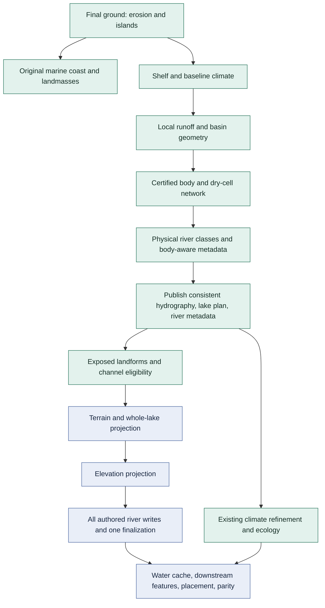

# Earthlike Basin Integration

Status: implemented and independently reviewed; the complete headless bank and
owner check/test/build/deploy graph pass. Production-native footprint/class
qualification passes; actual naval traversal remains open. This packet implements the selected direction in
[WORKSTREAM](WORKSTREAM.md), [basin design](basin-design.md), and
[the bounded open-network contract](basin-open-network.md). Native evidence
and unresolved qualification questions remain in [rivers](rivers.md).

## Outcome And Boundary

Swooper Earthlike explicitly selects `certified-sill-spill`: original ground,
baseline climate, connected full-sill bodies, conserved discharge, and authored
minor/main channels become one coherent physical result before exposed
landforms and Civ7 projection. Other shipped maps explicitly select the legacy
sink-budget path until separately qualified. Selection is authored data, never
a map-ID test, unsupported-result fallback, seed retry, or projection repair.

The operation replay covers 105 distinct forcing cases over 85 distinct
physical maps. The complete existing 96-scenario study bank admits 92 cases:
four of the five desert-mountains scenarios are refused, while all other 91
cases pass, including all 47 Earthlike scenarios. Two refusals are independently
confirmed non-open root budgets, not merely failure of a conservative child
certificate:

- Desert-mountains Huge seed 1538316523: root 9 is singleton cell 3791,
  with runoff about 40.545, precipitation 51 and demand about 155.0548;
  full-sill balance is about -104.0548 and the root has no incoming body.
- Desert-mountains Huge seed 1018: root 6 returns a shoreline-quantized closed
  response at level 46 below spill 49, retaining 35 wet cells and about
  1066.13 positive unresolved residual. Its full-sill balance is about
  -2409.36 and the root has no incoming body. This is not an exact zero-balance
  continuous shoreline claim.

Receipts: `/tmp/civ7-open-network-study-bank/index.json` and
`/tmp/civ7-open-network-study-bank/root-failure-discriminator.json`. These are
real reasons to retain an explicit legacy product path, not evidence that
closed water cannot exist. None of the cohorts establishes unrestricted seed
or advanced-configuration support. Preserve these receipts when evaluating
the activation gates below.

For the new path, a well-formed but unsupported case fails generation with its
typed witness before publishing water/network products or invoking native
projection. Malformed inputs remain errors. General closed, dry/subtile,
outlet-free, sibling-supported, and competing-branch coordination are not
implemented speculatively in this integration.

The physical and native claims are different:

- Physical truth includes exact strict wet footprints, preserved ground,
  nonascending adjacent dry receivers, mixed-body flux, and marine exits.
- Civ7 receives whole inland-water bodies and land-only river writes.
  Native lake elevation is not independently controlled physical water height.
  Physical freshwater bodies and native `isLake` classification are distinct;
  see the native water-category boundary below.
- Physical major class and intended native navigability are separate fields.
  The independently reviewed V6 probe qualifies navigable lake inlets within
  its tested geometry; the selected lowering is MINOR to MINOR and MAJOR to NAVIGABLE.
- Separate native inlet/outlet river IDs are acceptable. One native object or
  continuous navigation through a lake is not required or presently proven.

## Causal Decomposition



### One Water-Network Step

Replace Hydrography's `rivers` and `lakes` steps with one `network` step. It
declares the existing/new leaf operations and orchestrates them through its
typed `ops` bindings. It owns no alternative physical solver. No operation
calls another operation; the existing shared budget policy remains the one
budget law.

For the certified branch:

1. Compute local, rainfall-attributed runoff at Number precision.
2. Compute basin geometry from unchanged final ground and original marine mask.
3. Run `computeOpenBasinNetwork` with that exact geometry, runoff, baseline
   precipitation, and baseline potential demand. Refuse an unsupported result.
4. Classify final dry-cell discharge; derive body-aware river metadata.
5. Construct and cross-check all three physical products, then publish them.

The legacy branch performs its current routing, runoff accumulation,
classification, sink-budget lake planning, and metadata computation in the
same order and with the same selected settings, but publishes from the one
completed computation. Branch tests require the unselected operations never
to execute.

"Atomic" here means one successful step publishes one mutually consistent
generation of products. Core does not supply a new multi-artifact transaction:
do all support decisions and cross-product checks before the first publish;
an admission failure aborts the run and admits no downstream projection. Do
not claim rollback or add a transaction framework.

### Local Runoff

Add `hydrology/compute-local-runoff`, strategy `precipitation-attributed`, for
the new branch. Its law preserves Earthlike's current selected coefficients:

```text
R = P * (1 - infiltrationFraction)
      * (1 - humidityDampening * clamp(humidity / 255, 0, 1))
```

Return `number[]`, with marine entries zero and finite `0 <= R <= P`. Units
remain rainfall-index times unit tile area per representative interval. No
Float32 accumulation, hidden floor, display scale, storage conversion, or
additional source enters the budget. Earthlike currently has runoffScale 1
and minRunoff 0; the new public runoff selection has only the two attributed
fractions. Legacy retains its existing scale/floor semantics under its own
branch. Any later discharge display conversion is explicit and cannot feed
back into routing, body budgets, or conservation.

### Metadata Is Not A Second Router

Reuse `projectRiverNetwork` with final dry-cell discharge and receivers. Admit
Number-valued discharge without first truncating it to Float32; preserve the
legacy represented values and classification result by widening the existing
Float32 input with `Array.from` at the operation boundary. Legacy artifacts
remain Float32; the operation admits `number[]` for both callers.

Add the focused `classify-basin-river-network` operation for the materially
different body-aware input. It produces the existing river-metadata product,
not another receiver plan. Count contributing area once on the contracted
dry-cell/body DAG; count each wet member once as contributing area, never once
per inlet. Merge incoming stream-order evidence once at the body and expose
it to the outgoing dry reach. Fix this convention in fixtures rather than
letting the choice of internal wet BFS tree determine area or order.

Dry inlets have an accepted-lake endpoint and body identity, not an ocean
mouth. Outgoing dry reaches retain their downstream destination. Slopes on
dry edges use unchanged ground; physical water surfaces are explicit at body
boundaries. Wet BFS receivers are connectivity only: zero wet entries in
`dryDischarge` are sentinels, not a wet-cell allocation of body outflow.

## Authored Configuration

Keep the Standard recipe and existing Core machinery. No recipe-family
registry, conditional scheduler, or alternative operation dispatcher is needed.
Integration exposed a shared artifact-admission limitation; the independently
reviewed [tagged artifact admission prerequisite](tagged-artifact-admission.md)
adds only exact root object-variant support, not product policy or scheduling.

There is a genuine authoring limitation: `defineStep` binds every declared
operation envelope, and `createRecipe` executes every registered step. A
stage compiler cannot omit registered steps. Use the already admitted inline
stage `public` plus `compile` mechanism for this meaningful public shape:

```text
hydrology-hydrography = {
  knobs: { riverDensity: sparse | normal | dense },
  water: LegacyWater | CertifiedWater,
  projectRiverNetwork: the existing operation envelope
}

LegacyWater = {
  model: "legacy-sink-budget",
  lakeiness: few | normal | many,
  drainageRouting: the existing operation envelope,
  accumulateDischarge: the existing operation envelope,
  planLakes: the existing operation envelope,
  classifyRiverNetwork: the existing operation envelope
}

CertifiedWater = {
  model: "certified-sill-spill",
  computeLocalRunoff: the new attributed-runoff operation envelope,
  computeDrainageBasins: the existing geometry operation envelope,
  computeOpenBasinNetwork: the existing certified operation envelope,
  classifyBasinRiverNetwork: the new metadata operation envelope
}
```

Implement `public` as a closed `Type.Object` containing a discriminated
`Type.Union` at `water`, not as a top-level union. The illustration above is
the complete authored stage surface: declare `riverDensity` in `knobsSchema`
and omit the reserved `knobs` key from `public`; Core composes it into that
surface. Compose the actual operation configuration authorities rather than
copying their parameter schemas.
There is no `lakeiness`, seed budget, lake-count/area cap, or unused legacy
operation envelope in the certified public branch. The common river-density
knob still adjusts physical classification, not the existence of required
bodies or a hidden native subset.

The compiler narrows `water.model`, translates the selected public controls,
and emits one strongly typed internal `network` configuration with a literal
model discriminant. Static bound operations require internal envelopes for
both branches. Fill the inactive internal slots from their existing canonical
defaults; these are compiler plumbing, never public controls, executed work,
or fallback authority. Do not use unchecked casts to erase a bad branch or
copy inactive config into published evidence. Unit tests prove selected
envelope forwarding and zero calls to every inactive operation.

The map-rivers stage likewise uses a closed inline public object:

```text
map-rivers = {
  projection:
    { model: "legacy-procedural", navigableRiverDensity,
      endpointDischargePercentileMin, targetMajorTileFraction }
    | { model: "authored-network" }
}
```

Only the legacy branch exposes subset quotas. The new branch initially has no
native parameter knobs: use the qualified finalizer tuple once. Projection
dispatch follows the physical product's typed model tag, not map ID. Validate
the authored projection selection against that tag and reject a mismatch.
Add the same cross-stage pairing check to Standard map-config admission so a
known inconsistent envelope fails before running generation.

Migrate all eight complete shipped JSON configurations mechanically. Earthlike
selects certified water/authored projection; the other seven explicitly
select legacy water/projection. Preserve legacy numeric values and knob
effects. Reject old/unknown fields instead of silently accepting deprecated
controls. Update generated schema/default/DAG consumers through their existing
build owners, not hand-edited generated output.

## Shared Product Ownership

All water/network artifacts remain under
`domain/hydrology/modules/hydrography/artifacts/`; there is no recipe-owned
parallel basin plan or native-readback replacement for physical truth.

| Product | Contract change |
| --- | --- |
| `hydrography` | Typed physical model; exact certified runoff/dry discharge, final receiver graph, physical river classes, terminal identities. Preserve documented legacy fields only on the legacy branch, not fabricated conditioned values on the new one. |
| `lakePlan` | Existing wet-mask authority gains certified body IDs, physical surface, floor/sill/outlet/connectors, body ledger/outflow, certificates and conservation. Legacy payload remains explicitly legacy. Counts are diagnostics, not selection limits. |
| `riverNetwork` | Existing metadata authority gains coherent lake endpoints/body associations and the contracted-body area/order convention. No new routing authority. |
| `projectedLakes` | Accepted immutable footprint of complete bodies. Certified success requires exact planned/accepted equality; native numeric surface remains separate observation. |
| `projectedRivers` | Replace the quota-specific `projectedNavigableRivers` identity with a typed legacy/authored projection product. Common masks distinguish physical classes from intended native classes; authored entries retain every source, receiver, direction and native class. Legacy-only selection counters remain legacy-only. |

Keep `hydrography.basinId` as terminal-catchment identity. Derive it from final
terminal paths with deterministic IDs; neither depression `leafId` nor wet
`bodyId` is a substitute. Reuse owner-local schema atoms for genuine shared
body/flux structures without exporting a second artifact schema authority.

Consumers derive exposure from `topography.landMask` and `lakePlan.lakeMask`;
do not publish another competing water mask. Native observations remain local
step evidence and parity inputs, never mutations of the physical products.

The consumer split is explicit, not a blanket substitution of masks. Baseline
climate, ocean coupling and thermal forcing retain original marine geography.
In particular, thermal `landMask=0` selects sea-level/SST treatment and removes
the altitude lapse; an elevated freshwater lake must not acquire that meaning.
Terrestrial pedology, biome/vegetation selection and refined land-water-budget
eligibility instead use certified exposed land, with direct `lakePlan`
dependencies. Legacy consumers retain their prior inputs. A matched fixture
must exclude a newly wet cell from terrestrial soil/vegetation while retaining
its original altitude-sensitive thermal forcing. Lake-specific thermal
feedback and an iterative lake/atmosphere solve remain out of scope.

## Surface Landforms

Split the present `morphology-features` stage at the actual dependency:

- Keep islands and landmass decomposition in an early ground stage, before
  shelf, baseline climate, and water geometry. Original marine geography and
  continental identity are not recomputed from lake-fragmented land.
- Keep the existing `morphology-features` surface stage for mountains and
  volcanoes, now requiring the completed physical water/network products.
  Move the early steps into a narrowly named `morphology-islands` stage;
  relocate their step directories with that ownership change.
- Preserve the existing mountain/volcano seed labels, authored coefficients,
  tectonic fields, original elevation, and original marine coast distances.

Use two different concepts:

```text
exposedLand[cell] = originalLand[cell] && !physicalWet[cell]
blockingLandformEligible[cell] = exposedLand[cell]
                                && physicalRiverClass[cell] == NONE
```

Pass exposed land as the physical land substrate for dry surface selection.
Add an explicit candidate-eligibility mask to ridge/peak and volcano selection
so channels cannot become mountains or volcanoes. Apply that mask while
selecting candidates, not as a projection-time eraser or a carve into ground.
Keep hills eligible on dry channels: V5 retains them, and a hill is not a
mountain/volcano barrier. Hill/rough-land planners still see dry channel cells
as land for neighboring relief and denominators. A channel reservation is
not fake water, a coast, a change in sea level, or a new sediment model.

Apply this exposure/channel reservation only to the certified path during
the transition. Legacy selection retains its original land eligibility so
moving its stage does not silently change the other seven products. The
branch follows typed physical model evidence, never map ID.

## Projection Transaction

For certified bodies, remove the existing mountain/volcano clipping and
singleton-fragment pruning from the lake projection path. Preflight complete
bodies against reserved surface intent, stamp every admitted wet cell, and
require footprint/outlet integrity. A partial native rejection is a bounded
failure with body/cell evidence, not a newly authoritative smaller lake.
Legacy projection behavior remains explicit until its separate migration.

Keep the current projection order: morphology, lakes, elevation, rivers,
downstream features and placement. Derive every authored river write from the
final physical graph on classified dry source cells. This includes inlet
sources, dry sill connectors, outgoing dry channels and the final dry source
whose receiver is marine. Do not write inside wet bodies or omit an edge
because its ground would have been uphill under the old conditioned graph.

Use the existing admitted adapter capability surface. Preflight availability,
write each source once in a deterministic order, call
`finalizeRivers([false, 25, 2, 2])` once, then preserve qualified validation,
area calculation and water-cache ordering. No `modelRivers` or pre-stamped
navigable subset executes on this branch. Native exceptions propagate; there
is no retry or adapter-side rerouting.

V5 qualifies the real adapter for its flat/hill controls and establishes
mountain/volcano rejection. V3 establishes that an interior minor break can
demote an upstream navigable section. V4 establishes complete categorical
bodies with minor inlets and separately navigable marine-connected outlets.
These are not a universal terrain/direction or navigation-through-lake law.
Keep the source-to-receiver lowering proof separate from native class,
membership, adjacency and gameplay observations.

V6 passed the bounded lake-inlet class gate: all 34 dry-source writes retained
their intended classes, including eight navigable inlet cells, across seven
later native phases. See [the native river record](rivers.md). This selects
one-to-one physical/native class lowering, including lake inlets, but does not
prove through-lake movement or arbitrary geometry. Physical class, intended
native class, and observed class remain distinct; an observed demotion is a
mismatch, not permission to rewrite intent after the fact.

## Acceptance Contract

Approved explicit retirement, for the certified model only: the legacy
`lake-component-count <= 24` and `lake-share <= 0.08` assertions are proxy
budgets from a seed-selected lake model. They cannot remain authorities over
the new full-footprint physical model. Do not replace them with thresholds
fitted to the new observed counts. Retain both measurements as diagnostics.
Other legacy configurations retain their existing acceptance contract.

Replace those two proxies with direct certified invariants:

- Every node certificate and actual body ledger is admitted; no negative
  body outflow, invented supply, hidden loss, or duplicated catchment source.
- Global external export closes against dry runoff plus wet precipitation
  minus wet demand within the declared summation roundoff bound.
- Strict full footprints, recorded outlets, adjacent acyclic receivers,
  unchanged ordinary dry tributaries, and nonascending dry ground hold.
- Every planned body is wholly realized; every intended dry channel source
  receives exactly one authored write. Missing, extra and wrong-class native
  observations are measured separately, never waived by a percentage quota.
- No wet cell or authored dry channel source has blocking mountain/volcano
  intent; no ground/coast carving or compensating river suppression occurs.

Retain existing geography, placement/start legality and spacing, settlement,
coastal access, relief/range structure, ecology/floodplain and resource guards.
The separately reviewed [singleton study](basin-singletons.md) retires the
20% singleton-share quota for certified bodies only. All 76 examined singletons
are complete supported bodies, not projection fragments. Keep their count and
share as diagnostics, the legacy quota, and every direct physical/playability
guard. The study records real local walking barriers, including an enclosed
three-cell pocket; this is not a universal access or zero-fragmentation claim.
Do not assert zero land fragmentation, manufacture passes, or promise unchanged
mountain counts. Placement/playability evidence, not a lake count, judges the
consequences of coherent water and surface eligibility.

| Predeclared movement | Held inputs or guards |
| --- | --- |
| More complete water bodies; different lake counts/areas are expected. | Exact original elevation, marine land mask, sea level and coastline. |
| Final dry sill receivers change only along certified recorded connectors. | Every other dry local receiver; original basin geometry provenance. |
| Discharge and classifications change after wet demand and mixed-body routing. | Baseline precipitation/PET, their units, chosen runoff coefficients. |
| Mountain/volcano selection changes where physical water/channels reserve space. | Physical drivers, seed labels, relief law, no peak quota or ground carve. |
| Authored minor rivers replace procedural disagreement; native major intent becomes explicit. | All intended sources written, finalizer once, stable water cache/parity order. |
| Refined climate/features/placement may respond to the new river and wet evidence. | Their authored parameters and acceptance guards; no feedback into baseline basin forcing. |
| Other shipped maps remain legacy outputs. | Legacy config values, operation call order, eligibility and projection behavior. |

## Implementation Lanes

Paths in the first five lanes are relative to
`plugins/mod/map/swooper-physics/src/`. These are bounded owner changes, not
new frameworks or an invitation to refactor unrelated stage infrastructure.

1. **Physical leaves and schemas.** Hydrography
   `ops/compute-local-runoff`, `ops/classify-basin-river-network`,
   `ops/project-river-network`, module `contract.ts`/`router.ts`, and
   `artifacts/{hydrography,lake-plan,river-network}.artifact.ts` plus their
   direct catalog/shared model atoms. Preserve the reviewed geometry,
   single-pool law and certified network algorithm.
2. **Orchestration and authored API.**
   `recipes/standard/stages/hydrology/hydrography/index.ts`, replace
   `steps/{rivers,lakes}` with `steps/network/{config,step,viz}.ts`, update
   `contract-manifest.ts` and `recipe.ts`. Migrate `maps/configs/*.config.json`
   and `maps/configs/standard-admission.ts`; generated recipe schemas/types
   continue through `recipes/standard/artifacts.ts` and their existing owner.
3. **Surface dependency.** Morphology `features` and new `islands` stage
   composition, their mountain/volcano step contracts and implementations,
   `domain/morphology/modules/landforms/ops/{plan-ridges,plan-volcanoes}`
   candidate admission, and existing foothill/rough-land exposed-substrate
   inputs. Apply the explicit original-marine/thermal versus exposed-terrestrial
   consumer split above to refinement, pedology and biomes, without a climate
   rewrite or lake-specific thermal feedback.
4. **Projection and consumers.** Hydrology `projection/steps/lakes`,
   `rivers/index.ts`, `rivers/steps/plot-rivers`, owner-local graph-to-hex
   lowering policy, `projected-lakes.artifact.ts`, new
   `projected-rivers.artifact.ts` and direct catalog. Migrate
   `metrics/capture.ts`, `parity/{replay,hydrology}.ts`, ecology
   `features/steps/score-layers`, placement `steps/plan-resource-demands`, and
   final-surface parity consumers. Elevation projection records physical/native
   water distinction without carving or claiming numeric water-level parity.
5. **Product proof.** Existing `metrics/families`, `metrics/targets`, and
   `metrics/studies` own the measurements, model-scoped assertions and cohorts.
   Extend the current bank rather than adding another runner or report system.
   Retire old Earthlike-only lake/quota-policy tests only when replacement
   assertions cover the new behavior; retain legacy tests for legacy branches.
6. **Realization proof.** The app at `apps/mods/map/swooper-physics` owns V6,
   generated-file proof, deployment and correlated native runs. Adapter contract
   readers may need the narrow removal of the misleading readback-derived
   `minorRiverStampingSupported` flag, coordinated with its existing portable
   owner and mock tests. No new controller/service capability, raw caller-side
   planner, or Habitat bypass is part of this work.

Lanes 1 and the fixture qualification can proceed independently after their
own approval. Landform/projection implementation consumes the agreed artifact
contracts. Activate Earthlike only as the complete lane 1-5 story plus the
bounded native proof, not as a disconnected helper or a partially native map.

## Verification Gates

1. **Configuration and boundaries:** public-branch admission rejects inactive
   controls and wrong projection pairing; compile forwards only selected
   authorship; inactive operation spies remain unused. All eight config assets
   remain valid. Manifest/DAG tests prove ground before water and water before
   surface landforms. Run existing owner type/policy checks plus the narrow
   Core admission prerequisite's complete checks, without weakening Habitat rules.
2. **Physical semantics:** test attributed double-precision runoff, unsupported
   refusal before publication, preserved ground, consistent three-product
   publication, final terminal IDs, strict sill ties and quotient accounting.
   A multi-inlet body fixture must produce the same area/order and flux after
   changing only its wet connectivity tree. A lake inlet must not become an
   ocean mouth. A newly wet elevated tile loses terrestrial soil/vegetation
   eligibility without acquiring marine sea-level thermal forcing. Retain all
   reviewed pure-operation fixtures.
3. **Surface/projection semantics:** fixture a wet body and dry channel crossing
   candidate mountain/volcano sites, with hills retained and physical land
   masks unchanged on the dry channel. Replace certified clipping expectations
   in `lakes.store-water-data.test.ts`; extend
   `plot-rivers.post-refresh.test.ts` for complete source coverage, no
   `modelRivers`, exact adapter intents, one finalization, and cache ordering.
   Cover all hex directions/parities, wrap seams, confluences, sill connectors,
   lake boundaries and the final dry-to-marine edge in lowering tests.
4. **Bank:** run current integrity, river-network, geography, relief, floodplain,
   ecology and placement studies. Add certified basin measurements to those
   owners. Include Earthlike Standard 1/42/1018, Huge 1018 and its previously
   discriminating dry/cold forcing, supported Tiny cases, and unchanged-seed
   support cohorts. Preserve failing seeds and unsupported witnesses. Check
   legacy map outputs against pre-migration evidence.
5. **Native:** independently qualify V6, then run correlated installed-digest
   Earthlike generation and final readback. Compare complete lake footprints,
   intended/observed classes, missing/extra sources where readable, stable
   maintenance, and existing bounded freshwater/navigation gameplay facts.
   Unknown exact directed edges remain unresolved; mock success is not native
   hydrodynamic or navigation proof.

## Review Decisions

The selected architecture is Earthlike-first, explicit dual product selection,
one network step, shared physical artifacts, and post-water surface selection.
The internal inactive-envelope distinction above is intentional and bounded by
the static authoring API; it does not authorize unused public controls.

The root has approved the model-scoped retirement of the three proxy lake
budgets under the user's delegated authority. The quantified full-footprint
cases and physical intent justify that decision; no replacement fitted caps
or relaxation of physical/playability guards is approved. Independent
architecture review accepted the design after the explicit thermal/terrestrial
mask split and Core-owned knobs clarification. V6's native inlet-class gate
has passed; complete Earthlike generation passes headless and the bounded
production-native category qualification recorded below. Actual naval
traversal remains separate and open. If a real
Earthlike unsupported witness appears, preserve it and decide whether to
narrow the advertised support domain or implement that demonstrated
coordinator case. Do not preemptively build the general simulator or relabel
failure as success.

The first integrated bank also exposed measurement-population mismatches,
not physical failures. Certified wet-body connectivity carries no independent
river mouth: mouth coverage now explicitly counts exposed dry sources while
catchment coverage still counts all original land. Planned landform shares
use the same exposed-land population as their allocator; geological and
legacy populations are unchanged. Huge 1018 foothills are 317/2517 (12.594%),
and Huge 7777 are 207/2484 (8.333%), both passing unchanged thresholds.

## Native Water-Category Boundary

The first normal Huge/1018 run stopped on an over-strong native classification
assertion, not a rejected physical footprint. A diagnostic replay emitted one
complete 13-part `CERTIFIED_LAKE_PROJECTION_V1` series (digest `4f9900d2`): all
203 planned cells are accepted COAST/water with zero terrain mismatch. Of
these, 155 are native `isLake`; the other 48 belong to three isolated native
water areas of 15, 16 and 17 cells, each wholly within planned bodies. All
observed areas of 1..10 cells are native lakes, including two ten-cell controls.
Huge's metadata has `LakeSizeCutoff=10`; this is evidence consistent with a
size-dependent category, not a recovered general native implementation.

The independently reviewed correction preserves physical bodies and Civ7's
database. Certified acceptance requires exact water and COAST terrain, not
that every physical body acquire native lake identity. `projectedLakes` stays
an immutable accepted physical footprint; it gains no native-class snapshot.
Stamp/final receipts expose native classifications independently, and local
before/after observations qualify numeric leveling. A physical mask alone
grants no numeric mismatch exemption. Native freshwater,
feature legality and navigation remain actual-game observations, not claims
inferred from the physical mask. Start planning's physical-lake adjacency
score is modeled opportunity, not proof of a native freshwater bonus.

Diagnostic receipts: `/tmp/civ7-certified-native-rejected-scripting.log`,
`/tmp/civ7-certified-lake-diagnostic-scripting.log` and
`/tmp/civ7-certified-lake-diagnostic-live.log`. This amendment does not by
itself qualify the final map, native heights, freshwater or river classes.

The subsequent numeric discriminator found that `setElevation` levels all
203 accepted inland-water cells, not only the 155 native-classified lakes.
The 15-, 16- and 17-cell bodies read uniformly at 530, 230 and 110 respectively;
all 55 physical bodies have one observed numeric level. These are native
representation observations, not physical spill-height equality or a recovered
leveling formula. All ordinary land and ocean writes remain exact; the only
adjustment outside the accepted footprint is the already-qualified native lake
at original-water cell 976.

A temporary immediate-post-setter read was compared with the existing
post-cliff/area read across all 6,996 cells: zero differences. The complete
setter receipt has digest `d08abada`; the post-write receipt is `664329d0`.
This attributes the observed adjustment to the setter without claiming absence
of unobserved intermediate changes. The temporary probe is removed after this
qualification; durable post-write/final numeric receipts remain.

The numeric contract therefore distinguishes accepted native-lake adjustments,
accepted inland-COAST adjustments, and other mismatches. Accepted adjustments
require complete finite readback and locally unchanged water, COAST terrain
and native category. Ordinary land/original ocean retain exact admission;
the separate original-water native-lake exception still requires stable native
lake evidence. Body-level uniformity remains diagnostic rather than a new
unsupported engine constraint. Receipt:
`/tmp/civ7-inland-water-setter-diagnostic-decoded.json`, with the corresponding
`-scripting.log` and `-live.log` files. At that point a complete normal run and
final river/water readback were still required; the qualified normal result
is recorded at the end of the cliff-order discriminator below.

## Native Cliff-Order Discriminator

The first completed normal map retains all 656 intended river source positions
with zero missing or extra sources, but 11 intended navigable cells become
minor. These form three complete dry reaches of four, five and two cells ending
at original marine water. Their physical receivers are nonascending; there is
no downstream physical MINOR interruption or blocking mountain/volcano. A
six-phase diagnostic locates these demotions and the first 48 inland COAST
height adjustments at `finalizeRivers`. Terrain validation then changes 31 of
those water heights again; coast restoration, area calculation and cache
refresh make no further change. The source classes remain stable after
finalization.
This is a failed class-parity gate, not full integration acceptance.

Those mouths have the three largest native drops (428, 548 and 388), but a
bare drop threshold contradicts V6's retained 750-to-zero navigable control.
V5/V6 did not generate cliffs; the production map does so before river
finalization. Shipped Earth also generates cliffs first, so changing that
order is a new experiment, not asserted official precedent.

The predeclared ordering discriminator, before changing physical classification:
on the certified path only, generate cliffs after authored finalization and
terrain/coast restoration, then refresh areas and water data. Hold all physical
fields, numeric elevation intent, every source/class write and the once-only
finalizer tuple exact. Observe complete source classes and numeric changes
before and after late cliff generation and through final placement. Success
must retain the authored classes and water footprint without a second river
finalization, setter repair, invented navigability threshold, or ground carve.
If the demotions persist, reject cliff order as their explanation.

Receipts: `/tmp/civ7-certified-final-native-{decoded,surface}.json`,
`/tmp/civ7-certified-river-phases.json`,
`/tmp/civ7-certified-river-demotion-diagnosis.json`, and
`/tmp/civ7-certified-river-mouth-discriminator.json`.

The ordering discriminator retains all intended classes through all seven
observed phases: 362 MINOR and 294 NAV. Complete rows, not just counts, match.
Cliffs remain present, including at the three formerly demoted mouths; the
late call does not further change measured heights. No second finalization,
numeric correction, height cutoff, class rewrite or terrain carve was added.
This establishes a class-preserving ordering, not a navigation repair.

The final normal Huge/1018 run completed at `2026-09-28T12:19:36.832Z`, with
generated/deployed script SHA-256
`56b0a9a7cb9b84528a21fb4efec846fb0ff8870be73ab0150ac416601b7a137e`.
All 656 intended sources retain their classes, with zero missing/extra cells
or NAV-terrain mismatches. All 203 planned wet cells remain water/COAST; 155
are native lakes and 48 are the separately qualified inland-COAST category.
The public 6,996-cell readback has stable map/turn identity. Temporary phase
instrumentation is absent from the normal generated script's run.

Immediate numeric admission has zero other-land/original-ocean mismatches,
plus 155 accepted lake, 48 accepted inland-COAST and one original-water native
lake adjustment. Final observation adds two dry differences, cells 2603 and
2709, both on native Redwood Forest. This identifies the affected feature,
not the exact later mutating call. Placement is not represented as perfect:
206/216 resource placements, 4/7 wonders and 1,366/1,367 ordinary feature
placements are accepted; rejected intents remain reported without retries
or substituted success. Receipts:
`/tmp/civ7-certified-release-native-{live.log,decoded.json,surface.json}`.

[Native navigation qualification](native-navigation.md) remains explicitly
open. The Galley entry test also fails on cold official Earth and procedural
Continents controls. That failed oracle cannot justify changing our physical
model or claiming a generator-specific bug. Physical/native-category
integration can be committed and reviewed separately, while no general
naval traversal, exact directed-edge or through-lake gameplay claim follows.
