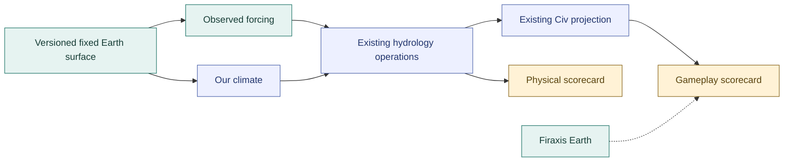

# Earth Calibration Benchmark

Status: source census complete; benchmark design proposed, not implemented.
Prepared 2026-09-29 by root.
Continues [coherence completion](coherence-completion.md). The user proposes a
fixed Earth baseline to separate downstream climate/drainage quality from
generated continent and relief variability.

## Investigation Frame

**Decision:** select a durable benchmark that can calibrate physical behavior
and Civ7 navigable-river projection without confusing the two. First establish
an actual same-resolution comparison with Firaxis Huge Earth; then identify a
lawful fixed-geography entry point and the additional inputs it requires.

**In scope:** shipped Earth map data and declarations; present Earthlike
configuration; navigable coverage and scale; climate/drainage assumptions;
existing study, metric, artifact and domain-operation owners; a sequenced
implementation and verification plan. The current native water-height repair
remains a distinct unfinished production change.

**Outside this slice:** new production tuning, importing global datasets in
bulk, replacing the physics engine, assuming native height units are metres,
or claiming ship passage from source declarations or screenshots.

**Questions:** How far does our authored NAV coverage differ from Firaxis at
equal grid size and after land/water normalization? What does fixed geography
constrain, and what forcing or material fields must still be supplied? Which
existing contracts support a fixed-Earth study without hidden synthetic inputs?
Which comparisons would expose overfitting rather than reward it?

**Evidence policy:** current source and structured map/database data establish
authored inputs; existing coherent native observations establish realized
outputs; these are not interchangeable. Primary scientific data and methods
qualify real-Earth claims. Firaxis is a gameplay reference, not an empirical
hydrological truth set. Counts require explicit units, masks and denominators;
NAV declarations, NAV tiles, connected components and navigable rivers are
different quantities. Unknowns remain visible.

**Execution:** bounded parallel source census, architecture trace and primary
science review, followed by root synthesis and independent review. Stop once
the comparison and an implementable owner/contract plan discriminate the
alternatives. Reframe if the shipped map lacks physical inputs needed to claim
an empirical Earth calibration. Do not invent those inputs merely to make a
fixture execute.

**Deliverable:** numerical comparison with reproducible retained evidence,
clear implemented-versus-open accounting, and benchmark tiers with required
inputs, expected outcomes, holdout checks and dependency order. Review this
design before any new benchmark architecture or default tuning is enabled.

## Implemented Versus Open

Implemented and locally qualified in this isolated Graphite stack, not merged
to main: numeric elevation, climate-band corrections, relief-supported
landforms, certified static basin drainage and lake budgets, dry minor/NAV
authorship, and the [wet outlet repair](wet-river-continuity.md).

Still open: the general [native water-height repair](water-height-maintenance.md),
climate-fed [network/terrain evolution](basin-evolution-design.md), density
calibration, and era-qualified ship traversal. The Earth fixture and benchmark
below are not implemented. This investigation changes no runtime defaults and
does not claim a fresh live-game acceptance run.

The cutoff20 diagnostic already repairs the tested large-lake shorelines
without expanding water or changing physical drainage. The open question is
general production coverage, not a demonstrated flaw in that treatment.
Qualify a bounded map-scoped classification policy before adding a new height
reapplication pass; failure of an unlimited cutoff does not reject this simpler
option. The normal restored map still uses cutoff10.

## Shipped Earth Census

Both maps have 106 x 66 = 6,996 cells. The primary comparison is unique authored
dry river sources, not call counts, named rivers or native river objects.
Exposed land includes mountains and dry navigable terrain; it excludes marine
water and inland wet footprints. Water is not used as the denominator for
drainage density, but is reported to make the land-area difference visible.

| Metric | Firaxis Huge Earth | Swooper Huge/1018 |
| --- | ---: | ---: |
| Exposed land | 3,158 | 2,517 |
| Water cells | 3,838 | 4,479 |
| Dry NAV source cells | 191 | 294 |
| Dry MINOR source cells | 201 | 362 |
| Dry NAV / exposed land | 6.05% | 11.68% |
| Dry NAV / all map cells | 2.73% | 4.20% |
| All dry river sources / exposed land | 12.41% | 26.06% |
| NAV share of dry river sources | 48.72% | 44.82% |
| Dry NAV connected components | 26 | 66 |
| Median dry NAV cells per component | 7 | 4 |

Swooper has **1.54 times the NAV tiles, 1.93 times the land-normalized NAV
density, and 2.10 times the overall dry-river density** in this comparison.
The problem is not an unusually high NAV share alone. More numerous, shorter
dry navigable stretches also distinguish the maps. These are measurements of
one reference seed, not a population estimate for every Earthlike generation.

Components follow authored downstream edges between dry NAV sources only.
They exclude wet connectors and minor reaches, so a legitimate lake splits
this particular statistic. Both induced graphs are acyclic and unbranched.
Neither component counts nor their sizes prove full-river fragmentation or
ship reachability. Record full wet-connected paths separately in the benchmark.

Firaxis supplies 3 wet NAV and 1 wet MINOR declaration, versus Swooper's 37
wet NAV outlet declarations; those are not extra dry channel tiles. Earth has
34 enclosed coast-only components totaling 71 cells. They are not proven
native lakes without live readback. Swooper's 203 authored inland wet cells
include 48 native non-lake cells in three bodies of 15, 16 and 17 cells, the
already-diagnosed height-maintenance case. Original model-water contributes
another 4,276 cells; it is not identical to the native non-lake-water mask.

**Evidence:** Earth is its shipped SQLite substrate plus AST-extracted
`paintEarthHugeRivers` declarations before finalization. Swooper declarations
match the retained atlas, with completed native class parity for every cell.
No completed-native Earth parity is asserted. Both paths use the finalization
tuple `(false, 25, 2, 2)`. Source snapshot:
`89cee44d5ae7192f126e8ae09484c04400df9146`.

The retained reproducible census is under
`~/Library/Application Support/Civ7Tools/VisualAtlas/huge-1018/earth-calibration/`:
`river-census.mjs` and `river-census.json`. The JSON records input hashes,
identity checks, masks, exact counts and coordinates. Run the script with Node
and this worktree as its optional first argument; it reads shipped data and
retained receipts only. Syntax checking, all assertions and repeat execution
pass. It is an investigation artifact, not a second durable benchmark runner.
The current canonical config was separately admitted and deep-compared with
the retained atlas envelope: exact equality, envelope digest
`ba0fcb703331b0f2b985800cfc8fcf63b9e2fee2e90eb0390a337ad82282cbb8`,
recipe digest
`053248f720f0aae4c2b1c73f141a58ceb9b442858ff8566a03e9c62234480b92`.
This connects the census to current configuration, not to a fresh current-code
generation. Both digests also match V9's retained inputs.

## Current Earthlike Is Not An Earth Calibration

Authority is the authored
[`swooper-earthlike.config.json`](../../../plugins/mod/map/swooper-physics/src/maps/configs/swooper-earthlike.config.json)
plus normalization, not the preset name or unnormalized fields.

| Control | Current effective meaning |
| --- | --- |
| Latitude and water | +80/-80 latitude; 63% target water, not an empirical Earth-area contract |
| Thermal setting | `hot`: baseline thermal 8/50 becomes 10.5/60 after offsets |
| Seasonality | `high` plus authored tilt 23 gives **28.44 degrees**, not 23 |
| Terrain evolution | `young`, one era, low erosion; no geological-time calibration |
| Runoff | Rainfall index with scalar infiltration .18 and humidity damping .22 |
| Visible classes | Minor percentile .74, major .88, absolute discharge floors zero |

The tilt is `23 + (23.44 - 18)`. See the
[normalizer](../../../plugins/mod/map/swooper-physics/src/recipes/standard/stages/hydrology/climate/baseline/steps/climate-baseline/step.ts)
and [knob policy](../../../plugins/mod/map/swooper-physics/src/recipes/standard/stages/hydrology/climate/model/policy/climate-knob-policy.ts).
This is a concrete reason to inspect effective compiled inputs before calling
the scenario Earth-calibrated, not evidence that tilt alone caused the network.

Physical elevation is quantized normalized relief, not metres; native display
height is yet another scale. Runoff is rainfall-index flux over unit tile area,
not cubic metres per second. Potential demand is an empirical index, not
calibrated lake evaporation. Certified runoff does not presently consume
spatial permeability. A fixture cannot silently supply raw metres, mm/year or
geology and assume existing computations acquire those meanings.

The [river classifier](../../../plugins/mod/map/swooper-physics/src/domain/hydrology/modules/hydrography/ops/project-river-network/strategies/discharge-percentiles/index.ts)
ranks all positive-discharge exposed-land cells. Each qualifying major endpoint
promotes its strongest connected upstream minor path, including cells below
the major threshold. Thus .88 is not a 12% navigable quota. The classifier has
no minimum trunk length or map-size normalization; authored projection maps
every class-2 source to NAV without an additional permanence/gradient gate.
The earlier .88-to-.96 trial reduced 294 NAV cells to 129 while holding physical
drainage unchanged. That establishes classification sensitivity, not the right
Earth calibration or a physical repair.

## What Fixed Earth Can Establish

**Recommendation:** establish two reference scorecards, not one fitted target:
empirical Earth processes and Firaxis's playable Earth representation. Firaxis
can anchor visible river coverage, corridor structure and native joins. Its
stylized heights and coastlines are not a physical digital elevation model.
Running our downstream pipeline on them is a useful game-scale diagnostic, but
cannot by itself validate the physical model.

Finished morphology constrains drainage but does not uniquely specify climate,
water availability or every channel. Our code is repeatable for fixed inputs
and seed; incomplete inputs are a different problem from nondeterministic
execution. Fixed geography can coexist with different external climate forcing
and ocean states, as illustrated by [NASA's CERESMIP experiments](https://data.giss.nasa.gov/CERESMIP/).
Declare a climatological epoch, seasonal forcing and simplified ocean/atmosphere
assumptions; building a general circulation model is not required.

At coarse resolution, a DEM can erase outlets and represent water surfaces
instead of beds. [MERIT Hydro's method](https://agupubs.onlinelibrary.wiley.com/doi/10.1029/2019WR024873)
explicitly distinguishes terrain conditioning and actual inland basins. Record
any conditioning and missing lake-bed information. If known channels are used
to condition the input, matching those channels is a reconstruction check,
not independent evidence that our solver predicted them. A withheld catchment
is independent for topology scoring only if its known channel information is
also withheld during input conditioning, not merely during parameter fitting.
Otherwise label topology agreement as reconstruction and reserve independent
validation for outcomes not embedded in those inputs.

There is no universal observed count of "navigable rivers." Vessel, season,
depth, current and barriers matter; [USACE's navigation guidance](https://www.publications.usace.army.mil/Portals/76/Publications/EngineerRegulations/ER_1110-2-1458.pdf)
illustrates those distinctions without supplying a historical Civ threshold.
[HydroRIVERS](https://www.hydrosheds.org/products/hydrorivers) itself defines
thresholded reaches, not unique rivers or navigation eligibility. Use area,
length, basin hierarchy, relative discharge and connected usable corridors,
with an explicit game-era navigation claim, rather than a global river count.

## Benchmark Design

The two forcing arms are separate executions with identical physical inputs,
not two writers for one climate artifact. Keep erosion/evolution off in the
fixed-surface baseline. Add it later as a separately measured treatment.

1. **Admit a versioned surface fixture.** Pin ground elevation, marine mask,
   sea datum, bathymetry, shelf/coastal evidence, geographic coordinates and
   substrate assumptions. Record source revision, latitude coverage, seam,
   row orientation, hex resampling, area weights, units, quantization and
   conditioning. Keep potential inland lake cells on original land so the
   solver, not a supplied wet mask, determines their inundation. Declare
   uncertainty or exclude lake-bed-dependent scoring when beds are unavailable.
2. **Isolate hydrology with reference forcing.** Independently normalized
   reference precipitation, humidity and demand feed existing runoff and basin
   operations. A companion reference-local-runoff case isolates routing and
   storage from the runoff conversion. Pin the index conversion; never tune
   reference conversion and model response simultaneously to erase an error.
3. **Run our climate on the same surface.** Compare regional and seasonal
   temperature, precipitation and aridity before measuring their downstream
   effects on lake budgets, mouths, catchments and discharge hierarchy. Add
   biomes with explicit substrate/pedology inputs, not guessed soil state.
4. **Qualify game projection separately.** Use common-resolution Firaxis and
   empirical-network summaries as different references. Measure exposed-land
   NAV coverage, connected trunk size, wet-connected paths, slope/barriers,
   outlet continuity and realized native classes. Ship passage still requires
   a working era-appropriate stock control and then the same Swooper test.
5. **Freeze calibration and challenge it.** Hold out entire catchments and
   climate regimes, then run diverse procedural identities, map resolutions
   and seeds. Include wet tropical, monsoon, arid, mountain and snowmelt cases;
   unsupported processes are explicit limitations, not silently passing tests.

**Area and units decision:** land the first fixture with explicitly ordinal,
game-cell checks; do not call those results empirical discharge calibration.
Then admit consistent geographic cell area and time conversion at the existing
hydrology operation owners before quantitative Earth water-budget acceptance.
This must cover local runoff, direct lake precipitation, evaporation/demand
and storage volume wherever compared, not just river accumulation. The current
unit-tile-area contract makes post-hoc area weighting insufficient. E2 must
either complete that unit contract and its conservation tests or explicitly
remain an index-valued diagnostic, never pass a volumetric Earth target.
Reference slopes and lengths likewise use the declared geographic grid, not
native display heights or an invented constant km-per-game-tile scale.

Reference candidates are [ERA5 climatology](https://www.ecmwf.int/en/forecasts/dataset/ecmwf-reanalysis-v5)
for atmosphere and [HydroATLAS](https://data.hydrosheds.org/file/technical-documentation/HydroATLAS_TechDoc_v10_1.pdf)
for catchments, gradients, modeled discharge and natural-vegetation attributes.
These are observation-constrained or modeled references, not perfect truth.
Dataset selection, common epoch/coverage and the explicit unit transform are
the first implementation decisions; do not download an unbounded corpus first.
Native Earth heights may support a separate ordinal game fixture, never an
undocumented inverse conversion to metres.

## Owners And Sequencing

The scientific boundary is immediately before Standard's climate baseline,
which consumes final topography and shelf. It is **not currently a public
terrain-array input**: initial setup admits seeds, dimensions, latitude and
game context; metric capture runs the complete Standard recipe. A complete map
also needs substrate, routing/coastline, belts, plates and landmass identity for
pedology, mountains, volcanoes and resources. Do not fabricate those downstream
dependencies or mutate already-published artifacts to make a fixture run.

Initial scientific fixtures can use existing operation contracts and admitted
test-artifact utilities. That proves bounded climate/hydrology behavior, not a
complete generated map. Persistent fixture selection must subsequently be
admitted at existing producer owners within the same Standard manifest. Review
the exact source variant and complete artifact contracts before implementing
that cross-owner extension. No second recipe, private trace injection, fake
engine observation or engine replacement is proposed.

| Slice | Existing owner | Completion criterion |
| --- | --- | --- |
| E0: census and design | This packet and existing coherence workstream | Reproducible same-stage counts; reviewed inputs/claims; no tuning |
| E1: effective Earth inputs | Authored config, normalization tests, domain fixture contracts | Compiled values and unit mappings explicit; deterministic surface and valid topology |
| E2: independent forcing and units | Hydrology/climate domain operations and focused composition tests | Consistent area/time/flux contract and conservation before empirical budget scoring; reference forcing isolates the water model |
| E3: coupled benchmark | Standard producers, scenario/capture/sample and study bank | Same fixture through predicted climate and hydrology; complete downstream dependencies before full-map claims |
| E4: projection calibration | River classification policy, Civ realization and existing native proof | Physical network held for class-only changes; stock and custom native controls pass |
| E5: robustness | Existing study families and independent review | Held-out basins, climates, resolutions and generated worlds; accepted gallery refresh |

E1-E3 may be prepared alongside C2's independent native height repair. The
fixed-surface arms should precede default C3 evolution tuning and C4 density
calibration: otherwise changing topography, rainfall and NAV thresholds together
would conceal the causal error. C3's existing design remains relevant, but is
an evolution treatment, not a prerequisite for importing a frozen reference.
Close the known height-lifecycle fault before claiming end-to-end native quality.
One existing worktree/linear Graphite stack remains the delivery path; create
only meaningful, nonempty implementation branches as each slice is ready.

Numerics remain in domain operations; steps compose and publish. Reuse the
[canonical benchmark architecture](../../system/libs/mapgen/benchmarks/BENCHMARKS.md):
recipe-owned scenarios/capture/sample, pure metric facts, separate target
policies, and executable `.study.ts` protocols with adjacent explanations.
Import/conversion code is a bounded fixture-building concern, not a second
hydrology or study engine. Extend the existing glossary for new measured terms.

## Acceptance And Decision Rules

- Freeze input identities, reference coverage, effective configs and scoring
  populations before tuning; missing evidence must not count as a pass.
- Separate empirical tolerances from game-density preferences and hard
  invariants. Set numerical tolerances from coarse-grid uncertainty and an
  untuned baseline, not after inspecting the preferred candidate.
- Preserve mass accounting, receiver adjacency, legitimate closed basins,
  marine footprint, and exact deterministic repeatability. Quantify resampling
  error before blaming domain computations for lost sub-grid channels.
- Prefer direct causal comparisons: reference runoff versus modeled runoff,
  reference climate versus predicted climate, then physical truth versus
  native realization. Do not fit multiple compensating controls at once.
- Require no physical-field change when only game channel classes change.
  Conversely, elevation, incision or climate changes must be assessed across
  physical and downstream gameplay outcomes, not NAV count alone.
- Report unsupported snowmelt, low-flow or geological mechanisms as gaps when
  the discriminating case exposes them. Add a model only when the missing
  process materially explains the mismatch; avoid a complete Earth simulator.
- A versioned benchmark family is the durable asset. Matching one screenshot,
  one river count or one golden field hash is not proof of general robustness.

This packet recommends the next testable path. It does not claim that our
pipeline has already regenerated Earth, that fewer rivers are always better,
or that completing this benchmark makes the engine permanently correct.

Independent review accepted the owner/sequence and identified two material
clarifications, both incorporated: conditioning-information exclusion for
independent topology holdouts, and computational area/flux admission rather
than post-hoc score weighting. Documentation links, census assertions and
current-config identity checks pass; no runtime behavior changed in this slice.
