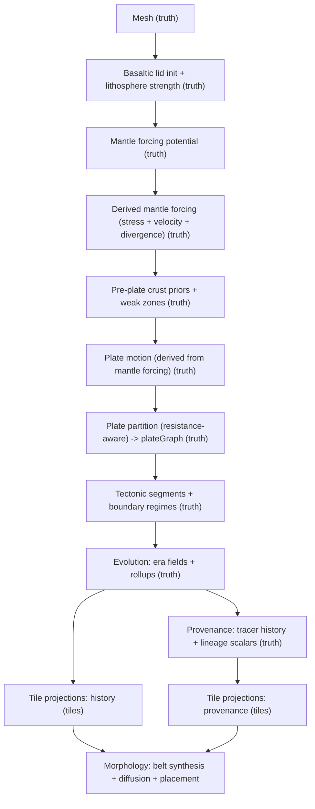

# SPEC: Foundation Evolutionary Physics (Maximal)

Status: Draft (2026-02-03)

This document is the **canonical target architecture** for the next Foundation iteration: a basaltic-lid, mantle-forced, evolutionary tectonics engine that produces planet-like tectonics with deterministic, bounded computation and **mandatory** downstream-consumable outputs.

This SPEC is intentionally **not** constrained by current Foundation contract shapes. We will **break and migrate** contracts as needed to preserve realism and downstream quality.

## Goals

- Start from a **global basaltic lid** (oceanic crust everywhere at t=0).
- Make **mantle forcing first-class** (truth artifact), and derive tectonic regimes/kinematics from it.
- Run an **evolution loop** with explicit eras and iteration budgets.
- Produce mandatory outputs for:
  - **Downstream consumers** (Morphology-first): continuous belt fields, era-aware drivers.
  - **Provenance** (Lagrangian): material lineage/history, not “optional.”
- Be deterministic and bounded (fixed budgets with explicit invariants).

## Non-Goals

- Full PDE mantle convection simulation.
- “Fast mode” or “budget mode” variants. (Single maximal strategy only.)

## Canonical Decision Set (This SPEC)

Supersedes earlier “compromise” decisions:
- D02 forcing (baseline) → **D02r mantle forcing as potential + derived stress/velocity**
- D04 evolution semantics (baseline) → **D04r dual outputs: Eulerian eras + Lagrangian provenance**
- D06 events + forces (baseline) → **D06r event mechanics + mandatory force emission**
- D07 morphology consumption (baseline) → **D07r mandatory era + provenance consumption**

Decision packets (normative):
- `docs/projects/pipeline-realism/resources/decisions/d01-ordering-crust-vs-plates.md`
- `docs/projects/pipeline-realism/resources/decisions/d02r-mantle-forcing-potential-derived.md`
- `docs/projects/pipeline-realism/resources/decisions/d04r-history-dual-eulerian-plus-lagrangian.md`
- `docs/projects/pipeline-realism/resources/decisions/d06r-event-mechanics-and-force-emission.md`
- `docs/projects/pipeline-realism/resources/decisions/d07r-morphology-consumption-contract.md`

## High-Level Architecture

## Truth Artifacts (Mesh Space)

### Mantle Forcing (D02r)

Mandatory:
- `artifact:foundation.mantlePotential`
- `artifact:foundation.mantleForcing` (derived truth)

Normative details:
- `docs/projects/pipeline-realism/resources/spec/sections/mantle-forcing.md`

### Evolution Outputs (D04r)

Mandatory:
- `artifact:foundation.tectonicHistory`
- `artifact:foundation.tectonicProvenance`

Fixed budgets (normative defaults):
- `ERA_COUNT_TARGET = 5`, `ERA_COUNT_MAX = 8`
- `ADVECTION_STEPS_PER_ERA = 6`

Normative details:
- `docs/projects/pipeline-realism/resources/spec/sections/history-and-provenance.md`

### Events And Forces (D06r)

Normative details:
- `docs/projects/pipeline-realism/resources/spec/sections/events-and-forces.md`

### Plates, Segments, Crust

This SPEC assumes we continue to produce (or replace with superior equivalents) the existing core truth products:
- mesh geometry (`artifact:foundation.mesh`)
- crust state (`artifact:foundation.crust`) with a physically meaningful strength field
- plate partition/kinematics (`artifact:foundation.plateGraph`)
- boundary segments (`artifact:foundation.tectonicSegments`)

Note: D01 ordering remains crust-first for partitioning, but crust priors must be mantle-coupled (no pre-authored “continents by fiat”).

## Projection Artifacts (Tile Space)

Morphology is tile-first today; this SPEC makes tile projections first-class **where they are the domain boundary**.

Mandatory new projections (D07r):
- `artifact:foundation.tectonicHistoryTiles`
- `artifact:foundation.tectonicProvenanceTiles`

Existing projections retained or replaced:
- `artifact:foundation.plates`
- `artifact:foundation.crustTiles`

Normative details:
- `docs/projects/pipeline-realism/resources/spec/sections/morphology-contract.md`

## Algorithms (Overview)

### Basaltic Lid + Lithosphere Strength

1. Initialize oceanic lid everywhere (type=oceanic, age=0).
2. Derive initial lithosphere strength field that will be coupled against mantle stress.
3. Apply deterministic differentiation rules (craton seeds/rift weakening) derived from mantle forcing, not random seeds.

This step is the foundation for D01 (crust-first resistance partition).

### Mantle Forcing Potential (D02r)

Canonical mechanism:
- deterministic, low-order radial basis potential sources (plumes/downwellings)
- derived stress proxy and forcing velocity from gradients/curvature

See: `docs/projects/pipeline-realism/resources/spec/sections/mantle-forcing.md`

### Plate Partition + Boundary Segments

1. Build resistance field from lithosphere/crust strength, rifts, and differentiation structure.
2. Partition plates using resistance-aware growth (Dijkstra-like).
3. Derive boundary segments and classify boundary regimes from relative motions + coupling fields.

### Dual History Outputs (D04r)

Per era:
- compute era fields (boundary regimes + force potentials)
- reduce rollups
- update tracer history + provenance scalars (mandatory)

See: `docs/projects/pipeline-realism/resources/spec/sections/history-and-provenance.md`

### Morphology Consumption (D07r)

Morphology must:
- consume era fields + provenance tiles
- construct continuous belts (segment-derived corridors)
- apply age/recency-driven diffusion to produce non-wall orogeny

See: `docs/projects/pipeline-realism/resources/spec/sections/morphology-contract.md`

## Determinism + Validation (Non-Render Invariants)

Minimum invariants are mandatory and must be validated in pipeline steps (pre-render).

From mantle forcing:
- determinism (bitwise stable given seed/config)
- coherence/spectral constraints (no microstructure-first)
- magnitude bounds
- coverage bounds (no degenerate upwelling/downwelling occupancy)

From evolution:
- `eraCount` invariants and cross-artifact agreement (`tectonicHistory.eraCount === tectonicProvenance.eraCount`)
- tracer history consistency (tracer indices always in `[0..cellCount-1]`)
- boundary regime sanity checks (non-empty belts, no flicker regressions)

From morphology:
- belt continuity (component length distributions)
- explainable outcome correlations (uplift signals correlate with elevation; volcanism with volcano density)

## Performance Budget (Fixed)

This SPEC is maximal but bounded. Budgets are fixed for determinism and testability.

| Budget | Value | Notes |
| --- | --- | --- |
| `eraCount` target | 5 | must be >= target |
| `eraCount` max | 8 | hard max |
| tracer advection steps / era | 6 | fixed |
| mantle smoothing steps | 1–2 | fixed count (no convergence loops) |

## Migration / Cutover Notes (Non-Normative)

This SPEC is target state. Migration slices will define how to land it (prepare → cutover → cleanup), and may require temporary bridges, but bridges must have explicit deletion targets.

