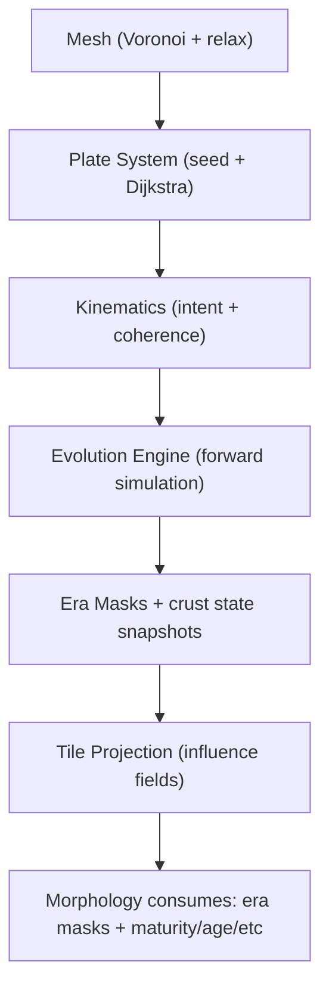
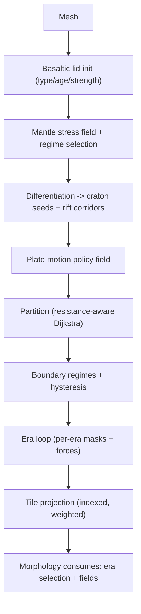

# Draft: Proposal Comparison + Decision Backlog (Foundation Evolutionary Refactor)

Date: 2026-02-03

This document is a **comparison scaffold** for synthesizing two target-model proposals into one canonical architecture for the next Foundation iteration.

Non-goals:
- This is not yet the “pure SPEC” target architecture doc.
- This does not attempt to “improve current Foundation as-is” except to harvest durable concepts (validation/observability/guardrails) that remain valuable under the new engine.

## Goal (Target Behavior)

Design a Foundation refactor that:
- starts from a **global basaltic lid** (oceanic crust everywhere at t=0)
- uses a bounded-cost but physically defensible **evolutionary tectonics model** (history/iterations are first-class)
- exposes **planet-like plate tectonics** (rift/subduction/transform/collision as emergent or systematically derived)
- produces **era-resolved outputs** that downstream stages (primarily Morphology) can consume deterministically

## Inputs (Source Packets)

Proposal C (end-to-end, “unified” narrative):
- `docs/projects/pipeline-realism/resources/packets/foundation-proposals/unified-foundation-refactor.md`
- `docs/projects/pipeline-realism/resources/packets/foundation-proposals/tectonic-evolution-engine.md`
- `docs/projects/pipeline-realism/resources/packets/foundation-proposals/first-principles-crustal-evolution.md`

Proposal D (subsystem specs + “authoritative” proposal):
- `docs/projects/pipeline-realism/resources/packets/foundation-refactor-proposal-packet/raw/docs/system/libs/mapgen/foundation-refactor-proposal.md`
- `docs/projects/pipeline-realism/resources/packets/foundation-refactor-proposal-packet/raw/docs/system/libs/mapgen/_archive/foundation-first-principles-lid-to-continents-spec.md`
- `docs/projects/pipeline-realism/resources/packets/foundation-refactor-proposal-packet/raw/docs/system/libs/mapgen/_archive/foundation-plate-motion-and-partition-spec.md`
- `docs/projects/pipeline-realism/resources/packets/foundation-refactor-proposal-packet/raw/docs/system/libs/mapgen/_archive/foundation-tectonic-evolution-spec.md`

Non-target “hardening” (to harvest guardrails/observability concepts, not as the target):
- `docs/projects/pipeline-realism/resources/packets/m11-foundation-realism-spike/README.md`

Current contract baseline (for later cutover planning):
- `docs/system/libs/mapgen/reference/domains/FOUNDATION.md`

## Proposal Pipelines (At-a-Glance)

Proposal C (unified):

Proposal D (authoritative + specs):

## Comparison Axes (How We’ll Reconcile)

Axes are grouped to match dependency order: spine first, then boundaries/validation, then domain semantics.

Spine:
- orchestration order (what is “primitive” vs “derived”)
- canonical artifacts and their contracts (mesh-space truth vs tile-space projections)

Boundaries:
- validation/observability (what we can assert without rendering)
- determinism + performance envelope (cost bounds)

Domain:
- mantle/lid forcing model
- plate partitioning + kinematics
- boundary interaction model
- crust evolution (continental emergence)
- era/history semantics
- downstream consumption (Morphology contract)

## Side-by-Side Matrix (C vs D)

| Axis | Proposal C (foundation-proposals) | Proposal D (proposal-packet) | Notes / Why It Matters |
|---|---|---|---|
| Planet “story” | Strong narrative (Wilson cycle, “continents manufactured”). | Strong narrative (“basaltic lid” + stress/strength regime selection). | Both align on the core premise. Divergence is in how “physics” enters the algorithms. |
| Kinematics | “Intent-driven” motion with `globalIntent` + `coherence` mixing random vs intent. | Policy-driven **vector field** (div/curl balance) + bounded variance. | D’s policy field is closer to “physical forcing”, but C’s intent surface is a powerful authoring handle. |
| When crust exists | Starts with uniform basalt; crust evolution largely in the sim loop (maturity/thickness/age). | Starts with basaltic lid then creates crust strength/age/type via craton/rift assembly before partition. | Ordering changes what partition can “see” (uniform vs resistance-aware). |
| Plate partitioning | Dijkstra growth; explicitly says resistance is uniform at partition time. | Dijkstra growth over resistance field (age/type + rift weakening) to avoid cratons + follow weak zones. | This is a first-order divergence: do we let crust drive plates, or plates drive crust? |
| Mantle forcing | Optional thermal/mantle state; kinematic intent can stand in for forcing. | Explicit mantle stress field; regime selection (stagnant/episodic/mobile) influences everything. | Decides whether “mantle” is a first-class computed field. |
| Boundary interactions | Rich event taxonomy (subduction/rift/transform/collision), forward simulation; material tracking language appears in the engine docs. | Boundary labeling via normal/tangent decomposition + hysteresis; per-era masks + force fields; optional bounded advection (not full reconstruction). | Divergence: full Lagrangian material tracking vs bounded fields + optional tracer context. |
| History outputs | Era masks and crust snapshots are first-class. | Era-resolved masks and force fields are first-class; explicit “history profile”. | Both converge on “history as output”, but differ in how much history is “simulation” vs “signals”. |
| Morphology contract | Big “what changes for Morphology” section; new signals + adaptation guide. | Morphology explicitly chooses eras (`tectonicEraMode`, weights). | Both require Morphology changes; D is more explicit about “era selection” as an API. |
| Config / authoring | Unified schema + knob mapping; includes plate count scaling, coherence, etc. | “Profiles” (resolution/continent/motion/history) -> derived constants. | Decide whether config surface is “profiles-first”, “knobs-first”, or hybrid (profiles with escape hatches). |
| Migration posture | Includes phased strategy chapters. | Includes implementation sequence and file tree; reads like a refactor map. | Later we should split migration slices out of the canonical spec. |

## Key Divergences (What We Must Resolve)

1. “Plates first” vs “crust first”
- C: partition plates, then simulate crust evolution and tectonics.
- D: compute crust strength/age/rifts first, then partition plates using a resistance field.

2. Forcing model: author intent vs mantle stress field
- C: kinematic intent can drive realistic patterns, mantle/thermal is optional.
- D: mantle stress and regime selection are first-class and upstream.

3. Evolution model: full material tracking vs bounded history signals
- C: forward simulation with event types, evolving crustal state; tends toward material-tracking semantics.
- D: era fields + optional bounded advection; avoids full plate reconstruction as a requirement.

4. Config surface: schema/knobs vs authoring profiles
- C: full schema, knob mapping, scaling rules.
- D: profiles with derived internal constants.

## Decision Backlog (To Synthesize Into One Canonical Architecture)

Each item below should become a standalone decision packet under `docs/projects/pipeline-realism/resources/decisions/`.

## Decision Status (Draft)

Draft defaults chosen (via decision packets on the synthesis branch):
- D01: crust-first resistance partition. See `docs/projects/pipeline-realism/resources/decisions/d01-ordering-crust-vs-plates.md`.
- D02: mantle-lite proxy forcing + intent/kinematics. See `docs/projects/pipeline-realism/resources/decisions/d02-forcing-mantle-minimum.md`.
- D04: Eulerian era fields + optional bounded tracer history. See `docs/projects/pipeline-realism/resources/decisions/d04-evolution-semantics-history-model.md`.

Synthesis note:
- `docs/projects/pipeline-realism/resources/spec/synthesis-d01-d02-d04.md`

Remaining decisions (ordered by dependency, after D01/D02/D04):
- D03: Define the plate motion representation. Options: plate velocities sampled from a global vector field (D-like), intent vectors + coherence mixing (C-like), vector field + intent constraints (intent shapes the field). Impacts: global patterns (assembly/breakup), boundary curvature, reproducibility.
- D05: Define crust state variables and their meaning. Options: maturity/thickness/age (C), type/age/strength (D), both but with one canonical (maturity derives type/strength). Impacts: partition resistance, morphology signals, backwards compatibility.
- D06: Define subduction + collision handling (what is destroyed vs accreted). Options: event-driven rules (C), boundary regime fields + downstream force diffusion (D), hybrid (events emit force fields). Impacts: mountain belts, arc volcanism, continent growth, morphology coupling.
- D07: Define “history as output” API for downstream stages (esp. Morphology). Options: fixed stack of era masks (C-like), explicit era selection (D-like), aggregated effective tectonics field + optional per-era debug. Impacts: API surface, tuning UX, reproducibility, visualization.
- D09: Define validation + observability minimum (pre-render correctness). Options: adopt M11-style metrics/diagnostics as required outputs, minimal invariants only, staged observability (debug-only first). Impacts: regression safety, tuning loop quality, developer velocity.
- D08: Define the configuration surface (what users author). Options: profiles-first with escape hatch knobs (D + C), knobs-first with presets (C), scenario templates as primary surface (D optional scenario mode). Impacts: usability, backwards compatibility, long-term maintenance.

## Candidate “Hardening” Concepts to Harvest (M11 Spike)

These are candidates to explicitly pull into the new engine if they remain valuable and are not already superseded by better canonical docs/implementation.

- Validation/observability: define measurable invariants for plate partitions, boundary regimes, belt continuity, crust/age distributions.
- Failure-mode framing: enumerate “ways this looks fake” and map each to a detectable signal.
- Segment/belt abstraction: model boundaries as segments/belts (not just per-cell noise) to avoid “wall mountains”.
- Deterministic micro-structure policy: bounded noise only after macro drivers are established.

Verification needed:
- Which of these are already implemented in current Foundation steps.
- Which are already better specified in `docs/system/libs/mapgen/reference/domains/FOUNDATION.md` or adjacent canonical docs.

## Next Step (After You Review This Draft)

1. Write decision packets for D01–D09 under `docs/projects/pipeline-realism/resources/decisions/`.
2. Once decisions are accepted, write a **pure SPEC** target architecture doc (separate from migration):
   - Proposed path: `docs/projects/pipeline-realism/resources/spec/foundation-evolutionary-physics-SPEC.md`
3. Then write migration slices (prepare -> cutover -> cleanup) and a milestones/issues plan.
