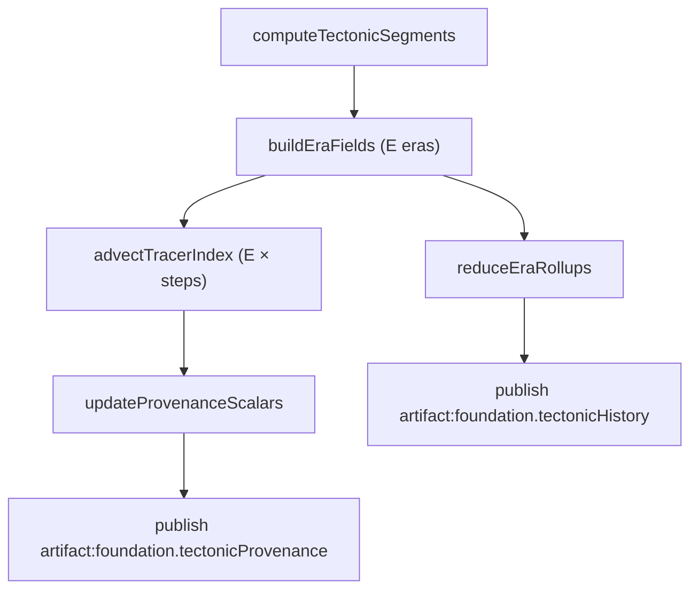

# History And Provenance (D04r Dual Output)

## Target Contract Summary

D04r defines a **dual-output history model** for Foundation evolution:
- **Eulerian era fields**: per-era boundary regimes and force potentials.
- **Lagrangian provenance**: per-cell tracer history across eras plus provenance scalars.

Both outputs are **mandatory truth artifacts** and share the same `eraCount`, mesh topology, and indexing.

## Truth Artifacts (Names + Schemas)

### `artifact:foundation.tectonicHistory` (truth; mesh space)

Required fields (per era, oldest → newest):
- `boundaryType: Uint8Array` (BOUNDARY_TYPE)
- `convergentMask: Uint8Array` (0/1)
- `divergentMask: Uint8Array` (0/1)
- `transformMask: Uint8Array` (0/1)
- `upliftPotential: Uint8Array` (0..255)
- `riftPotential: Uint8Array` (0..255)
- `shearStress: Uint8Array` (0..255)
- `volcanism: Uint8Array` (0..255)
- `fracture: Uint8Array` (0..255)

Rollups (per cell):
- `upliftTotal: Uint8Array`
- `fractureTotal: Uint8Array`
- `volcanismTotal: Uint8Array`
- `upliftRecentFraction: Uint8Array`
- `lastActiveEra: Uint8Array` (0..`eraCount-1`, 255 = never)

Header:
- `eraCount: number`
- `cellCount: number`

### `artifact:foundation.tectonicProvenance` (truth; mesh space)

Canonical representation: **per-cell tracer index history across eras + per-cell provenance scalars**.

Per-era tracer history (length = `eraCount`):
- `tracerIndex[era]: Uint32Array` (length = `cellCount`)
  - `tracerIndex[0][i] = i`
  - For `era > 0`, `tracerIndex[era][i]` is the **source cell index** from era `era-1` that advected into cell `i`.

Provenance scalars (per cell, final state at newest era):
- `originEra: Uint8Array` (era index of first appearance)
- `originPlateId: Int16Array`
- `lastBoundaryEra: Uint8Array` (255 = none)
- `lastBoundaryType: Uint8Array` (BOUNDARY_TYPE, 255 = none)
- `lastBoundaryPolarity: Int8Array` (-1, 0, +1)
- `lastBoundaryIntensity: Uint8Array` (0..255)
- `crustAge: Uint8Array` (normalized 0..255 across `eraCount`)

Header:
- `eraCount: number`
- `cellCount: number`

## Hard Compute Bounds

Fixed bounds are mandatory to keep evolution deterministic and predictable.

- `ERA_COUNT_TARGET = 5`
- `ERA_COUNT_MAX = 8`
- `ADVECTION_STEPS_PER_ERA = 6`

Rationale:
- `ERA_COUNT_TARGET = 5` provides enough temporal depth to differentiate early vs recent boundary regimes without exceeding memory budgets.
- `ERA_COUNT_MAX = 8` aligns with the existing schema upper bound and allows controlled higher-fidelity presets.
- `ADVECTION_STEPS_PER_ERA = 6` bounds per-era drift to a fixed cost while preserving visible transport structure.

## New Invariant (Replaces `eraCount === 3` Guard)

Validation must enforce:
- `eraCount === historyProfile.eraCount`
- `eraCount >= ERA_COUNT_TARGET`
- `eraCount <= ERA_COUNT_MAX`
- `tectonicHistory.eraCount === tectonicProvenance.eraCount`

This replaces `eraCount === 3` in `mods/mod-swooper-maps/src/recipes/standard/stages/foundation/steps/validation.ts`.

## Memory Surfaces (Arrays × Sizes)

Let `C = cellCount`, `E = eraCount`.

| Surface | Arrays | Type | Size | Big-O |
| --- | --- | --- | --- | --- |
| Era fields | 9 per era | u8 | `9 × E × C` bytes | `O(E × C)` |
| Era masks | 3 per era | u8 | `3 × E × C` bytes | `O(E × C)` |
| Rollups | 5 total | u8 | `5 × C` bytes | `O(C)` |
| Tracer history | 1 per era | u32 | `4 × E × C` bytes | `O(E × C)` |
| Provenance scalars | 7 total | u8/i8/i16 | `~10 × C` bytes | `O(C)` |

Notes:
- The memory profile is dominated by `O(E × C)` surfaces (era fields + tracer history).
- All arrays are flat typed arrays in mesh order.

## Algorithm (Pseudo-code)

```text
function computeHistoryAndProvenance(mesh, segments, historyProfile):
  E = historyProfile.eraCount
  require ERA_COUNT_TARGET <= E <= ERA_COUNT_MAX
  require historyProfile.advectionSteps == ADVECTION_STEPS_PER_ERA

  eras = buildEraFields(mesh, segments, E)
  rollups = reduceEraRollups(eras)

  tracerIndex = array(E)
  provenance = initProvenance(mesh.cellCount)

  tracerIndex[0] = identityIndex(mesh.cellCount)
  seedProvenance(provenance, eras[0])

  for era in 1..E-1:
    tracerIndex[era] = advectTracerIndex(
      tracerIndex[era-1],
      eras[era-1].boundaryType,
      segments.driftU,
      segments.driftV,
      ADVECTION_STEPS_PER_ERA
    )
    updateProvenance(provenance, eras[era], tracerIndex[era])

  return {
    tectonicHistory: { eraCount: E, cellCount, eras, rollups },
    tectonicProvenance: { eraCount: E, cellCount, tracerIndex, provenance }
  }
```

## Flow (Mermaid)



## Downstream Consumption (Morphology First)

Morphology must consume **both** outputs:
- **Eulerian era fields**: select or blend eras to derive boundary regime intensity and stress-driven shaping.
- **Lagrangian provenance**: adjust uplift persistence, erosion resistance, and volcanic recurrence based on `originEra`, `lastBoundaryEra`, and `crustAge`.

This keeps existing boundary-driven shaping intact while enabling lineage-driven realism.

## Mapping To Current Contract / Code

Current anchors (from `docs/system/libs/mapgen/reference/domains/FOUNDATION.md`):
- `mods/mod-swooper-maps/src/domain/foundation/ops/compute-tectonic-history/contract.ts` (extend schema to include provenance artifact)
- `mods/mod-swooper-maps/src/domain/foundation/ops/compute-tectonic-history/index.ts` (produce era fields + rollups; add provenance output)
- `mods/mod-swooper-maps/src/recipes/standard/stages/foundation/steps/validation.ts` (replace `eraCount === 3` with new invariant)
- `mods/mod-swooper-maps/src/recipes/standard/stages/foundation/steps/tectonics.ts` (publish dual artifacts)

No current artifact is removed. `artifact:foundation.tectonicHistory` remains canonical for era fields, while `artifact:foundation.tectonicProvenance` becomes the required Lagrangian output.
