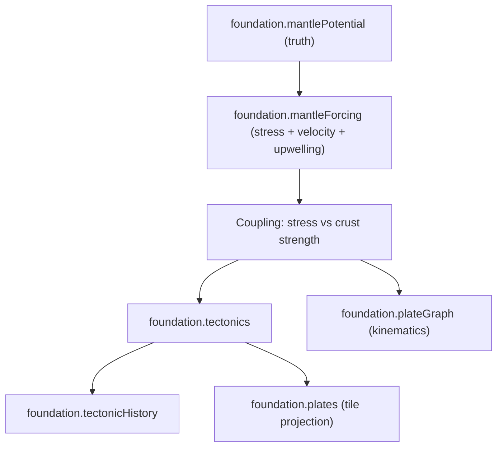

# Mantle Forcing (Potential + Derived Stress/Velocity)

Mantle forcing is a **first-class mesh-space truth substrate**. It is mandatory, deterministic, and low-order (cell/plume/downwelling structure). All tectonic regimes and plate kinematics are derived from this substrate, not from filtered noise or author intent.

## Artifact Surface (Truth, Mesh Space)

### `artifact:foundation.mantlePotential`

Canonical forcing potential field for mantle convection.

Schema (mesh space):
- `cellCount` (u32)
- `potential` (Float32Array, length = `cellCount`) in normalized range `[-1, 1]`
- `sourceCount` (u16)
- `sourceType` (Int8Array, length = `sourceCount`; `+1` upwelling, `-1` downwelling)
- `sourceCell` (Uint32Array, length = `sourceCount`)
- `sourceAmplitude` (Float32Array, length = `sourceCount`, signed)
- `sourceRadius` (Float32Array, length = `sourceCount`, in mesh-distance units)

### `artifact:foundation.mantleForcing` (derived truth)

Deterministic derivations from `mantlePotential`. These are truth artifacts, not projections.

Schema (mesh space):
- `cellCount` (u32)
- `stress` (Float32Array, length = `cellCount`) normalized `[0, 1]`
- `forcingU` (Float32Array, length = `cellCount`) mesh-space X component
- `forcingV` (Float32Array, length = `cellCount`) mesh-space Y component
- `forcingMag` (Float32Array, length = `cellCount`) normalized `[0, 1]`
- `upwellingClass` (Int8Array, length = `cellCount`; `+1` upwelling, `-1` downwelling, `0` neutral)
- `divergence` (Float32Array, length = `cellCount`) signed, normalized `[-1, 1]`

## Deterministic Generation Method (No Filtered Noise)

1. **Seed low-order sources** on the mesh using deterministic Poisson-disk sampling over the neighbor graph.
2. **Assign source types** with fixed counts: `plumeCount` (upwelling) and `downwellingCount` (downwelling).
3. **Compute potential** as the sum of radial basis kernels for each source:
- `phi(cell) = sum_i amplitude_i * exp(-(dist(cell, source_i) / radius_i)^2)`
4. **Normalize potential** to `[-1, 1]` while preserving sign and relative amplitude.
5. **Diffusion pass**: apply a fixed-count, deterministic Laplacian smoothing (1–2 iterations) to enforce long-wavelength coherence without introducing randomness.

This creates a low-order mantle field with explicit plumes/downwellings and stable, deterministic structure.

## Derived Fields (Mandatory)

### Stress Proxy

Compute per-cell stress from the potential gradient magnitude and curvature:
- `grad(phi)` from mesh neighbor finite differences.
- `stress = clamp01((|grad(phi)| + curvatureWeight * |laplacian(phi)|) / stressNorm)`.

### Forcing Velocity Field

Compute a deterministic forcing velocity field from the potential:
- Base flow: `v = -velocityScale * grad(phi)` (flow from high to low potential).
- Rotational component for shear realism: `v += rotationScale * rot90(grad(phi))` (set `rotationScale = 0` to disable).
- Normalize to `forcingMag` in `[0, 1]` and store `forcingU/V` in mesh space.

### Upwelling/Downwelling Classification

- `upwellingClass = +1` where `phi` is a local maximum above `upwellingThreshold`.
- `upwellingClass = -1` where `phi` is a local minimum below `-downwellingThreshold`.
- Otherwise `0`.

## Coupling Rules (Mantle Forcing + Lithosphere Strength)

Coupling uses `foundation.crust.strength` as lithosphere resistance.

- **Rifts/Fractures**:
- If `stress > strength` and `divergence > riftDivergenceThreshold`, mark rift-preferred zones and raise `riftPotential` + `fracture`.
- **Subduction-Preferred Zones**:
- If `stress > strength` and `divergence < -subductionConvergenceThreshold`, mark subduction-preferred zones (favoring oceanic or weaker crust) and raise `upliftPotential` + `volcanism`.
- **Hotspots/Plumes**:
- If `upwellingClass = +1` and `stress > plumeStressThreshold`, mark plume-driven hotspots and raise `volcanism` even away from plate boundaries.
- **Stable Regime**:
- If `stress <= strength`, treat cell as stable (no rift/subduction preference; low fracture/shear).

These coupling rules are the sole source for regime drivers used by `foundation.tectonics` and `foundation.tectonicHistory`.

## Required Non-Render Invariants

- **Determinism**: Given identical seed + config, `mantlePotential` and derived fields are bitwise stable. All tie-breakers are deterministic.
- **Spectral/Coherence**: At least 80% of potential energy is in low-order modes (k <= 4 equivalent), or mean correlation length >= `coherenceRadius`.
- **Magnitude/Energy Bounds**:
- `potential` in `[-1, 1]`, `stress` in `[0, 1]`, `forcingMag` in `[0, 1]`.
- Mean `forcingMag` within `[meanVelocityMin, meanVelocityMax]`.
- **Regime Coverage**:
- Upwelling and downwelling each occupy at least `minUpwellingFraction` and `minDownwellingFraction` of mesh cells.
- No single class exceeds `maxClassFraction`.

## Parameter Table (Config Surface)

| Parameter | Type | Default | Range | Notes |
| --- | --- | --- | --- | --- |
| `mantle.plumeCount` | u16 | 6 | 2–16 | Upwelling source count |
| `mantle.downwellingCount` | u16 | 6 | 2–16 | Downwelling source count |
| `mantle.plumeRadius` | f32 | 0.18 | 0.08–0.35 | Radius in mesh-distance units |
| `mantle.downwellingRadius` | f32 | 0.18 | 0.08–0.35 | Radius in mesh-distance units |
| `mantle.plumeAmplitude` | f32 | 1.0 | 0.4–2.0 | Signed amplitude (positive) |
| `mantle.downwellingAmplitude` | f32 | -1.0 | -2.0–-0.4 | Signed amplitude (negative) |
| `mantle.velocityScale` | f32 | 1.0 | 0.2–2.5 | Scales forcing velocity |
| `mantle.rotationScale` | f32 | 0.2 | 0.0–1.0 | Adds shear-like rotation |
| `mantle.stressNorm` | f32 | 1.0 | 0.5–2.0 | Normalization for stress |
| `mantle.coherenceRadius` | f32 | 0.25 | 0.15–0.6 | Minimum correlation length |
| `mantle.upwellingThreshold` | f32 | 0.35 | 0.2–0.6 | Local max threshold |
| `mantle.downwellingThreshold` | f32 | 0.35 | 0.2–0.6 | Local min threshold |
| `mantle.meanVelocityMin` | f32 | 0.25 | 0.1–0.6 | Invariant guardrail |
| `mantle.meanVelocityMax` | f32 | 0.65 | 0.4–0.9 | Invariant guardrail |
| `mantle.minUpwellingFraction` | f32 | 0.08 | 0.03–0.2 | Regime coverage |
| `mantle.minDownwellingFraction` | f32 | 0.08 | 0.03–0.2 | Regime coverage |
| `mantle.maxClassFraction` | f32 | 0.7 | 0.5–0.85 | Regime coverage |

## Contract Mapping (Current Foundation Artifacts)

- `foundation.crust.strength` provides lithosphere resistance used in coupling rules.
- `foundation.plateGraph.plates[].velocity` is derived from `mantleForcing.forcingU/V` (aggregate per plate).
- `foundation.tectonics` fields are derived from mantle forcing + strength:
- `upliftPotential` from convergence + downwelling adjacency
- `riftPotential` from divergence + stress
- `shearStress` from velocity gradient magnitude
- `volcanism` from upwelling maxima and subduction-preferred zones
- `fracture` from shear + stress exceedance
- `foundation.tectonicHistory` accumulates the same drivers per era (no mantle optionality).
- `foundation.plates` (tile projection) samples the mantle-derived tectonic fields via `tileToCellIndex`.

Pointer: `docs/system/libs/mapgen/reference/domains/FOUNDATION.md` (Artifacts; projection posture; current tectonics fields).

## Flow (Mantle Forcing to Tectonics)

