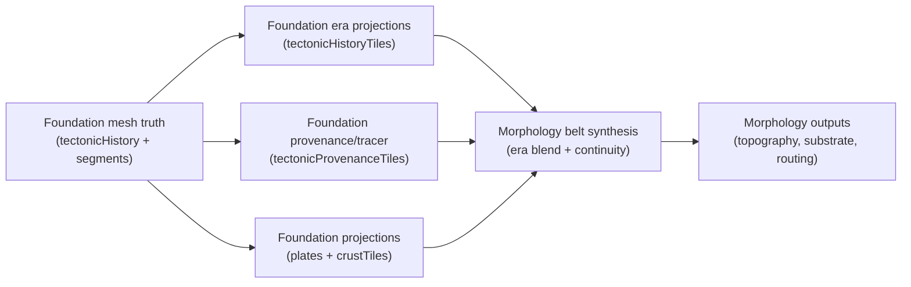

# Morphology Consumption Contract (Era + Provenance)

## Purpose

Define the **maximal Morphology-first** contract for consuming Foundation era fields and provenance/tracer-derived signals so Morphology produces continuous, age-aware belts and avoids wall-mountains.

## Contract (Required Inputs)

Morphology remains **tile-first**. Foundation must publish tile projections for era fields and provenance/tracer signals alongside existing projections.

**Required Foundation artifacts (tile space)**
- `artifact:foundation.plates` (existing)
- `artifact:foundation.crustTiles` (existing)
- `artifact:foundation.tectonicHistoryTiles` (new; era fields + rollups, tile-projected)
- `artifact:foundation.tectonicProvenanceTiles` (new; bounded tracer/provenance fields, tile-projected)
- `artifact:foundation.tectonicSegments` (mesh truth; consumed only for belt continuity seeding and projected to tiles inside Foundation)

**Contract table (tile-space projections)**

| Field | Type | Meaning |
| --- | --- | --- |
| `eraBoundaryType[e]` | `u8[]` per tile | Boundary regime per era (`0 none, 1 conv, 2 div, 3 trans`). |
| `eraUpliftPotential[e]` | `u8[]` per tile | Era-specific orogeny drive (0..255). |
| `eraRiftPotential[e]` | `u8[]` per tile | Era-specific rift drive (0..255). |
| `eraShearStress[e]` | `u8[]` per tile | Era-specific transform drive (0..255). |
| `eraVolcanism[e]` | `u8[]` per tile | Era-specific volcanism drive (0..255). |
| `eraFracture[e]` | `u8[]` per tile | Era-specific fracture drive (0..255). |
| `upliftTotal` | `u8[]` per tile | Rollup (sum/normalized) of all eras’ uplift. |
| `upliftRecentFraction` | `u8[]` per tile | Fraction of uplift from the newest active era (0..255). |
| `lastActiveEra` | `u8[]` per tile | Era index of most recent activity; 255 = never. |
| `originEra` | `u8[]` per tile | Tracer-derived origin era for the dominant material parcel. |
| `originPlateId` | `i16[]` per tile | Tracer-derived origin plate id for dominant material parcel. |
| `driftDistance` | `u8[]` per tile | Tracer-derived drift distance bucket (0..255) since origin era. |
| `lastBoundaryEra` | `u8[]` per tile | Most recent boundary event era (convergence/divergence/transform). |
| `lastBoundaryType` | `u8[]` per tile | Boundary regime associated with `lastBoundaryEra`. |

## Era Combination Policy (Deterministic, No Knobs)

Let `N = eraCount`, `age(e) = (N - 1 - e)` where `e = N-1` is newest. All weights are deterministic constants.

1. Base weight per era: `w_base(e) = exp(-0.7 * age(e))`.
2. Boost the most recent activity: if `e == lastActiveEra`, `w_base(e) *= 1.25`, otherwise `w_base(e) *= 0.85`.
3. Normalize: `w(e) = w_base(e) / sum(w_base)`.
4. Blended drivers: `upliftBlend = sum(w(e) * eraUpliftPotential[e])`; `riftBlend = sum(w(e) * eraRiftPotential[e])`; `shearBlend = sum(w(e) * eraShearStress[e])`; `volcanismBlend = sum(w(e) * eraVolcanism[e])`; `fractureBlend = sum(w(e) * eraFracture[e])`.
5. Blended boundary regime: choose era `e*` with max `w(e) * max(eraUpliftPotential[e], eraRiftPotential[e], eraShearStress[e])`; tie-breaker favors newer eras. `boundaryTypeBlend = eraBoundaryType[e*]`.

## Wall-Mountain Avoidance (Belts, Age, Diffusion)

### Belt continuity rules

- Belts are **segment-derived corridors**, not boundary lines. Seed belts from `foundation.tectonicSegments` and project to tiles before Morphology.
- Merge adjacent segments when they share `(plateA, plateB, regime)` and are within **2 tiles** of each other; fill gaps of **<= 2 tiles** by shortest-path stitching in tile space.
- Belts must be at least **6 tiles** long unless the originating segment is shorter; otherwise the belt is discarded.

### Belt age/recency usage

- **Age index** uses `lastActiveEra` and `originEra`. If `lastActiveEra != 255`, age = `N - 1 - lastActiveEra`; otherwise age = `N - 1 - originEra`.
- **Width scaling** uses `upliftRecentFraction`: `widthScale = 1.2 - 0.6 * (upliftRecentFraction / 255)`. Newer belts are narrower and sharper; older belts are wider and more diffused.

### Uplift diffusion rules + invariants

- Convert belts into an uplift field via **anisotropic diffusion** oriented along belt tangents.
- Diffusion sigma is fixed from age: `sigma = 1 + 3 * (age / max(1, N-1))`.
- Diffusion cutoff radius: `5 * sigma` tiles.
- Invariant: diffusion must be monotonic away from the belt core (no secondary ridges without a belt seed).

## Observability + Validation Invariants

### Belt continuity and distribution

- At least **85%** of convergent belt tiles belong to connected components with length **>= 12** tiles.
- Belt width histogram must be unimodal per era (no spiky “line” belts).
- `convergent : divergent : transform` belt area ratios must remain within **[0.5..2.0]** of the same ratios in `eraBoundaryType` signals.

### Forcing-to-output coupling

- For tiles in the **top upliftBlend decile**, the final Morphology elevation must be in the top **30%** of land elevations.
- For tiles with `riftBlend` in the top decile, the final elevation must be in the bottom **40%** of land elevations or near coastline (rift valleys / basins).

### Explainable outcome distributions

- Correlation between `upliftBlend` and final elevation must be **positive** (Spearman > 0.35) on land tiles.
- Correlation between `volcanismBlend` and volcano placement density must be **positive** (Spearman > 0.35).

### Trace + provenance auditability

- Every belt component must emit a trace payload with: `eraIndex`, `boundaryType`, `upliftBlend`, `widthScale`, `sigma`, and provenance hashes (origin era/plate).
- Trace summaries must allow reconstructing which inputs produced each belt without reading morphology buffers directly.

## Current Mapping (Contract → Code)

- Foundation truth + projections: `docs/system/libs/mapgen/reference/domains/FOUNDATION.md`
- Morphology contract (tile-first): `docs/system/libs/mapgen/reference/domains/MORPHOLOGY.md`
- Current consumption path: `mods/mod-swooper-maps/src/recipes/standard/stages/morphology-pre/steps/landmassPlates.contract.ts` (requires `foundation.plates`, `foundation.crustTiles`); `mods/mod-swooper-maps/src/recipes/standard/stages/morphology-pre/steps/landmassPlates.ts` (consumes tile drivers)
- Era history source: `mods/mod-swooper-maps/src/domain/foundation/ops/compute-tectonic-history/contract.ts` (era fields + rollups); `mods/mod-swooper-maps/src/domain/foundation/ops/compute-tectonic-segments/contract.ts` (segment topology for belt seeds)

## Diagram (Flow)

