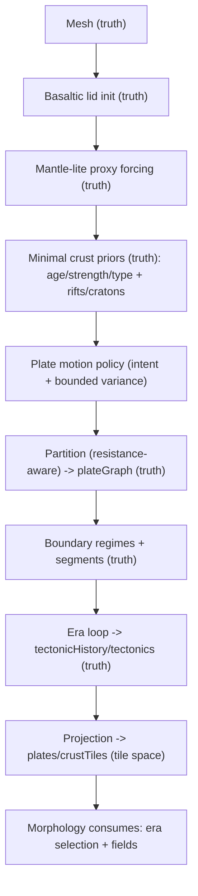

# Draft Synthesis: D01 + D02 + D04 (Foundation Evolutionary Refactor)

Date: 2026-02-03

> Superseded by the maximal posture decisions (D02r/D04r/D07r) and the canonical SPEC at `docs/projects/pipeline-realism/resources/spec/foundation-evolutionary-physics-SPEC.md`.

This note consolidates the first three upstream decision packets into a single, coherent “working target” posture for the Foundation evolutionary refactor.

Decisions are still **draft defaults** until we explicitly accept them, but they are consistent with the stated goal: a basaltic-lid, evolutionary physics model with bounded cost and deterministic outputs for downstream stages (especially Morphology).

## Decisions (Draft Defaults)

### D01 (Ordering): Crust-first resistance partition

Source: `docs/projects/pipeline-realism/resources/decisions/d01-ordering-crust-vs-plates.md`

Chosen default:
- **Crust-first resistance partition**: initialize basaltic lid, derive minimal crust resistance priors (age/strength/type, rifts/cratons) **before** plate partition, then run plate partitioning using resistance-aware growth.

Implications:
- Foundation must gain a **pre-plate** crust initialization/differentiation step (even if minimal).
- Plate boundaries become less “pure Voronoi” and more coupled to weak zones (rifts) and strong zones (cratons).

### D02 (Forcing): Mantle-lite proxy + intent/kinematics

Source: `docs/projects/pipeline-realism/resources/decisions/d02-forcing-mantle-minimum.md`

Chosen default:
- **Mantle-lite proxy forcing field** (low-frequency driver) is the minimum upstream forcing signal.
- Plate motion remains **intent/kinematics-driven**, but intent must respect/bind to the proxy so plate topology is anchored to a physical-looking driver.

Implications:
- Add a new mesh-space forcing surface (proxy field) with validations/invariants (distribution, coherence length, coupling to partition).
- Preserve author control as a stable UX surface while still being able to say “this is physics-postured.”

### D04 (Evolution semantics): Eulerian era fields + optional bounded tracer history

Source: `docs/projects/pipeline-realism/resources/decisions/d04-evolution-semantics-history-model.md`

Chosen default:
- Canonical history output is **Eulerian, era-resolved fields** (masks + force potentials).
- Add **optional bounded tracer history** for drift context, but do not require full Lagrangian material tracking as the baseline.

Implications:
- Downstream API (Morphology-first) should be built around: era selection/weights + force fields, not provenance-heavy parcel histories.
- The current “`eraCount === 3`” validation guard is now a likely migration pressure point (contract allows more; consumer selection becomes the stable interface).

## Resulting Spine (Working Target)

## Next Decisions Unlocked

With D01/D02/D04 set, the next “dependency-ordered” decisions are:

1. D03: Plate motion representation (vector field vs intent/coherence vs hybrid).
2. D05: Crust state variables + canonical meaning (maturity vs type/age/strength, or one derives the other).
3. D06: Event semantics vs force-field semantics (how subduction/collision drives orogeny + volcanism).
4. D07: Downstream history API (explicit era selection vs fixed stacks vs aggregated fields).
5. D09: Validation/observability minimums (what we can assert pre-render).
6. D08: Authoring surface (profiles vs knobs vs scenarios).
