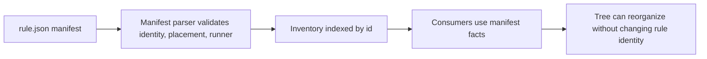

# Design: Location-Independent Rule Manifests

## Frame

**Objective:** make live Habitat rules inventoryable and executable from their
own `rule.json` manifests so rules can later move into better ontology
locations without changing identity or behavior.

**Hard core:** `rule.json` is the single rule inventory contract for the current
viable Habitat corpus. The tree may organize rules, but it must not be required
to identify or execute them.

**Exterior:** this phase does not design the eventual admission model, final
blueprint/capability/niche schemas, or scan-coverage derivation from admitted
authority.

**Falsifier:** if a live rule cannot be represented by a manifest with explicit
identity, current placement, and runner file references without recreating path
or sibling inference elsewhere, this phase stops and the manifest model must be
redesigned.

## Artifact Home Decision

This planning artifact lives under OpenSpec because the implementation slice is
now concrete: the write set, contract surface, sequence, validation gates, and
closure scans are all known well enough to define a downstream implementation
change. OpenSpec remains downstream change control. It does not become Habitat
ontology authority and it does not supersede `.habitat/FRAME.md`,
`.habitat/dominoes.md`, or direct user decisions.

The rejected alternative was to keep this only under `docs/projects/...` as a
pre-code workstream note. That would be appropriate if the question were still
"which direction should we take?" The current question is narrower: implement a
specific manifest contract after review. The OpenSpec record is therefore the
right handoff artifact for the future implementation branch.

## System Read

The current system has a reinforcing loop that keeps accidental tree shape
sticky:


The balancing intervention is to change the information flow:



The leverage point is not a file move. It is the rule of the system: what
counts as the source of identity and execution.

## Manifest Contract

The authored manifest input must be closed and explicit:

```ts
type RuleManifestV1 = {
  schemaVersion: 1;
  id: string;
  title: string;
  placement: RulePlacement;
  ownerProject: string;
  lane: "enforced" | "advisory";
  forbids: string;
  why: string;
  remediate: string | null;
  message: string;
  pathCoverage: PathCoverage[];
  scanRoots?: string[];
  hookCheck?: true;
  exceptionPath?: string;
  manifestPath?: string;
  patternName?: string;
  generatedZone?: string;
  forbiddenFileNames?: string[];
  hostSurfaceGuard?: true;
  artifacts?: RuleSupportFiles;
  runner: RuleRunnerV1;
};

type RulePlacement = {
  niche: string;
  blueprint: string;
  category: string;
  operation: { kind: "check" | "fix" | "generate" | "migrate" };
};

type RuleRunnerV1 =
  | {
      name: "grit";
      files: {
        pattern: string;
        applyPattern?: string;
      };
      patternName: string;
    }
  | {
      name: "habitat";
      mode: "structure";
      files: {
        structure: string;
      };
    }
  | {
      name: "habitat";
      mode: "script";
      files: {
        script: string;
      };
      runtime: "bun" | "node" | "bash";
    }
  | {
      name: "habitat";
      mode: "file-layer";
      guard: "generated-zone" | "forbidden-file-name" | "host-surface";
    }
  | {
      name: "nx";
      target: {
        project: string;
        target: string;
      };
    };

type RuleSupportFiles = {
  baseline?: string;
};
```

### Placement Semantics

`placement` means "where this rule currently belongs in the inventory." It is
not a promise that future authority objects will keep these fields. It is not a
future admission requirement. It is not an assertion that the manifest must live
under the matching tree path.

The implementation may add a guard that reports mismatch between manifest
placement and current path as a warning or follow-up only if that guard does not
block location-independent inventory. The phase does not require that guard.

### Runner File Semantics

Runner files are referenced by manifest paths. They may be sibling files today
and probably will remain siblings during this slice, but sibling location is not
the contract.

The parser must validate that every referenced runner file exists before
execution. Missing runner files fail as registry metadata failures, not ordinary
rule violations.

`manifestPath` is not the path to `rule.json`. It remains the existing Pattern
Authority / governance relation until a later governance slice renames or
replaces it. The live manifest file path is loader metadata, not authored
metadata.

### Non-Runner Artifact Semantics

Location independence also covers rule authority files that affect behavior but are
not execution entrypoints. The current important example is `baseline.json`.
For any rule whose baseline is read from a subject-local `baseline.json`, the
manifest must declare `supportFiles.baseline`. Baseline shrink/growth policy stays
owned by baseline code; this phase only removes hidden path discovery as the
way to find the current baseline artifact.

Global historical baseline roots may remain only as bounded history adapters.
They cannot be the current-rule contract unless the implementation deliberately
migrates all current baselines to a single id-based global store and records
that as the manifest-independent baseline contract.

### Intentional Redundancy

This design intentionally reintroduces authored `id` and `title` because the
next system goal changed. The prior normalization optimized for hierarchy-owned
packet semantics. The next prerequisite is location-independent inventory, so
identity must move back into the manifest.

This is not a retreat to the old model because the manifest now also owns exact
execution entrypoints and current placement. There must be one identity source,
not two.

## State-Space Reductions

This work deletes these live states:

| Current state | Why it is extra state | Target state |
| --- | --- | --- |
| Rule id from packet path | Moving a rule changes identity unless every consumer keeps a path parser | `rule.json.id` |
| Title from packet id | Human title cannot be reviewed or moved independently | `rule.json.title` |
| Placement from packet path | Current belonging cannot move without changing file location | `rule.json.placement` |
| Runner from sibling scan | Adding support files can accidentally affect execution shape | `rule.json.runner` |
| Subject-local baseline lookup by `/<ruleId>/baseline.json` | Moving a rule can disconnect its baseline unless another search finds it | `rule.json.supportFiles.baseline` or a deliberate global id-based baseline contract |
| Service registry loader and Nx loader both doing packet enrichment | Two loaders must stay in sync | One shared manifest contract, with Nx consuming the same facts |
| Artifact routing by `blueprints/.../<packet>` | Changed authority path is mapped by grammar, not inventory | Artifact routing joins changed paths against manifest path and runner file references |
| Baseline historical id by packet regex | Baseline comparison treats path as id | Baseline reads current id from manifest; historical fallback is bounded to git history only |

## Current Evidence

Observed on `codex/habitat-derived-packet-execution` before this planning
branch:

- 124 live `.habitat/**/rule.json` files.
- Authored `rule.json` currently includes policy/routing fields but not `id`,
  `title`, `placement`, or `runner`.
- `tools/habitat/src/service/model/rules/policy/packet-derivation.policy.ts`
  derives id, title, placement, and runner from path plus sibling role files.
- `tools/habitat/src/service/model/rules/repositories/registry.repository.ts`
  discovers candidates but filters to `isPacketRulePath`.
- `tools/habitat/src/providers/nx/rule-registry-loader.ts` repeats packet rule
  discovery and enrichment.
- `tools/habitat/src/service/model/baseline/operations.policy.ts` still derives
  historical current-packet ids with `/blueprints/.../<packet>/rule.json`.
- `tools/habitat/src/service/model/baseline/operations.policy.ts` still has
  global and subject-local baseline path logic that must be converted into an
  explicit current contract plus bounded historical adapters.
- `tools/habitat/src/service/model/rules/policy/authority-paths.policy.ts` maps
  changed Habitat authority paths to ids through packet grammar.
- `tools/habitat/src/nx-plugin.ts` still uses `.habitat/**/${rule.id}/**` as a
  target input relation; that relation must be replaced by manifest and
  declared support file references.
- Hooks now expose `--runner`, but internal hook phases still use terms such as
  `source-check` and `file-layer`. The implementation must keep those private
  labels from becoming public selectors.

## Implementation Sequence

### Phase 1: Characterize Current Coupling

Done means:

- Tests assert current manifest loading, selection, baseline, artifact routing,
  Nx inputs, and runner execution behavior before changing the schema.
- Tests include a synthetic moved manifest path that must eventually preserve
  identity and behavior.
- Tests name current packet-grammar dependencies as failing expectations where
  appropriate.
- A persisted manifest migration ledger covers all 124 live manifests. Each row
  records current manifest path, current path-derived id/title/placement,
  sibling role files, existing runner behavior, proposed manifest id/title,
  proposed placement, proposed runner, proposed runner file refs, baseline
  artifact ref if any, and unresolved exception state.
- The implementation must not enter schema/model cutover until ambiguous,
  zero-runner, multi-runner, missing-baseline, and missing-runner-file rows are
  either repaired or explicitly blocked.

Review checkpoint:

- Spec reviewer confirms characterization proves the right failure class.
- Refactor reviewer confirms tests protect behavior rather than path grammar.

### Phase 2: Define Manifest Schema And Parser

Done means:

- Add `RuleManifestV1` schema with `id`, `title`, `placement`, policy fields,
  and explicit runner union.
- Parse manifests directly as full records; remove enrichment as live contract.
- Reject unknown fields.
- Reject duplicate ids.
- Reject missing runner files.
- Reject missing manifest-declared artifact files.
- Reject runner-specific contradictions: Grit without scan roots, non-Grit with
  scan roots if current policy keeps that invariant, Nx target mismatch if any
  legacy `graphTarget` field survives, and file-layer guard facet mismatch.
- Use exhaustive `switch` / `never` handling for runner and script runtime
  dispatch so adding a runner or runtime fails at compile time until every
  consumer is handled.

Boundary:

- Do not add admission fields.
- Do not add a broad compatibility cleaner.
- Do not keep path-derived `id` as a fallback.
- Do not overload `manifestPath` to mean the rule manifest path.
- Do not introduce a separate normalized document shape that accepts old
  authored fields and quietly rewrites them; any migration bridge must be a
  one-shot corpus migration, not a live parser mode.

Review checkpoint:

- API reviewer confirms a consumer can build correct inventory from schema and
  documented errors alone.
- TypeScript reviewer confirms runner is a discriminated union with no hidden
  optional-state soup.

### Phase 3: Mechanical Corpus Migration

Done means every live `.habitat/**/rule.json` has:

- `schemaVersion: 1`;
- stable `id`;
- stable `title`;
- current `placement`;
- explicit `runner`;
- explicit `supportFiles.baseline` when the rule has a subject-local baseline;
- existing policy/routing fields preserved unless this spec explicitly changes
  them.

Migration rules:

- Use the current path only as one-time migration evidence.
- Set `placement` to the current path-derived facts.
- Set runner file paths to the current concrete generic role files.
- Set baseline authority paths from the current concrete baseline file or from a
  deliberate global id-based baseline contract.
- Keep `pathCoverage` and `scanRoots` unchanged.
- Keep `manifestPath`, `patternName`, `exceptionPath`, file-layer facets, and
  graph facts only where they are real current metadata.

Review checkpoint:

- Corpus reviewer samples every runner class and confirms no missing field or
  unintended semantic change.

### Phase 4: Replace Discovery And Consumers

Done means:

- Service registry discovery loads every `.habitat/**/rule.json` without
  requiring packet grammar.
- Nx registry loading uses the same manifest contract and no independent packet
  enrichment.
- Baseline logic reads current ids from manifests and keeps only bounded
  git-history fallback for old paths.
- Baseline logic reads current baseline artifacts from manifest facts or from a
  deliberate global id-based baseline contract; it does not search for
  `/<ruleId>/baseline.json` as current authority.
- Artifact routing identifies rule-related changed files by manifest path plus
  referenced runner/artifact files, not `blueprints/.../<packet>` grammar.
- Nx inputs include manifest path plus explicit runner files.
- Hook, check, report, Grit, structure, script, file-layer, and generator
  consumers read explicit runner facts.

Boundary:

- A path parser may remain only for bounded historical fallback or explicit
  stale-shape guard scans. It cannot be required to load current rules.

Review checkpoint:

- Architecture reviewer confirms there is one live inventory path.
- Verification reviewer confirms moved-manifest tests prove identity and
  behavior independence.

### Phase 5: Delete Stale Model And Guard Closure

Done means:

- Delete or quarantine `packet-derivation.policy.ts` if no current code needs
  it. If kept, rename/scope it as migration or history fallback.
- Remove `isPacketRulePath` from live discovery.
- Remove sibling role scans from live runner derivation.
- Replace packet-derivation tests with manifest-contract and
  location-independence tests.
- Update docs that describe path-derived identity or sibling-derived execution.
- Add closure scans to reject reintroduction.

Review checkpoint:

- Adversarial reviewer checks for hidden compatibility ladders, duplicated
  identity, selector drift, and future-admission leakage.

## Interfaces And Boundaries

### Public/CLI Boundary

The canonical selector remains `--runner`, `--owner`, and `--rule`. This phase
does not add a new selector. It changes where selector facts come from.

`--runner habitat` intentionally selects all Habitat-native modes: structure,
script, and file-layer. `command-check`, `structure-check`, `file-layer`,
`format-check`, `source-check`, and `grit-check` are not public runner names.
Implementation tests must prove those old selector names are refused or remain
private hook-phase labels only.

### Registry Boundary

The registry loader owns:

- discovery of manifest files;
- JSON parsing;
- schema validation;
- duplicate id detection;
- referenced runner file existence;
- referenced rule support file existence;
- projection into existing consumer facts.

The registry loader must not own:

- admission decisions;
- future ontology validation;
- runtime product proof;
- broad scan-coverage inference.
- path-to-placement admission checks.

### Runner Boundary

`runner` is the execution owner contract:

- `grit` consumes `runner.files.pattern` and optional
  `runner.files.applyPattern`.
- `habitat` consumes `structure`, `script`, or file-layer guard mode.
- `nx` consumes structured graph target.

The implementation should use the existing internal `PacketRunner` name only as
a migration target if necessary; the public and durable vocabulary should become
`RuleRunner`.

The schema should prefer a single manifest form. If internal consumers still
want flat fields such as `patternPath` or `structurePath`, those should be
projection facts derived from the manifest, not a second authored input shape.

### Placement Boundary

`placement` is read by inventory/classification views and reports. It is not
used to locate the manifest or runner files. It is not a future ontology
commitment.

## Review Lanes

First-wave planning review must cover:

| Lane | Blocks on |
| --- | --- |
| Manifest/API contract | Missing fields, contradictory fields, unclear errors, admission leakage |
| Current-code coupling | Missed packet-path dependency, missed sibling-runner dependency, missed parallel loader |
| Workstream/OpenSpec | Missing write set, bad sequence, shortcut language, missing downstream realignment |
| Refactor/TypeScript | State space not reduced, compatibility ladder, non-discriminated runner model, weak tests |

Implementation must start with fresh agents after this planning branch is
accepted.

## Validation Plan For Implementation Branch

Minimum focused tests:

- registry manifest schema and duplicate id tests;
- manifest discovery from arbitrary `.habitat` location;
- missing referenced runner file failure;
- missing referenced baseline/artifact file failure;
- moved manifest preserves id, runner, baseline, and selector behavior;
- artifact routing maps changed manifest/runner/artifact files without packet
  grammar;
- Nx inputs use explicit runner file references;
- baseline uses manifest ids and manifest support file refs for current state, with
  bounded historical fallback only for old commits;
- generator writes full manifests.

Commands:

```bash
git diff --check
bun run --cwd tools/habitat check
bun run --cwd tools/habitat test
bun habitat check --runner grit --json
bun habitat check --runner habitat --json
bun habitat check --runner nx --json
bun habitat check --json
```

Validation matrix:

| Gate | Proof class | Freshness stance | Proves | Does not prove |
| --- | --- | --- | --- | --- |
| OpenSpec validation | Artifact-shape proof | Fresh command on the planning branch | Proposal/design/tasks/spec are valid OpenSpec records | Source implementation correctness or ontology authority |
| `git diff --check` | Diff hygiene | Fresh command before commit | No whitespace errors in the planning or implementation diff | Runtime behavior |
| Focused registry tests | Contract proof | Fresh tests after schema changes | Manifest schema, duplicate ids, missing refs, and moved-manifest inventory behavior | Every runner executes correctly |
| Focused baseline tests | Consumer proof | Fresh tests after baseline cutover | Current baseline reads manifest ids and explicit artifact/global contract | Baseline product policy redesign |
| Focused artifact-routing and Nx tests | Consumer proof | Fresh tests after consumer cutover | Changed manifest/runner/artifact files map to rule ids without packet grammar | Nx graph truth beyond declared inputs |
| Runtime `bun habitat check --runner ... --json` | Local execution proof | Fresh command after implementation | Current corpus loads and executes under each public runner selector | Future ontology admission or CI parity |
| Closure scans | Static residue proof | Fresh scan before closure | No live packet-path identity, sibling-runner inference, stale selector names, or old-root assumptions remain in active surfaces | Absence of archived or historical references |

Closure scans:

```bash
rg -n "packetLocationFromArtifactPath|isPacketRulePath|Rule file must live under|blueprints/.+rule\\.json|/blueprints/\\[\\^/\\]" tools/habitat/src tools/habitat/test
find .habitat -name rule.json -print0 | xargs -0 jq -e 'has("id") and has("title") and has("placement") and has("runner")'
find .habitat -name rule.json -print0 | xargs -0 jq -r '.runner | paths(scalars) as $p | getpath($p)' | rg '^\\.habitat/' # followed by existence verification
rg -n "\\.habitat/(rules|rules\\.json|baselines|patterns/(manifests|candidates|checks|apply)|source-check)" tools/habitat/src tools/habitat/test
rg -n "subjectLocalBaselinePathForRule|preD14aAuthoredArtifactPaths|/\\$\\{rule\\.id\\}/\\*\\*" tools/habitat/src tools/habitat/test
rg -n -- "--tool|ownerTool|source-check|command-check|grit-check|structure-check|format-check" tools/habitat/src tools/habitat/test .habitat docs/projects/habitat-harness
```

## Downstream Realignment

After implementation, update:

- `.habitat/FRAME.md` current file-role model;
- `.habitat/dominoes.md` sequence ledger;
- `.habitat/AUTHORITY.md` if it describes path-derived identity as current
  truth;
- `.habitat/AUTHORITY-TREE-SHAPE.md` if it describes the current tree as the
  required registry grammar;
- `tools/habitat/docs/CAPABILITIES.md`;
- generator docs and examples that show minimal `rule.json`.

Do not update `.habitat` ontology docs to claim final admission semantics.
